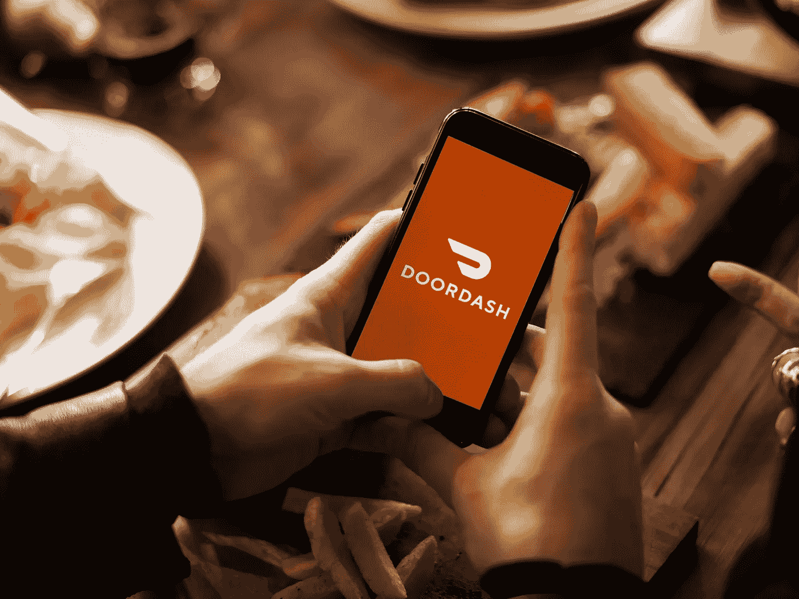
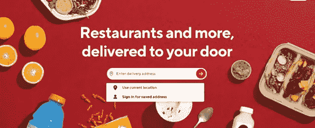
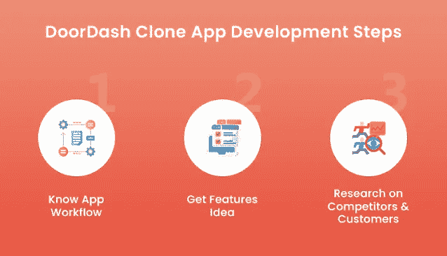

# 获得 DoorDash 应用程序开发优势，打造利润丰厚的食品配送帝国

> 原文：<https://medium.com/geekculture/get-doordash-app-development-edge-for-profitable-food-delivery-empire-9b8d17ea51c4?source=collection_archive---------13----------------------->

DoorDash App

想要在 2023 年通过在线食品交付应用程序在食品交付领域做大吗？你应该知道，你是在正确的地方。由于不同应用市场上存在许多食品配送解决方案，到 2027 年，食品配送市场将拥有异常光明和利润丰厚的未来，收入将达到 4662.0 亿美元，现在也是时候成为这一利润丰厚的市场的一部分了。

正如上面一行中所讨论的，许多解决方案都致力于简化食品配送服务的方式。除此之外，一个非常受欢迎的应用是 DoorDash。这家受欢迎的美国食品配送服务提供商自 2020 年成立以来，一直致力于为客户提供方便快捷的早餐、午餐和晚餐。这种便捷的服务吸引了全球企业家的关注，并鼓励他们开发食品订购应用程序，以开发 DoorDash 这样的应用程序，建立一个有利可图的食品配送业务。

你也在其中吗？什么事？这篇文章是给你的。我们列出了在这一过程中对您有用的不同步骤，以便您通过提供的无缝送餐服务提高收入。

## 向您介绍 DoorDash 应用程序

Image Source: doordash.com

> **—2013* ***服务地区*** *—美国、东京、墨尔本等**

*自 2013 年创建以来，DoorDash 让生活在美国的客户只需简单地点击几下，就可以轻松获得快速的早餐、午餐和晚餐。*

*拥有一些独特的功能，以简化送餐服务的方式，并允许不同的部门无缝运行该解决方案；这款应用在全球企业家中脱颖而出。它鼓励他们使用定制的 DoorDash 克隆应用程序开发 DoorDash 等食品应用程序。*

*下面就用下面几行向你介绍解决方案。*

## *关于 DoorDash 克隆应用的所有信息*

*DoorDash clone 应用程序是一款现成的定制食品交付应用程序，它是基于美国热门的食品交付应用程序(DoorDash)而构建的。这种定制特性允许食品配送初创公司根据未来的业务和客户需求在解决方案中进行简单的修改，从而无缝地发展他们的业务。*

*了解了这个解决方案的本质，你就会明白，它无疑是一个因祸得福的餐馆创业公司，因为他们将获得所需的援助，在合理的短时间内将他们的业务纳入客户的视野。他们还将能够更好地为他们服务，并快速实现可扩展性和增长。*

*你是希望用类似的解决方案做大的(餐馆创业公司)之一吗？在[食品交付应用程序开发服务](https://www.fooddeliveryclone.com/)期间遵循这些步骤，并看到自己获得利润和回报。*

## *2023 年成功开发 DoorDash 等 App 的步骤*

**

*DoorDash App Development Steps*

*执行送餐应用程序开发服务来开发像 DoorDash 这样的应用程序并不像听起来那么容易。它要求坚持一些极其重要的步骤。这里有一些你可以在 2023 年特别坚持，在这个世界上大展拳脚。它们概述如下。*

*   ***知道 App 工作流程***

*你首先需要知道这个应用程序是如何工作的。这意味着你需要知道食品配送服务是如何从餐馆送到顾客手中的。*

*有了这方面的知识，你就可以开始下一步的订餐应用开发之旅了。*

*   ***获得特色创意***

*接下来你知道特征是很重要的。因此，你需要记住这三个部分——顾客、餐馆和送货司机。*

*一旦你了解了这些细分市场，你就可以独立地了解那些能增强这些细分市场的送餐服务的特性，并看到你的利润率上升。*

*   ***竞争对手研究&客户***

*第三个极其重要的组成部分是研究竞争对手和你的竞争对手。当你这样做的时候，你将能够成功地首先解决客户的问题，最重要的是从你的竞争对手中脱颖而出。*

*除了这些步骤，你还应该和海外的伙伴联系。这将使你的成本效率过程变得极其简单和完美。然而，在最终同意之前——检查他们的投资组合、客户评论等。这将确定你正在与一个可靠的合作伙伴联系。*

*下一个关键是突出成本因素。*

* [## 英国十大食品配送应用数字化餐厅设置

### Ankit Patel 年 10 月 7 日，6 分钟阅读在线食品交付应用见证了它们在全球范围内的增长趋势。那么为什么…

www.fooddeliveryclone.com](https://www.fooddeliveryclone.com/blog/top-10-food-delivery-apps-in-uk/) 

## 开发 DoorDash 克隆应用的成本

当您计划使用 DoorDash clone 应用程序启动您的食品配送初创公司时，下表列出了开发人员在不同国家按小时开发 DoorDash clone 应用程序的估计成本。

**国家(每小时收费)**

*   美国(85 美元和 290 美元)
*   东欧(60 至 180 美元)
*   印度(25 至 80 美元)

现在知道了开发 DoorDash 克隆应用程序的估计[成本，你就可以理解获得它的访问权是一个真正的转型领域，值得餐厅创业公司加以利用。如果你也是一家刚刚起步的餐厅，希望通过定制食品配送解决方案在食品配送业务领域做大，我们推荐 DoorDash clone 应用程序。](https://www.peppyocean.com/doordash-clone-app/)

向你承诺支持简化送餐服务，同时确保你能够在合理的短时间内提高知名度，你可以很快进入顾客的视野。此外，你将能够成功地建立一个有利可图的食品配送帝国，解决最终消费者的需求，没有任何挑战。

# 总结

阅读这份全面的指南，你可以理解，要成为 4662.0 亿美元盈利食品配送市场的一部分，获得应用优势至关重要。然而，由于从头开始开发应用程序既费时又费钱，所以最好的方法是使用定制应用程序。市场上有许多定制解决方案。一个特别引起注意的是 DoorDash 克隆应用程序，因为它是美国热门应用程序的复制品，从而使初创公司能够超越竞争对手。如果你也在寻找类似的解决方案，今天就联系一家食品交付应用程序开发公司，看看你的利润滚滚而来。*