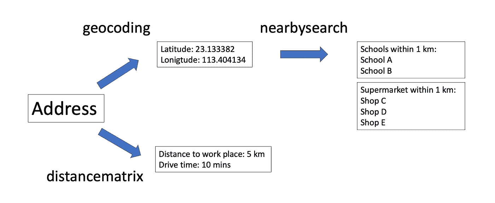
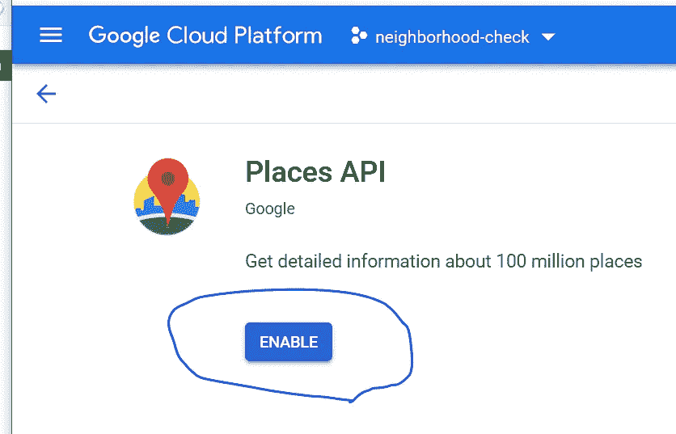
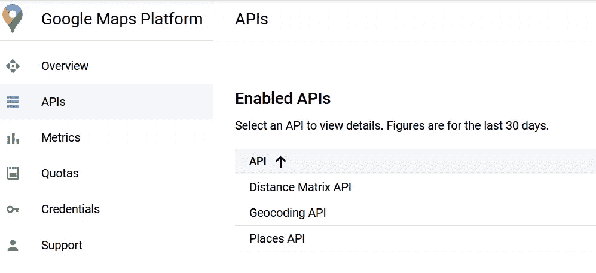
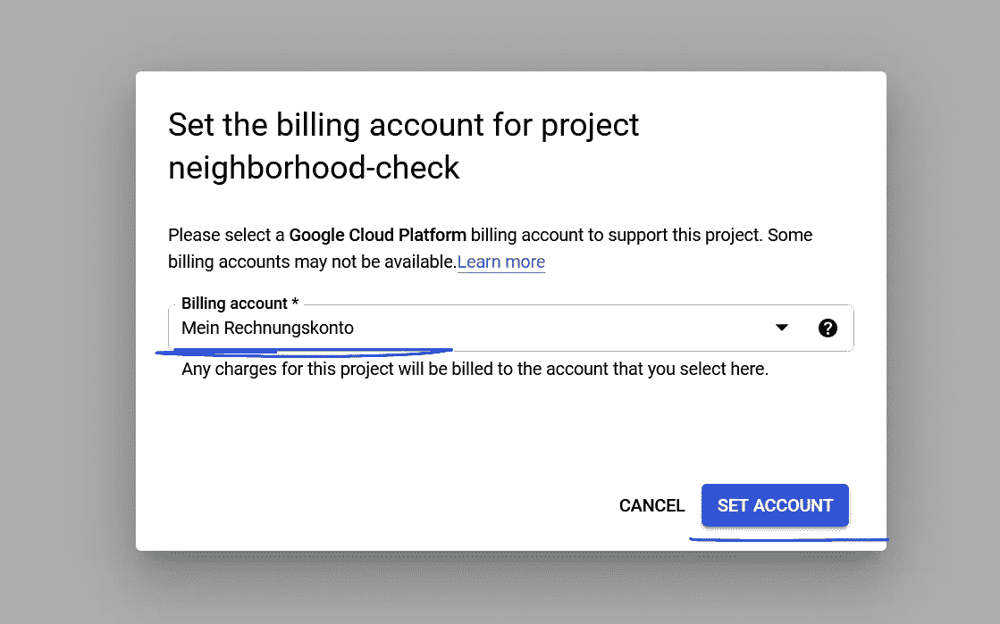
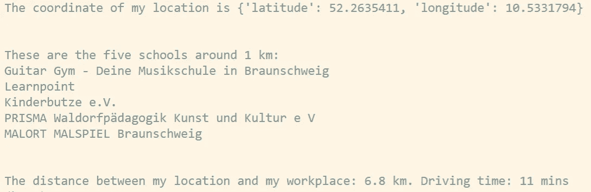
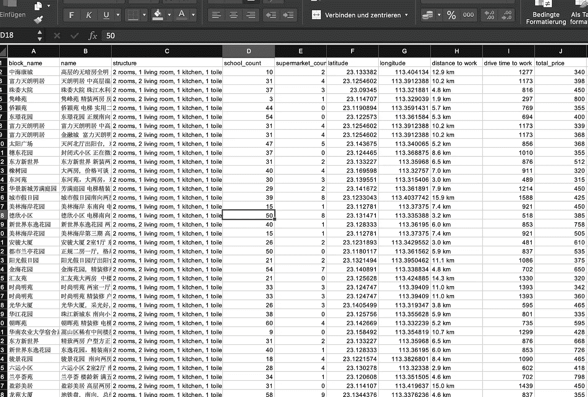
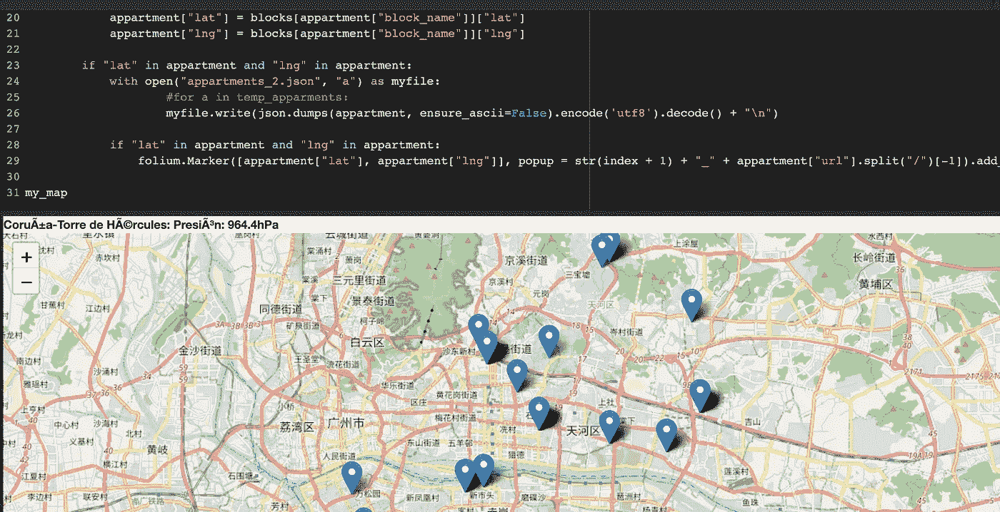

# 使用谷歌云在家庭搜索中使用地理空间

> 原文：<https://medium.com/geekculture/get-geo-data-from-google-cloud-for-your-next-new-home-f0a02c185d5f?source=collection_archive---------4----------------------->

# 介绍

寻找新家是一项艰巨的任务。买家被信息轰炸。除了经纪人提供的通常数据之外，买家通常希望了解更多关于邻居的信息，即所谓的地理空间数据或“geo”。这包括基本的和一般的问题，如“附近有多少超市和学校？”到更个人化的问题，比如“离我工作的地方有多远，开车去需要多长时间”。

如果名单很短，在谷歌地图上搜索几下，甚至亲自实地查看一下，就有可能回答所有这些问题。但通常情况下，买家首先会在房地产网站上进行筛选。在那里，他们通过价格、面积、朝向和房间数量等常见参数进行筛选。地理空间数据将真正成为这一过程的一部分。因此，挑战在于:如何一次获得大量房产的邻居信息？幸运的是，在一点 Python 和谷歌云的帮助下，这很容易做到(图。1).

在本教程中，我将向您展示如何获得两个重要的地理空间数据:首先是 1 公里半径内的学校，其次是距离和开车上班的时间。

这三个函数的脚本可以在这里找到。

 [## GitHub - dgg32/google_house

### 这个库包含了博客文章的代码:使用谷歌云在家中查找地理空间，它包含三个…

github.com](https://github.com/dgg32/google_house) 

# 建筑师

在本教程中，我们需要 Google Cloud，确切地说是三个 Google APIs:

1.  “distancematrix”可以为我们提供两个地址之间的距离和行驶时间，在我们的案例中是工作地址和财产地址。
2.  “地理编码”将文字地址转换成纬度和经度(lat-lon)对。
3.  “nearbysearch”采用纬度-经度对、机构类型和可选的搜索半径，并返回机构列表。

Figure 2\. Details of the architect

我创建了一个 Github 库来存放项目代码。然而，在我们使用这些功能之前，我们需要创建一个 Google Cloud 项目，启用 API，获取凭证密钥，并将这个密钥放在 config.py 中。

 [## dgg32/google_house

### 这个库包含了博客文章的代码:使用谷歌云在家中查找地理空间，它包含三个…

github.com](https://github.com/dgg32/google_house) 

# **谷歌云设置**

前往谷歌云控制台，点击“谷歌云平台”旁边的项目下拉菜单，创建一个名为“邻居检查”的项目。初始化后，单击进入项目。

单击“API 和服务”->“仪表板”->“启用 API 和服务”。在搜索栏中，搜索并启用以下 API:

1.  地理编码 API
2.  距离矩阵 API
3.  位置 API

Figure 3\. Add the “Places API”

因此，在添加这些 API 之后，您的“API”页面应该看起来像这样:

Figure 4\. Enabled APIs

之后，点击“凭证”->“创建凭证”->“API 密钥”。

Figure 5\. Create an API key

出现一个标题为“API key created”的弹出窗口。用“复制”按钮复制“你的 API key”，粘贴到“config.py”中的 API_KEY 变量中。

最后，我们需要为这个项目启用计费。进入[计费页面](https://console.cloud.google.com/project/_/billing/enable)，选择项目“邻居检查”，在弹出窗口中选择“计费账户”，点击“设置账户”。

Figure 6\. How to enable billing.

请注意，默认情况下，谷歌云只允许五个项目与一个计费账户相关联。因此，如果您收到关于“无法启用计费”的消息，您可以请求增加您的配额，或者在您的旧项目中禁用计费以腾出空间。

# 使用 Python 提取地理空间信息

一旦设置完成，与这些 Google APIs 进行交互并提取我们需要的地理空间信息是非常容易的。由于它们是 REST APIs，几乎所有的编程语言都可以与之交互。这里，我使用 Python 展示了图 3 中提到的三个函数。

在我的[仓库](https://github.com/dgg32/google_house)里，我打包了三个 Python 文件。“config.py”存储 API 密钥，“functions.py”包含与 Google APIs 通信的三个函数。最后，在“demo.py”中，我将我的位置设置为“赫尔佐格·安东·乌尔里希博物馆”，将我的工作地点设置为我的实际雇主德国 DSMZ·布伦瑞克的地址。

如您所见，坐标、博物馆周围的前五所学校以及博物馆与 DSMZ 之间的距离被成功返回:

Figure 7\. The output of demo.py

# 将地理空间数据添加到房屋搜索中

有了这些功能，我们就能丰富找房子的体验。从你的经纪人或他们的网站上，你可以得到诸如价格、面积、方位等数据，最重要的是，房产的地址。在设置了房产和工作地点的地址之后，你应该获得关于邻居和工作距离的信息。我没有在这里提供脚本，因为数据收集和后来的数据集成都过于个性化和网站特定。

但是在下图中，你可以看到我已经在中国广州自己的找房子中使用了我的函数。基本房产数据由[贾立安](https://m.lianjia.com/)提供。我在表中添加了“纬度”、“经度”、“学校 _ 计数”、“超市 _ 计数”、“上班开车时间”和“上班距离”。

Figure 8\. My own house hunt with the help of Google Cloud

事实上，在地理编码之后，我甚至可以用[叶子](https://python-visualization.github.io/folium/)来绘制属性(图 9。).有了这张图和这些数字，我可以对一些候选房产有一种空间感，并大大缩小我的搜索范围。

Figure 9\. Plotting the properties with folium

# 费用

然而，所有这些巨大的好处并不完全是免费的。在附近搜索时要格外小心。谷歌每月慷慨地给我们 200 美元的“地点”和“路线”积分。即“距离矩阵”中的前 40000 个电话和“附近搜索”中的前 5000 个电话都在 Goolge 上。但是一旦每月配额用完，你将在“距离矩阵”中被收取每 1000 个电话 5 美元的费用，在“附近搜索”([价格表](https://cloud.google.com/maps-platform/pricing/sheet))中被收取每 1000 个电话 40 美元的巨额费用。问题是，附近的搜索通常会返回几页结果，查看每一页都被视为一次访问(Stackoverflow 讨论[这里](https://stackoverflow.com/questions/54558881/what-is-the-price-for-a-call-to-google-place-near-by-search-api-next-results)和 Reddit 讨论[这里](https://www.reddit.com/r/webdev/comments/8vrkm6/google_places_api_new_pricing_from_0_to_2180_per/))。因此，一个不小心的“for 循环”会很快增加成本。

我不得不承认，我找房子时收到了一大笔账单。因为我的列表有大约 1300 个属性，我做了一些重新运行，所以我总共进行了大约 7700 次附近搜索 API 调用。结果，那个月结束时，我收到了一份令人瞠目结舌的€135.02 英镑的账单。

但是不要因为我的经历而气馁，因为这是完全可以避免的。我建议疏用这些函数。首先，也是最重要的，首先根据其他标准缩短候选列表，然后在上面运行这些 Google APIs。第二，通过将您的通话时间分配到不同的月份来利用每月点数。但是后者会有风险，你的候选房产可能会在你等待下个月贷款的时候被卖掉。所以平衡你的选择是很重要的。

# 结论

我必须承认，这整件事是一个非常古怪的方式来完成一个古老的任务，那就是找房子。即使不是所有人，大多数人也可以在不知道谷歌云是什么的情况下找到他们的下一个梦想家园。但是嘿，这个时代，一切都是“数据驱动”的。因此，对于我们这些极客来说，充分利用谷歌所能提供的东西并没有错。在找房子的过程中，就像在其他柠檬市场一样，我们获得的数据越多，我们就越能稍微平衡对经纪人的不利，我们就能做出更好的决定。

这个项目正好说明了这一点。有了 Google APIs 和一些数据争论，丰富我们最初的数据收集是可能的。我相信来自谷歌的地理空间数据有助于一个好的购买。它节省了我们大量的参观时间，并帮助我们比较一个简短的属性列表。事实上，这种技巧也可以用在你寻找新办公室甚至新工厂的时候。

找房子开心！

 [## 加入媒介与我的介绍链接-黄思兴

### 作为一个媒体会员，你的会员费的一部分会给你阅读的作家，你可以完全接触到每一个故事…

dgg32.medium.com](https://dgg32.medium.com/membership)