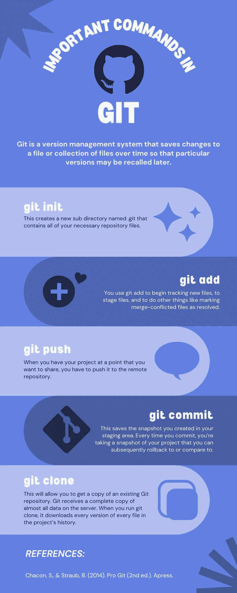

# 擅长 Git

> 原文：<https://medium.com/geekculture/get-good-at-git-46392927cd48?source=collection_archive---------40----------------------->


Git 是一个版本管理系统，它保存一段时间内对一个文件或文件集合的更改，以便以后调用特定的版本。它允许您将文件恢复到以前的状态，检查谁最后更新了可能会造成问题的任何内容，将整个项目恢复到以前的状态，比较一段时间内的更改，谁在何时提出了问题，等等。所以，事不宜迟，让我们得到它(双关语)。

# Git 快照


大多数其他系统将信息保存为基于文件的修改列表。
这些系统认为它们存储的数据是文件的集合，以及随着时间的推移对每个文件所做的更改。Git 认为它的数据更像是一个小型文件系统的一系列**快照**。当您在 Git 中提交或保存项目的状态时，它只是简单地获取当时所有文件的快照，并保存对该快照的引用。这使得 Git 的功能更像一个迷你文件系统，并在其上添加了一些强大的工具。

# 三种状态

您的文件可以处于 Git 中的三种状态之一:**已提交**、**已修改**和**已暂存**。Modified 表示您已经更改了文件，但尚未提交。Staged 表示您已经在当前版本中标记了一个修改过的文件，以便在下次提交时使用。提交意味着数据存储在本地数据库中

这三种状态在 Git 中有相应的部分:Git 目录**、工作目录**、staging 区域**。Git 目录是 Git 存储项目的对象数据库和元数据的地方。当您从另一台计算机克隆存储库时，它会被复制。工作目录包含项目当前版本的单一签出。
这些文件是从 Git 目录的压缩数据库中提取出来的，保存到磁盘上供你使用或更改。staging area 是一个文件，通常位于您的 Git 目录中，它保存了关于您的下一次提交将包含什么内容的信息。它有时被称为“指数”。******

# **最常用的命令**

****

## **git 初始化**

***git init* 命令将初始化现有目录中的存储库。**

```
git init
```

**这将创建一个名为。git 包含所有必需的存储库文件。很酷吧？(多余的双关语)。这不会开始跟踪你的文件。您可以使用添加命令开始跟踪您的文件。**

## ****git 添加****

**您使用 *git add* 开始跟踪新文件，暂存文件，并做其他事情，比如将合并冲突的文件标记为已解决。将它更多地理解为“将此内容添加到下一次提交”可能会有所帮助**

```
//adds all files in the current directory
git add .//only adds README.md file 
git add README.md
```

****git 状态****

**这个命令将告诉您哪些文件处于哪个状态。你将用它来回答两个问题:你修改过但还没有上演的是什么？你准备对你上演的这出戏做出什么承诺？**

```
git status
```

**这个命令的输出有时有点过于冗长。对于 git 状态的压缩输出，您可以添加-s 标志。**

```
git status -s
```

****git diff** *git diff*比 *git status* 命令更详细。它会告诉你你到底更改了什么，而不仅仅是更改了哪些文件。该命令将工作目录中的内容与临时区域中的内容进行比较。**

```
git diff
```

**如果您希望看到您已经暂存的内容将进入您的下一次提交，您可以使用 staged 标志**

```
git diff --staged
```

**请注意，如果您已经暂存了所有的更改，git diff 将不会给出任何输出。**

****git 提交****

**这将保存您在临时区域中创建的快照。任何你没有上演的东西都还在那里被修改着；您可以再次提交，将其添加到您的历史记录中。每次提交时，您都在拍摄项目的快照，您可以随后回滚到该快照或与之进行比较。**

```
git commit -m "Your commit message"
```

**m 标志允许您向提交添加消息，这可以帮助您区分提交并了解提交的原因。在您提交之后，它会输出您提交到哪个分支、提交的 SHA-1 校验和是什么(Git 中的所有内容在存储之前都经过校验和检查，然后由校验和引用)、有多少文件被更改，以及关于提交中添加和删除的行的统计信息。**

****

****git 克隆****

**这将允许您获得一个现有 Git 存储库的副本。Git 接收服务器上几乎所有数据的完整副本。当您运行 *git clone* 时，它会下载项目历史中每个文件的每个版本。**

```
git clone repo_url
```

****git 日志****

***git 日志*将按照最近提交最先出现的相反顺序打印存储库中的提交历史。它列出了每个提交及其 SHA-1 校验和、作者姓名和电子邮件、写入日期和提交消息。**

```
git log
```

****撤销 git 提交****

**如果您提交并意识到忘记添加一些文件，git 会帮您解决。您可以使用修改标志运行提交**

```
git commit --amend
```

**该命令获取您的临时区域并将其用于提交。如果自上次提交后您没有进行任何更改，您的快照将看起来相同。**

****添加遥控器****

**远程存储库是您的项目在互联网上托管的版本。当您需要与其他人共享工作时，您必须管理这些远程存储库，并向它们推送数据和从中提取数据。**

**要添加远程 Git 存储库，可以使用以下命令**

```
git remote add origin repo_url
```

**这里的 origin 基本上是你给这个远程回购的别名。每次使用关键字 origin，git 都会知道您在谈论这个远程存储库。你可以选择任何名字而不是起源。**

**要获得 Git 存储的所有远程设备的列表，可以使用 v 标志**

```
git remote -v
```

****推送到远程存储库****

**当您想要共享您的项目时，您必须将它推送到远程存储库。**

```
git push origin master
```

**如果您想将特定的本地分支推送到特定的远程分支，那么您可以使用以下命令:**

```
git push [remote-name] [branch-name]
```

****

**希望这是对 Git 原则的一个有用的介绍，当您进一步探索与 Git 相关的主题，如分支、Git 工具和 Github 时，它会对您有所帮助。直到下一次🌸。**