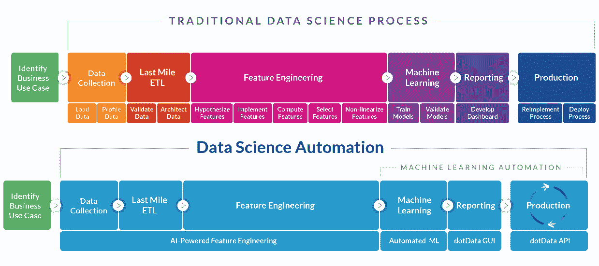
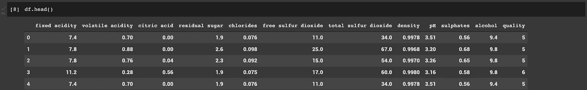
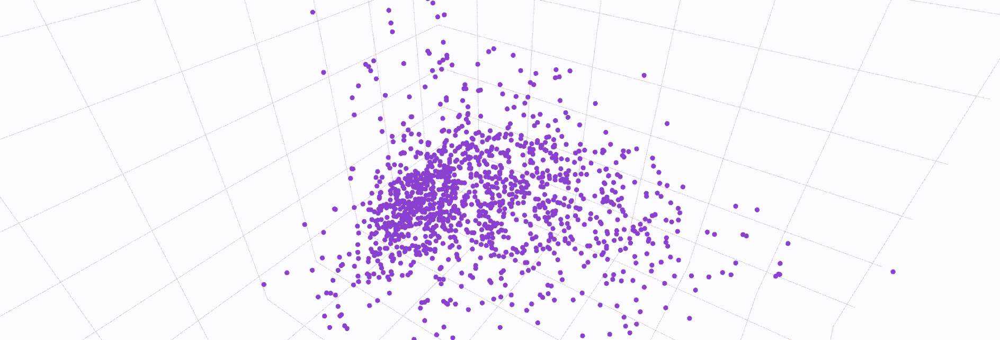
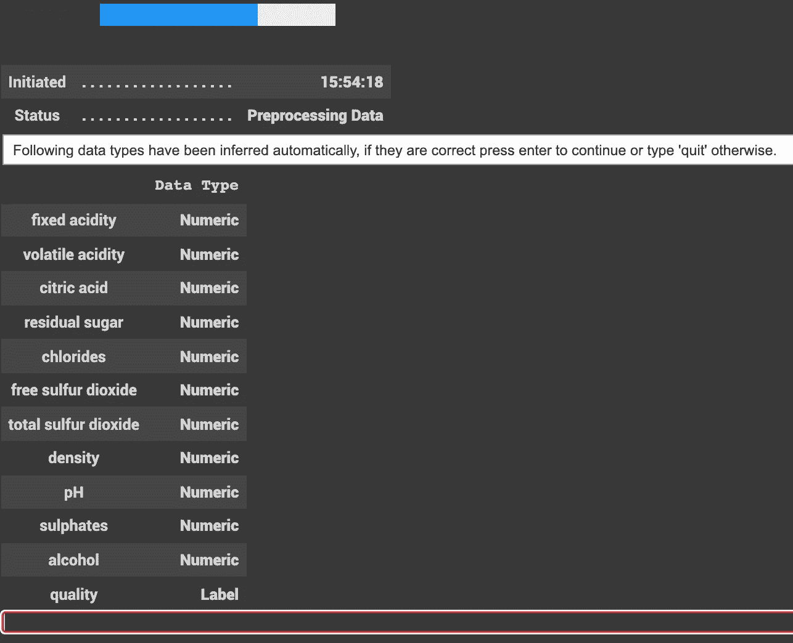
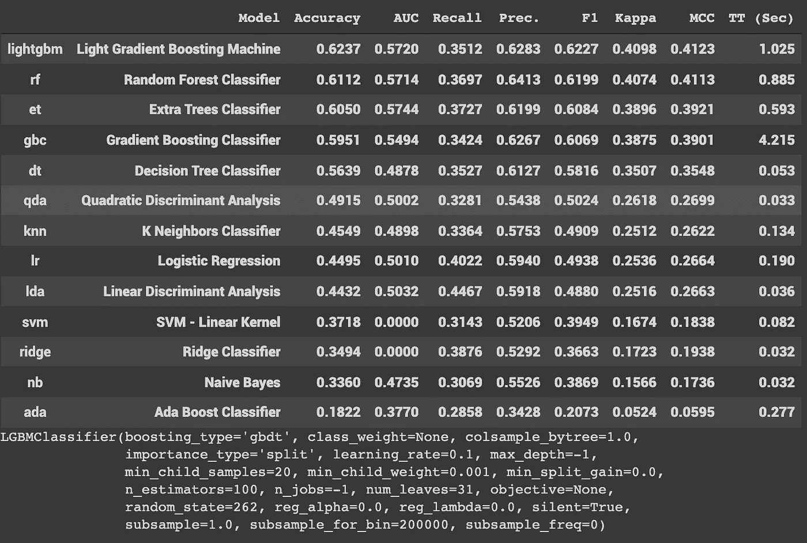
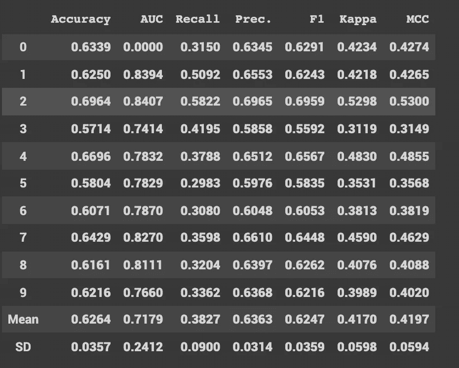
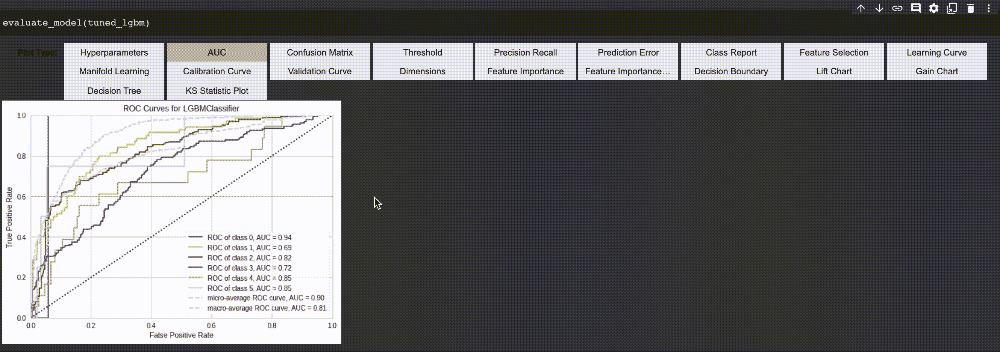

# 走出“哪个型号？”心理阻隔

> 原文：<https://medium.com/geekculture/get-out-of-the-which-model-mental-block-b68c41d32667?source=collection_archive---------41----------------------->

## 在几分钟内完成最后一年的项目


Image Credits — energepic.com via pexels.com

> 你现在是本科的最后一年，你的最后一年的压轴戏表演应该在 5 天内完成？你绝望地拿起那个 Kaggle 数据集，(也许是你朋友发给你的？我不知道。)，以获得 90%的准确率。但是您基本上停留在第 0 步，使用哪个模型？

信任我，我去过那里。你的直觉？你立刻开始谷歌“如何选择机器学习模型”，你会遇到诸如可解释性、偏见、方差、数据格式、线性等等术语。让我们面对现实吧，你一定在课堂上听过(或者没有听过)这些术语，但是随着就业季节的到来，你不会真的想修改所有这些。**你只想完成工作。**

介绍— [AutoML](https://towardsdatascience.com/a-brief-introduction-to-automl-4854c76877b6) 以一个可爱的(然而，一个相当强大的)库的形式被称为**[**py caret**](https://pycaret.org/)**(是的，这个博客目前是为寻找 Python 原型的人准备的，欢迎在下面评论类似的 R 语言)。AutoML 是自动创建管道(工作流)的过程，从输入数据开始，直到生成推理。尽管我们在本文中讨论的方法从技术上来说是一种*半自动方法，但是*当然，你会想在你的论文/报告中写点什么。在图 1 中可以看到一个非常好的过程比较。**我们开始吧！******

********

****Fig 1\. — A comparison between the workflow of the Traditional and Automated Data Science process. Image Credits — [https://www.datanami.com/2019/08/28/automl-tools-emerge-as-data-science-difference-makers/](https://www.datanami.com/2019/08/28/automl-tools-emerge-as-data-science-difference-makers/)****

# ****01-让我们得到数据****

****对于正在阅读这篇文章的任何人来说，这是一种额外的奖励，嗯，你想以某种方式找到数据集来围绕你的顶点/机器学习项目旋转。数据集如— [商城客户](https://www.kaggle.com/shwetabh123/mall-customers)、[波士顿房价](https://www.cs.toronto.edu/~delve/data/boston/bostonDetail.html)、 [MNIST](http://yann.lecun.com/exdb/mnist/) 、[泰坦尼克号数据集](https://web.stanford.edu/class/archive/cs/cs109/cs109.1166/problem12.html)等。是大量使用的开源基准数据集，用于学习目的。你可以在公共存储库中找到更多的数据集，比如— [Kaggle](http://www.kaggle.com) 、 [CMU 回购](https://guides.library.cmu.edu/machine-learning/datasets)等。一个类似的数据集被称为葡萄酒质量预测数据集，可以在这里[访问](https://github.com/shrikant-temburwar/Wine-Quality-Dataset/blob/master/winequality-white.csv)，我们将使用相同的数据集。****

****打开我们的 Jupyter 笔记本(我将使用 Colab 环境来构建这个模型的原型)，我们首先导入重要的库并导入数据集(作为一个原始的 GitHub 链接找到—这里是)。您可以在图 2 中看到相同数据集的输出。****

```
**''' let us import the usual required libraries'''
import pandas as pd
import numpy as np
import seaborn as sns
import matplotlib.pyplot as plt'''read the dataset'''
df = pd.read_csv("https://raw.githubusercontent.com/shrikant-temburwar/Wine-Quality-Dataset/master/winequality-white.csv")df.head()**
```

********

****Fig 2\. The output of Dataset that has been imported****

# ****02-数据分析和 EDA-****

****任何数据科学/机器学习项目最重要的方面是探索性数据分析(EDA)。完整的 EDA 流程可以在给定的[链接](https://github.com/choprahetarth/Which-Model/blob/main/WineDataEDA.ipynb)中看到。请随意探索它，更改参数，并产生见解！****

********

****Fig 3\. A cool animation produced from the EDA process (top 3 correlated features)****

# ****03 —应用 AutoML，然后，好吧，坐下来****

****我们知道该数据集基本上为我们提供了一个分类问题，其中提供了某些特征，例如—{固定酸度、挥发性酸度、柠檬酸等。}利用它们，我们必须预测葡萄酒样品的质量。首先，我们将首先安装 PyCaret 库。将下面的代码放在一个单元格中会安装这个库。****

```
**!pip install pycaret**
```

****安装 PyCaret 库后，稍微查看一下数据集，我们将首先导入 pycaret.classification。这将使我们能够访问所有存在的函数，以便开始我们的分类实验。****

```
**from pycaret.classification import ***
```

****完成后，我们将开始我们的第一个 AutoML 实验****

```
**##select only the features
x_columns = df.columns
x_columns = x_columns.drop(['quality'])##initite the AutoML Experiment
exp_csf = setup(data = df, target = 'quality',       transformation=True,polynomial_features=True, fix_imbalance=True,polynomial_degree=4, feature_selection=True)**
```

****setup()函数提供了数据和目标等参数，分别指定了数据帧和目标变量。以便了解其他参数的更多信息，如“转换”、“多项式特征”、“修复不平衡”等。，快速浏览一下[文档](https://pycaret.readthedocs.io/en/latest/api/classification.html)会帮助你快速了解它们的定义。当你这样做的时候，你会看到这样的提示-****

********

****Fig 4\. PyCaret automatically identifying feature data-types****

****如图 4 所示，PyCaret 自动识别不同的列及其数据类型。按下回车键后，可以看到一个大表，其中列出了该实验的所有参数。请根据您的首选数据集和需求随意调整这些参数。在此之后，数据集在一组经典和现代 ML 模型上被训练而不需要参数调整，并且快速比较被呈现在我们面前。****

```
**compare_models()**
```

********

****Fig 5\. PyCaret training the dataset on a group of models and presenting a stark comparison amongst them.****

****瞧啊。继续下去，选择在您想要的指标中提供最佳分数的模型。在我们的例子中，我们可以看到，如果我们将精确度作为模型选择的主要标准，那么光梯度增强机的性能会更好，而另一方面，如果我们需要精确的模型，那么随机森林分类器是更好的模型。****

****但是故事并没有就此结束…****

# ****04—高级功能****

****尽管经历了分层 K 折叠，但拟合模型肯定可以通过超参数调整来改进。使用网格搜索的超参数调整是通过将一些标准参数提供给 PyCaret 的 tune_model 函数来完成的。可以看出，该模型在几乎所有参数上都有所改进。****

```
**lgbm = create_model('lightgbm')grid = {'learning_rate': [0.03, 0.1,0.15],'depth': [4, 6, 10,15],'l2_leaf_reg': [1, 3, 5, 7, 9,15]}tuned_lgbm = tune_model(lgbm,custom_grid=grid)**
```

********

****Fig 6\. LGBM model scored on the dataset after paramter tuning****

****之后，我们在持有的测试数据集上预测我们的模型，以实际验证该模型是否适用于现实生活场景。****

```
**pred_holdout = predict_model(tuned_lgbm)**
```

********

****Fig 7\. The LightGBM model tested on our withheld dataset****

****我们可以看到，该模型在测试数据集上也表现良好。****

# ****05 —剧情！剧情！还有剧情！****

****越多越好…代码不言自明，如下所示-****

****有另一种交互式方法来生成这些图，如图 8 所示。以下命令用于完成同样的任务—****

```
**evaluate_model(tuned_lgbm)**
```

********

****Fig 8\. An interactive way to spawn graphs for evaluating the trained model.****

# ****结论****

****到目前为止，在本教程中，我们已经介绍了如何在小(和大？找出它)数据集时，你的时间不多了。有一些高级的主题仍然在本教程的范围之外，如[保存模型](https://pycaret.org/save-model/)，堆叠，混合或其他形式的组装，但你可以在这里查看。对于本教程中显示的完整代码，您可以查看这个 github [链接](https://github.com/choprahetarth/Which-Model)。****

****快乐模型建筑！****