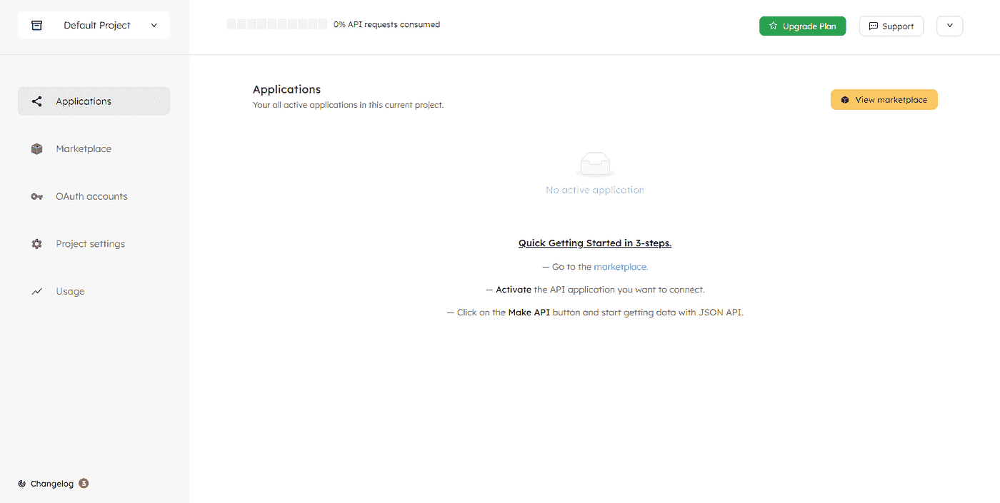
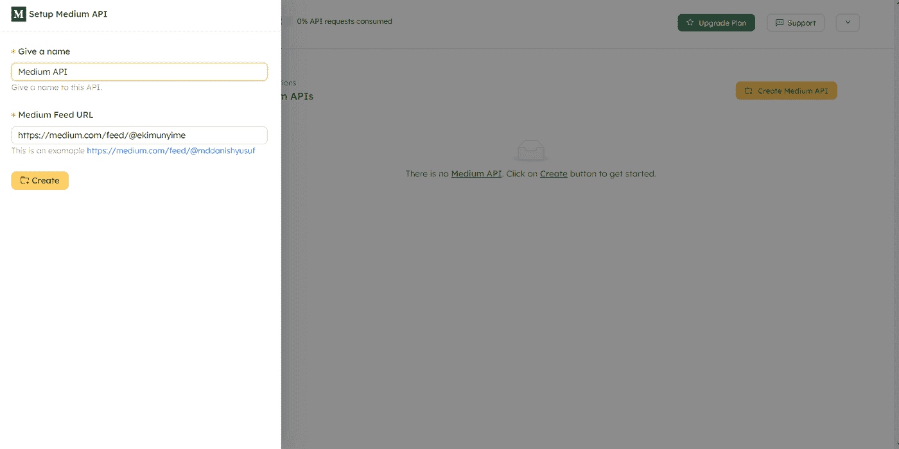
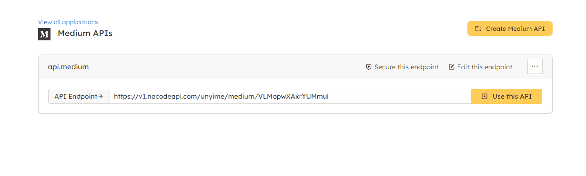
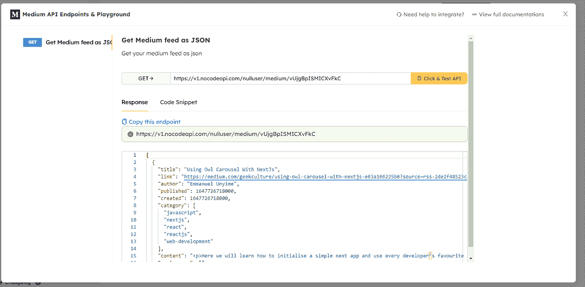
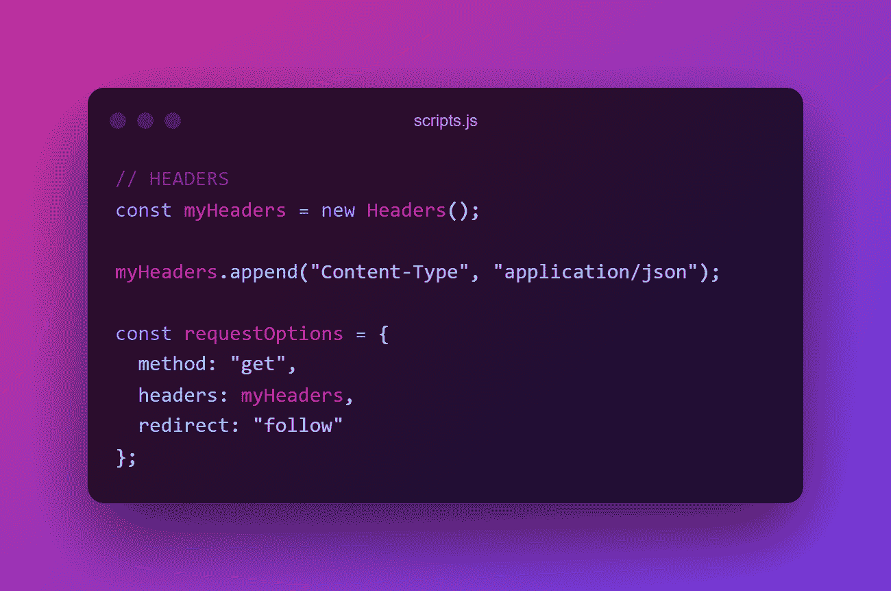
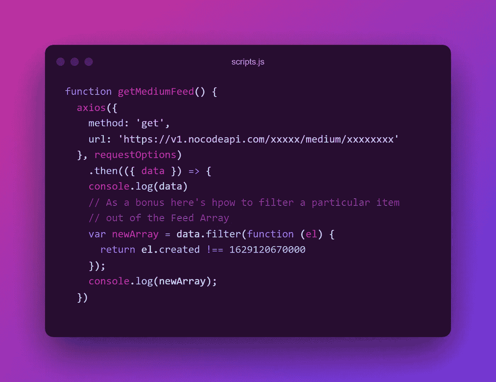

# 使用 JavaScript 在 2022 年从 Medium API 获取 Post

> 原文：<https://medium.com/geekculture/get-posts-from-medium-api-in-2022-using-javascript-2d1e40d0fd25?source=collection_archive---------1----------------------->

抱歉中断了，但我带着更多的文章和作为软件工程师的疯狂经历回来了。但是让我们从一些清淡的开始。

你知道程序，但首先；

*注意:我不会用 React 这样做，但是这些方法很容易应用，因为我们将使用 Axios。*

## 简介

Medium 是一个博客平台**，像 WordPress 或 Blogger** 。Medium 是给你带来 Twitter 的人的新项目。Medium 是由顶尖编辑、付费作者、公关宣传人员、创业公司和黑客联合制作的混乱无序的产品。*(谢谢谷歌)*

## 先决条件:

1.  如何使用 AXIOS 的基本知识。如果你以前没有使用过 Axios，我有一篇简单的文章，可以让你在 2 分钟内上手。[点击这里](/nerd-for-tech/a-beginner-introduction-to-using-axios-for-requests-e07fe9c87f54)
2.  理解异步 JavaScript。在这里阅读我的文章。
3.  理解 JavaScript 中的承诺、对象和数组。

*(这些知识有助于提高你的理解，但不是必需的)*

Am I only one who preferred the previous Medium Logo

## 步骤 1:创建 API

首先去 https://app.nocodeapi.com/注册(谷歌让它更快)，选择一个用户名，然后去你的仪表盘:

转到市场并选择 Medium，然后创建您的 API:

在提要后面的第二个输入字段中，输入您的媒体用户名。

## 步骤 2:在平台上测试 API

点击“使用此 API”

> 提示:如果你想访问你的 feed 之外的数据，比如你的个人“信息”,那么在 feed URL 中，删除“feed ”,只需输入你的用户名。

## 步骤 3:编写代码

这个平台的好处是他们实际上给了你代码片段，你不必花费太多的脑力。但是他们使用 fetch API，所以让我们为 Axios 稍微调整一下。

*(在上图中点击代码片段)*

*   **请求标题**

*   **函数及其回调**

就这样，我们结束了！检查你的控制台的结果。

***旁注:我确信有一种方法可以实现这个媒介的 API 和你的集成令牌，我正在努力，因为没有太多的资源。在那之前，如果像我一样，你想以一种看似简单快捷的方式展示你的帖子，那么这就足够了。一旦我搞清楚了 API，我会放一篇文章。如果你知道如何(用 JavaScript)让我在评论中知道***

Unyime。