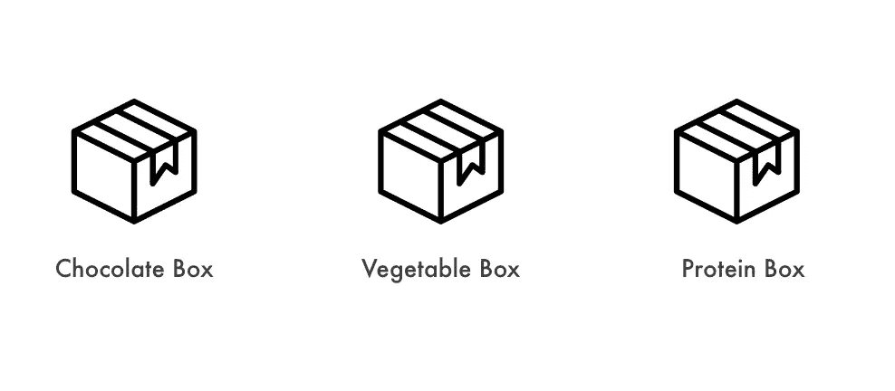
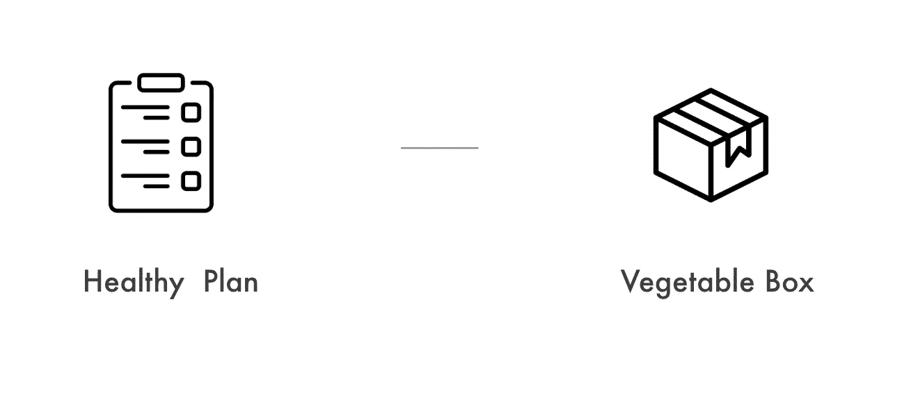
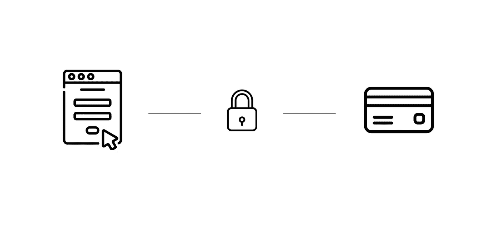
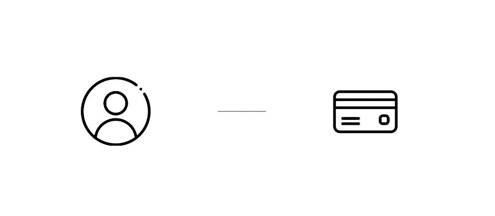

# 如何创建带条纹支付的套餐？这是为你订的。

> 原文：<https://medium.com/geekculture/get-ready-to-start-a-subscription-with-stripe-payment-ef15db43f0c0?source=collection_archive---------3----------------------->


Photo by [S'well](https://unsplash.com/@swell?utm_source=medium&utm_medium=referral) on [Unsplash](https://unsplash.com?utm_source=medium&utm_medium=referral)

## 在本文中，您将了解如何准备好订阅，以及一步一步的示例代码；产品、计划、付款方式、客户和订阅。

本文旨在解释如何使用 Stripe Payment API 创建订阅。要完全理解订阅机制，您还需要理解 Stripe Webhook 是如何工作的，它定义了订阅生命周期。这是一个复杂的话题，所以我不打算在这篇文章中写，但我会在以后的文章中写。

> 通过[订阅](https://stripe.com/docs/billing/subscriptions/creating)，客户为获得产品支付定期费用。与一次性购买相比，订阅需要您保留更多的客户信息，因为您需要在将来自动向他们收费。

您也可以查看[条纹文档](https://stripe.com/docs/billing/subscriptions/overview)了解更多详情。

在本教程中，我举例说明了如何创建一个***【20 美元】的每月健康饮食计划*** 。通过这一步，您将能够理解如何使用 Stripe Payment API 创建订阅。

# 产品

> 产品描述了你提供给顾客的特定商品或服务。例如，你可以提供你的商品或服务的标准和高级版本；每个版本都是独立的产品。它们可以与[价格](https://stripe.com/docs/api/products#prices)结合使用，以配置结账和订阅中的价格。



例如，假设您想要销售一个**蔬菜盒**进行订阅，您需要首先在 Stripe Admin 中或通过 Stripe API 注册产品信息。

```
const product = await stripe.products.create({
           name='Vegetable Box',
           statement_descriptor='Venetable Box'
})
```

就是这样。你现在有了一个叫做“蔬菜盒”的产品。接下来，让我们决定订阅间隔的价格和频率，也就是说，客户多久收到一次账单和**蔬菜盒**。

# 计划

> 计划定义了产品重复购买的基础价格、货币和计费周期。上面解释的产品帮助您跟踪库存或供应，计划帮助您跟踪定价。



例如，您可以创建一个**健康订阅计划**，向客户提供一个蔬菜盒。要创建一个计划，您需要指定`interval`、`currency`、`product`和`amount`。*一个计划关联一个产品*。

```
const plan = await stripe.plans.create({
        currency='usd',
        interval='month',
        product='pro_xxxxx', this is the id of vegetable box product
        nickname='monthly heathly plan',
        amount=20,
        usage_type='licensed',
})
```

通过将`usage_type`设置为`licensed`，您将在套餐开始后立即收到账单。`interval`是订阅计费的频率。您可以指定`day`、`week`、`month`或`year`。在本例中，当订阅开始时，该订阅将按“月”计费。

现在一个健康的计划已经准备好了！

接下来，为了真正开始订阅，还需要三个步骤。*需要创建支付方式、客户和订阅。*

# 付款方式

> PaymentMethod 对象代表客户的支付工具。它们可以与 [PaymentIntents](https://stripe.com/docs/payments/payment-intents) 一起使用，以收集付款或保存到客户对象，以存储未来付款的工具详细信息。



要保存客户的信用卡，您需要在结账时使用[条纹元素](https://stripe.dev/elements-examples/ja/)收集客户的信用卡。 **Stripe Elements** 是丰富的预建 UI 组件，帮助您在桌面和移动设备上创建自己的结账流程。

从那里，顾客输入他们的卡信息。客户的卡信息被收集并安全地保存在 Stripe 中，而不是您的服务器中。

```
const card = elements.getElement(CardNumberElement);
const payload = await stripe.createPaymentMethod({
       type: 'card',
       card: card,
       billing_details: {
          name: shipping.name,
          phone: phone,
          address,
       },
});
```

成功创建后，您可以通过访问下面的付款方式 id。该 id 将用于下一个**客户**部分。

```
payload.paymentMethod.id 
```

*如果客户保存了多张卡，那么将会有多个付款方式 id 与客户相关联。*

还有，Stripe 提供 Apple Pay 和 Google Pay 按钮。如果你想实施，你可以去[详细了解他们的 doc](https://stripe.com/docs/stripe-js/elements/payment-request-button) 。之前也写了一篇关于如何测试的详细文章。你也可以检查这个。

[](/geekculture/tips-on-google-pay-and-apple-pay-with-stripe-3eaaabd6ccab) [## 关于 Google Pay 和 Apple Pay 使用 Stripe 的提示

### 这是我在实现支付请求按钮时学到的全部内容，这是 Stripe Elements 的一个特性。

medium.com](/geekculture/tips-on-google-pay-and-apple-pay-with-stripe-3eaaabd6ccab) 

# 顾客

> `Customer`对象允许您执行重复收费，并跟踪与同一客户相关的多项收费



*当您的服务提供订购服务时，需要创建客户帐户并保存客户的卡信息*。

```
const customer = await stripe.customers.create({
        name: shipping.name,
        address: address,
        invoice_settings: {
            default_payment_method: paymentMethodID,
        },
        shipping: shipping,
})
```

`default_payment_method`是客户默认的付款方式。

收集付款方式后，将其作为`default_payment_method`附加给客户。对订阅进行计费时，将自动使用默认支付方式进行计费。如果订购的客户保存了多张卡，则只对设置为`default_payment_method`的一张卡计费。当客户更换用于订购的卡时，您需要更新`default_payment_method`以便正确地对卡计费。

# 签署

> 订阅允许您向客户重复收费


创建订阅需要*一个客户和一个计划*。在我们的例子中，我们制作了一个**健康计划**，因此您可以获取计划 id 并将其设置为订阅和客户 id。

```
const subscription = await stripe.subscriptions.create({
        customer: customerID,
        tax_percent: 8,
        items: [{ plan: plan.id, quantity: 1 }],
        coupon: coupon
})
```

您也可以在一个套餐中添加多个计划。但是在我们的例子中，让我们只购买一个数量为 1 的健康计划。如果您添加多个计划，将根据计划间隔和金额对您进行多次计费。

此外，您也可以添加可选项目。例如，如果您想要对订阅应用折扣，您可以从 Stripe dashboard 或通过 Stripe API 创建优惠券，并将其附加到订阅。

我之前也写了一篇关于优惠券的详细文章，所以如果你对了解订阅上的优惠券是如何工作的感兴趣，你也可以查看一下。

[](/geekculture/stripe-subscription-payment-create-coupon-for-subscription-89908ea86d93) [## 条带订阅付款:创建并应用订阅优惠券

### 订阅优惠券

medium.com](/geekculture/stripe-subscription-payment-create-coupon-for-subscription-89908ea86d93) 

现在，当客户购买健康计划时，客户将每月支付 20 美元的费用。

# 结束语

我向您展示了如何开始使用条带订阅。与一次性购买不同，这有点困难，尤其是如果您是 Stripe 的新手，因为您需要创建客户、计划、产品和订阅。学习成本可能很高，但 Stripe 惊人地简化了这一切，初学者可以很快做好准备。我希望我的文章能帮助你理解它是如何工作的。

如果你有任何意见，请放下你的评论。另外，如果你愿意，请随时订阅我的学习之旅。我现在是第一次创业，我正在分享我学到的东西。

我现在也正在撰写与电子商务和支付相关的其他文章，所以请随时关注我，以便在我未来的文章准备好时立即得到通知。我的账户主题是电子商务、支付和生产力。

(如果您希望向我发送提示🙂☕️)
-以太坊地址
0x 45 b 8 c 8712159 be fab 29 C3 B1 e 97 b 4534272 adff 31