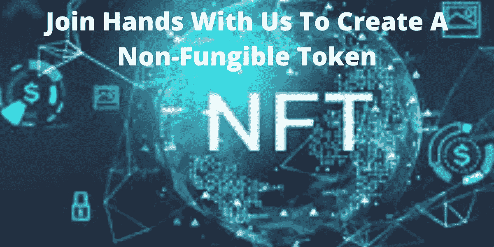

# 现在就开始开发不可替代的令牌

> 原文：<https://medium.com/geekculture/get-started-right-now-for-your-non-fungible-token-development-5960ddebb4e0?source=collection_archive---------17----------------------->

在目前的情况下，NFT 市场正稳步增长。通过这种方式，一些创作者获得了他们真正应得的利益。一个创作者要经过几个中介，才能在市场上达到最终的产出。但是 NFT 为创作者创造了一个身份。这使得内容创作者能够拥有非功能性传播媒介，他们可以利用这些媒介来推广和销售他们的非功能性传播媒介。你所需要做的就是联系一家 [**NFT 令牌开发公司**](https://www.appdupe.com/non-fungible-token-development?utm_source=google&utm_medium=blog&utm_campaign=Monika) 来开发你的 NFT。

通过 NFT 代币发展，您将获得有形和无形资产的无缝收益。无论是作为个人还是公司，你将获得的利益都是一样的。本文将向您简要介绍您需要了解的关于不可替换令牌及其发展的一切。

# 💡**什么是不可替换令牌？**

NFT 是一种独特且不可分割的数字资产。NFT 是不可互换的，因为它们是唯一的，不能被任何其他 NFT 替代。同样，NFT 只能用于法定货币和加密货币的交换。没有两个非功能性测试可以交换，因为它们是不可替换的。每个 NFT 都有不同的价值观，不可能完全相同。

NFT 是基于它们所采用的区块链协议开发的。没有规定 NFT 只能是艺术品；它们可以是游戏收藏品、媒体和娱乐、房地产、体育和加密收藏品。基于区块链网络，它们的标准化将被固定。

# 🔥**不可替代代币的吸引人的特征**

*   不可替换的令牌为创建者创建了一个身份，这样他们就可以声明属性的所有权。
*   智能合约被记录在不可替换的令牌中。这些智能合约被编程为当预定的一组条件被满足时自动执行。通过这种方式，由于 NFT 的重要特征是稀缺性，因此可以限制 NFT 的数量。
*   第三方的干预被完全消除，因为在这种情况下一切都是完全分散的。
*   开发不可替代的代币也将为全球投资铺平道路。
*   创建 NFT 是为了代表一种特定的资产，在数字生态系统中具有重要的价值。

# 🔥**在人们中间非常普遍的杰出标志标准**

众所周知，NFT 是使用各种区块链开发的；以太坊在相当长的一段时间里都是市场的先行者。所以当你接触以太坊令牌开发公司时，他们会提出通用的令牌标准。看看开发不可替换令牌时遵循的令牌协议。

## 🔓 **ERC-721**

这是 2017 年推出的第一款全球标准令牌。它被用来表示一个单独的资产，它将为创建者提供一个唯一的地址来声明他们的所有权。它执行各种功能，如将令牌从一个帐户转移到另一个帐户。不可替换代币内提供的智能合约使得跟踪以太坊区块链上创建的代币变得容易。

## 🔓 **ERC- 1155**

这是另一个重要的令牌标准，支持可替换和不可替换的令牌应用程序。即使 ERC 1155 最适合 NFT 交易，拥有大量与 ERC 721 标准相同的 NFT 也会影响交易流程。网络因此变得很慢。所以选择 ERC 1155 将对你大有帮助。

# 🔥**不可替换令牌是如何工作的？**

不可替代的令牌开发为创作者提供了巨大的空间。但是你可能想知道是什么让创造者选择 NFT 开发。下面是 NFT 如何为创造者工作。

## 🔓**所有权**

当个人使用法定货币和加密货币购买 NFT 时，他们的交易将被记录在区块链中。除了所有权证明和购买记录等详细信息，点对点交易也会记录在其中。NFT 的所有者有权将其出售给其他潜在买家。尽管 NFT 的截图和复制图像会在互联网上流传，区块链科技公司将记录下所有者的所有信息。所以在 NFT 的发展中会有捏造。

## 🔓**版权**

说到版权，有两种方法。创作者可以保留版权；他们也可以在征得买方同意的情况下放弃版权所有权。在这种情况下，买家没有任何权利复制甚至截图甚至转载作品。还有另一种方式，买家将获得版权和艺术品的完全所有权。

# 🔥**总结**

你准备好开发自己的不可替代的令牌了吗？那么，你现在需要做的就是接近一家领先的[以太币开发公司](https://www.finextra.com/blogposting/21702/start-to-develop-an-non-fungible-token-and-capture-the-metaverse-in-2022)来获得成功开发你的 NFT 的帮助。