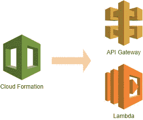
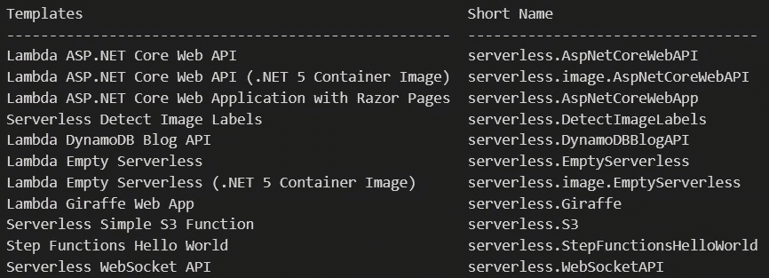
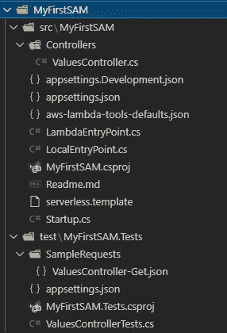
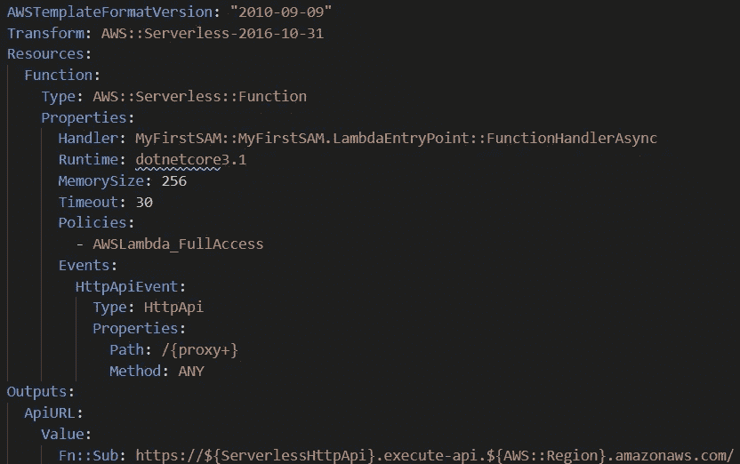
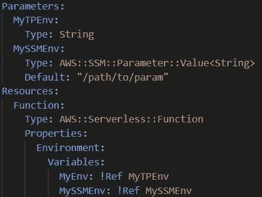

# 开始使用 AWS SAM 和 ASP.NET 核心

> 原文：<https://medium.com/geekculture/get-started-with-aws-sam-and-asp-net-core-6d4eddddbb93?source=collection_archive---------5----------------------->



[AWS 无服务器应用模型](https://aws.amazon.com/serverless/sam/)，又名 SAM，是 Lambda、APIGateway、DynamoDB 等 AWS 服务的捆绑。此外，AWS 还提供工具来帮助开发人员轻松开发无服务器应用程序。AWS SAM 支持 nodejs、go、python 等多种编程语言。然而，在本文中，我使用了。NET 及其 web 框架 ASP.NET 核心来演示。

我选择的原因。NET 不仅我很熟悉，而且 AWS 还为. NET 提供了其他工具，这些工具使得开发比其他编程语言更容易(至少我是这么感觉的)。

**为什么要使用无服务器应用？**

无服务器应用程序有很多好处，比如更便宜。不像普通的 web 应用程序必须全天候运行。无服务器应用程序只能按需运行。如果没有人使用你的网络应用，你几乎不用支付任何费用。以下数字基于每月付款的 [AWS 定价计算器](https://calculator.aws/):

**无服务器应用**

*   0 个请求，付款约为 0 美元
*   10，000 个请求，付款约为 1 美元
*   1，000，000 个请求，报酬约为 10 美元

**EC2 上的应用**

*   0 个请求，1 个 t2.micro 的付款约为 10 美元
*   10，000 个请求，1 个 t2.micro 的报酬约为 10 美元
*   1，000，000 个请求，1 个 t4g 的付款约为 100 美元

对于一个小的 web 应用程序来说，这是一个巨大的削减。

> *注:这些数字仅将 Lambda 和 APIGateway 与 EC2 进行了比较。可能还有其他费用，比如 53 路和 S3。此外，lambda 被设置为运行 2000 MS 并使用 256 MB 内存。*

# **要求**

这些是要求

*   AWS 帐户

您不需要安装 AWS-CLI 来运行 SAM，但是您需要将 AWS 凭证放在环境变量或~/中。AWS/凭据

*   AWS 桶

代码将被推到桶中

*   [。网芯 3.1 SDK](https://dotnet.microsoft.com/download)

在我写这篇文章的时候，AWS Lambda 还不支持。NET 5 或 6，除非你使用容器，但这是出了题。

*   [亚马逊。λ工具和模板](https://github.com/aws/aws-lambda-dotnet)

之后。NET SDK，运行下面的命令来安装 lambda 工具和模板。

```
# install lambda toolsdotnet tool install --global Amazon.Lambda.Tools # install templatesdotnet new -i "Amazon.Lambda.Templates::*" # you can run this command to list the lambda templatesdotnet new serverless --list
```

这些是无服务器的模板



# 创建无服务器应用程序

我们将使用`serverless.AspNetCoreWebAPI`模板，因为它不会生成太多或太少的文件。我们可以运行这个命令来创建 MyFirstSAM 项目。

```
dotnet new serverless.AspNetCoreWebAPI --name MyFirstSAM
cd MyFirstSAM
```



这些是生成的文件。它与`webapi`模板几乎完全相同。它有三个新文件和一个重命名。

*   **AWS-lambda-tools-defaults . JSON**:当使用`dotnet lambda`命令时，如果我们不给出具体的选项值，它将使用这个文件中的值。
*   cs:lambda 的入口点。
*   **serverless.template** :创建资源的 AWS CloudFormation 模板。
*   **LocalEntryPrint.cs** :是 Program.cs 的重命名，用于在本地运行应用程序。

`serverless.AspNetCoreWebAPI`模板的好处是

*   它创建 LambdaEntryPoint.cs 来隐式地将 Lambda 事件转换为 ASP.NET 上下文。我们可以编写一个普通的 APS.NET 应用程序的应用程序，没有额外的工作人员采用。(我们甚至可以在 AWS SAM 之外部署应用，比如 Azure)
*   该应用程序可以在本地运行。如果用其他模板比如`serverless.EmptyServerless`。代码不能开箱即用地在本地运行。

既然是常规的 ASP.NET，我们可以自己添加支持 MVC 或者 Razor 页面。例如，将服务更改为下面的代码。

```
// Startup.cs
public void ConfigureServices(IServiceCollection services) {
  services
    .AddRazorPages() // support Razor Pages
    .AddControllersWithViews(); // support MVC
}
```

# **serverless.template**

AWS 为 SAM 创建了类型`AWS::Serverless::Function`。该类型在部署时会被转换为`AWS::Lambda::Function`和`AWS::ApiGatewayV2::Api`等资源，可以阅读官方文档了解更多[AWS::server less::Function](https://docs.aws.amazon.com/serverless-application-model/latest/developerguide/sam-resource-function.html)。

默认情况下，模板通过定义`Events`包含一个 APIGateway 资源。类型`Api`是旧版本的 REST API，它为 stage 生成了一个无用的路径`/Prod`。因为很难在一个 SAM 中创建阶段。所以我们可以将类型改为`HttpAPi`并做如下修改。



serverless.template 支持 JSON 和 YAML 格式。所以我通常把它从 JSON 转换成 YAML，以便更好地读写。但是，您仍然可以使用 JSON 格式。

如果更改为`HttpApi`，还需要更改 LambdaEntryPoint.cs 中的继承类型

```
- LambdaEntryPoint : Amazon.Lambda.AspNetCoreServer.APIGatewayProxyFunction+ LambdaEntryPoint : Amazon.Lambda.AspNetCoreServer.APIGatewayHttpApiV2ProxyFunction
```

# 部署

lambda 工具还包括部署命令`dotnet lambda deploy-serverless <stack-name>`。这个命令将

*   构建代码
*   Zip 输出文件
*   把拉链推到 S3
*   将模板推至云形成
*   然后 CloudFormation 会为我们创建堆栈。

由于 HttpApi 不支持 stage，我们可以创建不同的栈作为 stage。比如下面的命令。

```
cd "src/MyFirstSAM" 
dotnet lambda deploy-serverless MyFirstSAMProd 
dotnet lambda deploy-serverless MyFirstSAMStaging
```

输出将显示 url。你现在可以在 SAM 上测试这个应用了。

# 设置环境变量

您还可以定义如何设置应用程序的环境变量(lambda)。有两种方法。

*   via [AWS SSM](https://aws.amazon.com/systems-manager/)
*   当执行`deploy-serverless`命令时，通过`--template-parameter`选项。

例如，我们可以在 serverless.template 上添加参数来支持它们。



在 JSON 中！裁判是`{ "Ref" : "MyTPENV" }`

展开时通过`--template-parameter`或`-tp`传递数值

```
dotnet lambda deploy-serverless $STACK -tp "MyTPEnv=$VALUE;"
```

# 结论

在我看来，AWS SAM 是一个很好的云托管解决方案。NET 开发人员。它既便宜又好用。