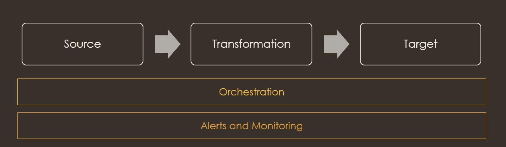
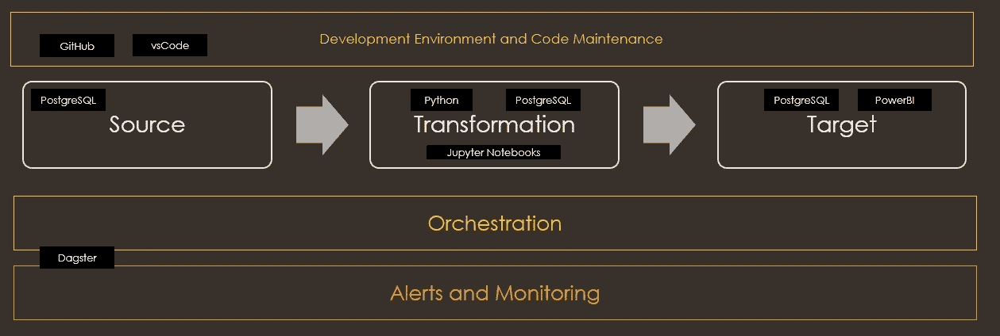

# 数据工程入门

> 原文：<https://medium.com/geekculture/get-started-with-data-engineering-f6e8dd585e49?source=collection_archive---------11----------------------->

在本文中，我希望介绍一些基本的工具和概念，您可以从这些工具和概念开始成为一名数据工程师。

数据工程师最常见的任务是构建数据管道。管道的复杂性取决于用例。但在大多数情况下，这些基本组件保持不变。

记住这一点，我想建议下面的学习大纲开始。

1.  了解版本控制工具。它有助于构建和维护您的代码
2.  学习像 python 这样的脚本语言，对初学者来说很棒
3.  学习数据建模的基础知识
4.  了解如何查询一个关系数据库。PostgreSQL 是一个很好的开始。
5.  了解 bash 脚本的基础知识
6.  学习一个编排/调度工具，如气流，Dagster，LUGI 等

一旦你熟悉了上述基础知识，你就可以开始学习这些了:

1.  了解如何查询 NoSQL，流数据库。
2.  学习数据质量的基础知识对于构建一个不仅保证数据可用性，而且保证有用数据可用性的管道来说是一个很有价值的补充。
3.  了解如何构建 CI/CD 管道
4.  了解云计算的基础知识
5.  学习数据可视化工具和 ML 建模的基础知识。这有助于理解您为什么要建立管道。

# 技术堆栈

以下是您可以安装/注册的基本技术堆栈。

python-[https://www.python.org/](https://www.python.org/)

https://jupyter.org/install

PostgreSQL-【https://www.postgresql.org/download/ 

https://github.com/(注册一个账户)

https://powerbi.microsoft.com/en-sg/desktop/

达格斯特-[https://www.dagster.io/](https://www.dagster.io/)

虚拟代码-[https://code.visualstudio.com/download](https://code.visualstudio.com/download)

**数据工程 Python 基础**

除了学习 python 的基础知识:变量、函数、条件语句和 oops 概念之外，下面的库对于有抱负的数据工程师来说也是不错的选择。

1.  pyspark
2.  要求
3.  熊猫
4.  beautifulsoup4
5.  心理战 2

python 正在成为数据工程师所需的主要技能之一，因为它被用于诸如 airflow 和 Dagster 等编排工具中。

**Jupyter 笔记本**

Jupyter 笔记本提供了一个很好的界面，可以用多种命令语言执行命令。它提供了使用多种语言转换数据的灵活性。

你可以参考下面的链接来了解 jupyter 支持的各种语言。[https://jupyter4edu.github.io/jupyter-edu-book/jupyter.html](https://jupyter4edu.github.io/jupyter-edu-book/jupyter.html)

**PostgreSQL**

Postgresql 是一个开源的关系数据库管理系统。大多数云提供商都提供这种服务。因此，构建一个与云无关的管道是对您的技术堆栈的有益补充。

SQL 是数据工程师的必备技能。Postgresql 有助于提供学习/发展您的 sql 技能的基本环境。

大多数时候，数据工程师还可能承担将数据从数据集市(使用 PostgreSQL)转换到数据湖/数据仓库的责任。并非所有代码都需要在 python 上构建，必须理解 PostgreSQL 上的一些现有函数和存储过程，以便它们可以在预聚合中重用。

在某些情况下，PostgreSQL 数据库还可以用于维护审计日志或充当 web 应用程序的元数据 DB。

**GitHub**

对于那些不熟悉源代码管理和版本控制库的人来说，GitHub 是一个很好的起点。通过 GitHub，人们可以练习 git 命令。除此之外，它还提供了读取端到端数据管道代码的资源。

**PowerBI 桌面**

数据工程师可以使用各种工具来处理数据管道。学习在像 PowerBI 这样的工具上构建简单的仪表板对于通过合并来自收集度量信息的各种元数据或数据源的数据来报告关键性能度量是有用的。

了解该工具还有助于了解任何数据管道故障的影响，因为数据管道通常充当报告工具的上游。

**达格斯特**

Dagster 是一个容易上手的编排平台。它可以帮助构建可以在本地测试的代码。对于希望成为全栈 ML 工程师的数据工程师来说，这是一个有用的补充。[https://docs.dagster.io/getting-starte](https://docs.dagster.io/getting-started)d

**虚拟代码**

vsCode 是一个代码编辑器工具。它有大量的扩展，可以添加这些扩展来支持代码开发。这里有一些你可以开始使用的扩展

1.  大蟒
2.  jupyterlab
3.  pythontest 浏览器
4.  一种数据库系统
5.  皮林特

快乐学习！