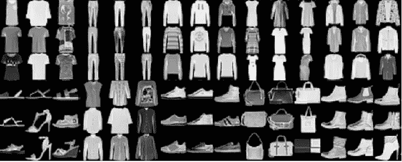

# 开始使用 Tensorflow 2.0 和 CNN

> 原文：<https://medium.com/geekculture/get-started-with-tensorflow-2-0-and-cnn-fed15708a373?source=collection_archive---------10----------------------->

## TensorFlow 2.0 和 CNN 使用时尚 MNIST 数据集的实践示例

[Fashion MNIST Dataset](https://www.kaggle.com/zalando-research/fashionmnist)

在本教程中，我们将展示如何在 Python 和 Tensorflow 2.0 中轻松构建卷积神经网络。我们将使用[时尚 MNIST 数据集](https://www.kaggle.com/zalando-research/fashionmnist)。

首先，确保您已经安装了 TensorFlow 的 2.0 版本: