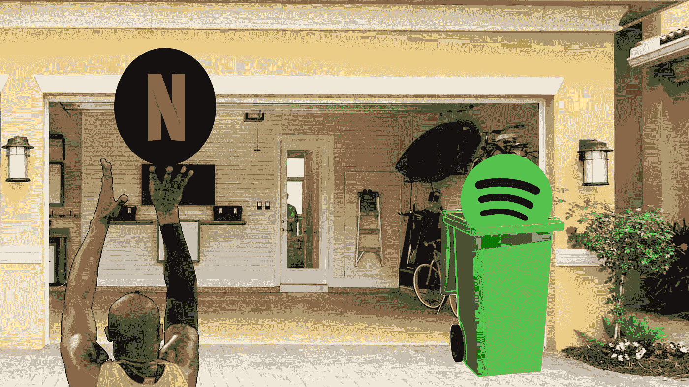
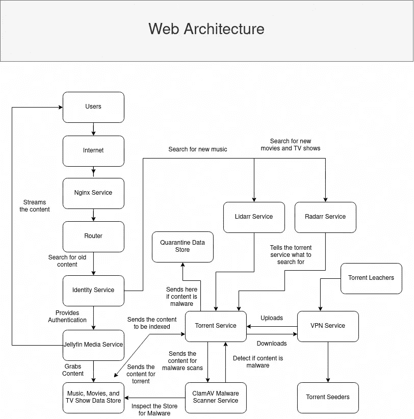
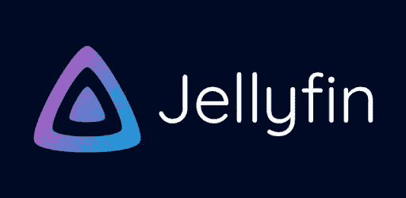

# 获得卓越的网飞和 Spotify 体验

> 原文：<https://medium.com/geekculture/get-the-superior-netflix-and-spotify-experience-4174f3d0817e?source=collection_archive---------2----------------------->

## 如何建立自己的流媒体服务？

**免责声明:我不赞成使用我的指南来传播非法材料。建议使用用户文摘，因为盗版内容可能是非法的，无论你是否拥有拷贝，在某些国家都是非法的。**

看一部电影需要十几个甚至更多的流媒体服务，你是否已经厌倦了？也许你讨厌**打开 VPN 访问区域锁定的内容**。也许您的某个订阅(如网飞)即将涨价，但并未以任何可量化的方式得到改善。大型科技商业模式是唯一一种[价格可以提高](https://www.ign.com/articles/netflix-price-increase-2021)而功能没有任何实质性改进的模式。

不仅如此，来自冷漠的政府实体的外国制裁也会阻止你访问你的内容。为什么美国政府的制裁会影响俄罗斯人民是否可以访问他们的内容？尤其是当这些人用他们辛苦赚来的钱购买了访问他们内容的特权而不是权利时。因为该权限可以在任何时候被任意取消。只有在这种数字农民的反乌托邦状态下，这样的事情才会发生。

网飞也在打击密码共享。网飞是一家推广大量“进步”和“觉醒”想法的公司。但是，共享密码？这是一个很大的否定。这听起来像共产主义，需要禁止，因为这将损害公司的底线。这让这些科技公司很困惑。

如果你厌倦了处理所有这些事情，那么你将学习如何构建自己的流媒体服务，从而击败竞争对手。我说的是具有剧院级音质的 4K 电影。录音室制作级别的音乐。而不是你从网飞和 Hulu 等流媒体服务中获得的 1080p 压缩垃圾。[你的音乐流媒体服务上的广告](https://community.spotify.com/t5/Subscriptions/Ads-on-podcasts-despite-premium/m-p/4753448)，即使你已经支付了付费订阅。

回到我那个时代，或者仅仅一二十年前，人们习惯于物理地拥有他们的内容。你会开车去商店购买 DVD 或 CD 形式的内容，或者从 Blockbuster 租赁。然而，如今大多数人转向通过网飞和 Spotify 等集中式流媒体服务来消费内容。因为那样更“方便”。现在你必须处理不拥有你的内容的问题。不仅如此，将所有东西都转移到云中意味着拥有你的内容是“过时的”。现在这些科技公司把你困在了他们的平台上。因为像 Blockbuster 这样“旧的”内容分发形式已经被淘汰。

Photo from observer.com

看着大众掏钱让他们杀了百视达，同时又知道另一部百视达还存在，有点诗意。幸运的是，你不必和其他的猪和羊一起在泥里打滚。因为你仍然可以自己托管你的内容服务器，并直接从你的家中传输。

以下是如何获得卓越的网飞和 Spotify 体验。

## 必备知识

你需要阅读我的博客文章，*去谷歌化的完整指南。在指南中，通过教你如何构建 Google Apps 和 Microsoft 365 的自托管版本，你可以学习自托管所需的网络和软件工程知识的基础。*

*您还需要了解如何创建数据集并将这些数据集挂载到不同的监狱。*

* [## 数据集

### TrueNAS 数据集是在数据存储池中创建的文件系统。数据集可以包含文件、目录…

www.truenas.com](https://www.truenas.com/docs/core/storage/pools/datasets/)  [## 免费的 11+locage。我如何在监狱里安装主机数据集

### 现在 iocage 在 FreeNAS 11-RC4 中可以使用了，我创建了几个监狱来玩。今天我决定测试一下…

www.truenas.com](https://www.truenas.com/community/threads/freenas-11-iocage-how-do-i-mount-host-datasets-inside-jails.55193/) 

Photo from Dre Tech Tips

## 媒体数据存储

您可以自由地以任何方式存储您的内容，因为媒体服务器可以轻松地索引电影。我建议您根据文件夹对内容进行分类。你可以将目录分成不同的媒体类型，如电影、电视节目和音乐。你可以进一步将每个类别分成不同的类型。例如，音乐类别可以进一步划分为说唱、嘻哈、古典音乐流派。这样做将使在服务器上存储和组织内容变得更加容易。

## 恶意软件隔离数据存储

潜在的恶意软件将被送到隔离区。这将防止用户消费潜在的恶意软件。您可能需要定期访问隔离区并检查内容是否为恶意软件。当你的电影有一个可执行的扩展名时，你应该是 sus。您还可以编写一个 cron 作业脚本，在 2 周后自动清除，这样您就不会浪费额外的空间。您也可以编写一个脚本来自动从隔离过程中删除。

如果你有任何脚本可以完成上述任何任务，那么把它提交给 Git Repo，这样你就可以帮助社区了。

 [## saandre 15/媒体服务

### 此时您不能执行该操作。您已使用另一个标签页或窗口登录。您已在另一个选项卡中注销，或者…

github.com](https://github.com/saandre15/media-service) 

## NGINX 服务

关于**安装**和**保护服务**的信息可以在先决知识部分找到。

**使用服务**

有些服务(如 Lidarr 和 Radarr)没有任何内置的身份验证服务。您必须配置您的反向代理服务器，以便在服务和互联网之间添加一个身份验证中间件层。否则，你会开始奇怪为什么电影、电视节目和音乐会神秘地消失或添加到你的流媒体服务中。

遵循指南并根据您运行的身份服务进行修改。

 [## 使用 key cloak/Red Hat SSO | Red Hat Developer 为 OAuth/OpenID Connect SSO 配置 NGINX

### 在本文中，我将介绍如何使用 Keycloak/Red Hat 单点登录为基于 OAuth 的单点登录(SSO)配置 NGINX。这允许…

developers.redhat.com](https://developers.redhat.com/blog/2018/10/08/configuring-nginx-keycloak-oauth-oidc#configuring_keycloak_and_nginx)  [## OpenID 连接 WSO2 身份服务器和 WSO2 OAuth2 游乐场

### 本节演示了 WSO2 Identity Servers OpenID Connect 基本客户端概要实现与 WSO2…

docs.wso2.com](https://docs.wso2.com/display/IS500/OpenID+Connect+with+the+WSO2+Identity+Server+and+WSO2+OAuth2+Playground) 

如果您成功创建了一个支持 WSO2 Identity Server 单点登录的 NGINX 配置文件，请提交一个 pull 请求。

 [## saandre 15/媒体服务

### 此时您不能执行该操作。您已使用另一个标签页或窗口登录。您已在另一个选项卡中注销，或者…

github.com](https://github.com/saandre15/media-service) 

## VPN 服务

当您获取内容时，您可能希望使用 VPN 服务。因为你不希望人们得到你的 IP 地址，并可能 DOX 你。建议您选择公司位于以下国家的 VPN 提供商。

*   荷兰
*   卢森堡
*   保加利亚
*   俄罗斯
*   香港
*   新加坡
*   马来西亚

这也将保护你免受“其他”恶意演员的攻击。选择一个不计量流量或提供最大流量的主机提供商。大多数主机提供商每月提供大约 1TB 的流量。任何提供无限带宽的主机提供商都要优越得多。

**如何安装服务？**

在主机提供商的选择上，我建议你设置一个 VPN 服务器。设置 VPN 服务器相当困难。幸运的是，这个过程已经被下面的软件自动化了。

 [## GitHub-the onemule/simple-openvpn-server:一个设置脚本和简单的 web UI，用于设置一个…

### OpenVPN 是最流行的 VPN 平台之一，原因有很多。它是免费的，开源的，并且有…

github.com](https://github.com/theonemule/simple-openvpn-server) 

**如何使用服务？**

TrueNAS 允许您通过 VPN 路由流量，但是，它是通过整个流量。这是对带宽的浪费，尤其是在带宽有限的情况下。

 [## OpenVPN

### 虚拟专用网络(VPN)是专用网络在公共资源上的延伸。它允许客户…

www.truenas.com](https://www.truenas.com/docs/core/services/openvpn/#openvpn-client) 

如果您关注了我的上一篇博客，那么您将使用 FreeBSD 托管您的服务。这里有一个关于如何通过 VPN 路由你的监狱流量的指南。任何与现实世界相连接并执行非法活动的软件都应该让流量通过 VPN 来保护自己。

 [## FreeBSD:通过 VPN 路由监狱流量— davd.io

### 我想通过 OpenVPN 将我的 FreeBSD NAS 的一个单独的监狱暴露给一个客户端的网络，同时它可以从…

www.davd.io](https://www.davd.io/freebsd-route-jail-traffic-through-vpn/) 

如何确保服务的安全？

只需保持服务器更新，并使用防火墙阻止未使用的公共端口。请确保运行测试，以确保 IP 地址是 VPN IP 地址。这样就不间接拧自己了。

在服务器上，通过下面的 URL 发出 CURL 请求。检查 IP 地址，以确保您已经正确设置了一切。

https://whatismyipaddress.com/

如果您的 IP 地址是您的家庭或办公室 IP 地址，那么您的 VPN 设置不正确。并调试您的连接。

## 种子服务

Torrenting 基本上是一个分散的内容抓取器和内容分发器。这将**允许你免费获取内容创作者或第三方转售者不可出售的内容**。你可以得到任何内容，包括软件，视频，电影。

**安装服务**

有一个叫 Transmission 的软件提供烘焙服务。遵循以下指南，安装传输服务。您不需要 WebGUI 或远程客户端，因为我们将有另一项服务来自动化内容种植过程。

 [## 传输插件安装和设置

### 大家好，我学习了几个不同的变速器安装和设置教程。当我有插件的时候…

www.truenas.com](https://www.truenas.com/community/threads/transmission-plugin-installation-and-setup.51498/) 

**使用服务**

传输是一个公共程序，所以要遵守协议和礼仪。最重要的是不要成为一个漏网之鱼。对于你过滤的每一个内容，至少要有一个种子。

 [## 如何种子种子种子种子文件-尊重 BitTorrent 礼仪

### Torrenting 就是使用人们电脑上已经有的文件。那些决定共享文件的人…

www.technadu.com](https://www.technadu.com/how-to-seed-torrent-files/19437/) 

您还必须启用**远程访问**，这样其他服务就可以与 torrent 服务接口来远程下载和上传内容。

阅读更多关于脚本的内容。你必须写一个脚本，在比赛后运行，将下载的文件发送到恶意软件扫描服务。如果恶意软件服务检测到病毒，它会将其发送到隔离区。否则，它将允许 torrent 索引器将内容移动到媒体服务器数据存储。

 [## 脚本传输/传输 Wiki

### 此时您不能执行该操作。您已使用另一个标签页或窗口登录。您已在另一个选项卡中注销，或者…

github.com](https://github.com/transmission/transmission/wiki/Scripts) 

如果您有一个自动化传输种子任务的脚本，那么创建一个拉请求。

 [## saandre 15/媒体服务

### 此时您不能执行该操作。您已使用另一个标签页或窗口登录。您已在另一个选项卡中注销，或者…

github.com](https://github.com/saandre15/media-service) 

**保护服务**

这不是面向公众的，所以你不需要防火墙。请确保尽可能频繁地更新这个种子服务，以最大限度地提高安全性。这些媒体公司会找到尽可能多的方法来干扰你，一个报价一个报价地窃取他们的内容。

 [## 激流中毒——维基百科

### Torrent 中毒是故意使用 BitTorrent 共享损坏的数据或带有误导性文件名的数据…

en.wikipedia.org](https://en.wikipedia.org/wiki/Torrent_poisoning) 

## 雷达服务

您可能希望自动下载和播种内容。众所周知，在这个点播流媒体时代，等待内容下载是一件痛苦的事情。如果你能自动下载并格式化它，使它能被你的媒体服务器索引，那就太好了。有工具可以让你做到这一点。

Radarr 是介于 torrent 服务和下载电影和电视节目的媒体服务之间的中间件。

它监控电影和电视节目的 RSS 源。并下载内容。通常，种子标题包含元数据，如名称、存储大小、电影质量、音乐质量。因此，软件解析它，并将其发送到存储位置，如媒体或音乐数据集。从那里，媒体软件将索引电影和电视节目。

**安装服务**

只需按照指示在监狱内安装该服务。

 [## GitHub—radar/radar:sonar 的一个分支，用于处理 Couchpotato 电影。

### Radarr 是一个为新闻组和 BitTorrent 用户提供的电影收藏管理器。它可以监控新电影的多个 RSS 源…

github.com](https://github.com/Radarr/Radarr) 

**使用服务**

您需要将您的 torrent 服务器信息输入到此应用程序的 torrent 客户端部分，以便服务可以执行内容下载。

您需要创建几个 webhooks 来让服务正常工作。把 webhook 想象成一种让 web 软件相互通信的方式。过去，人们会使用脚本来自动化任务。但现在是 2022 年，没有人想处理被称为 CLI 的可怕的大黑匣子。他们想使用他们花哨臃肿的图形用户界面。

 [## 什么是网钩？

### webhook 是一个越来越受欢迎的 API 概念。随着越来越多我们在网上做的事情可以用…

sendgrid.com](https://sendgrid.com/blog/whats-webhook/) 

创建一个 webhook，告诉 Jellyfin 在电影或电视节目下载后刷新其库。这是您可以调用来执行该操作的 URL。

http://<jellyfin address="">:<jellyfin port="">/库/刷新？api_key=</jellyfin></jellyfin>

创建一个域名，例如

> search.video.example.tld

你还需要寻找种子的 RSS 源。一些最好的种子源包括但不限于

*   [显示 RSS](https://showrss.info/)
*   [RARBG](https://rarbg.to/rss.php)

## Lidarr 服务

这与 Radarr 是一回事，但它下载的是音乐，而不是电影和电视节目。这里是[下载服务](https://github.com/Lidarr/Lidarr)的网址。只需按照 Radarr 服务指南安装和设置您的服务。

## 杰利芬媒体服务公司

Jellyfin Media Server 是网飞和 Hulu 在自托管市场上的竞争对手。还有其他服务，如 Plex 媒体服务器和 Emby 媒体服务器，但这一个是最好的插件支持。另一个也会试图通过锁定功能让你为软件付费。

**安装服务**

安装 Jellyfin 需要 DotNET。微软不支持 FreeBSD 上的框架，但是他们有。NET for Linux。前任首席执行官史蒂夫·鲍尔默称 Linux 为“癌症”。今天，整个 Azure 云几乎都是基于 Linux 构建的。嘿，一旦你发现如何赚钱或直接收购竞争对手，那么它就不再是癌症了。这都是微软商业计划的一部分，以[拥抱、消灭和扩展](https://skeptric.com/embrace-extend-extinguish/)。

这里有一个免费的开源软件，你可以在 FreeBSD 上安装 Jellyfin。

 [## GitHub——f rank/jellyfin-server-FreeBSD:FreeBSD 的 jellyfin-server 组件

### 微软没有 FreeBSD 的官方版本。更多详情请见此处。本次回购目前仅…

github.com](https://github.com/Thefrank/jellyfin-server-freebsd) 

如果你读了我的博客文章 [*去谷歌化的完整指南*](/@stemtalk/how-to-dismantle-the-google-empire-e652bff6d2) ，你会对使用身份服务器为你的用户自动处理账户感兴趣。

免费开源社区中的某个人已经为 Jellyfin 构建了一个 SSO 插件。它支持 SAML 和 OpenID。这是阿尔法质量的软件，所以它可能有一些错误。

 [## GitHub — 9p4/jellyfin-plugin-sso:这个插件允许用户通过 sso 提供者登录(比如…

### 该插件允许用户通过单点登录提供商(如谷歌、脸书或您自己的提供商)登录。这个…

github.com](https://github.com/9p4/jellyfin-plugin-sso) 

**使用服务**

就像网飞和 Hulu 一样，他们也有一个在 iOS 和 Android 上的应用。

就像 Spotify 一样，他们也有一个非官方的音乐播放器应用程序，用于安卓系统和 T2 的 iOS 系统。查看必备知识，了解如何设置反向代理，以便在开放的互联网上为您的服务提供公共接口。

您可以设置一个域名，例如

> media.example.tld

并将它直接指向您的媒体服务器，这样您就可以在任何地方访问您的电影、电视节目和音乐，就像网飞和 Hulu 一样。

也许你想限制在开放的互联网上传输视频的带宽。我们需要一个代码转换器来执行视频和音频压缩。几乎所有向用户提供流媒体内容的互联网公司都会使用这个。

你可能不想在 CPU 上使用代码转换器。否则，您的自托管服务器将听起来像一个 XB-70 瓦尔基里

准备垂直起飞。所以你得买个 GPU。根据用户数量的不同，您可能需要购买更强大的 GPU 或更多的 GPU。一台 GTX 1080 对 10 个用户来说绰绰有余。您可以尝试的另一项技术是预转码，而不是即时转码。但是那样会浪费更多的存储空间。

**保障服务**

如果您在开放的互联网上运行此服务，请保持服务不断更新。封锁未使用的端口。

## ClamAV 服务

你会从网上下载一些随机的东西。所以你有可能会下载恶意软件。你不希望自己检查每一个下载的内容。ClamAV 将自动完成这一过程。ClamAV 是一款恶意软件扫描软件。

**安装服务**

特鲁纳斯已经是克拉马夫的预建监狱。

**使用服务**

我们将使用 ClamAV 作为一个独立的服务。确保你的恶意软件数据库是最新的。我们的隔离模式将基于新冠肺炎传染病隔离程序。每一份文件都要通过软件检查。检测到恶意软件后，它会将其隔离，下载内容的用户将无法访问该内容。否则，用户仍然可以访问该内容。

**保护服务**

这可能是你保护的最重要的东西。如果你搞砸了，你可能会从任何恶意种子下载恶意软件。或者你可能会下载有毒的种子。确保恶意软件数据库每天不断更新。数据库会定期更新，因此您也必须定期扫描媒体数据存储。执行此操作的最佳方式是将媒体数据存储安装到 ClamAV 中。并定期执行扫描。

## 为什么 Spotify 和网飞还是更好？

好吧，你构建的解决方案可能会在流媒体质量、隐私和成本方面击败竞争对手。但是你会失去一些你已经习惯的功能。

**内容的账户管理**

Spotify 和网飞为不同的用户提供不同的内容。目前确实如此。Sonarr 软件一直在寻求使用 SSO 实现多用户支持。这将有助于区分不同用户的内容存储。

 [## 多用户支持问题#1682 Sonarr/Sonarr

### 多个用户将允许用户允许家庭成员和朋友访问 Sonarr，而不给他们完全的访问权…

github.com](https://github.com/Sonarr/Sonarr/issues/1682) 

**推荐系统**

你想使用一个旨在让你沉迷于这项服务的推荐系统吗？说到推荐系统。

 [## 大型科技公司是新的大型烟草公司吗？历史说是的

### 1965 年 9 月，伊丽莎白·德鲁为《烟草游说团的静悄悄的胜利》写了一篇文章。在里面…

interestingengineering.com](https://interestingengineering.com/is-big-tech-the-new-big-tobacco) 

## 最后

[订阅免费电子邮件列表，获取更多关于反大科技的内容。](/subscribe/@dretechtips)

**加入我们，成为 400 多名想要获得卓越软件的人。而不是大量销售的垃圾软件。**

达到这一点可能意味着你同意大部分已经写了。留下大量的掌声和分享，以获得算法来推广将杀死大型技术的信息。

**相关内容:**

*   [信号将被破坏](/geekculture/signal-will-be-compromised-eb18a91fd51f)
*   [完全去谷歌化指南](/@dretechtips/how-to-dismantle-the-google-empire-e652bff6d2)
*   [抖音:该应用致力于建立一个不断变化的世界秩序](/geekculture/tiktok-the-app-bent-on-asserting-a-changing-world-order-d09b3077ddc8)*