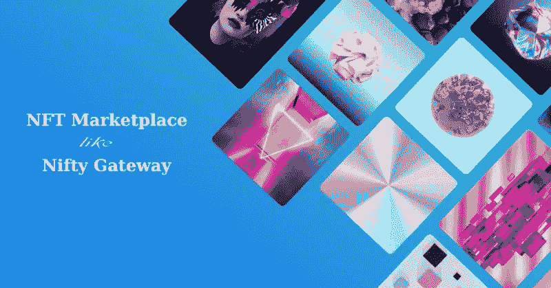
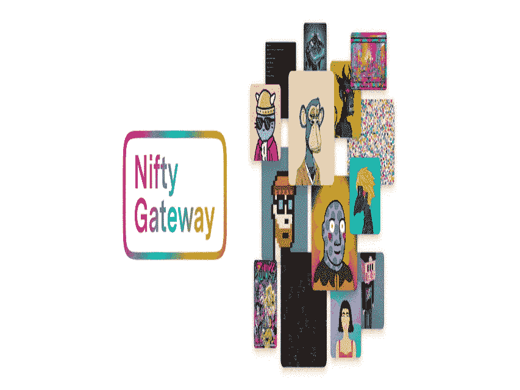

# 通过 Nifty Gateway 等 NFT 市场，让您的收藏物超所值

> 原文：<https://medium.com/geekculture/get-your-collections-to-a-great-value-with-the-nft-marketplace-like-nifty-gateway-a63cae98f130?source=collection_archive---------15----------------------->

NFT Marketplace Like Nifty Gateway

金融交易是未来的关键，也是最大的挑战。他们支撑着精神，让他们继续前进，就像他们现在正在做的那样。他们已经进入了每一个可能的维度，成为了地球上最复杂的东西。人们已经开始在各个领域创建 NFT 和他们的市场，使它成为全世界最成功的商业机会。

现在，非技术人员在他们所在的每个领域都有很多市场，这在人们之间建立了一种强有力的纽带。一个这样的市场是 Nifty Gateway。它的平台中包含了最受欢迎的东西，并取得了很大的销量。你可以建立一个成为世界上最成功的企业家之一。

在这里，让我们谈谈俏皮网关和一个 [**俏皮网关的发展像 NFT 市场**](https://bit.ly/3xD95pr) **。**

## **什么是便捷的门户市场？**

CryptoKitties 和艺术家，如 Cey Adams，Kenny Scharf，Jon Burgerman 和崔佛·琼斯，都在 Nifty Marketplace 上有代表，Nifty market place 是一个位于区块链的平台，用于访问一些当今最受欢迎的艺术品和收藏品。

限量版系列定期出版，很快就销售一空。

## **一个漂亮的网关 NFT 市场是如何运作的？**

Nifty Gateway NFT Marketplace

[**Nifty Gateway**](https://niftygateway.com/) 是一个主要的市场平台，由于其巨大的受欢迎程度，已经成为顶级艺术家和品牌的磁石。由于这种诱惑，市场能够生产高质量的 nif。所生成的 Nifties 集合在特定时间被丢弃，并且仅在有限时间内可用。漂亮的网关 NFT 市场专注于每三周投放一次镍币，赋予收藏品独一无二的品质，增加它们的价值。Nifty Gateway 是一个集中的平台，而其他 NFT 市场是分散的。你不需要像 MetaMask 这样的数字钱包来开始交易，因为这是一个基于美元的市场。

## **NFT 开发的 Nifty Gateway 的特点**

☀Ownership

☀Advanced 用户界面

象征的☀Inauguration

☀Immutability

安全的☀Transactions

可定制的☀A 平台

☀Creating 一份名单

☀Purchasing 和投标

☀Ratings

☀Platform 为了安全

☀There 不会充当调停者。

## **独家俏皮网关，像 NFT 市场开发，**

这个漂亮的网关，类似于 [**NFT 市场开发**](https://bit.ly/3NHgnOK) 过程，是透明的，如果用户对任何 NFT 感兴趣，可以在市场中出价。用户可以愉快安全地交易。

## 1.**注册**

要创建帐户，用户必须首先注册他们的凭证。用户将能够在他们的账户被验证和登录后输入他们的支付信息。现在用户帐户已经激活，他们可以销售、购买和创建 NFT。

## 2.**探索**

用户现在可以使用他们的凭证登录，并浏览市场中可用的 NFT。一旦找到最好的，他们就可以出价购买 NFT。

## 3.**拍卖**

用户(买家)将被通知艺术品创作者的出价。如果卖家对出价满意，他们可以继续以这个价格出售 NFT。与传统拍卖一样，开始拍卖将有助于用户购买最好的 NFT。

## 4.**铸造**

数字艺术家创作艺术品，然后通过上传在漂亮的网关上出售。最后一步是批准步骤，在此期间，管理员检查数字作品，并批准其包含在 Nifty Gateway NFT 市场中。

## **Nifty Gateway 的优势**

Nifty Gateway 的主要吸引力在于参与市场的艺术家的排他性；网站上提供的作品包括来自世界各地的一些最好的艺术家。下降是可预测的，很容易跟踪，转售你的购买也很简单。

初学者会欣赏 Nifty Gateway 的简单性，因为他们可以创建一个帐户并用信用卡购买 NFTs，而不是必须 [**创建一个加密钱包**](https://bit.ly/3xIVJYJ) ，向 ETH 提供资金，连接它，支付汽油费，并签署交易。

## **Nifty Gateway 接受哪些钱包？**

作为一个托管市场，Nifty Gateway 不要求用户连接任何基于网络或硬件的加密货币钱包来使用该平台。

你购买的作品会保存在平台上，除非你将它们提取到一个外部钱包地址，但如果它们在像 **MetaMask** 这样的钱包中，它们就不能在 Nifty Gateway 上出售。如果你想卖掉它们，你可以把它们放在另一个市场上，比如OpenSea，或者把它们放回漂亮的网关平台。

## **发展**

市场的开发要么由 NFT 市场开发公司完成，要么通过雇佣潜在的开发者来完成。公司是巨大的，你需要为开发过程选择正确的公司。现在是市场发展的时候了，因为它可以成为这一代人的榜样。

## **结论**

雇佣一家 NFT 市场发展公司，用它来启动你的生意。这是面向未来的时代，你可以成为一名成功的密码创业者和密码大王。**[**【NFT 市场】像俏皮的门户**](https://bit.ly/3xD95pr) 会更好的给你事业有成的机会。因此，与开发公司打交道，像 Nifty gateway 一样开创自己的市场。增加你事业成功的机会。**