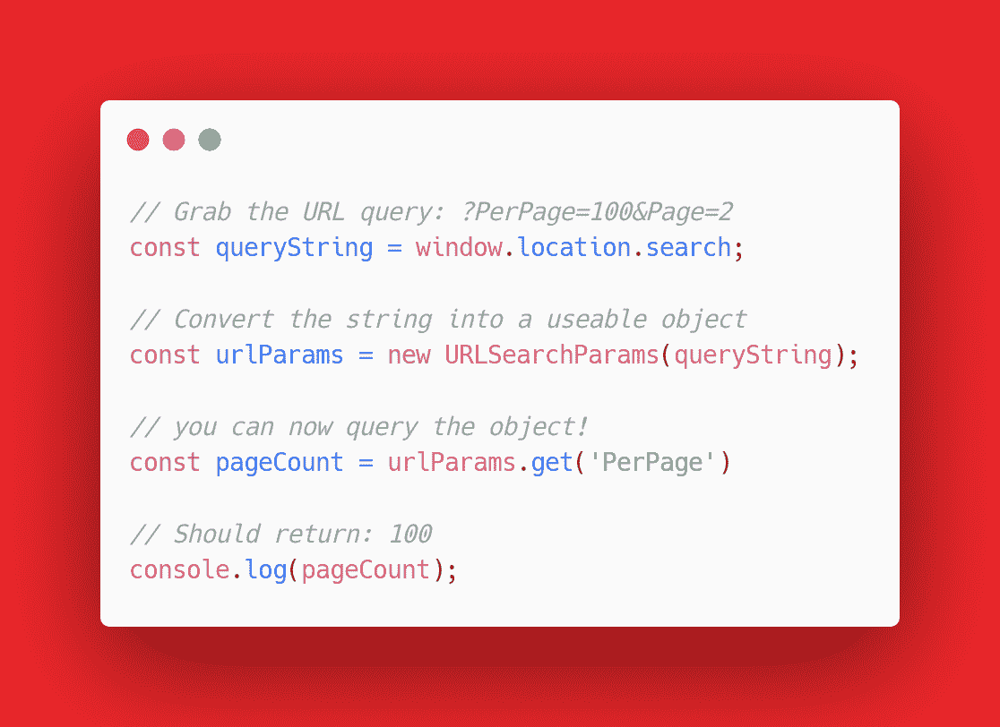
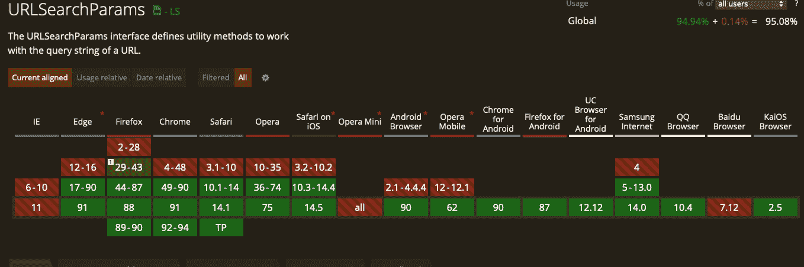

# 在 Javascript 中获取 URL 参数

> 原文：<https://medium.com/geekculture/getting-a-url-parameter-in-javascript-ce78626c0308?source=collection_archive---------43----------------------->

用 Javascript 编程时，有时您可能想知道是否有任何参数通过 URL 传递。如果您不熟悉 URL 参数，它们是在基本 URL 和“？”后面设置的参数。例如，让我们看看下面的例子:

[https://www . josephamaurer . com/Projects/DevAPI/recentdevposts . html？PerPage=100](https://www.josephamaurer.com/Projects/DevAPI/RecentDevPosts.html?PerPage=100)

*？PerPage=100* 是这个 URL 传递的第一个参数。获取这个参数的值并恰当地使用它取决于您的 javascript 逻辑。那么可以有多个参数吗？你打赌！使用以下语法添加附加参数:

[https://www . josephamaurer . com/Projects/DevAPI/recentdevposts . html？PerPage=100 & Page=2](https://www.josephamaurer.com/Projects/DevAPI/RecentDevPosts.html?PerPage=100&Page=2)

&Page=2 '是该 URL 的第二个参数。此时，您可能想知道像这样传递参数有什么限制？很明显，你不能有任何空间。另一个原因是“#”字符是为跳转到文档的某一部分而保留的。一般来说， [URL 编码](https://en.wikipedia.org/wiki/Percent-encoding#Percent-encoding_reserved_characters)用于处理这个问题，使任何文本都可以安全地传入 URL。Internet Explorer (RIP)的最大长度为 2083 个字符。虽然, [RFC 2616](https://datatracker.ietf.org/doc/html/rfc2616#section-3.2.1) 规范规定服务器需要能够处理任意数量的字符，但是如果请求太长，web 服务器可能会响应失败。如果你打算在一个生产项目中这么做，我强烈推荐你看看谷歌 Chrome 指南。

# **网络表单**

这些查询字符串在 URL 中最常见的用途是 web 表单。当用户点击表单上的 submit 时，他们的响应会被发布到 URL 中，供后端处理。在本教程中，我们将只关注从那个 URL 获取值进行处理，但是有很多在后端使用它的例子。

# **URL 搜索参数**

当使用 javascript 解析 URL 时，最简单的方法是使用 [URLSearchParams](https://developer.mozilla.org/en-US/docs/Web/API/URLSearchParams) 而不是自己尝试解析字符串。你可以使用正则表达式来尝试做到这一点，但是正如我之前写的这是一个可怕的想法。所以让我们看看下面的例子，看看这是如何工作的。

如您所见，获取参数实际上是一个非常简单的过程。您可以非常容易地进行查询，查看存在哪些对象，并在使用它们之前先检查它们是 null 还是实际值。在我写这篇文章的时候，[浏览器的支持](https://caniuse.com/urlsearchparams)非常好，几乎可以在任何地方使用。

# **实例**

在我的[上一篇视频文章](https://dev.to/mwrpwr/exploring-dev-to-api-45ni)的基础上，您现在可以向我的示例页面传递参数，以处理它返回的文章数量。

 [## API 测试人员开发:最近的帖子

### 一个从 DEV.to API 提取数据用于调试和共享的工具！

www.josephamaurer.com](https://www.josephamaurer.com/Projects/DevAPI/RecentDevPosts.html?PerPage=3) 

如果你最终使用了这种方法并快乐编码，请告诉我😊