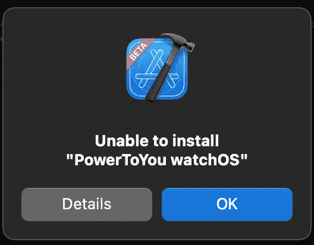
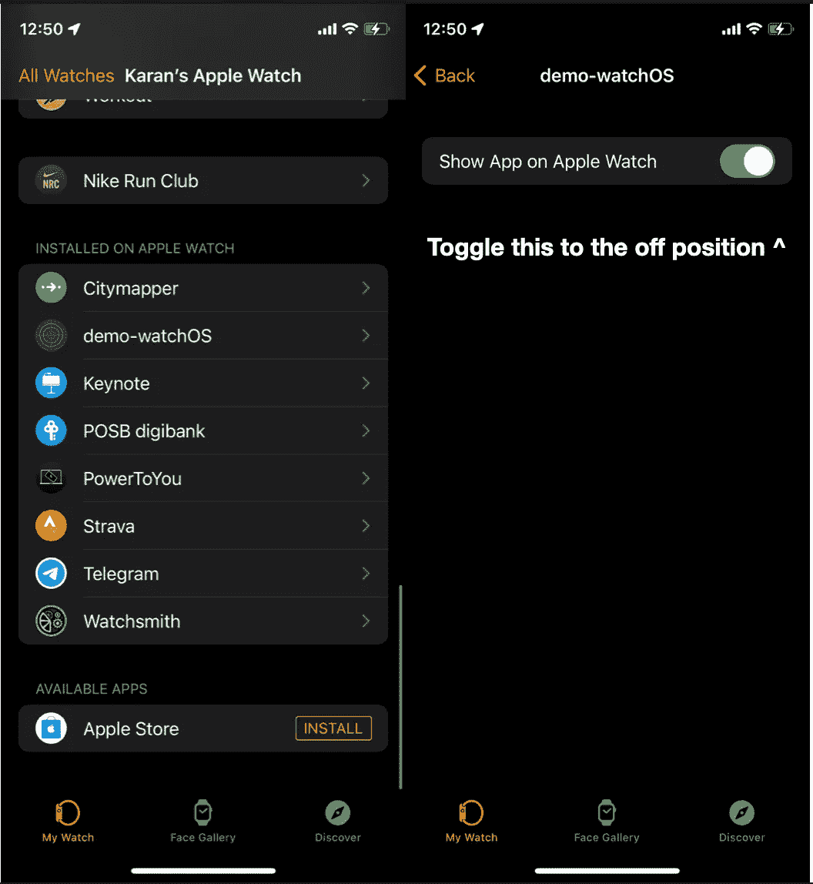
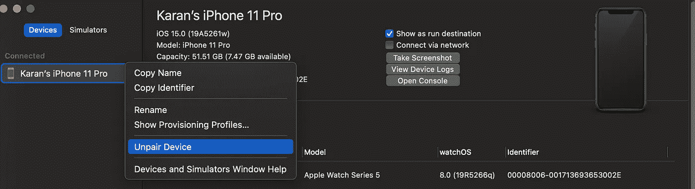
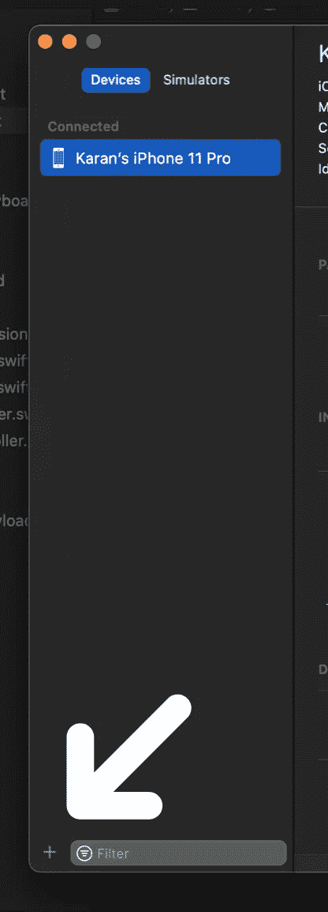

# 使用 watchOS 和 Xcode 修复调试

> 原文：<https://medium.com/geekculture/getting-debugging-with-watchos-and-xcode-to-work-a38c3f6e1c99?source=collection_archive---------15----------------------->

# 背景

如果你曾经试图为 watchOS 开发，你会非常清楚它与 Xcode 相处得并不好。

Average day in the life of a watchOS developer

最常见的问题是它卡在“准备安装”或“在设备上运行你的应用程序名”上，实际上什么也不做。

在模拟器中调试工作正常，但当你试图使用 CloudKit 或后台应用程序刷新时，这不是特别有帮助，这两者在 Apple Watch 模拟器中都不可用。我们自己已经有足够多的 bug 需要修复，即使没有我们的工具来增加我们的麻烦，所以这篇文章在这里试图解决这个问题。

如果你在这里，你可能已经尝试重启你的 iPhone、Apple Watch、Xcode 和 Mac，所以我不打算进入这个过程(如果你还没有尝试过，现在是最好的时机)。

注意:我使用的是 Xcode 13、iOS 15 和 watchOS 8，但是 Xcode 12 以及之前版本的 iOS 和 watchOS 上的步骤和 UI 是相似的。

# 修复 1 —重新安装

重新安装应用程序可以帮助 Xcode 调试再次正常工作。你可以通过打开 iPhone 上的“手表”应用程序，向下滚动直到你看到你的应用程序的名称，点击行，然后禁用“在 Apple Watch 上显示”。这有时有用，但可能相当不一致，但这也是最简单的方法，绝对值得一试。

# 修复 2 —取消配对

解除配对有助于缓解连接问题。为此，首先通过按⌘ + Shift + 2 或在菜单栏中选择窗口->设备和模拟器进入设备和模拟器窗口。

你应该在这个窗口中看到你的 iPhone，如果没有，使用 lightning 电缆重新连接它。在 iPhone 上右键单击(如果您使用触控板，请按住 control 键单击)并选择“解除设备配对”。接下来，解锁 iPhone，点击弹出窗口上的“信任”,如果设备询问，输入您的密码。现在重新启动 Xcode，然后再次尝试运行应用程序。如果这行得通，太好了！如果没有，还有另一个解决方案。

# 修复 3-手动设置

如果自动配对不能按预期工作，手动配对设备可以解决连接问题。如果您在 Devices and Simulators(设备和模拟器)窗口上看到一个黄色横幅，通知您该设备正在准备开发，那么这个修复就特别值得注意。

再次，通过按⌘ + Shift + 2 或在菜单栏中选择窗口->设备和模拟器进入设备和模拟器窗口。

现在，按下窗口左下角的小+图标，而不是断开设备的连接。选择你的 iPhone，点击下一步，你应该会看到一个绿色的勾号和一条信息，说明“设备设置成功”。尝试重新启动 Xcode 并再次在您的手表上运行，它现在应该可以工作了。

如果这些方法都不适合您，您需要验证您的 iOS、watchOS 和 Xcode 版本是否兼容，您的电缆是否支持数据传输，以及您的电脑端口是否按预期工作。

# 不想每次都重做这个过程怎么办？

投入如此多的精力只是为了让调试工作，这并不理想。然而，你可以使用 os_log，当然这也不理想，它有局限性，但是更可靠。

当您无法访问 Xcode 的一些调试功能时，os_log 允许您在事件发生时记录事件，并从 Mac 上的 Console.app 查看它们(您可以通过按下⌘ +空格键并搜索控制台来找到它们)。这消除了 Xcode 成为调试中的一个因素的需要(在很大程度上)，从而消除了 Xcode 导致问题的可能性。

# 提高调试速度的技巧

有时，即使调试工作正常，也会非常慢。

您可以通过返回“设备和模拟器”窗口并选中“通过网络连接”复选框来解决这个问题。

接下来，打开 Apple Watch 上的设置应用程序，并确保您连接到与 Mac 和 iPhone 相同的 WiFi 网络。如果你在 Apple Watch 上没有看到 WiFi 网络，很可能是因为你已经将其配置为使用 5 GHz 而大多数 Apple Watch 只支持 2.4 GHz，Series 6 是唯一支持 5 GHz 的 Apple Watch(截至 2021 年 6 月)。

从 Mac 上拔下 iPhone，再次在手表上运行该项目，如果网络是瓶颈，现在调试应该会更快。

这个技巧在 WWDC 2019 年关于创建独立手表应用的会议上提到过，下面的链接将指引你到它被提到的时间。[https://developer.apple.com/videos/play/wwdc2019/208/?时间=653](https://developer.apple.com/videos/play/wwdc2019/208/?time=653)

# 感谢阅读，我希望这有所帮助！