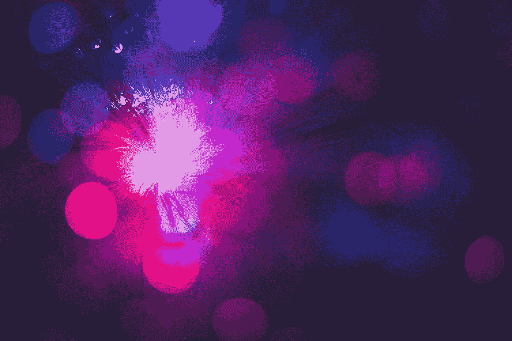
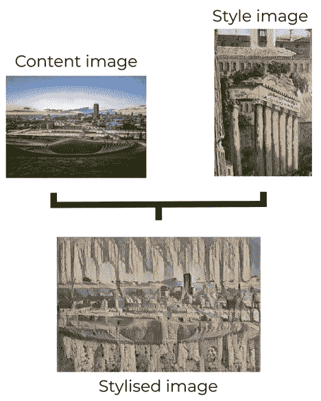

# 在 5 分钟内创建您自己的人工智能生成的艺术！

> 原文：<https://medium.com/geekculture/getting-hands-on-with-neural-style-transfer-in-5-minutes-374cfc5e99ce?source=collection_archive---------19----------------------->

在这篇文章中，我们将简要了解什么是神经风格转移(NST)及其底层架构，然后再看如何使用 Google Magenta！



Photo by [Shahadat Rahman](https://unsplash.com/@hishahadat?utm_source=unsplash&utm_medium=referral&utm_content=creditCopyText) on [Unsplash](https://unsplash.com/s/photos/neural-transfer?utm_source=unsplash&utm_medium=referral&utm_content=creditCopyText)

## 入门理论

神经风格转移是一种操纵图像或其他媒体以将它们的外观改变成另一个图像的方式。

神经网络将两个图像作为输入(一个称为内容图像，另一个称为样式图像)，内容图像充当基础图像，我们将对其应用样式图像中的样式。

至于底层网络本身，网络在最中间的隐藏层包含一个“瓶颈”。这个“瓶颈”充当编码和解码过程之间的边界——编码过程是将样式图像分解为其特征的过程，而解码过程是使用这些特征构建内容图像的过程。

要更深入地了解架构，请查看[神经类型转移直观指南|作者 Thushan Ganegedara |迈向数据科学](https://towardsdatascience.com/light-on-math-machine-learning-intuitive-guide-to-neural-style-transfer-ef88e46697ee)。这是一本非常全面的指南。

## 什么是谷歌洋红？

Google Magenta 是谷歌工程师的一个开源研究项目，旨在探索机器学习在艺术和音乐创作过程中的作用。这是我们将用于应用风格转移的模型，而不必训练我们自己的模型——我们将利用 [TensorFlow Hub](https://www.tensorflow.org/hub) 上的版本。

现在我们已经看了一些理论，让我们开始吧！

## 一个可以上手的快速入门脚本

首先，我们需要将以下包安装并导入到 Python 脚本中:

```
import argparse
import tensorflow_hub as hub
import tensorflow as tf
import numpy as np
import matplotlib.pyplot as plt
import cv2
```

*   *argparse* 包将帮助我们处理命令行参数——注意这是一个标准的库包！
*   *tensorflow_hub* 包是一个训练有素的机器学习模型库，可以开箱即用，即 [TensorFlow Hub](https://www.tensorflow.org/hub/) 。我们将用它来访问 Google Magenta 模型。
*   tensorflow 包将帮助我们完成一些功能，比如从一个类似张量的物体中创建一个常数张量。
*   numpy 包在任何与 ML 相关的项目中总是有用的。
*   *cv2*&*matplotlib*包将帮助我们处理、加载和保存我们的图像。

让我们分解代码，然后看一个例子！

看看上面的要点，我们可以看到脚本被分解成两个函数——一个用 argparse 包处理命令行参数，另一个加载 Magenta 模块并完成样式转换。

我们将关注 *main()* 函数，我们向它传递 3 个参数:分别指向内容和样式图像的路径，以及保存输出图像的路径。

该函数首先使用 matplotlib 库函数从其路径位置读取内容和样式图像，然后将图像转换为标准化的 numpy 数组。因此，数组中的每个值现在对应于图像的一个像素，并且这些值将是该像素在黑白标度上的颜色值的比率。

接下来，我们从 Tensorflow Hub 加载 Magenta 模型，向其传递两个张量常数 numpy 数组中的两个图像。剩下的就是处理输出，然后将输出图像保存到传递给 *main()* 函数的输出路径中！

## 使用示例脚本

现在我们已经研究了脚本的内容，让我们看看在中的使用，以及输出示例是什么！

要调用该脚本，您可以运行如下命令:

```
python google_magenta_example.py -c '<content_image_path>' -s '<style_image_path>' -o '<output_path>'
```



对于这个例子，我使用美丽的谢菲尔德作为我的内容图像，然后使用一幅旧画作为我的风格图像。

从左边的简化流程图可以看出，内容图像已经被分解，然后使用样式图像的特性重新构建。

这可能会产生一些真正令人惊叹的艺术品，所以一定要尝试不同的组合！

## 结论

这让我们接近尾声！

在这篇文章中，我们已经探索了神经风格转移的介绍性架构，然后看了一个快速入门脚本，以获得和创建自己的艺术——所有这一切都在 5 分钟内完成！

~伊森