# 裸体:让我的便携式过滤器无底

> 原文：<https://medium.com/geekculture/getting-naked-making-my-portafilter-bottomless-6dfd63d54e7c?source=collection_archive---------3----------------------->

两年前，我为我的 Kim Express 买了第一个无底 portafilter。我的目标是更好地了解如何提高我的投篮，但我没有意识到我会看到即时的改善。我的技巧没有立即改变，只有咖啡和杯子之间的障碍改变了。最近，我决定对我的意大利帕沃尼和我的恩里科无底线，这个决定需要一些话来切断底部。

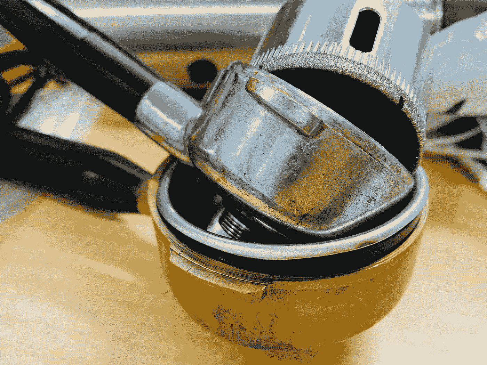

# 赤裸裸的优势

无底移动式过滤器有四个主要优点:

1.  咖啡和杯子之间没有东西(除了过滤器)。
2.  现场观看和调整镜头的能力。
3.  能够录像并在以后查看，以便进行进一步的[故障分析](https://towardsdatascience.com/coffee-data-sheet-d95fd241e7f6)。
4.  无需定期清洁移动式过滤器。

我没有预料到第一个优势，但它带来了很大的不同。从那以后，我用一个普通的便携式过滤器来过滤同一个镜头，同一个篮子，它减少了镜头的口感和复杂性。随着时间的推移，在便携式过滤器上积累的小残渣是杯子的关键。

失败分析是我提高投篮的关键，它让我看到我的投篮准备或投篮技术哪里出了问题。它有助于确定我的击球是否水平，是否分布得不好，或者我的断奏击球的水平是否没有调准。[录像](https://youtu.be/wmd3dYA7zVg)也消除了一些必须如此专注于观看镜头寻找关键细节的压力。此外，我用视频来记录预灌注、开花和灌注时间，这使我可以更专注于拍摄。

> 对我来说，记录镜头变得和记录镜头数据一样重要。

最后，我不喜欢打扫卫生。我只是最近才定期清洁我的主机的活塞头。所以去无底当然有帮助。

# 机器太多

我岳母在地下室给了我一台旧的 Pavoni，我在南旧金山的一艘船上从一个老家伙那里买了一台意大利的 [Enrico。两台机器都工作得很好，拉帕沃尼稍微好一点，但是我知道他们有更大的潜力。所以我决定去无底洞。](/overthinking-life/the-tale-of-a-stolen-espresso-machine-6cc24d2d21a3)

> 意式浓缩咖啡机的美妙之处在于制作出来的咖啡，而不是机器。

起初，有阻力。我的岳母和姐夫坚持不让我做这件事。他们说这会破坏机器的美观。对我来说，我不太关心机器的味道；对我来说，浓缩咖啡机的美妙之处在于它生产的浓缩咖啡。然而，我有一个备用的 portafilter，所以游戏不会伤害感情！

为拉·帕沃尼买一个无底洞是可能的，但这比我想花的钱要多。我在网上看到，有些人用一个钻头，钻了多个孔，最终他们到达底部脱落。我买了钻头，试了试，很快就失败了。我没有钻床，但即使如此，钻头也不容易。

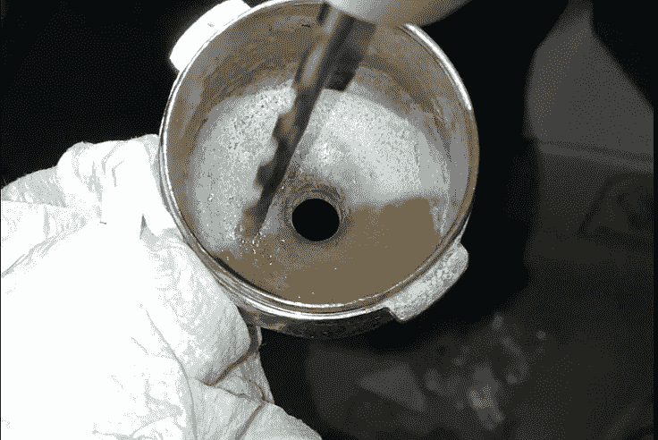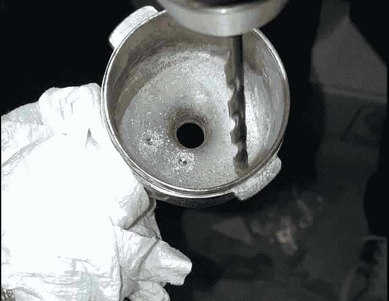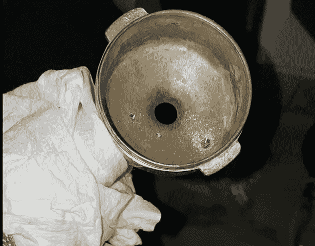

我在脸书的 la Pavoni group 上发布了我的奋斗经历，有人推荐了一个金刚石钻头。这是 10 美元，似乎可以在几分钟内用钻床完成。

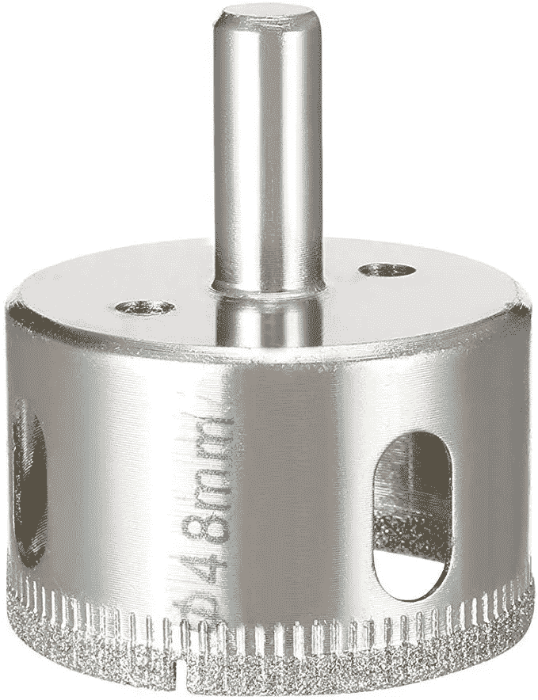

我还决定我可以用这个在意大利的恩里科。便携式过滤器的诀窍是我没有一个原始的篮子。我找到了一个 63 毫米的篮子，我不得不把顶唇的一部分剪掉。然后一个朋友建议添加一个塑料片来帮助它留在 portafilter 中。事实证明，这个钻片的大小正好适合过滤器的底部。诀窍是确保洞在中心。

# 钻宝宝！钻！

我借了一个朋友的钻床，一旦我得到了一切设置，拉帕沃尼花了几分钟。我很紧张，我想是因为恩里科开得更快了。

## 拉帕沃尼

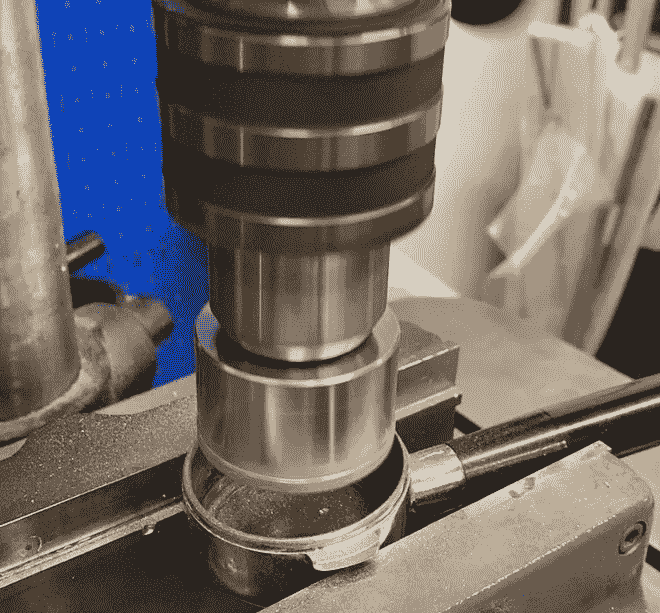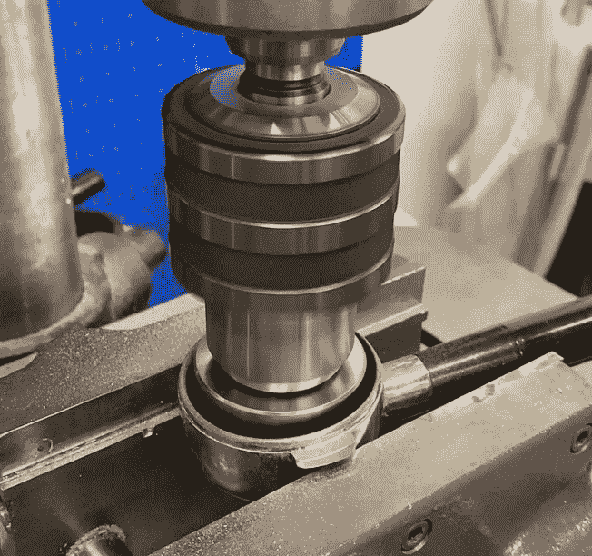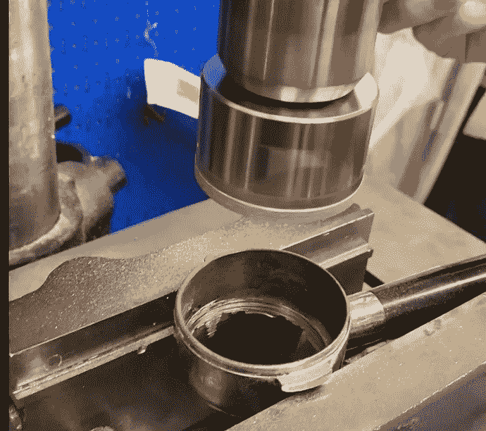

## 意大利的恩里科

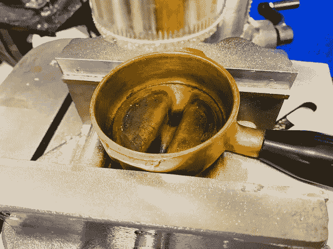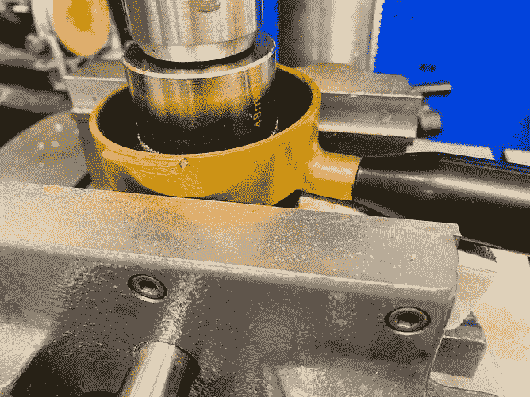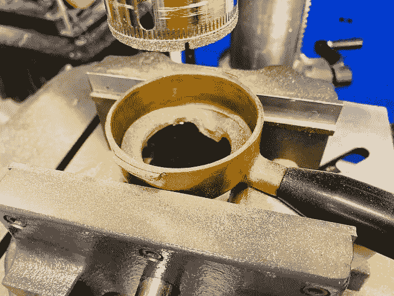

## 稍微打磨后

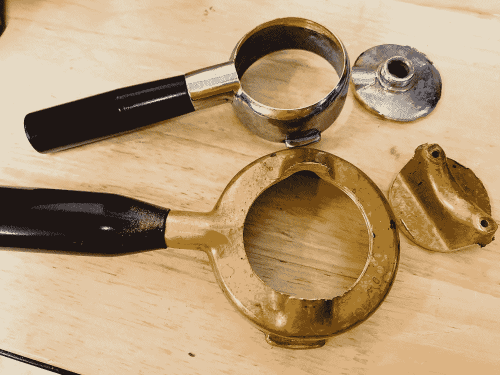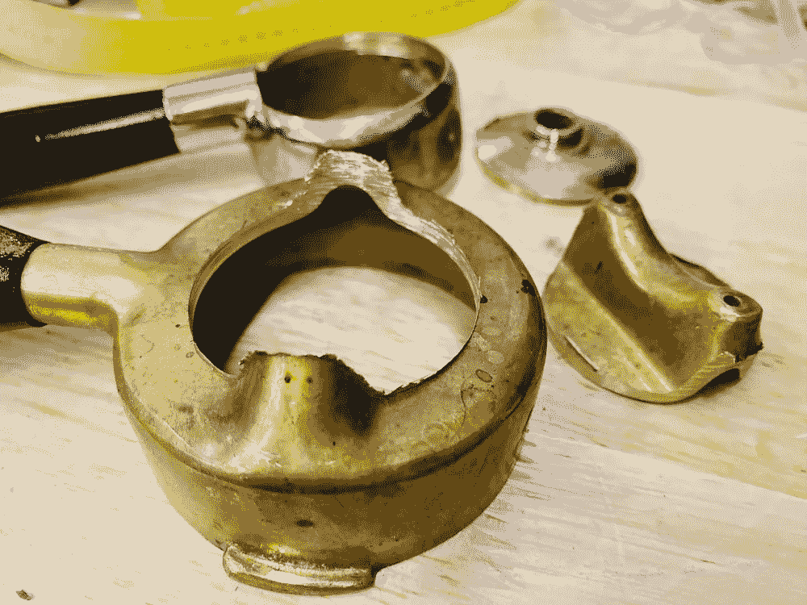

# 裸体拍照

La Pavoni 在我的姻亲家里，所以我必须再等几个月才能使用它，但我很快就能使用意大利的 Enrico。portafilter 的底部看起来有点狂野，但我留下了它，因为我觉得它看起来很酷。伸出来的两个零件没有任何功能，但我不想冒险打磨它们，因为 Enrico 的零件很少，所以滤波器在 portafilter 中的位置会出现问题。

## 第一枪

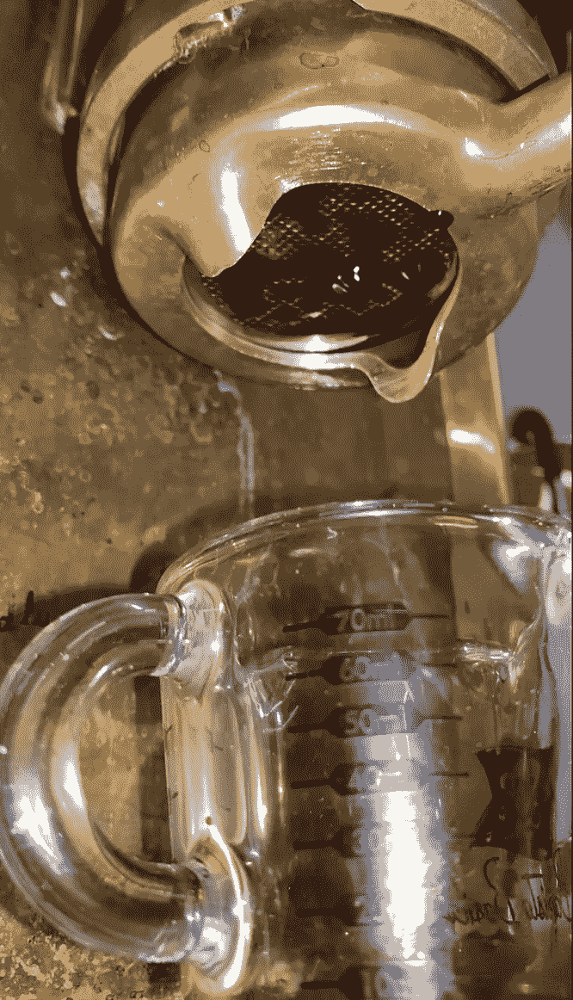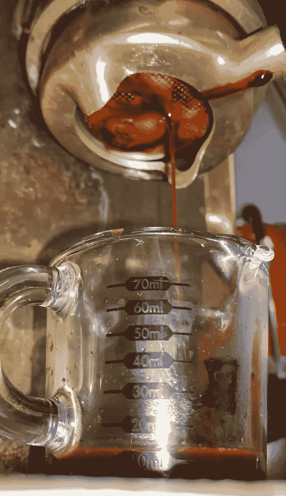

第一张照片看起来不均匀，我不确定滤镜是否不均匀地位于 portafilter 中。所以我又拉了一个镜头，旋转了过滤篮。

## 第二枪

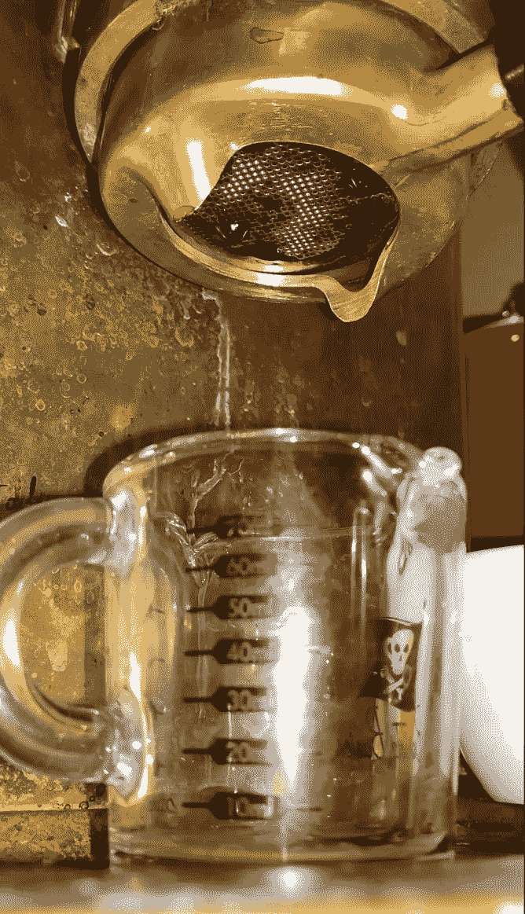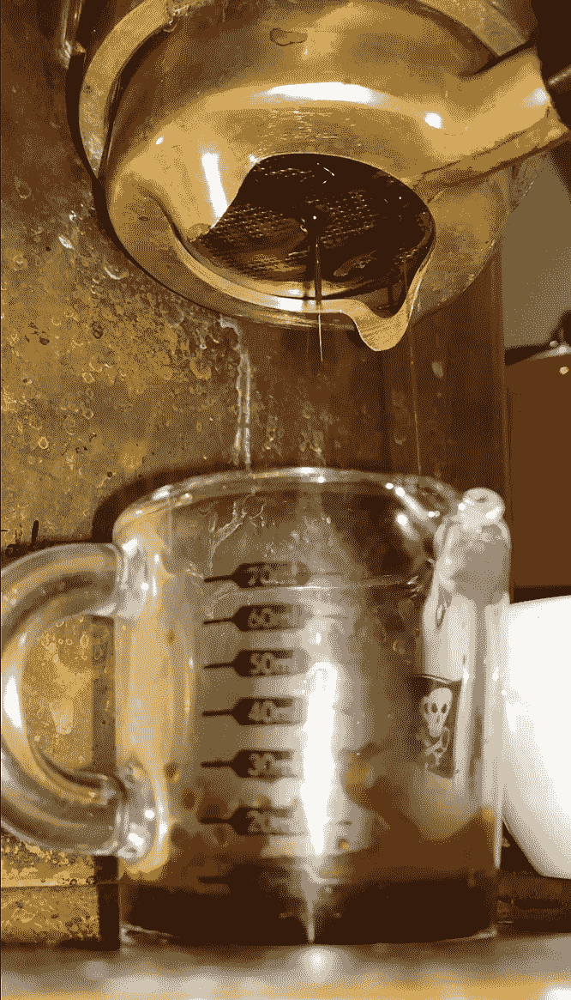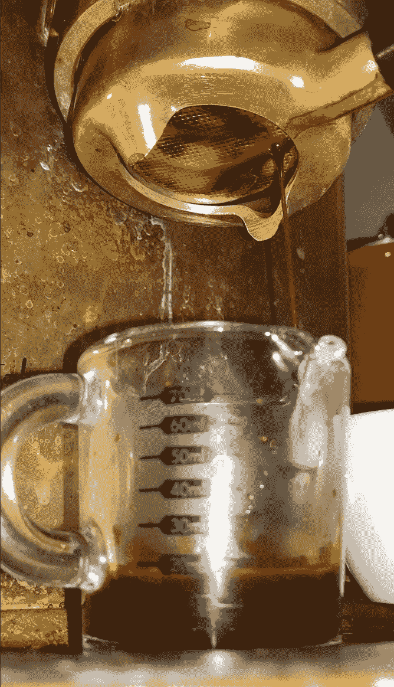

第二次注射出来几乎一样，我开始怀疑机器没有坐在水平，因为在预输注期间，一切都出来相当均匀。所以我用水平仪检查了一下，桌子有很大的倾斜。

我不仅从咖啡没有接触到 portafilter 中受益，我还发现了一个机器设置问题，我不确定我是否会遇到这个问题。

我现在能够更好地理解 Enrico 的复杂性，因为几乎没有人经常使用这台机器，所以关于最佳技术的文档很少。有人可能会说它只是另一本手册，但根据我的经验，它的功能似乎介于弹簧驱动杆和手动杆之间。恩里科是弹簧驱动的，但它的反应不像金快车一样。

我梦想为这些机器配备一些裸移动式过滤器，我只有三台机器没有裸移动式过滤器，但理论上可以:拉佩皮纳、拉[陆丹蓝](/overthinking-life/moka-espresso-the-advanced-coarse-fb732f26d6cc)和拉布里卡。我知道 la 陆丹蓝和 la Brikka 的可能性很小，因为以前没有人做过 Moka 风格，但 la Peppina 似乎可以用定制的硬件来实现，因为那个手柄太怪异了。

如果你愿意，可以在 [Twitter](https://mobile.twitter.com/espressofun?source=post_page---------------------------) 和 [YouTube](https://m.youtube.com/channel/UClgcmAtBMTmVVGANjtntXTw?source=post_page---------------------------) 上关注我，我会在那里发布不同机器上的浓缩咖啡照片和浓缩咖啡相关的视频。你也可以在 [LinkedIn](https://www.linkedin.com/in/robert-mckeon-aloe-01581595?source=post_page---------------------------) 上找到我。

# 我的进一步阅读:

[测量通过过滤器的浓缩咖啡萃取量](https://towardsdatascience.com/measuring-espresso-extraction-across-the-filter-c9a4ccee117f)

[断续浓缩咖啡:提升浓缩咖啡](https://towardsdatascience.com/overthinking-life/staccato-espresso-leveling-up-espresso-70b68144f94?source=post_page---------------------------)

[浓缩咖啡中咖啡的溶解度:初步研究](https://towardsdatascience.com/coffee-solubility-in-espresso-an-initial-study-88f78a432e2c)

[浓缩咖啡模拟:计算机模型的第一步](/@rmckeon/espresso-simulation-first-steps-in-computer-models-56e06fc9a13c)

[咖啡数据表](https://towardsdatascience.com/@rmckeon/coffee-data-sheet-d95fd241e7f6)

[工匠咖啡价格过高](https://link.medium.com/PJwoAMYpuT?source=post_page---------------------------)

被盗浓缩咖啡机的故事

[平价咖啡研磨机:比较](https://link.medium.com/rzGxlDtquT?source=post_page---------------------------)

[浓缩咖啡:群头温度分析](https://link.medium.com/FMxfCmcOCT?source=post_page---------------------------)

[浓缩咖啡过滤器分析](https://link.medium.com/2T2tjpUsgU?source=post_page---------------------------)

[便携式浓缩咖啡:指南](https://link.medium.com/zhCu9HbK6U?source=post_page---------------------------)

[克鲁夫筛:一项分析](https://link.medium.com/SK0dmYdK6U?source=post_page---------------------------)