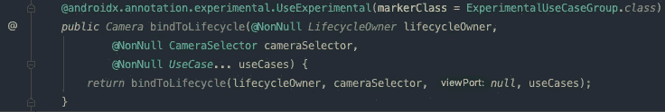

# 入门:Android CameraX

> 原文：<https://medium.com/geekculture/getting-started-android-camerax-a84e138e2c00?source=collection_archive---------2----------------------->

## 快速指南(和示例代码)让您开始使用新的 Android Jetpack CameraX API 作为 MLKit 的条形码扫描仪。

Photo by [ShareGrid](https://unsplash.com/@sharegrid?utm_source=medium&utm_medium=referral) on [Unsplash](https://unsplash.com?utm_source=medium&utm_medium=referral)

顾名思义，Jetpack(一组用于 Android 开发的现代 API)真正提高了开发人员的工作效率——Jetpack CameraX API 的引入也不例外。

与它的前身(Camera2)相比，使用 CameraX 开发基于相机的 Android 视图是一个更加简化的过程，具有一些突出的功能:

*   抽象出 OEM 传感器硬件驱动程序差异的复杂性。
*   支持 Android API 21 及以上版本。
*   与其他 Jetpack 组件一样，它具有生命周期意识，并负责提供和分解所需的资源以响应应用程序生命周期事件。
*   **对我来说，最激动人心的特性是引入了所谓的“用例管道”**

# **一个用例管道？**

本质上，CameraX API 上下文中的`UseCase`是一个类，它接受来自相机的图像帧，对它做一些事情，并在完成时通知 API，此时调用下一个用例——冲洗和重复。

举例来说，这就是如何使用 CameraX 初始化/设置相机实例:

Screenshot of ProcessCameraProvider.java in android.camerax.lifecycle

正如您所看到的，传递了`bindToLifecycle`函数:

*   将承载摄像机实例的活动(LifecycleOwner)。
*   一个助手(`CameraSelector`)，用来指定使用哪个硬件传感器(摄像头)。
*   ***一个*** `***UseCase***` ***类型的列表(vararg)来运行每一帧。***

最后一个参数允许您根据需要将多个用例连接在一起。

此外，如前所述，这绑定到一个生命周期感知相机实例，因此，例如，如果您后台应用程序，CameraX 将负责暂停硬件并使相关资源可用于垃圾收集。

# **基础用例**

到目前为止，CameraX API 有三个不同的基本用例，即:

*   **预览**:接受显示预览的表面— `Preview`
*   **图像分析**:为分析提供 CPU 可访问的缓冲区，例如用于机器学习推理:)— `ImageAnalysis`
*   **图像捕捉**:捕捉并保存照片— `ImageCapture`

假设`Preview`用例将在*大部分时间*被放置在管道中是安全的。这将获取接收到的图像帧，并将其渲染到一个`Surface` ( `androidx.camera.view.PreviewView`)供用户查看。

类似地，`ImageCapture`提供将接收到的帧保存为照片的功能。

最令人兴奋的显然是`ImageAnalyses`——它给你一个原始的帧缓冲区，让你用自己选择的 ML 模型进行推理。

> 出于本文的目的，我将使用`BarcodeScanning` API(作为 [Google 的 MLKit 框架](https://developers.google.com/ml-kit)的一部分)对图像帧进行推理，以识别和解码图像中的不同条形码标准

可以说，使用这种方法扫描条形码在准确性和速度方面击败了所有其他东西，例如 ZXing 库。

在我的测试中，我在理想条件下获得了 2 秒的识别速度——更不用说 CPU 利用率的巨大差异了。

# **挖入**

我现在介绍一个实现了 CameraX 和 MLKit 的演示 Android 项目，演示如何使用 CameraX 对图像帧进行推理(如前所述——一个条形码扫描仪)

这是一段视频，展示了包含 EAN 条形码和二维码的包装*(注意屏幕底部解码后的条形码字符串)*

**入门**

虽然你可以在 GitHub 上使用[示例代码，但我会指出一些(尽管是显而易见的)需要记住的事情:](https://github.com/k1dbl4ck/android-camerax-demo)

*   在您的应用程序模块`build.gradle`文件中添加 CameraX(以及可选的 MLKit)依赖项。
*   记得声明使用设备摄像头硬件的`AndroidManifest.xml`权限和特性。
*   该项目使用`dataBinding`,因此确保您的 Android Studio 版本兼容自动生成绑定类。
*   在示例项目中，实际的集成放在`CameraHelper.kt`中以保持其可移植性。

> 需要注意的一个一般范例是，移动设备上的图像处理和推理可能是相对昂贵的操作，并且将多个用例(尤其是低效用例)流水线化在一起可能会对设备电池和资源产生巨大影响。
> 
> 在本文的最后，我将讨论如何让用例跳过超过某个负载阈值的帧——导致吞吐量降低——但更好地利用资源。

**主要活动**

首先要做的是创建预览视图(用户可以看到的摄像机画面):

这里我使用了一个专门为渲染相机预览而设计的视图。请注意，尽管视图填充了父视图，但渲染帧的实际尺寸是根据设备屏幕大小和方向通过纵横比计算来设置的。

接下来，绑定这个视图的活动:

这里没什么特别的:

*   用所有者、上下文、呈现预览的视图和接收解码的条形码识别结果的回调函数初始化`CameraHelper`类。
*   权限处理程序重写将权限结果传递回助手。

`CameraHelper`本身就是行动的地方。你可以直接在 Github 上查看这个类:

 [## k1dbl4ck/android-camerax-demo

### 一篇关于 thewerner.medium.com 的文章的源代码

github.com](https://github.com/k1dbl4ck/android-camerax-demo/blob/master/app/src/main/java/nl/venters/cameraxdemo/CameraHelper.kt) 

尽管不是必需的，但为了方便起见，我们创建了一个`typealias`监听器对象，传递给分析器，以回调条形码推断的结果:

接下来，我们创建一个`ExecutorService`来在后台/在它自己的线程上运行`ImageAnalysis`分析器，以及一些全局属性:

start 函数检查是否授予了权限，如果没有，则启动摄像机权限请求，这将导致上面的活动获得权限结果，该结果再次传递给该类的`onRequestPermissionsResult`:

正如你所看到的，这个过程将无限循环，直到用户授予相机权限——因为没有相机，应用程序无法完成它的设计。

接下来,`startCamera`函数在上下文执行器角色中设置摄像机未来提供者:

在这里，我们“瀑布式”选择摄像机(首选后置摄像机)，然后将用例绑定到提供商:

*   按照本文开头描述的`bindToLifecycle`方法签名，需要一个`CameraSelector`实例来指示使用哪个硬件传感器(摄像头)。如果您想在视图上添加一个按钮来切换相机，您可以用所需的传感器更新`lensFacing`并再次调用`bindCameraUseCases`——但出于扫描条形码的目的，通常不使用“自拍”相机。
*   接下来，我们指定用例来运行图像帧
*   最后，设置要显示预览的表面。

此时——应用程序正在运行，摄像机正在捕捉帧,`CameraX` API 正在将它们发送到指定的用例。

**读取条形码(图像分析用例)**

这是激动人心的部分，展示了 CameraX 及其用例概念的作用:

*   我们扩展了`ImageAnalysis.Analyzer`基本用例…
*   …并覆盖通过一个`ImageProxy`实例传递的`analyze`函数。

`imageProxy`包含帮助器来获取/设置图像上的数据——在这个例子中，我们简单地将帧作为一个`Image`实例——但是代理也:

*   暴露原始像素缓冲区
*   启用设置和获取裁剪矩形(子图像)
*   获取图像类型、尺寸和旋转等。

> 注意:图像帧的旋转(或方向)对于推断任务很重要，因为许多 CV 模型是在某个方向的数据上训练的。您还可以看到它被传递给了 BarcodeScanner (MLKit) API。

最后，我们通过 MLKit 提供的`BarcodeScanner` API 运行该帧——它有一个回调函数，包含该帧中所有已识别的条形码，然后调用我们的监听器，并给出结果(如果有的话)

最后， ***以及最重要的*** ，我们调用`imageProxy.close()`——这是为了让`CameraProvider`知道我们已经完成了对帧的处理。不这样做将导致其他用例(包括预览)冻结，因为它假设用例仍在处理中。

# **绩效说明**

当我们初始化分析器时，我们规定了几个标志来定义`CameraProvider`的帧缓冲行为:

**背压**

对于性能来说，这可能是最有用的标志，这取决于您是否想要处理来自相机的每一帧，或者您是否乐于只接收最新的帧。

`ImageAnalysis.STRATEGY_KEEP_ONLY_LATEST`将向您的用例发送最新的可用帧。

`ImageAnalysis.STRATEGY_BLOCK_PRODUCER`将“暂停”摄像机，直到所提供的帧被分析(并且`imageProxy.close()`被调用)

**队列深度**

当然，如果你需要处理每一帧，如果你的代码没有被优化或者花费太长时间，这将会影响性能，所以在这种情况下为了进一步帮助，可以指定一个`ImageQueueDepth`。根据[官方文件](https://developer.android.com/reference/androidx/camera/core/ImageAnalysis.Builder#setImageQueueDepth(int)):

> 为`[ImageAnalysis.STRATEGY_BLOCK_PRODUCER](https://developer.android.com/reference/androidx/camera/core/ImageAnalysis#STRATEGY_BLOCK_PRODUCER)`模式设置摄像机管道可用的图像数量。
> 
> 图像队列深度是相机可用以填充数据的图像数量。这包括目前正在被`[ImageAnalysis.Analyzer.analyze(ImageProxy)](https://developer.android.com/reference/androidx/camera/core/ImageAnalysis.Analyzer#analyze(androidx.camera.core.ImageProxy))`分析的图像。根据背压策略，增加图像队列深度可能会使相机操作更平滑，但会增加内存使用量。
> 
> 当背压策略设置为`[ImageAnalysis.STRATEGY_BLOCK_PRODUCER](https://developer.android.com/reference/androidx/camera/core/ImageAnalysis#STRATEGY_BLOCK_PRODUCER)`时，增加图像队列深度可能会使高负载下的系统上的摄像机流水线运行更平稳。然而，对于当前帧速率，花费在分析图像上的时间仍应保持在单个帧周期内，平均为*，以避免停止相机流水线。*
> 
> *该值仅适用于`[ImageAnalysis.STRATEGY_BLOCK_PRODUCER](https://developer.android.com/reference/androidx/camera/core/ImageAnalysis#STRATEGY_BLOCK_PRODUCER)`模式。对于`[ImageAnalysis.STRATEGY_KEEP_ONLY_LATEST](https://developer.android.com/reference/androidx/camera/core/ImageAnalysis#STRATEGY_KEEP_ONLY_LATEST)`，该值被忽略。*
> 
> *如果未设置，并且此选项由选定的背压策略使用，则默认为 6 个图像的队列深度。*

***高级注意:跟踪 FPS***

*正如在[中暗示的，CameraX](https://github.com/android/camera-samples/blob/2690075bca44d51e4e37df07273d1f8d7fe9846f/CameraXBasic/app/src/main/java/com/android/example/cameraxbasic/fragments/CameraFragment.kt#L547) 的官方谷歌示例应用代码`ImageAnalysis`用例可以在运行时计算当前的 FPS 速率。*

*尽管 executor 通常运行在自己的后台线程上，但在某些情况下，如果 FPS 低于某个阈值，简单地调用`imageProxy.close()`而不是处理帧可能是有用的。*

*将这种技术与上面设置的缓冲区标志结合使用，您可以根据需要微调性能。*

# *结论*

*本文给出了一个使用新的 CameraX API 的基本示例。围绕`ImageAnalysis`基本用例有更多的可能性，我希望在未来的帖子中探索更多的可能性。*

*感谢阅读，我希望你得到一些有用的见解！*