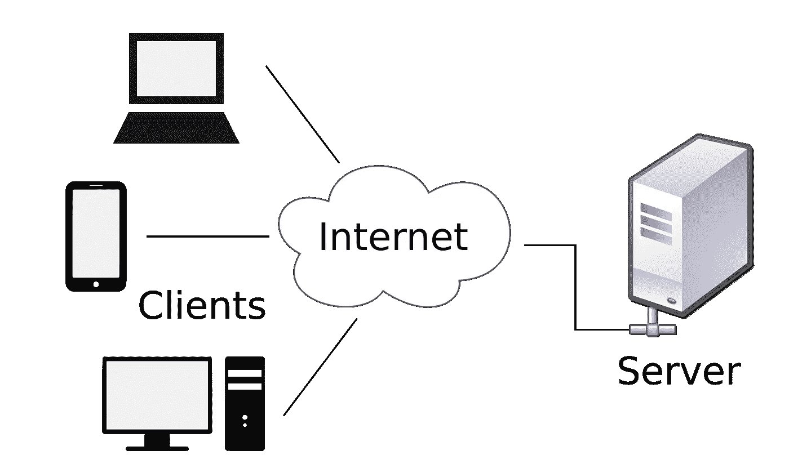

# Apache Spark 入门— I

> 原文：<https://medium.com/geekculture/getting-started-with-apache-spark-i-5fbbe7b47667?source=collection_archive---------23----------------------->

让您开始 Apache Spark 之旅的一系列文章！

Photo by [imgix](https://unsplash.com/@imgix?utm_source=unsplash&utm_medium=referral&utm_content=creditCopyText) on [Unsplash](https://unsplash.com/collections/9683625/big-data?utm_source=unsplash&utm_medium=referral&utm_content=creditCopyText)

## **定义大数据**

随着分布式计算、计算能力和过去十年出现的大量存储选项的逐渐增加，术语大数据已被广泛使用。到底什么是大数据，哪些数据可以称之为大数据？

基本上，我们可以用 3V 的
**卷**
来描述它，即生成的数据量(以字节、兆字节、千兆字节、兆兆字节衡量)..)

**速度**
数据生成的速度，实时或流式或批处理

**多样性**
数据的类型—结构化或非结构化

## **数据类型和来源**

数据可以来自各种数据源，可以有各种数据类型，从浮点到字符到文本文件。数据可以采取各种形式，可以从各种来源获取。一些最重要的数据来源是—

**应用数据** —可以包含交易数据、CRM 数据、客户数据、雇主数据、员工数据等。从内部应用程序或从某些公共应用程序。

**日志和监控** —主要包括物联网设备中发生的事件、各种应用程序的元数据以及各种应用程序的运行/崩溃日志。它也可以有一些监控检查数据。

**流媒体源和物联网传感器** —实时馈送，如物联网设备事件、视频流、音频流和事件流。

**数据类型** :
数据可以有多种形式，但主要分为 3 类:
1。结构化数据
2。半结构化数据
3。非结构化数据

*   **结构化数据** 一般是表格数据，在数据库中用列和行来表示。以这种形式保存表的数据库称为 ***关系数据库*** *。*数学术语“*关系”*指定以表格形式保存的一组已形成的数据。在结构化数据中，表中的所有行都有相同的一组列。用于结构化数据的 SQL(结构化查询语言)编程语言。
*   **半结构化数据** 数据是不包含结构化数据(关系数据库)但仍有某种结构的信息。半结构化数据由以 *JavaScript 对象符号* (JSON)格式保存的文档组成。它还包括 ***键值*** 存储和 ***图形*** 数据库。
*   **非结构化数据** 非结构化数据是指没有按照预先定义的方式进行组织或者没有预先定义的数据模型的信息。非结构化信息是一组大量文本，但也可能包含数字、日期和事实等数据。**视频、音频和二进制**数据文件可能没有特定的结构。它们被指定为**非结构化**数据。

## 分布式系统

一种系统，其组件位于网络中的多个位置，通过在其间传递消息来相互通信，以实现共同的目标。它可以被认为是一个单独的蚁丘，里面有成千上万的工人和筒仓。一个组件的故障不会对整个系统产生重大影响。

A client-server model diagram. Source: Wikimedia Commons

分布式系统有几个优点-

*   水平缩放
*   可靠性
*   并行计算
*   更高的性能
*   灵活性
*   公开

除了这些优势，我们也面临一些挑战

*   监控和维护
*   协调、依赖、调度

## HDFS (Hadoop 分布式文件系统)

HDFS 具有主服务器和从服务器架构。主节点管理文件命名空间和客户端对文件的访问规则。数据节点管理连接到节点的存储，数据存储为文件。默认情况下，该文件被分割成大小为 128mb 的数据块。每个块被默认复制 3 次，以便具有容错系统。数据节点定期向命名节点发送心跳信号。

上述段落基本上是 HDFS 及其架构的简化版本。现在我们应该首先讨论上一段中使用的术语-

*   主-从架构——Apache Hadoop HDFS 架构遵循主/从架构，其中一个集群包含一个 NameNode(主节点),所有其他节点都是 DataNodes(从节点)。HDFS 可以部署在支持 Java 的各种机器上
*   NameNode 在 Hadoop 集群中充当主节点。下面列出了 NameNode 执行的主要功能:
    1。存储实际数据的元数据。例如文件名、路径、数据块数、块 id、块位置、副本数、从属相关配置
    2。管理文件系统命名空间。
    3。调节客户端对实际文件数据文件的访问请求。
    4。将工作分配给从机(DataNode)。
    5。执行文件系统命名空间操作，如打开/关闭文件、重命名文件和目录。
    6。由于命名节点将元数据保存在内存中以便快速检索，因此其操作需要大量的内存。这应该托管在可靠的硬件上。
*   数据节点在 Hadoop 集群中作为从节点工作。下面列出了 DataNode 执行的主要功能:
    1。实际存储业务数据。
    2。这是处理读/写/数据处理的实际工作节点。
    3。根据主机的指示，它执行数据块的创建/复制/删除。
    4。由于所有的业务数据都存储在 DataNode 上，其运行需要大量的存储空间。商用硬件可用于托管 DataNode。
*   心跳信号是从 Datanode 到 Namenode 的信号，表示它是活动的。在 HDFS 中，没有心跳表明有一些问题，然后 Namenode，Datanode 不能执行任何计算

希望这是一篇介绍大数据和 Spark 概念的好文章！我将在下面张贴后续文章及其链接。干杯！

更多内容请关注！

其他可能感兴趣的文章:
- **本系列的一部分**:

[Apache Spark-I 入门| by Sam | Geek Culture | 2022 年 1 月| Medium](/geekculture/getting-started-with-apache-spark-i-5fbbe7b47667)
[Apache Spark II 入门| by Sam | Geek Culture | 2022 年 1 月| Medium](/geekculture/getting-started-with-apache-spark-ii-fffeab9f5df7)
[Apache Spark III 入门| by Sam | Geek Culture | 2022 年 1 月| Medium](/geekculture/getting-started-with-apache-spark-iii-1758581d87f3)

**杂项** : [细流企鹅和帕尔默企鹅。上周在网飞的 Binged 非典型… |作者 Sam | Geek Culture | Medium](/geekculture/streamlit-and-palmer-penguins-92a09004ed45)
-[Streamlit 入门。使用 Streamlit 解释你的 EDA 和… |作者:Sam | Geek Culture | Medium](/geekculture/getting-started-with-streamlit-ed81eafcb298)

干杯，请关注更多此类内容！:)

如果你喜欢它的内容，你现在也可以给我买一杯咖啡！
[samunderscore12 正在创作数据科学内容！(buymeacoffee.com)](https://www.buymeacoffee.com/samunderscore12)