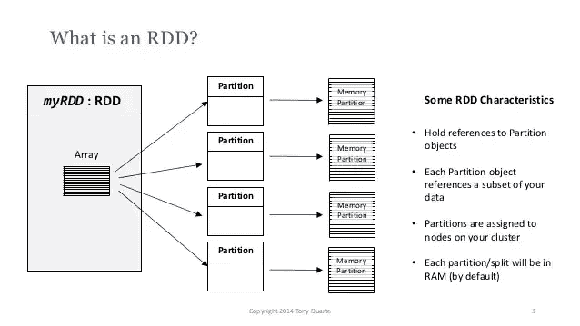
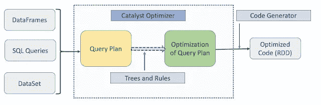

# Apache Spark III 入门

> 原文：<https://medium.com/geekculture/getting-started-with-apache-spark-iii-1758581d87f3?source=collection_archive---------18----------------------->

Apache Spark 之旅的第三部分！

Photo by [AltumCode](https://unsplash.com/@altumcode?utm_source=unsplash&utm_medium=referral&utm_content=creditCopyText) on [Unsplash](https://unsplash.com/s/photos/code?utm_source=unsplash&utm_medium=referral&utm_content=creditCopyText)

现在，我们将讨论 Spark 中的数据结构和其他一些更深入的主题。Spark 中有三种类型的数据结构可以保存数据:

1.  RDD(弹性分布式数据集)
2.  资料组
3.  数据帧

**弹性分布式数据集(RDD)**
spark 的基础(遗留)数据结构可以描述为:
-数据元素的不可变分布式集合
-容错
-跨集群节点分区，可以并行运行

Source : [Slideshare](http://image.slidesharecdn.com/youtubespk-141216130447-conversion-gate02/95/apache-spark-rdd-101-3-638.jpg)

创建 rdd:

*   并行化 pyspark 导入 SparkContext 的集合

    sc = spark context . getor create()
    data =[1，2，3，4]
    dist data = sc . parallelise(data)
*   外部数据集
    distFile = sc . textfile(" data . txt ")
*   来自另一个 RDD

**DataSet** Spark SQL 中的强类型数据结构，它是 dataframe API 的扩展

**Dataframe** 它是一个分布式的数据集合，这些数据被分组到指定的列中，Dataframe 相当于一个数据库表。

创建数据框架:
NewDF = spark . read . parquet(" file _ path ")

**并行性和分区**
Spark 中控制并行性的两个主要因素是
1。分区数量
2。遗嘱执行人人数

## ETL/ELT 流程

ETL(提取、转换和加载):
提取:从多个来源提取数据的过程
转换:对提取的数据应用业务逻辑并丢弃不需要的数据
加载:将数据加载到最终的表中，或者作为文件

ELT(提取、加载和转换):
当我们出于分析和数据科学目的需要原始数据时，加载和转换部分会被切换
我们保留原始数据，并让团队根据需要转换数据。

## 数据仓库和数据湖

**数据仓库:** 专为 OLAP 而建
专注于一个业务领域
通常以更结构化的形式包含数据
最终用途是为下游应用程序和 web 界面生成报告
最流行的数据仓库数据库有— Oracle、Hive、GBQ、雪花

**数据湖:** 重点是创建一个集中的数据可用性，供多个职能团队使用
数据保持原样，无需从源进行太多更改
最终用户可以是多个用户，如数据科学、数据工程、数据分析师等。
可以进行数据编目来标记数据，以便于使用

## 对数据结构的操作

我们可以对 rdd、数据集和数据帧进行以下操作
转换
操作

例如，我们希望获得工资高于 10 万美元的员工，我们可以在收集数据时执行这些转换
操作，或者将数据保存在文件或数据库中。所以它把我们在执行器中的所有数据带给我们的司机。一旦我们执行了操作，就会在执行器中创建作业。

不同的转换我们有
过滤数据
改变数据类型
对字段应用计算
连接
合并
透视
选择等等！

## 转换的类型

窄变换
-在这种情况下，每个输入分区将只贡献给一个输出分区
-不需要混洗
-可以流水线化到单个阶段
-映射、过滤、联合等。

宽转换
-在这种情况下，输入分区将贡献给多个输出分区
-它定义了一个新的阶段
- Reduce by、group by、join 等。

## 行动

一个动作指示 Spark 计算一系列转换的结果
动作将数据从执行器发送到驱动程序，一旦完成
它们可以返回原始值，或者我们可以将它们写入文件和表格

我们可以执行的一些典型转换有:
-收集
-减少
-计数
-取
-顶部
-聚集

## Spark 中的代码执行

代码执行是在集群中完成的，一旦我们创建了数据框、数据集或 SQL 代码，Spark 就会为其执行创建一个逻辑计划。所有这些都是通过在后台运行的优化器来完成的。

Source : [Learn to Spark](https://www.learntospark.com/2020/02/spark-sql-catalyst-optimizer.html)

逻辑计划:
一系列的数字或代数结构，没有定义计算将如何进行。
物理计划:
这是一个物理计划，它也定义了如何进行计算。

## SQL Catalyst 优化器

catalyst 优化器将逻辑计划转换为物理计划。优化只不过是对长期运行的应用程序或系统进行微调并做出一些改变的方法，以使应用程序有效地管理资源并有效地减少处理时间。

众所周知，直接使用 RDD 完成的转换的性能不会那么高效，Spark SQL API 数据帧以及数据集的性能都优于 RDD。Spark SQL 与一个名为 Catalyst optimizer 的优化引擎一起运行，该引擎可以帮助开发人员通过对源代码进行任何更改来优化基于数据帧和数据集构建的查询。

Catalyst 是 Spark SQL 模块化库之一，受基于规则的优化和基于成本的优化支持。基于规则的优化建议使用一组规则来查找执行查询的方式，而基于成本的优化则是计算所有基于规则的查询的成本，并帮助引擎找到执行 SQL 查询的最佳方法。

SQL Catalyst 优化器的主要重点是最小化混洗操作，最小化执行器之间的数据传输

如上图所示有 4 个主要组件:
-分析器
-优化器
-物理规划
-代码生成器

## 火花应用

spark 应用的组件主要包括:-

1.  创建 spark 会话并定义应用程序
2.  与数据源连接
3.  以 rdd 和数据帧的形式获取输入数据
4.  应用转换和业务逻辑
5.  应用操作
6.  定义运行应用程序的模式
7.  提交申请

我们将在下一篇文章中讨论一些代码！:)

其他可能感兴趣的文章:
- **本系列的一部分**:

[Apache Spark-I 入门|作者 Sam |极客文化| 2022 年 1 月| Medium](/geekculture/getting-started-with-apache-spark-i-5fbbe7b47667)
[Apache Spark II 入门|作者 Sam |极客文化| 2022 年 1 月| Medium](/geekculture/getting-started-with-apache-spark-ii-fffeab9f5df7)

**杂项** : [细流企鹅和帕尔默企鹅。上周在网飞的 Binged 非典型… |作者 Sam | Geek Culture | Medium](/geekculture/streamlit-and-palmer-penguins-92a09004ed45)
-[Streamlit 入门。使用 Streamlit 解释你的 EDA 和… | by Sam | Geek Culture | Medium](/geekculture/getting-started-with-streamlit-ed81eafcb298)

干杯，请关注更多此类内容！:)

如果你喜欢它的内容，你现在也可以给我买一杯咖啡！
[samunderscore12 正在创作数据科学内容！(buymeacoffee.com)](https://www.buymeacoffee.com/samunderscore12)