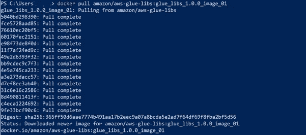
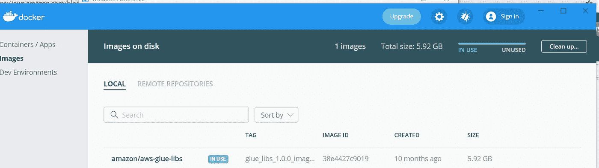
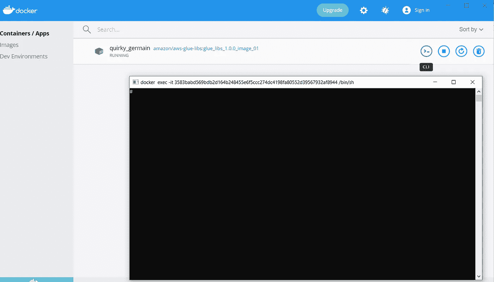
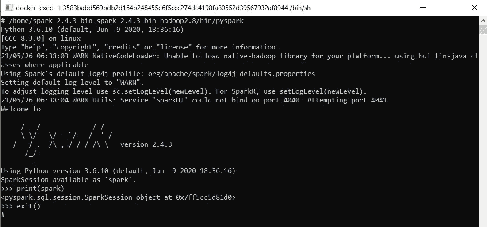
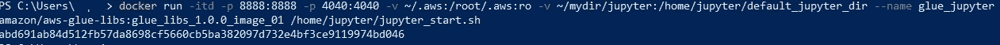
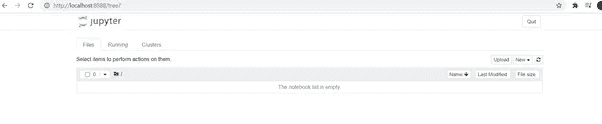
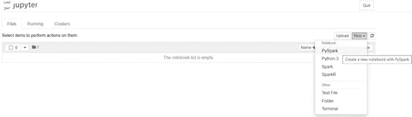
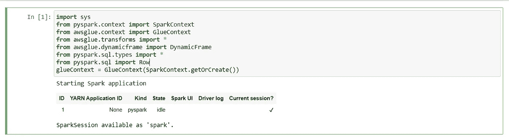
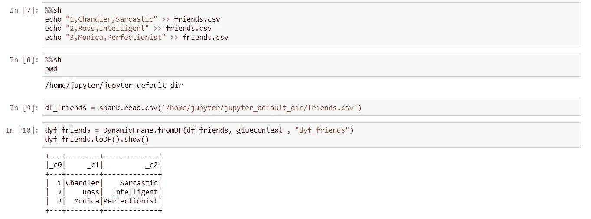

# 在没有 AWS 帐户的情况下使用 Jupyter 笔记本开始使用 AWS Glue

> 原文：<https://medium.com/geekculture/getting-started-with-aws-glue-using-jupyter-notebook-without-aws-account-11df977d1523?source=collection_archive---------30----------------------->

你是 AWS Glue 的新手，正在探索 Glue 的各种功能，但没有 AWS 帐户吗？

即使没有 AWS 帐户，您也可以开始探索 AWS Glue 功能。让我们开始吧…我将提供一个简短的演示，介绍如何在本地机器上设置你的游戏场。

1.  如果你没有 Docker，就在你的机器上安装它。
    [https://docs.docker.com/engine/install/](https://docs.docker.com/engine/install/)
2.  调出 docker 图像

```
docker pull amazon/aws-glue-libs:glue_libs_1.0.0_image_01
```



3.运行 docker cli



4.测试火花壳是否可以发射

```
/home/spark-2.4.3-bin-spark-2.4.3-bin-hadoop2.8/bin/pyspark
print(spark)
exit()
```



5.开始 Jupyter

```
docker run -itd -p 8888:8888 -p 4040:4040 -v ~/.aws:/root/.aws:ro -v ~/mydir/jupyter:/home/jupyter/default_jupyter_dir --name glue_jupyter amazon/aws-glue-libs:glue_libs_1.0.0_image_01 /home/jupyter/jupyter_start.sh
```



6.启动您的 Jupyter 笔记本

> 6.1 打开浏览器，转到“http://localhost:8888/”



> 6.2 创建笔记本并导入必要的模块



```
import sys
from pyspark.context import SparkContext
from awsglue.context import GlueContext
from awsglue.transforms import *
from awsglue.dynamicframe import DynamicFrame
from pyspark.sql.types import *
from pyspark.sql import Row
glueContext = GlueContext(SparkContext.getOrCreate())
```



7.创建数据并开始探索 glue 的各种功能



参考:

[https://AWS . Amazon . com/blogs/big-data/building-an-AWS-glue-ETL-pipeline-locally-without-an-AWS-account/](https://aws.amazon.com/blogs/big-data/building-an-aws-glue-etl-pipeline-locally-without-an-aws-account/)

如需进一步阅读:

[https://github . com/AWS-glue-libs/tree/master/AWS glue](https://github.com/awslabs/aws-glue-libs/tree/master/awsglue)
[https://docs . AWS . Amazon . com/glue/latest/DG/built-in-transforms . html](https://docs.aws.amazon.com/glue/latest/dg/built-in-transforms.html)