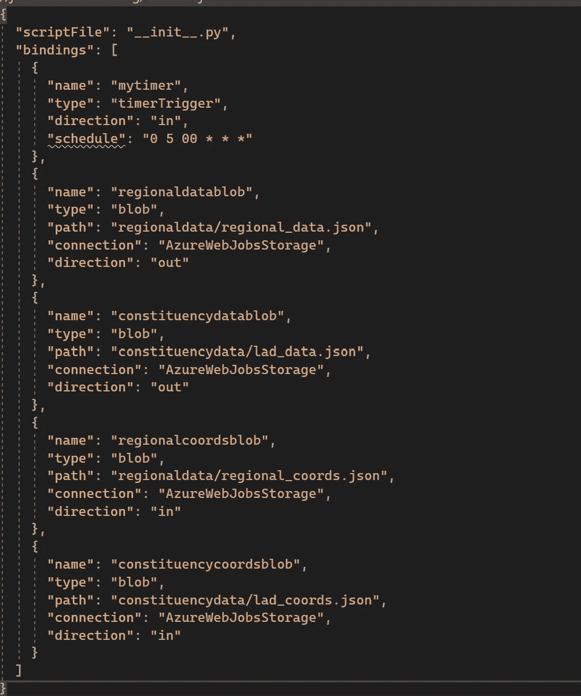
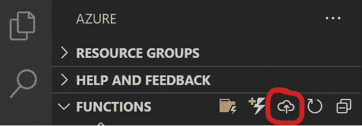

# Azure 函数入门

> 原文：<https://medium.com/geekculture/getting-started-with-azure-functions-19e96257ec0f?source=collection_archive---------9----------------------->

对于企业来说，云的采用越来越普遍。通常，这些企业的工作负载需要偶尔执行代码作为较大数据流的一部分，那么他们对 Azure 有什么选择呢？输入 Azure 函数。

在这篇博文中，我将介绍 Azure 函数和无服务器计算，以及如何开发你的第一个函数。


Photo by [Christopher Gower](https://unsplash.com/@cgower?utm_source=unsplash&utm_medium=referral&utm_content=creditCopyText) on [Unsplash](https://unsplash.com/s/photos/coding-python?utm_source=unsplash&utm_medium=referral&utm_content=creditCopyText)

# Azure 函数和无服务器计算简介

Azure Functions 是 Azure 中提供的一种无服务器计算服务，它运行代码来响应预定的事件或触发器。

在无服务器计算中，用户只需创建或上传代码，然后定义将执行代码的触发器或事件。这种触发可能来自各种来源，包括计时甚至其他云服务，如数据库。

一旦触发发生，在任何计算资源被释放之前，代码被加载并随后在执行环境中运行。仍然涉及到服务器，但是用户不再需要提供任何计算实例，这使得开发人员的工作更加轻松。

# 函数的高级剖析

从高层次来看，有几个概念需要你去理解…

*   触发器——如前所述，触发器是函数运行所需的条件。触发器可能有多种来源，但重要的是要注意每个函数只有一个触发器。
*   绑定——绑定可以被视为一个功能所需的到其他服务的连接。这种绑定可以是输入绑定，也可以是输出绑定。

一旦你理解了这两个概念，你就可以开始开发你自己的功能了。

# 功能的分解

在这一节中，我们将深入探讨在 Azure 上开发无服务器功能的一些关键文件和最佳实践。

## 功能开发的要求/建议

由于它提供的工具和扩展范围，我们将使用 Visual Studio 代码来创建和开发我们的函数——您将需要安装 Azure Functions 扩展和您选择的编程语言。

对于这个例子，我将使用 Python，如果你也这样做，请注意你需要安装 Python 3.6–3.8，因为这些是 Azure 函数支持的版本。

## 创建函数

在 VS 代码中，我们希望从打开命令面板开始，搜索`Azure Functions: Create function`命令——这将允许我们定义函数的设置:

*   为您的函数项目选择一种*语言:从列表中选择 Python。*
*   选择一个 *Python 别名来创建一个虚拟环境*:选择你的 Python 解释器的位置。
*   为您的函数选择一个*模板:*在本例中，我们将使用“定时器触发器”模板。
*   提供一个名为的*函数——我们将其命名为 TimerTrigger1*

一旦你完成了设置，你会看到一些文件在目录中被创建。让我们把它们分解一下，看看它们的用途。

## function.json —定义触发器和绑定

我们要研究的第一个文件是 function.json 文件。该文件用于定义函数的触发器以及绑定——与其他 Azure 服务的连接。目前看起来应该有点像这样:

```
{ "scriptFile": "__init__.py", "bindings": [ { "name": "mytimer", "type": "timerTrigger", "direction": "in", "schedule": "0 */5 * * * *" } ]}
```

但是你说这一切意味着什么呢？让我们一行一行地分解它！

*   “scriptFile”属性定义了包含函数被触发时要执行的代码的脚本。
*   “bindings”属性允许我们以数组的形式定义函数的触发器和绑定。我们可以看到，触发器已经基于我们之前的选择进行了定义。触发器的“方向”是 in，因为它是我们函数的输入。定时器的“schedule”属性是使用 ncrontab 语法定义的——参见这里的。

添加更多绑定时，文件可能如下所示…



这个例子取自一个正在进行的项目，但是它很好地突出了额外绑定的定义。

这里我定义了 4 个绑定，它们都是到唯一 blob 存储的连接。

有些将它们的“方向”属性设置为“输出”,因为它们充当输出——这就是 __init__ 的输出。py 脚本将被存储！

关于绑定的更多信息，请查看 [MS Docs 页面](https://docs.microsoft.com/en-us/azure/azure-functions/functions-triggers-bindings?tabs=csharp)！

## __init__。py —函数要执行的代码

现在让我们来看一下保存代码的文件，这些代码将在我们的函数被触发时执行。目前它应该是这样的:

```
import datetimeimport loggingimport azure.functions as funcdef main(mytimer: func.TimerRequest) -> None: utc_timestamp = datetime.datetime.utcnow().replace( tzinfo=datetime.timezone.utc).isoformat() if mytimer.past_due: logging.info('The timer is past due!') logging.info('Python timer trigger function ran at %s',   utc_timestamp
```

该脚本目前所做的就是导入几个包，定义一个 main 方法，然后根据计时器记录一些信息——这实际上充当了开发人员的样板模板。

如果你想带任何额外的第三方包，如 numpy，熊猫等。，您可以将它们添加到顶层目录中的 requirements.txt 文件中！

## 部署您的功能

现在我们已经探索了样板示例，让我们看看如何将一个功能部署到 Azure！由于我们使用 VS 代码作为我们的 IDE，这个过程通过 Azure 扩展得到了很好的简化:



导航到侧边栏上的 Azure 扩展，你将能够在`FUNCTIONS`部分旁边看到一个`Deploy to Function App`选项——这就是我们将要开始的地方！

这将以与我们创建函数本身时相同的方式调出一系列设置

*   选择一个*订阅*:选择自己的订阅。
*   在 Azure 中选择*功能 app*:如果你没有功能 App，选择在 Azure 中创建新的功能 App。
*   为您的功能应用程序输入一个*唯一名称:输入应用程序的名称。*
*   选择一个*运行时栈*:选择您在本地机器上使用的 Python 版本。
*   为新资源选择一个*位置:选择一个离你最近的区域以获得最佳性能。*

此后，部署将在后台继续。如需更多帮助，请查看此处的文档！

## 结论

这就是你对 Azure 函数的一个简短的停留之旅！我们已经查看了关键概念和核心文件，它们应该有助于加速您进入函数和无服务器计算的旅程。

~伊森