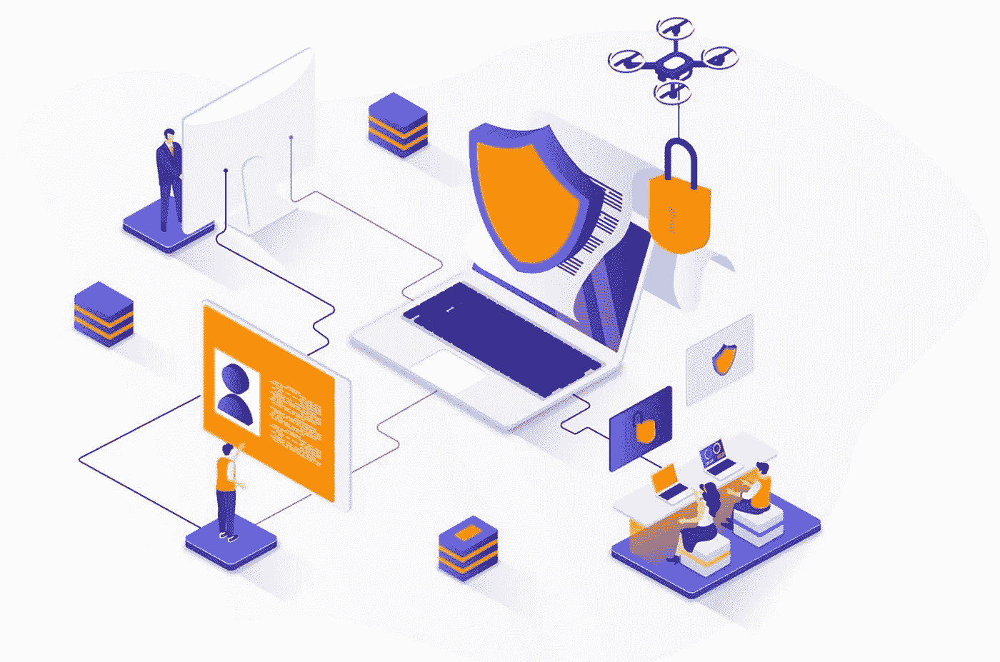

# 网络安全素养入门

> 原文：<https://medium.com/geekculture/getting-started-with-cyber-security-literacy-6678083f677b?source=collection_archive---------6----------------------->

网络安全术语介绍

一个周五的下午 4 点左右，我收到安全运营经理的一封电子邮件，通知我们有一个“关键零日漏洞”，需要在我们的内部应用程序中解决。对此，我回答说:“嘘！！今晚我的晚餐计划泡汤了！”。我团队中的一名初级 DevOps 工程师看着我说:“好吧！我们可以周一再处理这件事，对吧！?"。

这时，我意识到她不知道关键零日漏洞是什么意思，关键漏洞对 IT 基础架构或应用程序的威胁，以及它可能导致的攻击的影响。在本文中，我将分享一些常见的网络安全词汇、它们的含义以及它们在 IT 安全环境中的用法。

所以我们将通过讲故事来探究所有这些术语。我将总结一个真实的故事，一个名叫 Mat Howen 的记者如何被黑客攻击，他的数字生活如何被黑客瓦解。

Meet Mat Honan. He just had his digital life dissolved by hackers. PHOTO: ARIEL ZAMBELICH/WIRED. ILLUSTRATION: ROSS PATTON/WIRED

要了解更多信息，请查看 Mat 的文章:[苹果和亚马逊的安全如何导致我的史诗般的黑客行为](https://www.wired.com/2012/08/apple-amazon-mat-honan-hacking/)。额外的原始资料:[我在 youtube 上的 CS 视频](https://www.youtube.com/watch?v=U_P23SqJaDc&list=PLMSJmfiubd7kRdnyCD6idBhVE8admUJzL&index=2)

> **请注意我在整个故事中强调的词语**

## 发生了什么事？

这一切都发生在 2012 年 8 月，Mat 的 iPhone、iPad 和 MacBook 遭到黑客攻击。黑客们清除了这些设备上的所有数据。他们获得了 Mat 的 Twitter 账户，在 Twitter 上发布了仇视同性恋和种族主义的信息，并通过删除 Mat 的谷歌账户，从他的收件箱中删除了 8 年的信息，完成了他们的圣战。

黑客在访问和查看 Mat 的私人密码保护数字账户时，破坏了 Mat 信息的机密性和完整性；以及进行未经授权的更改，包括删除他个人设备上的文件，在他的 tweeter 帐户上发布非法消息，以及删除他 Gmail 帐户上的电子邮件。这些行为也损害了 Mat 信息的**可用性**，使 Mat 的数据永久不可用。

Image source: [vecteezy.com](https://www.vecteezy.com/vector-art/1760000-cyber-security-isometric-web-banner)

现在，这次黑客攻击的一个有趣的方面是，这些**攻击**是在没有一行**攻击代码**的情况下进行的；这意味着黑客不使用任何特殊的计算机程序，也不需要任何特别令人印象深刻的高级技术知识或技能。

没有重要编程知识或技能的黑客被称为**脚本小子**。黑客使用的唯一工具是一个网络浏览器、一部电话和任何有互联网连接的人都可以在网上找到的 Mat 的个人信息。

## 黑客是如何做到的？

黑客们首先收集了他们能在网上找到的 Mat 的所有个人信息。他们得到了马特的电子邮件地址、家庭住址和其他信息。使用 Mat 的个人信息以及巧妙使用假信用卡号码；黑客设法让亚马逊客服相信他们确实是 Mat，并要求为他们重置 Mat 的亚马逊账户。

有一次，黑客可以进入 Mat 的亚马逊账户；收集的额外个人信息。亚马逊给了他们 Mat 信用卡的最后 4 位数字。然后他们用它破解了 Mat 的 Apple ID，并获得了他的苹果设备(iPhone、iPad 和 MacBook)。

Image source: [wired.com](https://www.wired.com/2012/08/apple-amazon-mat-honan-hacking/)

接下来，黑客从 Mat 的 Apple ID 中获得了足够多的 Mat 信息，并能够重置 Mat 的 Google 帐户并访问他的 Gmail。从那里，他们使用他的谷歌账户进入他的推特账户，并能够发布仇视同性恋和种族主义的信息。

为了结束和掩盖他们的踪迹，黑客删除了 Mat 的谷歌账户，并用他的苹果 ID 请求对他所有的苹果设备进行远程数据擦除。有趣的是，远程擦除服务旨在保护苹果用户免受网络犯罪的侵害，允许他们在设备丢失或被盗的情况下删除数据。

# 网络安全术语

在上面的故事中，黑客利用了多重安全**漏洞**。有些是 Mat 无法控制的，有些是他可以避免的，比如没有将他的几个在线账户连接在一起，使得黑客可以访问其中一个账户。

在网络安全术语中，我在上面解释的、被黑客用来攻击 Mat 账户的攻击方法被称为漏洞利用。自从 Mat 的不幸事件以来，亚马逊和苹果已经更新了他们的客户识别协议，以消除他们这边的**漏洞**。

这个故事的一个特殊方面是，黑客声称他的动机是传播计算机安全意识。他是一名黑客活动家，又名**黑客活动家**。话虽如此，如果黑客是受经济利益驱动的网络罪犯，黑客攻击的影响可能会严重得多。他们可能用 Mat 的邮件访问了在线烘焙。

现在，让我们回顾一下所有的事情，或者进行一点非正式的风险评估。在网络安全方面:

*   *漏洞*是一个安全术语，描述安全系统中潜在的弱点。
*   *威胁*描述攻击发生的可能性。
*   *影响*描述攻击的后果

> 风险是对给定系统的漏洞、威胁和网络攻击的潜在影响的综合衡量

所以，我们假设这个黑客故事还没有发生。在这种情况下，您或 Mat 如何降低安全风险？

# 网络安全最佳实践

网络安全系统分析师可能会建议以下内容:

*   通过在 Google 帐户上启用双因素或多因素身份验证(MFA ),降低易受攻击性。
*   另一种降低风险的方法是减少威胁——简单来说，人们从攻击你中获得的越多，你就越有可能被攻击——一个相对匿名的互联网用户不太可能成为黑客的目标，除非是针对个人的。一个公众人物的威胁相对更高。
*   还可以通过降低攻击的潜在影响来降低风险，例如，如果 Mat 备份了数据，他就可以轻松地从被黑客攻击中恢复过来。

> **这里有一些顶级的网络安全最佳实践技巧。** *来源:***[titanfile.com](https://www.titanfile.com/blog/cyber-security-tips-best-practices/)**
> 
> **保持软件最新→避免打开可疑邮件→保持硬件最新→使用安全的文件共享解决方案加密数据→使用防病毒和防恶意软件→使用 VPN 将连接私有化→点击前检查链接→不要对密码偷懒！→在不需要时禁用蓝牙→从机器中删除广告软件→仔细检查网站上的 HTTPS→不要将重要信息存储在不安全的地方→扫描外部存储设备中的病毒→避免使用公共网络→备份重要数据。**
> 
> **避免“足够安全”的心态——永远记住没有 100%安全的事情**

**哦对了，看完这一切之后；我可以想象我团队中的初级 DevOps 工程师会问:“ ***但是什么是零日利用或漏洞呢？*** ”我大概会说这样的话:“ ***别犹豫，谷歌一下！*****

**玩笑归玩笑，我希望你现在已经熟悉了一些网络安全术语，如果还有我在本文中没有提到的其他术语，请不要犹豫，谷歌一下！ 😎😅**

> **干杯！！！**