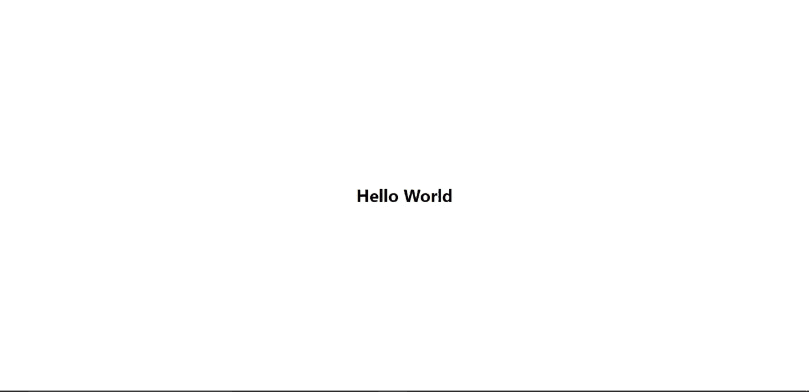
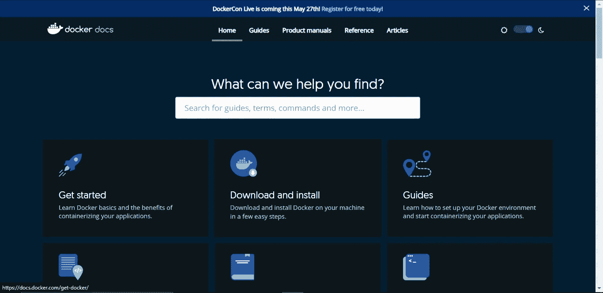
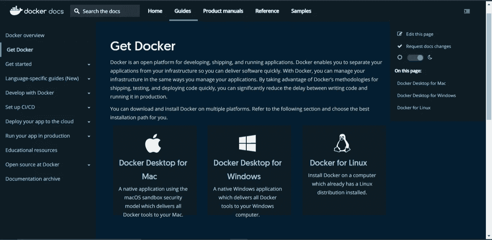
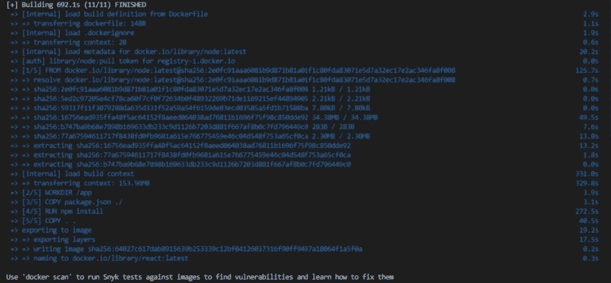
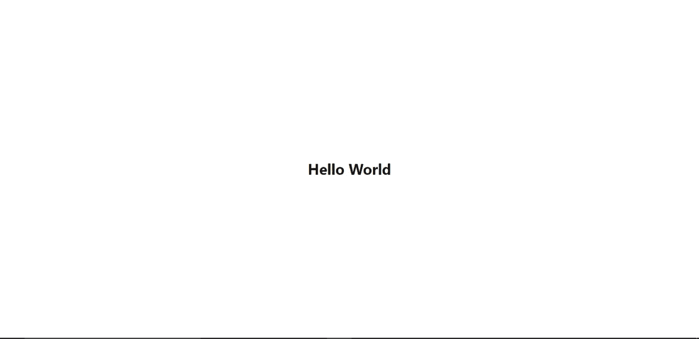

# React 中的 Docker 入门。Js 应用程序—基础

> 原文：<https://medium.com/geekculture/getting-started-with-docker-in-your-react-js-application-the-basics-6e5300cf749d?source=collection_archive---------0----------------------->


在本文中，我们将回顾在 React 应用程序中使用 docker 的步骤。出于讨论的目的，我决定将 docker 添加到一个简单的 React 项目中。

## 克隆 React 应用程序

下面，我粘贴了一个项目的链接，所以你可以在你的终端上运行下面的命令来克隆它；

```
git clone [https://github.com/OyinloluB/React-Docker.git](https://github.com/OyinloluB/React-Docker.git)
```

克隆应用程序并在本地运行后，您应该会看到下面的屏幕:



或者，你可以在你的个人项目中编码——两者都可以。

## 下载 Docker

为了能够使用 docker，您需要在您的计算机上安装 docker。不用担心，这是一个非常简单的过程。你所要做的就是去 docker 网站专门为你的操作系统下载 Docker。



要确认您是否已经成功地将 docker 安装到您的系统上，您可以在您的终端中运行以下命令:

```
docker -v
```

## 理解条款

使用 docker 时，您会经常遇到一些术语。理解它们的含义很重要，为此，我将在下面定义这些术语:

*   **码头工人:**

> Docker，简单来说就是 Y [ouTube](https://www.youtube.com/watch?v=gAkwW2tuIqE) 上的 [Fireship](https://www.youtube.com/channel/UCsBjURrPoezykLs9EqgamOA) 所定义的，是一种打包软件的方式，所以它能够在任何硬件上运行。

Docker 将您的 web 应用程序部署到容器中。这些容器获取您的代码、依赖项和它需要的一切，然后允许它在任何环境下运行。

*   **图像:**docker 图像包含运行应用程序所需的一切。它是一个模板，包含创建工作容器所需的一组指令。
*   **容器:**这是一个正在运行的映像进程/实例。如上所述，docker 容器“包含”了应用程序运行所需的一切，并且可以在任何环境中运行应用程序。
*   **docker file:**docker file 是定义如何构建映像的蓝图/一组指令。这是您定义的一系列步骤，必须在成功构建映像之前完成。
*   **Docker hub:** 想到 Github。Docker hub 是一个注册表，允许您托管您的图像，并让您访问大量其他 Docker 图像，您可以提取和使用这些图像。
*   **Dockerignore:***。dockerignore* 文件的作用类似于*。gitignore* 文件。它包含本地应用程序中不希望出现在 docker 映像中的任何文件。

既然我们已经学习了这些术语，我们可以开始在编写我们的简单应用程序时应用它们。

## 入门指南

在 React 应用程序中，我们要做的第一件事是在根目录下创建一个名为 *Dockerfile* 的文件。我们将其定义为一系列步骤、一组说明、一个蓝图，它定义了如何构建您的映像。我们还说过一个*映像*包含你创建一个工作容器所需的每一条指令，一个*容器*是一个映像的运行实例，它允许你的应用程序在任何环境下运行。现在我们都赶上了，让我们在 dockerfile 中写一些一步一步的说明，告诉它我们希望如何建立我们的形象。

```
FROM node:latest
```

这里的关键字是来自的**，这里我们的第一步/指令说我们想要使用最新的节点映像。**

```
WORKDIR /app
```

这里的 WORKDIR 说我们想要将应用程序的源代码添加到图像中。这行指令在我们的映像中创建了一个名为 *app* 的目录，并将我们的源代码添加到该目录中。

```
COPY package.json ./
```

在我们的应用程序中，我们已经安装了一些依赖项。**复制**这里复制我们 *packge.json* 文件的内容。

```
RUN npm install
```

**运行** npm install 继续在我们的映像中安装我们可能已经本地安装的所有依赖项。

```
COPY . .
```

这样做的目的是将本地目录中的所有文件复制到在我们的映像中创建的 */app* 目录中。

```
CMD ["npm", "start"]
```

这最后一个命令在每一步都成功导航后启动应用程序。

你的 *dockerfile* 现在应该是这样的:

```
FROM node:latestWORKDIR /appCOPY package.json ./RUN npm installCOPY . .CMD ["npm", "start"]
```

## 使用。dockerignore

在运行我们的应用程序以查看我们的设置是否有效之前，我们必须做一件事。现在的*。dockerignore* 文件是你不希望出现在 docker 映像中的所有东西的家。在我们的应用程序中，我们的映像中不需要的一个东西是 *node_module* 文件夹。为什么？在我们的 *dockerfile* 中，我们正在运行 *npm install* 以便访问我们应用程序中的所有依赖项。这本身将创建一个 *node_modules* 文件夹。

当我们将所有文件从本地复制到映像时，我们也复制了 *node_modules* 文件夹。为了抑制这种情况，在您的根目录中，创建一个*。dockerignore* 文件。我们在这里要做的事情非常简单，我们包括了与我们的 docker 映像无关的文件:

```
node_modulesDockerfile.git
```

## 建立我们的形象

现在要启动并运行我们的容器，我们必须首先运行 build 命令。这个命令遍历了我们在 over 文件中定义的每一步，当您运行它时会看到:

```
docker build -t nameofyourapp:latest .
```

当它运行时，在您的终端中，您会看到它遍历了我们在 over 文件中定义的每一步。



## 运行我们的容器

要运行我们的 docker 容器，在您的终端中编写命令:

```
docker run --name nameofyourchoice -d -p 3000:3000 nameofyourapp:latest
```

*   **-d:** 这将在分离模式下运行容器。简单地说，当您离开终端会话时，它会让您的容器保持运行。
*   **-p:** 这用于发布您希望您的应用程序运行的端口。如果您运行您的容器而不发布端口，那么无论您的容器中运行什么，都只能在您的容器中访问。

在您的容器成功运行后，您将会看到如下 id:

```
6d1670d1e2ff97997fa1a071aff4e558cfd4ff33a4d7efb5001565832887af24
```

您的 id 会有所不同，因为它特定于您的应用程序。

为了进一步确认我们的应用程序是否按预期运行，您可以运行这个命令来查看当前正在运行的图像:

```
docker images
```

它会向您展示如下内容:

```
REPOSITORY      TAG       IMAGE ID       CREATED          SIZE  
react          latest    64027c617dab   15 minutes ago   1.37GB
```

为了进一步确认，让我们在浏览器中运行我们发布的端口，看看是否会出现任何问题。因此，在你的浏览器中——如果你还在运行早先的 *localhost:3000* 上的 React 应用程序，进入你的终端并停止该进程，然后再次打开 *localhost:3000* 而不运行 *npm start* 。您应该会看到一个简单的页面，上面写着“Hello World”，如下所示:



## 结论

在这篇文章中，我们学习了如何对我们的 React 应用程序进行 dockerize。当在任何应用程序中使用 Docker 时，还有更多的东西需要考虑。为了了解更高级的概念或更深入地研究这里所涉及的概念，您可以进一步阅读或查看 Youtube 视频中的详细内容。