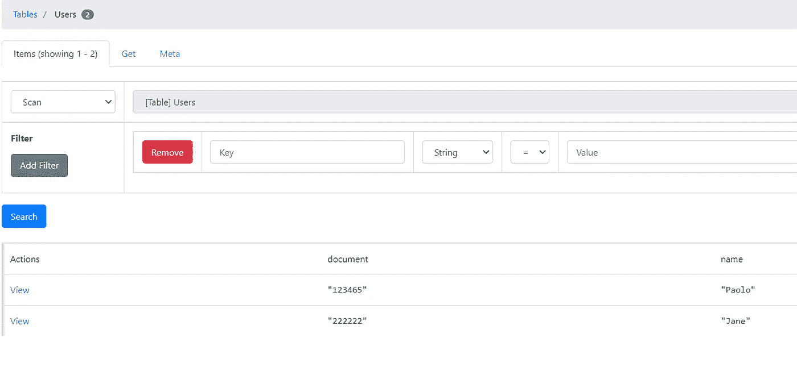
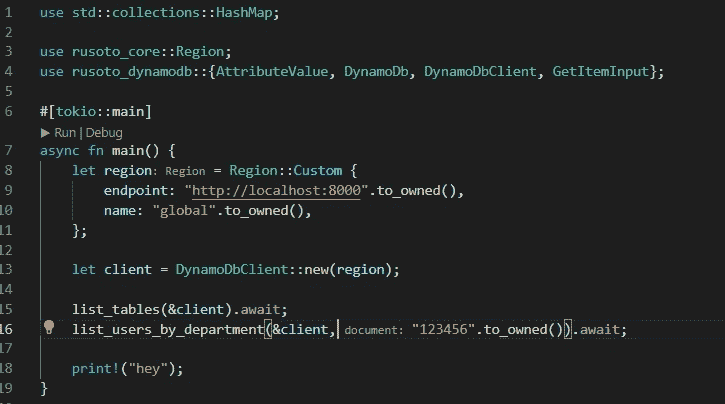
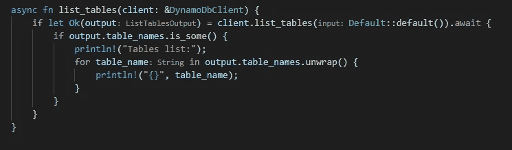
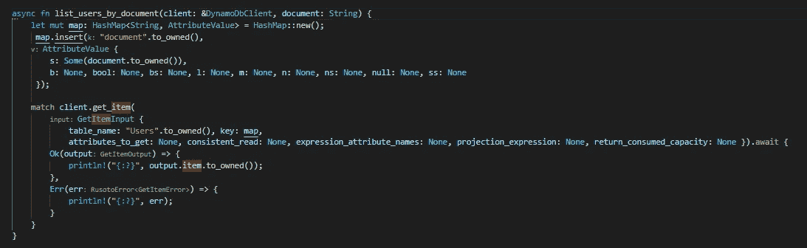
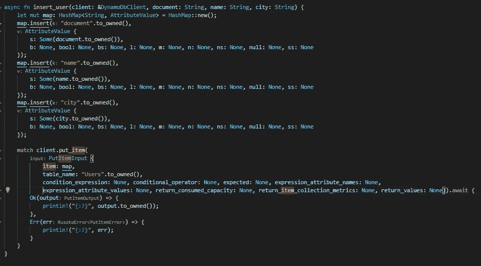
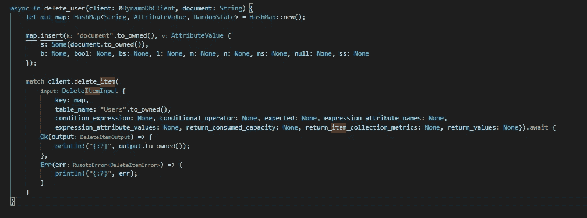
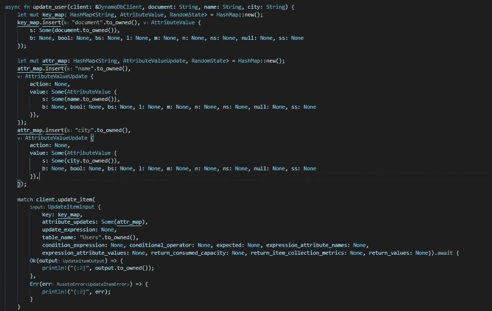

# 使用 Rust 语言开始使用 DynamoDB

> 原文：<https://medium.com/geekculture/getting-started-with-dynamodb-using-rust-language-5876686f352d?source=collection_archive---------8----------------------->


Photo by [Marc-Olivier Jodoin](https://unsplash.com/@marcojodoin?utm_source=medium&utm_medium=referral) on [Unsplash](https://unsplash.com?utm_source=medium&utm_medium=referral)

本文展示了一些使用 Rust 在 DynamoDB 上执行基本操作的例子和代码片段。

为此，我们将使用 Rusoto 库，它有许多与 AWS 集成的优秀特性。查看[文档](https://rusoto.github.io/rusoto/rusoto_dynamodb/)了解更多详情！

此外，我们将在本地运行 DynamoDB，将其用作 docker 容器，因此您不需要在 AWS 帐户中创建数据库。

## 用 docker 在本地运行 DynamoDB

```
docker run -p 8000:8000 amazon/dynamodb-local \
  -jar DynamoDBLocal.jar -sharedDb
```

[安装 NPM](https://docs.npmjs.com/downloading-and-installing-node-js-and-npm) (如果你没有的话)并安装 [dynamodb-admin](https://www.npmjs.com/package/dynamodb-admin) ，使用 NPM 在你喜欢的命令行工具中运行下面的命令:

```
npm install -g dynamodb-admin
```

运行 dynamodb-amin:

```
dynamodb-admin
```

这个工具对于查询和可视化您的表非常有用。



您可以使用它来检查我们将在示例中插入的数据。

我创建了一个名为 Users 的表，使用“document”作为键。您可以使用 dynamodb-admin 工具完成同样的工作。

## 创建 Rust 项目

使用 Cargo 创建一个 Rust 项目。项目名称由你决定。

```
cargo new dynamo_tutorial
```

更改 Cargo.toml 文件以添加以下依赖项:

```
[dependencies]tokio = { version = "1", features = ["full"] }rusoto = { version = "0.24.2" }rusoto_core = "0.47.0"rusoto_dynamodb = "0.47.0"
```

main.rs 文件必须包括相关的板条箱，如下所示。

之后，我们需要创建一个 *DynamoDbClient* 对象来连接数据库。



main function (not yet finished)

请注意，需要通过添加 tokio::main 属性来更改 main 函数。这允许我们的程序等待异步操作。

我添加了全局区域作为区域对象的属性。然而，这并不重要，因为我们在本地运行数据库。

## 列出所有表格



List of tables

该函数将列出数据库中包含的所有表。执行此操作不需要任何参数。

## 选择项目



Function to list users

任何查询操作都需要分区键，在本例中为*文档*。

在这里，我创建了作为查询参数的映射，只通知文档，因为我们在这个操作中只使用分区键。该函数将列出数据库返回的所有用户。

```
let mut map: HashMap<String, AttributeValue> = HashMap::new();map.insert("document".to_owned(), AttributeValue { s: Some(document.to_owned()), b: None, bool: None, bs: None, l: None, m: None, n: None, ns: None, null: None, ss: None});
```

注意，对于每个参数，我们必须填充 *AttributeValue* 对象。此对象需要填充类型属性。检查[文件](https://rusoto.github.io/rusoto/rusoto_dynamodb/struct.AttributeValue.html)以正确填写。在我们的例子中， *s* 是我们必须作为*文档填充的属性，*我们的键是一个字符串。

## 插入项目

*属性值*也将用于该操作。在这种情况下，对于每个属性，我们将需要一个 *AttributeValue* 对象。

```
map.insert("document".to_owned(),AttributeValue {s: Some(document.to_owned()),b: None, bool: None, bs: None, l: None, m: None, n: None, ns: None, null: None, ss: None});
```

在这个代码片段中，我为文档创建了对象。*名称*和*城市*的对象也将被创建。

我们将使用 *put_item* 函数将商品插入数据库。此操作需要类型为 *PutItemInput* 的对象作为参数。

在这个例子中，我传递了插入属性和表名的映射。

```
PutItemInput {item: map,table_name: "Users".to_owned(),condition_expression: None, conditional_operator: None, expected: None, expression_attribute_names: None, expression_attribute_values: None, return_consumed_capacity: None, return_item_collection_metrics: None, return_values: None}
```



insert_user function

## 删除项目

要从数据库中删除一个项目，我们将在 update_user 函数中使用 *delete_item* 函数，如下所示:



delete_user function

该函数需要一个[*delete item input*](https://rusoto.github.io/rusoto/rusoto_dynamodb/struct.DeleteItemInput.html)对象。下面是一个例子。

```
DeleteItemInput {key: map,table_name: "Users".to_owned(),condition_expression: None, conditional_operator: None, expected: None, expression_attribute_names: None,expression_attribute_values: None, return_consumed_capacity: None, return_item_collection_metrics: None, return_values: None}
```

移除项目需要密钥。在这种情况下，键是一个映射，我们必须通知键(在我们的例子中是“文档”)和值。

## 更新项目

要更新项目，将使用 *update_item* 函数。这个操作需要一个[*update item input*](https://rusoto.github.io/rusoto/rusoto_dynamodb/struct.UpdateItemInput.html)*，*，它需要表名和两个映射:一个用于键，另一个用于要更新的属性。

让我们创建一个函数 update_user 和两个映射，如下所示:



update_user function

完整的源代码在我的 github 上:

[保洛波索/鲁斯特 _ 迪纳摩 _ POC(github.com)](https://github.com/paoloposso/rust_dynamo_poc)

我希望这可能有用。回头见！