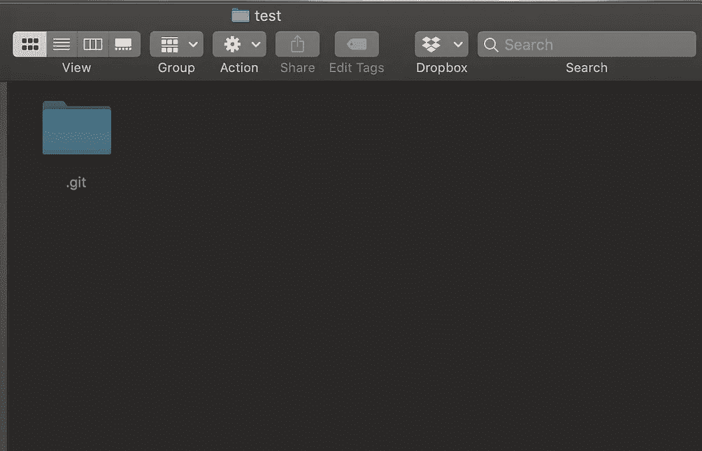
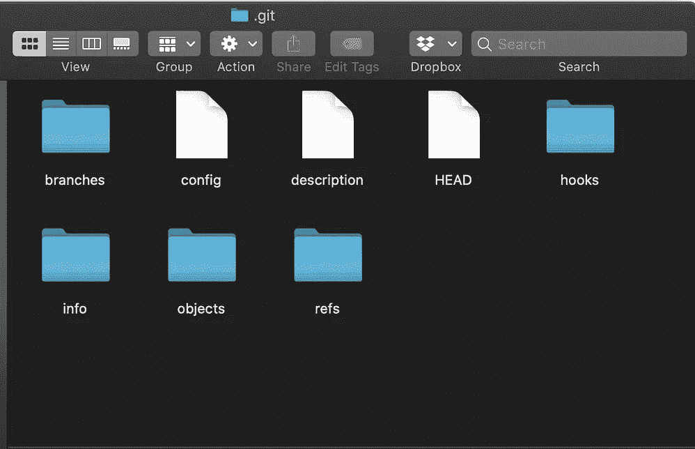
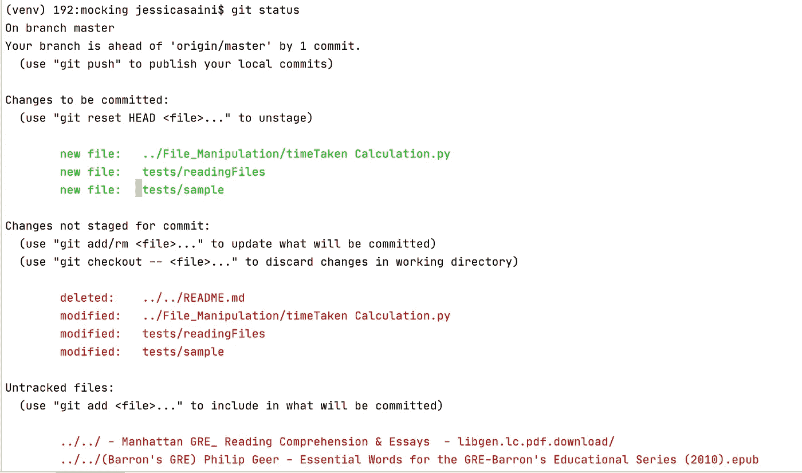
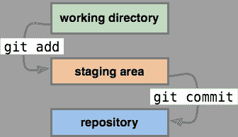

# GIT 命令入门:这里是您需要知道的一切

> 原文：<https://medium.com/geekculture/getting-started-with-git-here-is-everything-that-you-need-to-know-a3bfbd78b5d6?source=collection_archive---------6----------------------->

## 一本解释所有基本 GIT 命令的初学者指南


Photo by [Pexels](https://www.pexels.com/photo/photo-of-turned-on-laptop-computer-943096/)

想象一下向现有代码中添加一个特性。您意识到新添加的功能没有按照预期的方式运行，并且您希望恢复到其原始状态。可以想象，如果你所要做的就是一直按下`Ctrl+Z`直到你回到之前的代码，这将是一项多么乏味的任务。

在这种可怕的情况下，版本控制系统是你的救星。它们是帮助团队管理源代码随时间变化的软件工具。

开发人员可以独立地处理同一个文件，并在稍后阶段将它们合并。许多程序员可以同时处理一个文件，最好的一点是覆盖某人代码的可能性微乎其微。VCS 跟踪对代码所做的所有修改。因此，修复错误和恢复丢失的代码变得更加简单。

# GIT 是什么？

Git 是最流行的版本控制系统之一(VCS)。许多软件公司和应用程序依赖 Git 来维护它们的源代码。

## Git 中的存储库类型(Repo)

Git 属于分布式版本控制系统(DVCS)的范畴。这意味着存在于每个开发人员机器中的代码的工作副本包含了项目变更的全部历史。

Git 中的存储库分为两类:

*   **本地存储库:**位于您计算机上的文件夹(repo)是本地存储库，您可以在这里编写、开发和测试您的代码。
*   **远程存储库:**Git 中的远程存储库是团队所有成员用来为公共代码库做贡献的存储库。这个存储库主要依赖于一个托管服务，比如一个内部服务器。一个项目可以有多个支持存储库。

# GIT 命令的基础

这是一个关于如何使用基本 GIT 命令的综合教程。使用 Git 中的本地存储库需要执行以下 4 个命令:

*   git 初始化
*   git 添加
*   git 状态
*   git 提交

## Git 初始化

```
**$ git init** // creates a git folder that is hidden by default
```

`git init` 命令是您将在 Git 上运行的第一个命令。git init 命令用于创建一个新的空白存储库。(默认情况下，此存储库是隐藏的)。

如果你很想知道里面有什么，它看起来会像下面的图片



Local Repository for GIT

的。git 子目录用于将现有项目注册为 Git 项目。该文件夹包含版本控制所需的所有元数据文件。它包含所有关于提交的信息，远程 repo 地址，头指针，将存储项目历史的日志。

## Git 中的不同区域

运行`git init`命令后，你的项目在逻辑上被分成 3 个区域。这些领域如下:

*   **工作区域**
*   **集结地**
*   **本地存储库**

假设您已经开始编写代码，并且习惯性地按下`Ctrl+S`以避免丢失任何更改。到目前为止，您编写的所有代码都驻留在您的工作区中。在 Git 的语言中，工作区包含所有未跟踪的变更和文件。

记住，使用`Ctrl+S`保存代码并不会将代码保存在 Git 中。因此，为了保存对 Git 的所有更改，您需要使用`git add` 和`git commit`命令。

## Git 添加

这是一个简单的命令，将您的代码移动到临时区域。暂存区是一个缓冲区，用于保存下一次提交的更改。

```
**$git add <filename>** *//This command adds a particular file to the staging area.* **$git add .** //*This command adds all the files where the code is modified to the staging area.*
```

请记住，您的更改尚未保存，它们只是被移动到临时区域中。

## Git 提交

为了保存你的修改，这样你就可以在它们之上工作或者恢复到它们，你需要使用`git commit.`

“提交”是 Git 词汇表中保存的另一个词。每当您提交一个更改时，git 都会拍摄一个更改的快照。

```
**$git commit -m "<message>"** *//This command will save the files that were added to the staging area. '-m' flag signifies the message.*
```

每次提交更改时，都会为您的更改分配一个唯一的 40 位字母数字 id。该 id 可用于以后检索您的更改。

## 为什么我们需要一个集结地？

程序员最常问的一个问题是，为什么我们不能将我们的变更直接从工作区转移到本地存储库中。

*   暂存区为开发人员提供了将一个大的变更拆分成多个小的变更的灵活性。
*   它还区分对文件所做的更改。例如:如果您错误地编辑了一个文件，staging area 将在提交之前比较现有文件和旧提交中的更改。

## Git 状态

`git status`命令用于查看被跟踪和未被跟踪的文件、工作目录的状态以及暂存区。



Example of git status

当您运行`git status`命令时，您应该看到以下内容

*   **要提交的变更:**这些变更存在于临时区域中，在执行`git commit`命令后将被提交到本地存储库。
*   **未提交的变更:**这些变更存在于工作目录中。为了提交它们，您需要执行`git add`和`git commit`。
*   **未跟踪的文件:**这些文件不在您上次提交的文件中，也没有添加到您的临时区域中。

## Git 如何保存文件？



Saving File in git

> 工作目录→临时区域→本地存储库

Git 不将数据存储为一系列变更集或差异，而是存储为一系列**快照**。

# Git 中的分支

Git 中的分支只是一个轻量级的可移动指针。一个**指针**是一个变量，它有内存位置的直接地址。假设有一块招牌，上面写着你家的地址。在电脑的世界里，这个招牌是指向你家的指针。

## 主分支

主分支是 Git 中的默认分支。应用程序或软件的工作代码驻留在主分支中。

如果您正在与一个软件开发团队一起工作，您可能无法将您的代码直接推送到主分支。您的代码可能会导致当前工作代码中的一些主要问题，应该进行测试以避免错误。

> 为什么大师分支很重要？

主分支包含可部署的、生产就绪的代码。它应该是代码的稳定版本。你不应该把任何没有经过测试的东西推给主分支。

## **Git 中的分支**

如果您必须在 master 中的现有代码之上构建一个特性，您将从 master 创建一个分支。这个分支也称为特征分支。不同的程序员应该从 master 创建不同的分支来处理同一个项目。

如果您想查看所有分支，请使用命令

```
**$git branch -a** *//This command will save the files that were added to the staging area.* 
```

## 远程存储库

您本地系统中的所有更改都将通过遥控器与外界进行交流。远程是团队成员用来交换变更的公共存储库。远程存储库不需要在服务器上。它可以是您本地系统上的另一个存储库，您同事系统上的存储库，或者内部或外部服务器上的存储库。

然而，在大多数情况下，远程存储库存在于托管服务上，如 GitHub 或内部服务器，在那里很容易访问。

## 添加新遥控器

要添加一个新的遥控器，在终端上使用`git remote add`命令，在存储库的目录中。该命令需要两个必要的参数:

*   **远程别名:**按照惯例，用于存储库的远程别名是 **origin。**
*   **远程 URL**

```
**$git remote add origin https://github.com/Jess2110/Machine_Learning.git***//This command will map origin with the remote URL.*
```

请记住，可以为您的本地存储库配置/添加多个遥控器。

`git remote <alias> <url>`将为您的本地回购添加额外的遥控器。

## 查看您的遥控器

要查看你的遥控器，你可以使用命令`git remote`，这将显示你为你的项目配置的所有遥控器的别名。

```
**$git remote** // displays the aliases for all your remotes **$git remote -v** //displays the aliases and the URLs
```


Example of git remote

远程别名非常有用，因为程序员不必在每次推送或提取代码时都键入完整的远程 URL。

## 从遥控器获取和拉出

`git fetch`和`git pull`都用于从远程存储库下载元数据。

仅下载元数据(提交、引用、标签等)。)到您的本地存储库中，并且不将其与您的本地更改合并。因此，您不会丢失本地存储库中的任何更改。

`git pull`是一个高级命令，它从远程存储库下载元数据，并尝试将其与本地存储库合并。

> 换句话说，`git pull`就是依次执行的`git fetch`和`git merge FETCH_HEAD`。

## 什么时候使用 git fetch？

如果您被要求在项目的一个不同的分支中检查一个最近的提交，那么建议您使用`git fetch <alias_name> <branch_name>`在本地下载元数据。这将确保您的本地更改是完整的和不受干扰的。

## 将代码保存到远程存储库

git 的最后一步是将代码保存到远程存储库中。为此，您需要使用以下 to 命令:

*   Git 拉
*   git 推送

`git pull`命令将从您的遥控器下载所有的更改，并将其与您的代码合并到本地存储库中。

`git push`命令用于将本地存储库内容上传到远程存储库。推送是将提交从本地存储库转移到远程存储库的方式。

`git push`命令有两个参数:

*   远程别名，例如`origin`
*   一个分支名称，例如`master`。

```
**$git push origin master***//This command will push all the changes in your local repo to origin's(remote repo) master branch*
```

一旦推送成功，本地存储库中的所有提交都将发布到远程存储库中。

这就把我们带到了文章的结尾。我希望到现在为止，您应该对 git 的工作原理有了很好的理解，并且对执行 Git 提交有信心。

祝你编码之旅好运。