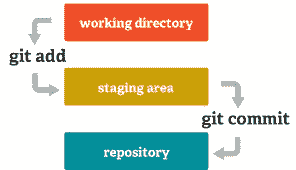
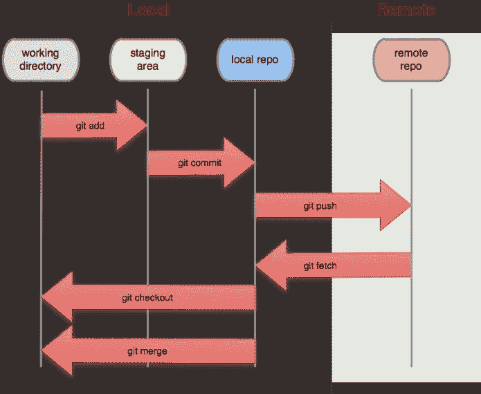

# Git 入门:变得简单

> 原文：<https://medium.com/geekculture/getting-started-with-git-made-easy-5d2e7735a8e7?source=collection_archive---------12----------------------->

## 在基于 Ubuntu / Linux 的操作系统中从命令行使用 GIT。



[https://git-scm.com/images/about/index1@2x.png](https://git-scm.com/images/about/index1@2x.png)

在本文中，让我们克隆一个远程项目，并学习 GNU/Linux 操作系统中的基本 GIT 命令。

准备好输入一些命令了吗？嗬！等等。

**注意:**你需要事先在你的电脑/笔记本电脑上做一些基本的设置。

*   工作 Linux 环境。
*   Git 已安装(GIT 可能已经安装在任何基于 Linux 的操作系统上了)。

你在这里是因为你已经有了一个 **github** 账户，至少我是这样认为的。如果没有，不要拖延， [**报名**](https://github.com/) 。

现在您已经在系统上设置了 GITHUB 帐户，让我们进入终端。`CTRL+ALT+T`将带您前往终点站/konsole。

1.  通过
    `git --version`
    搜索 GIT 版本，你应该会在屏幕上看到 *git 版本 2.30.0(当你在做这个的时候可能会有所不同)*。
    -如果您的本地没有安装 GIT，不要担心，[在这里](https://git-scm.com/book/en/v2/Getting-Started-Installing-Git)它已经安装了。
2.  是时候在您的本地系统中进行配置了。

```
git config --global user.name "<YOUR_NAME>"
git config --global user.email "<YOUR_MAIL_ID>"
```

注意:“global”告诉你的 GitHub 在你的电脑上做任何事情时总是使用这个信息。

很好。现在配置完成了。但是我如何检查它是否完成了呢？试试这个，看看你会得到什么！

```
git config --global --list
```

3.克隆部分正在进行中。很简单。

```
git clone [https://github.com/akhilmallepally/programs.git](https://github.com/akhilmallepally/programs.git)
```

Tadaa！项目被克隆。

使用 *cd* 命令进入项目文件夹。

```
cd programs
```

注意:试试 ***git remote -v*** 和 ***git branch -a*** ，它们分别给出了关于远程仓库和分支的信息。

> 如果您在本地创建一个项目文件夹，而不是克隆，那么它就不是一个 git 存储库。这就是初始化部分的由来。
> 
> **git 初始化**
> 
> 该命令指示 git 开始将该文件夹/目录作为存储库进行跟踪。

4.**创建**、**阶段**和**提交**一个文件到克隆的存储库。

*   通过终端创建一个空文件“test ”,并在文件中写入一些代码或文本:

```
touch test
```

*   检查本地存储库的更改/当前状态

```
git status
```

*   添加所有文件(这称为暂存)

```
git add <FILE_NAME>
```

*   让我们提交这些更改

```
git commit -m “first commit”
```

6.我们差不多完成了。将代码放入原始存储库的最后一步是

```
git push origin master
```

> 如果您克隆了给定的项目或其他人，您应该看到类似下面的内容，因为您应该作为合作者优先访问该回购。我们将在接下来的文章中详细讨论这个问题。
> 
> remote:对 akhilmallepally/programs.git 的权限被拒绝<your_username>。
> 致命错误:无法访问“https://github . com/akhilmallepally/programs . git/”:请求的 URL 返回错误:403</your_username>

下面是上述过程如何工作的图示。不要担心*获取*、*结账*、*合并*的命令，我们将在下一篇文章中讨论它们。



[https://greenido.files.wordpress.com/2013/07/git-local-remote.png](https://greenido.files.wordpress.com/2013/07/git-local-remote.png)

这是当您使用命令在 GIT 上工作时应该有的一个基本想法。