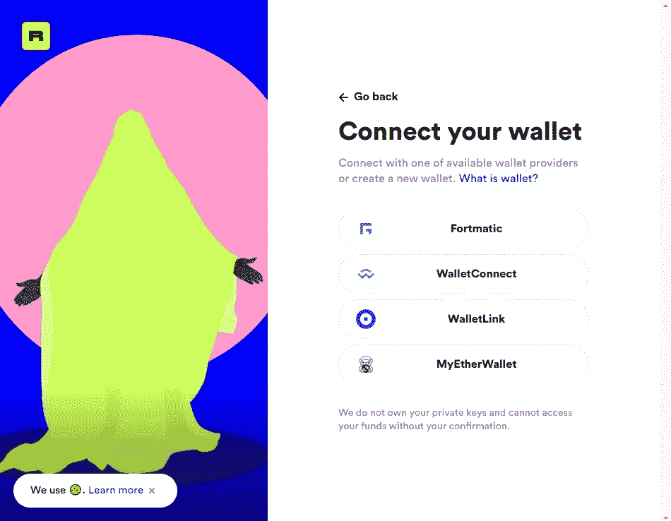
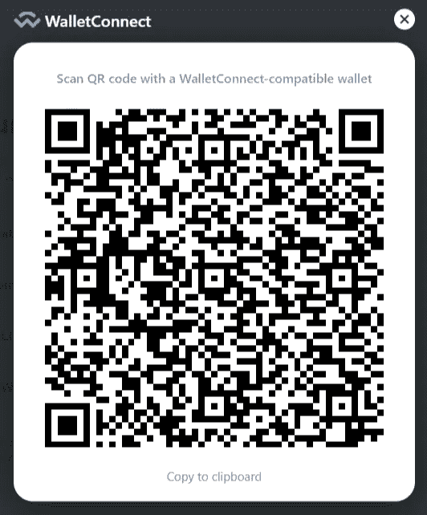
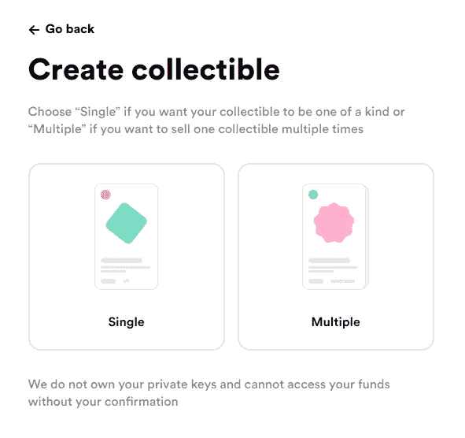
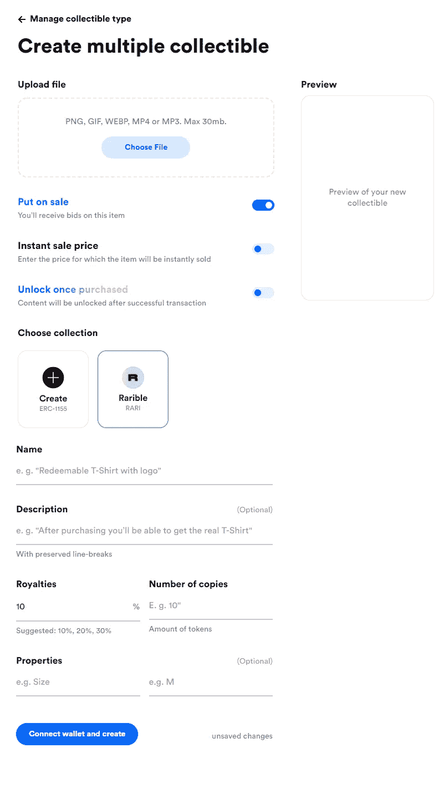

# NFT 艺术入门

> 原文：<https://medium.com/geekculture/getting-started-with-nft-art-1f6790d1b08d?source=collection_archive---------13----------------------->

如今艺术家有很多选择。他们可以使用传统的画布，但另一方面，他们可以使用 PC 和各种软件，如 Photoshop，3dMax 等。

虽然数字艺术有许多优势，如新的可能性，特殊效果等。它有两个严重的缺点:

1.  数字艺术品非常容易复制。
2.  很难要求或证明艺术品的所有权。

这就是为什么直到最近，与传统艺术品相反，数字艺术品的交易仍然非常困难。

现代发展为我们提供了一种新技术，名为“不可替代令牌”或 NFT。这意味着这些类型的令牌不能被拷贝或复制。它基于“以太坊”技术，该技术本身基于“区块链”基础设施，它为我们提供存储 NFT 的“智能合约”。“智能合同”为我们提供了艺术品的所有权证明。“以太坊”技术确保“智能合同”不能被篡改或复制。

以太坊环境也为我们提供了一种叫做以太(ETH)的加密货币，类似于更流行的比特币。艺术家可以出售他们的数字艺术，可以通过 ETH 加密货币获得报酬和版税，这些加密货币可以转换为真实的货币。

如何做到这一点超出了本文的范围，但是我将在这里解释如何利用这项新技术为您带来好处。

## 钱包:

数字钱包是存储智能合约和加密货币的手段。有四种类型的钱包:

1.  物理硬件钱包:这些是硬件设备。类似于 USB 闪存驱动器。硬件钱包让你可以离线存储加密货币。从而使其成为最安全的方法。
2.  移动应用:有些应用可以下载到基于 Android 或 IOS 的设备上。
3.  桌面应用程序:安装在桌面计算机上的应用程序。有针对 Windows、macOS 和 Linux 的版本。
4.  网络应用:这些只是你可以从任何地方访问的网站。

更多关于钱包的细节以及如何选择一款符合您需求的钱包，请点击查看详情[。](https://ethereum.org/en/wallets/)

## 铸造艺术品:

铸造简单地意味着你的工作和创造一个 NFT 令牌化的过程。简单地说，这是上传数字艺术，为其创建智能合同，并将其存储在您的数字钱包中的过程。数字文件可以是静态图片文件(PNG、GIF)、声音文件(MP3)或视频文件(MP4)。

最受欢迎的网站之一是 https://rarible.com/的 T2 T3。第一步是连接您之前创建的钱包。因此，请访问该网站，并按下屏幕右上角的连接键。

在这个屏幕中，我们可以看到四个钱包提供商。这些提供者连接了“Rarible”接口和我们的钱包。例如，如果我们按“WalletConnect ”,我们将看到如下所示的二维码:

使用移动钱包应用程序，如[“信任钱包”](https://trustwallet.com/)扫描它，并将其连接到我们的“Rarible”页面。如果我们使用桌面钱包、网络钱包或硬件钱包，我们可以将 QR 码复制到剪贴板并粘贴到钱包界面的适当位置。

在这个阶段之后，我们可以通过点击顶部屏幕上的“创建”按钮来开始铸造过程。

在第一个屏幕上，您可以选择单个收藏品或多个收藏品。这些选项几乎相同。唯一的区别是，在多种选择中，你可以多次出售你的艺术品。选择一个选项后，您将进入第二页:

第一个字段是上传字段，您可以在上面上传您的工作。

下一场是**【发售】**。在这里你可以选择是想把你的作品放到公开市场上出售，还是只想把你的作品注册到区块链上，以后再放出去出售。如果你想把它出售，那么你可以用 ETH 单位定义一个即时销售价格。

**“购买后解锁”**为买家提供在成功交易后显示的附加内容。这些附加内容可以是一个链接到你的作品的完整的高质量文件的 URL 链接。

现在你可以选择将你的作品添加到**现有的“稀有”收藏中**或者**创建你自己的收藏**。所有收藏都由以太坊网络上的 EIP-1155 标准管理。

**名称**和**描述**非常明显。这两个字段描述了您的作品。

**版税税率**定义了每次在二级市场上转售你的作品后你能获得多少。例如，如果您将版税税率设置为 10%,买方将转售您的作品，那么您将从售价中获得 10%。

**副本数量**定义了 Ethreum 网络上可以获得多少份您的作品副本。如果你定义了 10 份拷贝，那么没有人可以购买或复制你的作品超过 10 份。

您可以添加额外的**属性**，如大小、格式等。

现在我们可以按下**创建**按钮，开始铸造过程。

## 天然气价格:

> **警告:**铸造过程要花钱！你必须购买足够数量的乙醚。成本取决于许多因素。你想多快执行铸造过程，瑞士法郎汇率，以及你想执行的合同。

这些成本被称为“天然气”。在大多数情况下，您可以选择低速、中速和高速。速度越高，消耗的汽油就越多。更多关于汽油价格的细节可以在这里找到:[https://etherscan.io/gastracker](https://etherscan.io/gastracker)

## 在其他市场上刊登你的作品:

现在，在你的作品上传后，你可以在其他市场上列出你的作品，比如 https://opensea.io/的。请记住，在其他市场上市也会像最初的铸造过程一样让你付出代价。

## 收回收入:

现在，在你完成了你的第一笔销售，甚至从转售你的艺术作品中获得版税之后，是时候把你的收入兑换成现金了。

有几个网站，比如 https://www.binance.com 的、[https://coinmetro.com/的](https://coinmetro.com/)或[https://paxful.com/的](https://paxful.com/)，可以把你钱包里的乙醚转换成真钱，并转到你的银行账户上。

另一种取钱的方法是通过专用的 ATM 机。这里有一个网址可以帮你找到附近的自动取款机:[https://coinatmradar.com/](https://coinatmradar.com/)