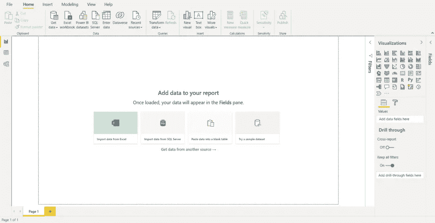
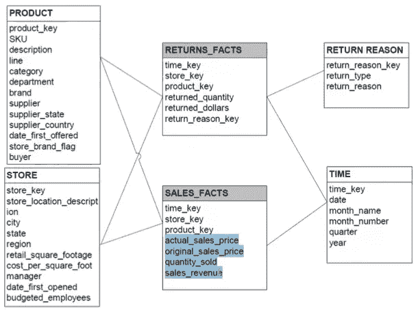
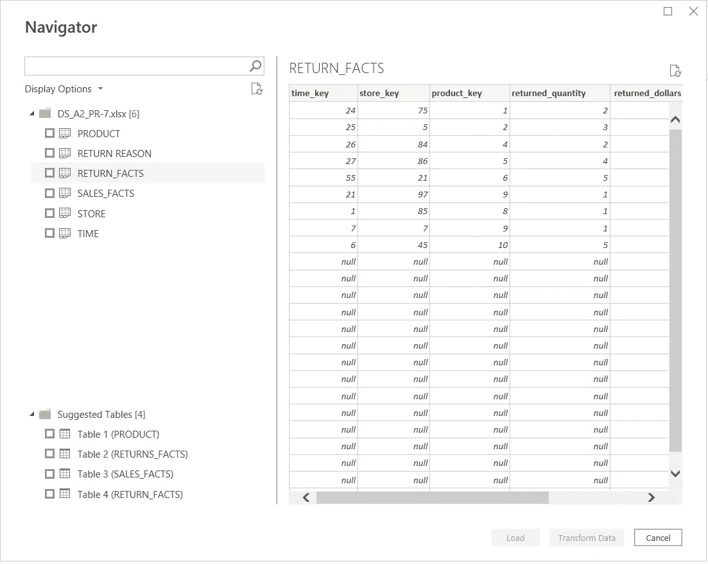
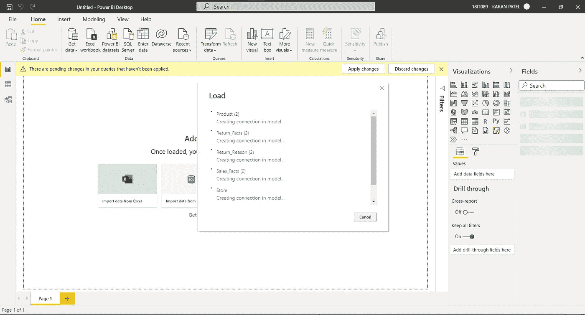
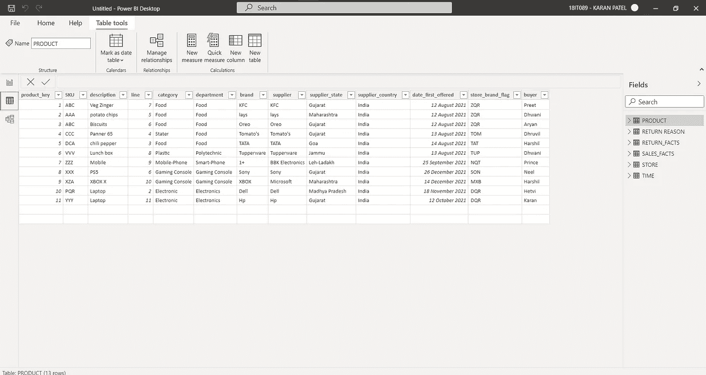
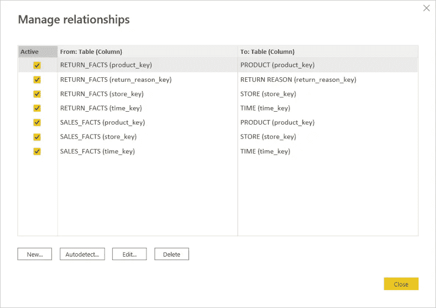
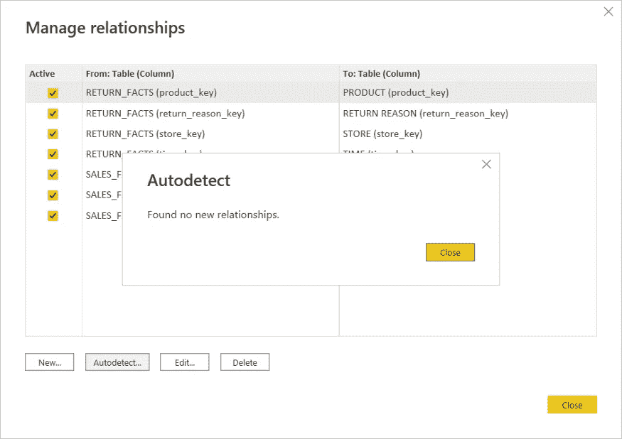
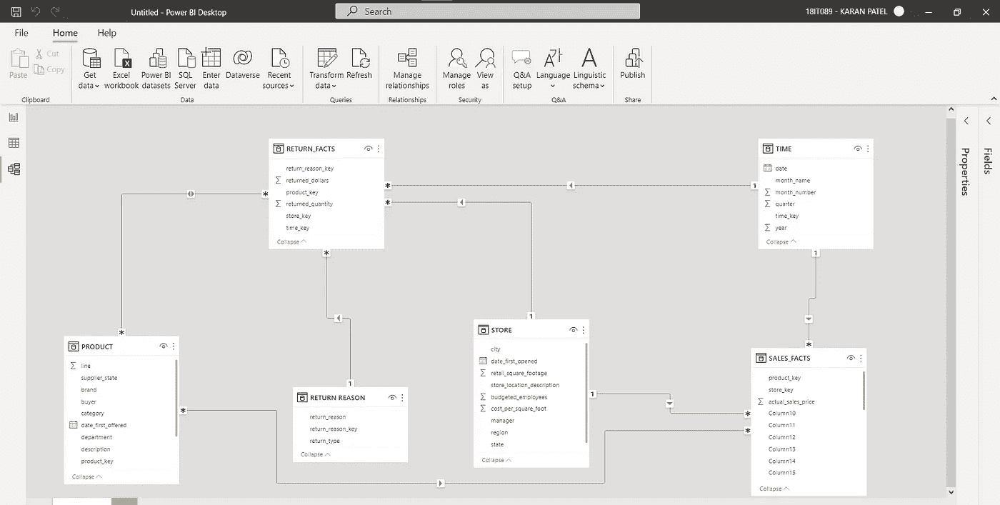

# 数据科学系列|使用 PowerBI 建模数据

> 原文：<https://medium.com/geekculture/getting-started-with-powerbi-modeling-the-data-63d62e979ddc?source=collection_archive---------19----------------------->

## 了解如何使用 Power BI 分析和创建数据模型

## ***什么是权力 BI？***

P ower BI 是一个软件从你的数据集中创建&发布报告和数据故事。借助 Power BI，您可以制作高度互动、引人入胜且功能强大的报告、仪表盘或视觉效果。您可以连接到任何数据(Excel 文件、SQL 数据库、BI 仓库、云数据、API、网页等)，混搭数据，将一个表格与其他表格链接，创建*可点击的*可视化，然后通过 Power BI 与您的受众安全地共享它们。

# **中的*可视化类型*中的**

以下是 Power BI 中的可视化类型:

1.面积图

2.折线图

3.条形图

4.柱形图

5.组合图表

6.饼图等

## ***电源毕主屏幕***

1.  **功能区** —显示与任务栏下方的报告和可视化相关联的常见任务。
2.  **字段窗格** —显示数据中可用于创建可视化效果的表格、文件夹和字段。
3.  **可视化窗格** —您可以在其中更改可视化、自定义颜色或轴、应用过滤器、拖动字段等。
4.  **过滤器窗格**——您可以在其中应用过滤器
5.  **报告视图或画布** —创建和排列可视化的地方。
6.  **报告、数据和模型视图** -您可以通过选择左栏中的图标在报告、数据和模型视图之间切换。
7.  **页面选项卡** —位于页面底部，此区域是您选择或添加报告页面的地方。

## ***我们将在字段*** 之间创建如下关系

Model Structure

## ***在 Power BI 中加载数据集***

选择导航器，现在选择。xlsx 文件，其中包含数据

DS_A2_PR-7.xlsx loaded

Dataset loading in the fields pane

打开字段选项卡浏览数据。

All the fields loaded.

单击相应的字段，打开所需的字段进行浏览。

现在，让我们管理字段之间的关系。从任务栏打开“管理关系”选项卡，将显示如下输出:

Relationships present in the dataset

Autodetecting relationships present in the dataset

一旦关系被维护，让我们生成模型。在 pages 选项卡中打开 model generate 选项，它将创建一个模型。

Model Generation

接下来，我们将在下一篇博客中看到仪表板的创建。