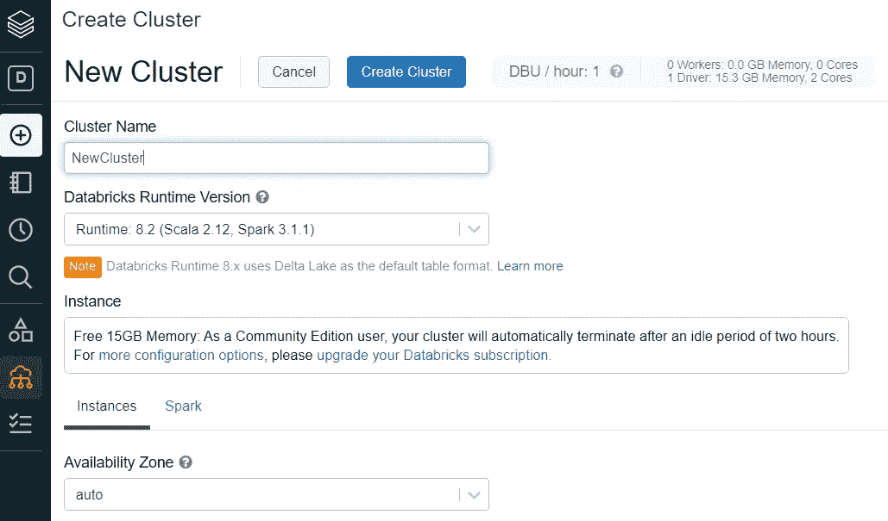

# 30 分钟后开始使用 PySpark。

> 原文：<https://medium.com/geekculture/getting-started-with-pyspark-in-30-minutes-fc9771ab8401?source=collection_archive---------27----------------------->

30 分钟学会 PySpark 基础！

**第 1-5 分钟:在 Databricks community edition 上创建一个帐户。**

【https://community.cloud.databricks.com/login.html】这里是链接:

在运行笔记本之前，您必须启动一个群集(下面选中的红色图标);见下面截图。

