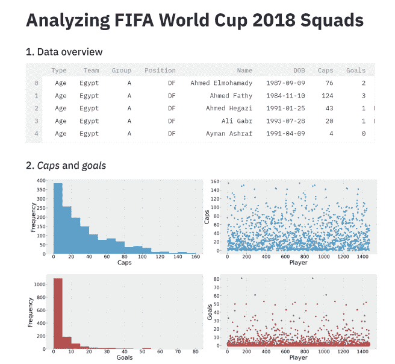
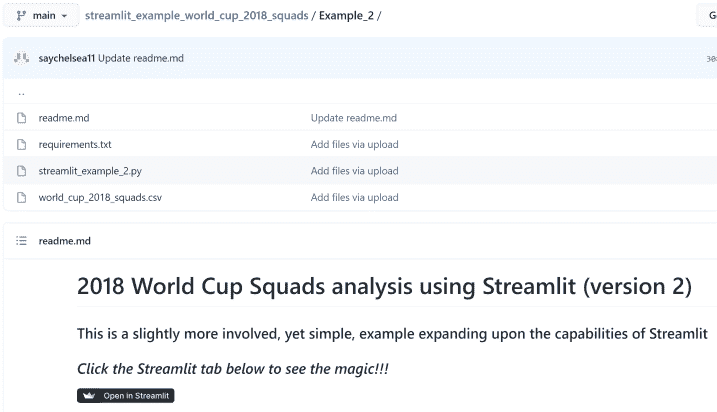
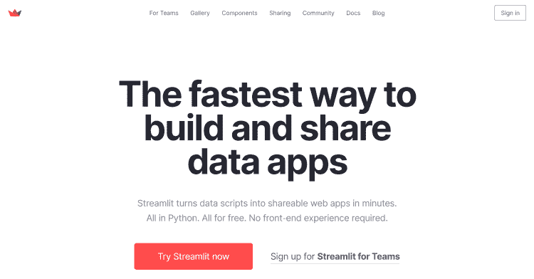
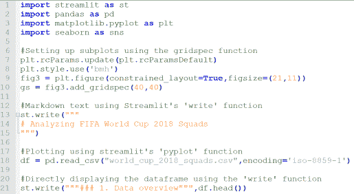
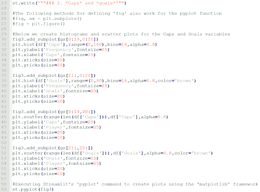
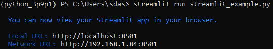
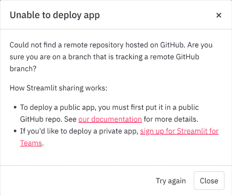
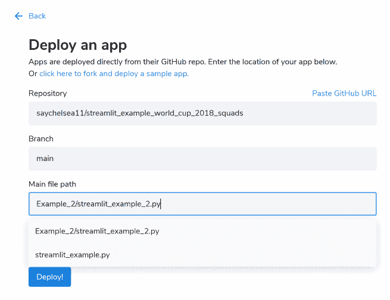

# 通过一个简单的例子开始使用 Python 强大的 Streamlit 框架

> 原文：<https://medium.com/geekculture/getting-started-with-pythons-powerful-streamlit-framework-with-a-simple-example-ed11d8af770f?source=collection_archive---------5----------------------->

Streamlit 是我最近遇到的最强大和包装良好的 Python 库之一。我最初是通过 LinkedIn 上的一个帖子偶然发现这个软件的，或者说是一个*框架*,因为它的创造者喜欢这样称呼它，我立刻被它所提供的东西吸引住了。

它被描述为一个将可视化和仪表盘作为应用程序部署的[框架，主要面向数据科学和机器学习的用例。然而，它不仅仅是一个简单的 Python 库；这是一个完整的生态系统，它包含了其他库并提供了大量的功能。因此，创造者称之为框架是准确的。](https://streamlit.io/)

有一段时间，我**在寻找一种方法，通过一个任何人都可以在浏览器上轻松查看的应用程序来部署一些分析或仪表板**。Streamlit 为此提供了完美的解决方案！

下面是应用程序完全部署时的一瞥，使用了我对 2018 年 FIFA 世界杯球队数据集进行的一些分析。我将在后面更详细地介绍这个例子。

要访问该应用程序，您可以使用此[链接](https://share.streamlit.io/saychelsea11/streamlit_example_world_cup_2018_squads/main/Example_2/streamlit_example_2.py)或前往我的 [Github 资源库](https://github.com/saychelsea11/streamlit_example_world_cup_2018_squads/tree/main/Example_2)，并点击描述中的黑色*“在 Streamlit 中打开”*按钮(如下所示)以获得更酷的体验。

我喜欢把 Streamlit 想象成更像一个 [*Jupyter 笔记本*](https://jupyter.org/) 或者一个[*Anaconda*](https://www.anaconda.com/)*而不是一个 [*熊猫*](https://pandas.pydata.org/) ，如果这说得通的话。它提供了一个与 Python 兼容的完整的软件生态系统。网站上的文档结构良好，为其作为应用程序的实施和部署以及与 Python 环境的无缝集成提供了分步指南。*

**

*下面，我描述了成功部署 Streamlit 应用程序所需的步骤，以及关于我对 2018 年世界杯球队的分析的细节。让我们开始吧！*

# *Python 脚本*

*创建 Streamlit 应用程序的第一步是创建执行特定任务的 Python 脚本。在这种情况下，我研究了 2018 年世界杯数据集，并使用 Streamlit 函数创建了一些可视化和 markdown 文本。*

*类似于在 Python 中安装大多数包，可以使用***pip install Streamlit***命令简单地安装 Streamlit。用于分析的脚本可以在上面链接的 Github 存储库中找到，还有数据集和 *requirements.txt* 文件，其中包含支持脚本中的分析所需的库。*

*该分析分为三个主要部分:*

1.  **显示数据集的片段**
2.  **使用支线剧情分析上限和目标变量**
3.  **使用条形图分析位置变量**

*我们将重点关注两个具体的 Streamlit 函数:*

*   ****写*** *:* 用来创建降价文本*
*   ****Pyplot*** :用于使用 matplotlib 框架生成图*

*第一部分的片段如下所示。我们来分析一下。*

**

*我们首先导入所有必需的库，然后设置一个方案。对于任何不熟悉 [*gridspec*](https://matplotlib.org/stable/api/_as_gen/matplotlib.gridspec.GridSpec.html) 函数的人来说，它是 matplotlib 库中用于定制支线剧情的有用工具部分。*

**第 13–15 行*显示了 Streamlit 函数的第一次使用。在这种情况下， *write* 函数用于创建 markdown 文本，最终会在最终的应用程序中显示出来。*第 21 行*包含另一个写函数，该函数包含一些降价文本和加载的数据帧的组合。在这种情况下，数据框的前五行将显示在应用程序中，这是该框架的一个很大的特点。*

*在脚本的第二部分，我使用 2×2 网格中的直方图和散点图可视化了*上限*和*目标*变量。同样，该部分的标题被写入第 23 行的*markdown 中。**

**

*在*第 21* 行，我们现在介绍了一个新的 Streamlit 函数 *pyplot* ，它支持 matplotlib 框架。例如，如果使用以下性质的命令在 matplotlib 中定义一个新图形，*

**fig 3 = PLT . figure()****或****

**fig 3 = PLT . figure(constrained _ layout = True，figsize=(21，11))**

*图形变量( *fig3* )可在 pyplot 函数中使用，以在 Streamlit 环境中生成图形。在代码的第 59 行*执行类似的命令。本节的其余部分主要由标准的 matplotlib 函数组成。第三和最后一部分再次利用 Streamlit 的 write 和 pyplot 函数创建更多的 markdown 文本和一个条形图，显示数据集中每个位置的频率。**

*为了使用 Streamlit 框架，脚本需要使用 ***streamlit run*** 命令运行，而不是 Anaconda 中常用的 *python* 命令。例如，我执行了以下命令来运行我的脚本，该脚本在 web 浏览器中打开了应用程序的预览:*

**

# *注册 Streamlit 共享和链接 Github 帐户*

*在预览页面上，点击页面右上角的**菜单按钮(3 条)**，选择**‘部署此应用’**。*

**

*这将打开一个窗口，提示您链接一个**公共 Github 库**。不过还有一个关键步骤从说明上看并不完全明显，那就是报名 [**Streamlit 分享**](https://streamlit.io/sharing) 。*

**

*点击上面窗口中的“我们的文档”将带您进入 Streamlit 网站，该网站提供了有关如何部署应用程序的进一步说明。但是，此时只有两个关键事项要做:*

1.  *将你的*代码*、*数据*和 *requirements.txt* 文件放在一个公共的 Github 存储库中*
2.  *注册 *Streamlit 分享*链接上面的 Github 库*

*注册 Streamlit 共享很简单。进入页面后(如下所示)，点击“请求邀请”,然后按照说明完成设置。需要的两个关键信息是 **Github 回购目录**和与回购相关的**电子邮件地址**。*

**

*一旦您收到确认您的帐户已设置的电子邮件，应用程序就可以部署了！*

# *部署应用程序*

*登录到您的 Streamlit 共享帐户，然后单击页面左上角的蓝色**“新建应用程序”**按钮。然后填写部署应用程序所需的信息。一旦你的 Github 账户链接到 Streamlit，这一步就相当直观了。*

**

*点击**‘部署！’**当你完成并简化后，它将使用 *requirements.txt* 文件中提到的库开始执行你的 Python 脚本。*

**

*注意，在这个初始部署过程中，安装所有必需的库需要一些时间。然而，一旦上线，重新运行应用程序只需几秒钟，每次有人访问该页面，应用程序都会自动重新运行。*

*请记住，如果应用程序在特定的天数内没有活动，它将进入睡眠状态。Streamlit 将发送一封电子邮件，通知您该应用程序将在几天前进入睡眠状态。为了使它保持活动状态，只需访问页面。该应用程序也可以从您的 Streamlit 帐户的仪表板重新启动。*

*这就对了。我希望这是有用的。如果您以前使用过 Streamlit，请在评论中告诉我，您发现该软件还有哪些有用的功能。我的最终目标是部署我使用 Streamlit 创建的财务跟踪仪表板，以便其他用户更容易访问它。留意那个！*

**原载于 2021 年 7 月 31 日*[*【http://thecraftofdata.com】*](http://thecraftofdata.com/2021/07/getting-started-with-the-powerful-streamlit-framework-in-python-with-a-simple-example)*。**