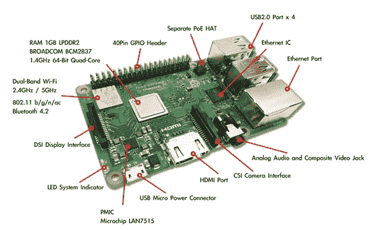
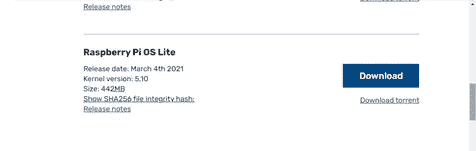
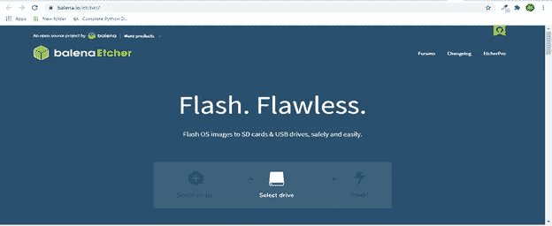
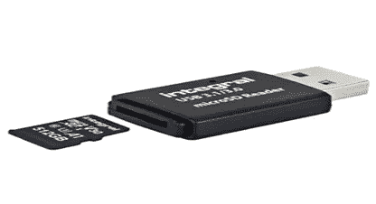
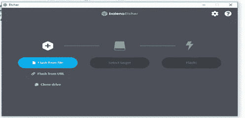
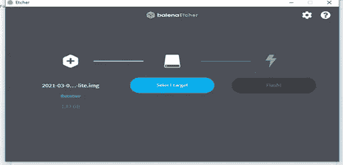
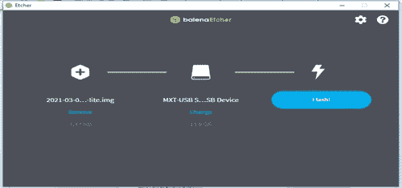
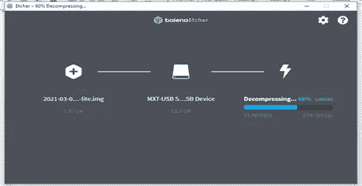
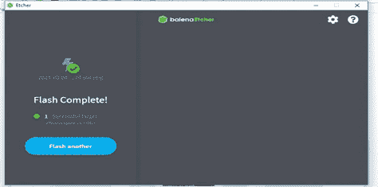

# 开始使用 Raspberry Pi 并安装 Raspberry Pi 操作系统

> 原文：<https://medium.com/geekculture/getting-started-with-raspberry-pi-and-installing-raspberry-pi-os-f20cbee4c008?source=collection_archive---------38----------------------->

在人生的某个阶段，你会想尝试一些新的东西。

> 那是在一个星期六的早上。我在互联网上做一些事情，然后我发现了一个小小的，卡片形状的电脑(Raspberry Pi)。我开始做研究。我看到了你可以用这台“小而强”的电脑完成的强大项目。接下来的一周，我得到了我的第一台“不贵”的电脑。

我的覆盆子 Pi 之旅就是这样开始的。可怕的😊

在本文中，您将了解如何在 Raspberry Pi 上安装 Raspberry Pi 操作系统。如果这是你的第一次，没必要担心。这将帮助你用树莓派开发令人惊叹的项目(DIY)。

什么是树莓派？

Raspberry Pi 是英国 Raspberry Pi 基金会开发的一系列单板计算机。它的开发是为了鼓励人们进入编程领域，并创造更容易获得计算教育的机会

Raspberry Pi 是一台运行 Linux 的小型廉价电脑。它提供内置组件，如 GPIO(通用输入和输出)引脚、HDMI 端口、以太网端口、音频端口、CSI 摄像头端口、MicroSD 插槽等。它允许用户连接他们的物理设备并创建有趣、实用的项目。

自 2012 年 Pi 1 Model B 发布以来，后续的改进导致了从 Pi 1 到 Pi 4 的许多代树莓 Pi，甚至是 2020 年 11 月发布的 Pi 400。

好吧。让我们开始做树莓派吧

所需硬件:

1.树莓 Pi 3 型号 B+

2.读卡机

3.MicroSD 卡 16G

4.个人电脑

所需软件:

1.Raspberry Pi OS Lite(这是 Raspberry Pi 的操作系统，也称为 Raspbian OS)

2.蚀刻机(这将有助于刷新 SD 卡上的 Raspbian 图像)

**第一步**

启动你的浏览器，下载[**Raspbian OS**](https://www.raspberrypi.org/software/operating-systems/)**Lite**

Raspbian OS

**第二步**

在你的电脑上下载并安装 [**蚀刻机**](https://www.balena.io/etcher/)

Etcher for Flashing

**第三步**

将 MicroSD 卡插入读卡器。然后，将读卡器插入电脑的相应端口。

A Card Reader and MicroSD Card

二。启动 Etcher 将 Raspbian 操作系统映像刷新到 SD 卡中

interface for Etcher

三。选择 Raspbian 操作系统映像

四。点击选择目标以选择 MicroSD 卡

动词 （verb 的缩写）点击 Flash 按钮，将图像写入 SD 卡

不及物动词等待所有过程完成，并显示“闪存完成”

最后，从 PC 端口上取下读卡器，并将 MicroSD 卡从读卡器上取下。然后，将 MicroSD 卡插入 Raspberry Pi SD 卡插槽。

a Raspberry Pi 3 B+ with an inserted MicroSD Card

**结论**

为了更好的理解，我尽可能地把它分解开来。我记得当我开始时，我花了一整天的时间来安装 Raspbian OS，但有了这些步骤，你就可以开始了。

现在您已经将 Raspbian OS 安装到了 Raspberry Pi 中，您可以开始开发项目了。在我的下一篇文章中，我们将创建我们的第一个项目“ [**如何使用树莓派**](https://elijahmaria04.medium.com/how-to-blink-led-using-raspberry-pi-8351b06348d7) 闪烁 Led”