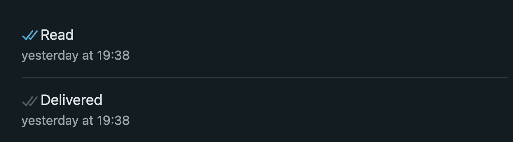
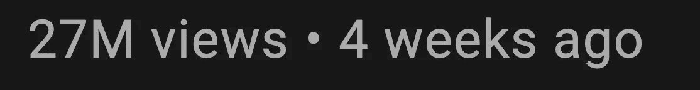
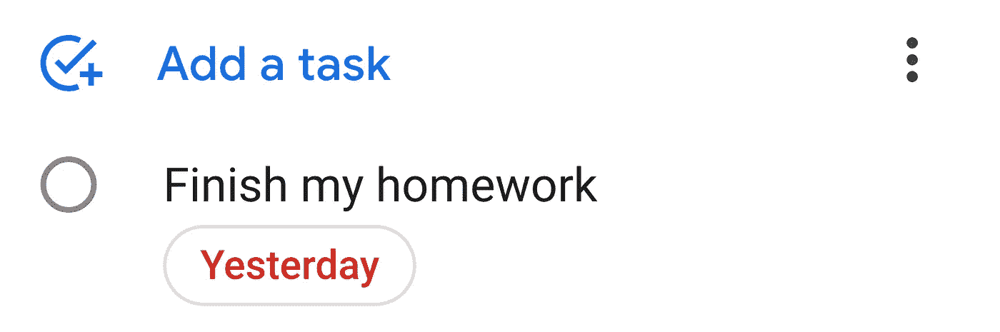
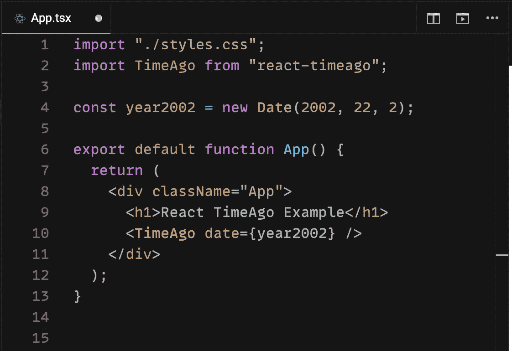

# React TimeAgo 入门

> 原文：<https://medium.com/geekculture/getting-started-with-react-timeago-f9bb639aa432?source=collection_archive---------18----------------------->

## 当您需要在 React 应用程序中显示过去的相对时间时。

Photo by [Sonja Langford](https://unsplash.com/@sonjalangford?utm_source=medium&utm_medium=referral) on [Unsplash](https://unsplash.com?utm_source=medium&utm_medium=referral)

在网站上显示相对时间变得越来越流行，对终端用户来说也更方便。WhatsApp、YouTube、脸书、优步，以及可能你日常使用的大多数应用程序都以相对格式显示日期。

Relative time on WhatsApp

Relative time on YouTube

Relative time on Google

# 图书馆想解决什么问题？

显示过去的相对时间可能不像第一眼看上去那么容易。有多个边缘案例和多个问题需要回答。例如，一个月有多少天？多少天、几个月或几年前是 22。2.从现在到 2002 年？组件需要多久更新一次？如何格式化输出？

该图书馆试图解决所有这些问题，同时仍然是小规模的。

# 你如何使用图书馆？

您可以使用`npm install react-timeago`或`yarn add react-timeago`来安装该库。如果您正在使用 TypeScript，您可能需要通过安装`@types/react-timeago`依赖项来手动添加类型。

Simple code-snippet example

The result from the conde-snippet

TimeAgo 组件采用主属性`date`，它需要是您想要以相对格式显示的日期。通过提供其他的道具，你甚至可以改变文本显示的方式，你也可以修改组件更新的频率。

你可以在这个操场[https://codesandbox.io/s/brave-hellman-t42wo](https://codesandbox.io/s/brave-hellman-t42wo?file=/src/App.tsx)上试试，完整的文档可以在 [GitHub 库](https://github.com/nmn/react-timeago)上找到。

# 你应该什么时候使用这个库？

独自实现这种边缘情况逻辑可能很耗时，而且容易出错。如果您正在使用消息应用程序、跟踪应用程序或任何其他使用日期的应用程序，并且希望用户看到简单的相对日期，那么将该库安装到您的项目中可能是一个不错的选择。然而，有些用户可能更喜欢绝对日期而不是相对日期，但是如果你不确定他们的偏好，你可以同时显示两个日期，例如`14:38 (4 hours ago)`。

# 结论

React TimeAgo 正在以一种优雅的方式解决这个问题，正在接受测试，每周被下载超过 60，000 次，使该库变得可靠。