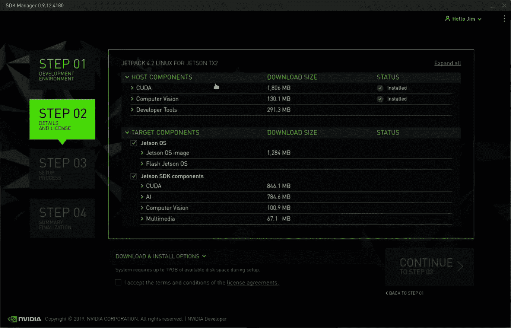
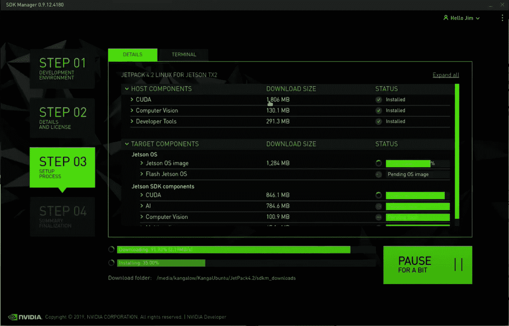
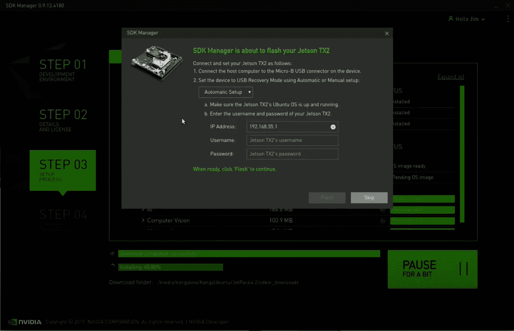
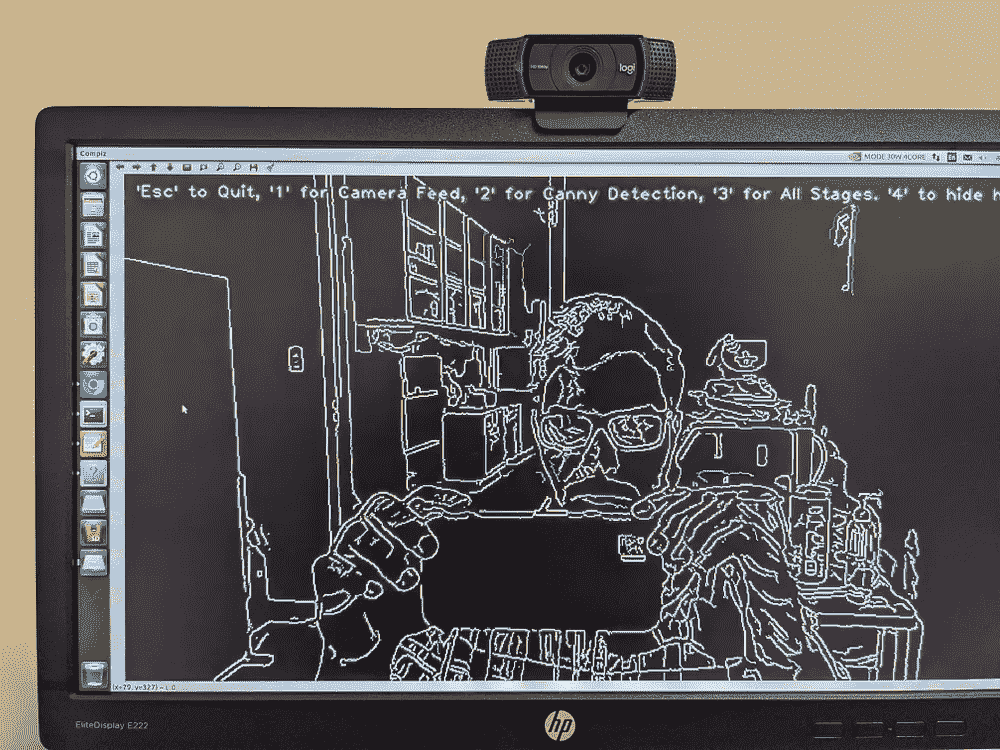
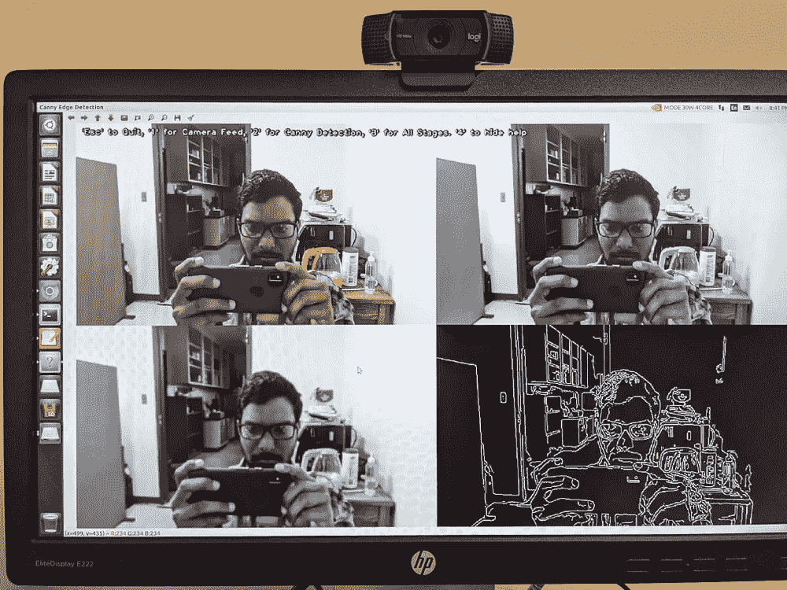

# Nvidia Jetson AGX Xavier 实时图像处理入门

> 原文：<https://medium.com/geekculture/getting-started-with-real-time-image-processing-on-nvidia-jetson-agx-xavier-9e2ba008b665?source=collection_archive---------13----------------------->

他的教程是为那些不熟悉使用 Jetson 平台的人准备的，特别是 T2 的 Nvidia AGX Xavier。Nvidia Jetson 平台是嵌入式系统(可以放在你的手掌上！)已知在动态环境中实时执行边缘计算(高吞吐量计算)。这种硬件的应用出现在农田农业中，其中包括某些实时应用，如作物侦察(Yang 等人，2020 年)、水果检测(Mazzia 等人，2016 年)、修剪应用(Mulhollem 等人，2020 年)等。随着这些系统在处理计算机视觉应用的大量数据方面变得越来越先进。因此，当我开始使用这个硬件时，我记下了一些要点(非常简单，可以让你开始使用),以使它对你来说更容易和更容易，而不需要花费几周甚至几个月的时间让系统运行起来！

新手用户可以学习设置系统的基础知识(在完全完成这篇博客之后)并进一步利用(通过在 python 上开发自己的脚本来执行高级图像处理！)这个模块在他们的研究领域中的力量。到目前为止，Nvidia 已经发布了这些模块的几个版本，它们的 RAM 大小不同，功耗也不同。从 Jetson Nano 到 Xavier，这些系统的性能随着您的花费而有所不同。目前可用的 3 种系列有:

1.  杰特森纳米系列
2.  杰特森 TX1/TX2
3.  Jetson Xavier 系列(NX/AGX)——*本博客涵盖该模块*

开始前的先决条件:

1.  你应该知道如何通过命令行操作基于 Linux 的系统
2.  了解 cv2 . capture(OpenCV 库)的工作原理
3.  简单的图像处理基础知识(过滤，阈值，等等！)

# 将它连接到显示器

我写这篇文章作为博客的一部分，因为当我第一次使用这个模块时，我不知道该做什么。我认为在这台机器上执行人工智能所需的工具和软件包(如 CUDA、cuDNN、TensorRT、OpenCV)已经安装好了。当您将此模块与显示器连接时，您可能会有同样的感觉。这里的一个建议是:**“不要试图使用任何转换器来连接模块和监视器。它只支持 HDMI 到 HDMI 的连接"**。如果您尝试使用任何转换器，比如说那些蓝色显示器到 HDMI 转换器，屏幕将不会显示任何内容。你第一次连接这个显示器时，它会打开 Ubuntu(基于 Linux 的操作系统，我的是 16.04)。

# 你需要一台安装了 Linux 的远程电脑

是的，你需要连接这个系统(通过 USB C 到 USB)来刷新它。这个闪存安装所有需要的软件包。简而言之，sdk manager 是一个 GUI，它可以帮助您安装(通过手动选择)执行基于计算机视觉的任务所需的所有软件包。您需要开始做的事情:

1.  模块(Nano，TX1/TX2/AGX/NX)
2.  连接到模块的监视器
3.  独立的键盘和鼠标
4.  以太网连接。以防万一如果你有 Wifi 芯片，请安装在 Xavier AGX 上启动无线连接，
5.  安装了 Linux 的远程电脑——你需要在你的模块和远程电脑上安装相同版本的 Ubuntu
6.  一套额外的键盘和鼠标
7.  键入 C to USB，将其从模块连接到远程 PC

# 使用 sdk 管理器用 Jetpack 刷新它

首先，在 Nvidia Developer([https://developer.nvidia.com/](https://developer.nvidia.com/))上创建一个帐户，并下载 sdk manager (*。deb)在远程 PC 的下载文件夹中。一旦完成，打开终端**和*光盘*到**下载。在此之后键入以下内容:步骤 01— - >

1.  sudo 易于安装。/SDK manager _[版本]。[内部版本号]。deb (你可以简单地复制粘贴你刚刚下载的文件名)
2.  安装后，键入， *sdkmanager。*用你的 ID 和密码登录(记得我之前让你做账号！)

3.您将看到一个如下所示的 GUI(图 1)。您可以选择您计划用于工作的任何目标硬件，并确保您的 sdk 管理器已经检测到有一台 Jetson 机器连接到您的远程 PC。如果您愿意，可以选择最新的 Linux Jetpack。继续执行步骤 02->

4.第二步是整个装置的核心。这是安装所有必需的包、库、工具(如 CUDA、TensorRT、cuDNN、计算机视觉和开发工具)的地方。如果你愿意，把它安装在你想要的目录/位置。

5.安装需要大约 1/2 小时到 40 分钟，取决于您的互联网速度。如果中途失败，再试一次。如果那也不起作用，试着从头开始一切。

6.一旦你看到这个屏幕(左)，输入你的用户名和密码，并闪烁它！一旦您的 Jetson 模块成功刷新，您的 Jetson 将重新启动，要求您再次输入您的用户名和密码。动手吧！完成这一步后，您就不需要远程电脑了。

# **下载 GithHub 库并安装 OpenCV**

杰特森·哈克斯([https://www.jetsonhacks.com/](https://www.jetsonhacks.com/))在这个平台上做了一些很酷的东西。如果你愿意的话，可以在他的 GitHub 页面([https://github.com/jetsonhacks](https://github.com/jetsonhacks))上迁移到他的知识库，探索更多。

由于我们更倾向于使用 OpenCV 进行实时应用，所以让我们从源代码安装 OpenCV，这样您就可以配置 GStreamer([https://gstreamer.freedesktop.org/](https://gstreamer.freedesktop.org/))支持，它支持用于实时应用的外部(可能是 USB 网络摄像头或 Raspberry Pi cam)摄像头。另外，Xavier AGX Jetson 板有不同的模式供您选择，如 10W、15W、30W 等。这些模式根据要求苛刻的任务提供不同的功率来执行高吞吐量应用。更多内容请看这个([https://www . jetsonhacks . com/2018/10/07/nvp model-NVIDIA-jetson-AgX-Xavier-developer-kit/](https://www.jetsonhacks.com/2018/10/07/nvpmodel-nvidia-jetson-agx-xavier-developer-kit/))。 ***cd*** 到你要安装所有 OpenCV 相关依赖项的文件夹。**确保驱动器中有足够的空间！跟着这些:**

1.  *$git 克隆*[*https://github.com/jetsonhacks/buildOpenCVXavier*](https://github.com/jetsonhacks/buildOpenCVXavier)*(我用这个是因为我用的是 AGX Xavier)*
2.  *切换到下载的存储库: *cd buildOpenCVXavier**
3.  *现在你会看到* *。sh* 文件，输入 *ls。*一旦确认，键入*、*、**、*、***、 *$。/buildAndPackageOpenCV.sh(构建大约需要 50 分钟或 1 小时)**
4.  *现在你会注意到 opencv 文件夹安装在你的驱动器中，迁移到同一个 opencv 文件夹中的 build 文件夹， *$cd..*—>*$ CD opencv*—>*$ CD build**
5.  *一旦进入，输入，*$ sudo apt-get install cmake-curses-GUI*。这将打开一个包/依赖项列表，供您根据需要进行手动配置。我不认为这是一个必要的步骤，但像往常一样，你可以随时探索！*

# *使用网络摄像头部署实时处理*

*我正在添加一些当我成功完成所有事情时点击的很酷的图片。*

****

*Figure. Canny Edge and 4-split screens with live camera feed, canny edge, Gaussian Filter*

1.  *现在一切都很简单了。迁移到克隆存储库 buildOpenCVXavier 中的**示例**文件夹。一旦进入，您将看到已经有一个为编写的程序(从存储库中克隆的！)你，叫做， ***cannyDetection.py* 。**这是一个简单的边缘检测算法。*
2.  *这很重要。如果你在 Jetson AGX Xavier 上工作，你需要对代码做一个非常微小的改变，使其通过 USB 摄像头传输。如果你打算使用 TX2/Nano，我认为没有必要改变。*
3.  *因此，打开代码，寻找这一行，*

****def open_camera_device(设备编号):****

****返回 cv2。VideoCapture(设备编号)，****

*将第二行中曲线括号**内的 ***device_number 修改为 0*** 。这会让 GStreamer 通过您的网络摄像头传输实时视频。完成后，保存并在终端中键入这些内容，***

**4。$ ./cannyDetection.py —视频设备 1。*你会看到这样的东西(上图，你坐在前面！)*

***您可以使用这些东西，创建自己的图像处理算法并进行部署。玩得开心！***

# ***参考文献***

*马齐亚，维托里奥&萨尔维蒂，弗朗切斯科&哈利克，阿莱姆&基亚伯格，马塞洛。(2020).使用具有硬件加速器的嵌入式系统的实时苹果检测系统:边缘人工智能应用。*

* [## 为自动化机器人苹果树修剪系统设计的新型切割装置

### 第一个机器人切割机构-或“末端执行器”-一个完全自动化，计算机化的修剪系统，为现代…

news.psu.edu](https://news.psu.edu/story/626728/2020/07/24/research/novel-cutting-mechanism-devised-automated-robotic-apple-tree) 

杨，明德&布宾，杰森&蔡，惠萍&曾，新宏&许，玉春&史都华，克里斯托弗。(2020).利用边缘计算和深度学习 EDANet 进行水稻倒伏评估的自适应自主无人机侦察。农业中的计算机和电子学。179.10.1016/j.compag

 [## 首页- JetsonHacks

### 今天在 GTC，NVIDIA 宣布新的 Jetson Nano 2GB 售价仅为 59 美元！看这里:背景回到 2019 年 3 月…

www.jetsonhacks.com](https://www.jetsonhacks.com/) 

[https://developer.nvidia.com/embedded/jetson-modules](https://developer.nvidia.com/embedded/jetson-modules)

**注:如有疑问，请联系我，**[**nitinprecisionag.com**](http://nitinprecisionag.com)**。我会尽力解决的！***