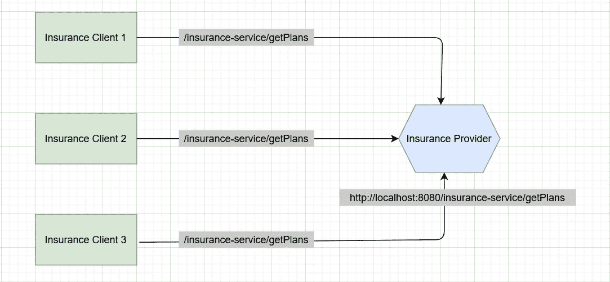
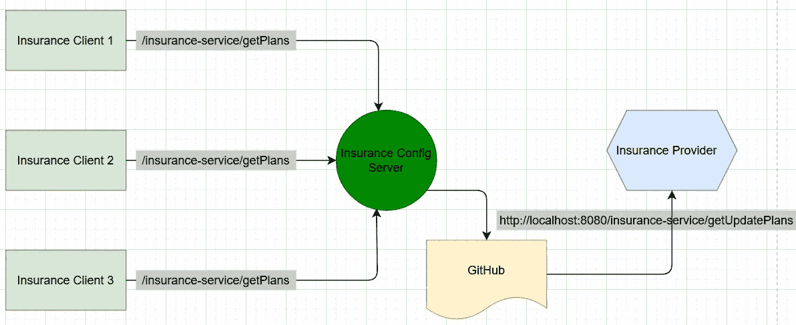
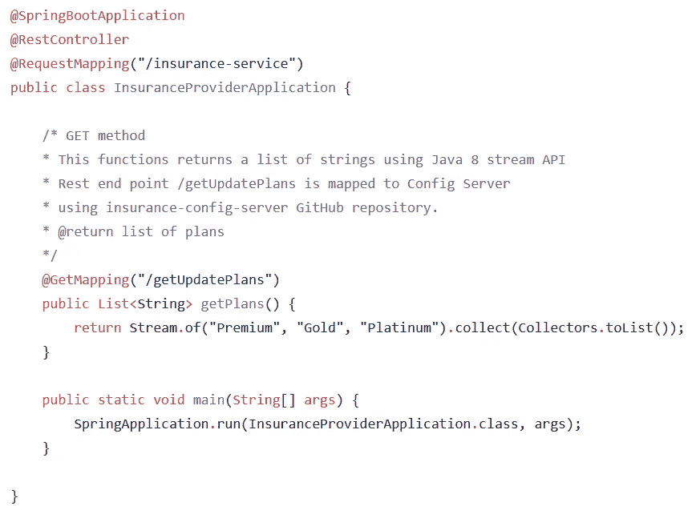
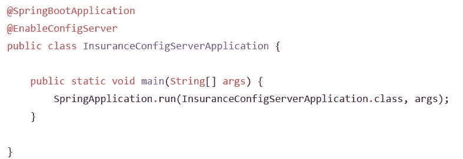
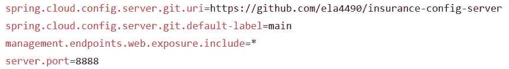
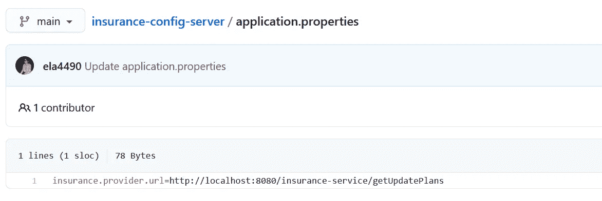
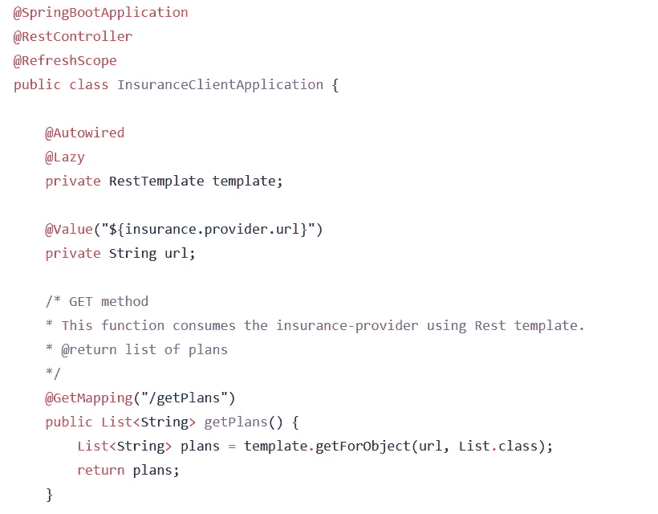
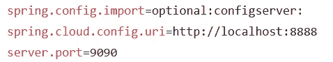
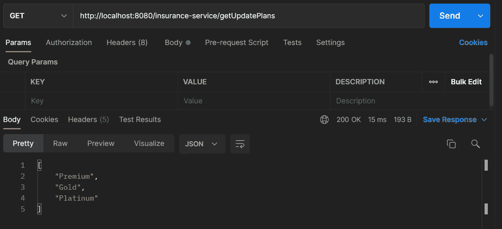

# Spring Cloud 配置入门

> 原文：<https://medium.com/geekculture/getting-started-with-spring-cloud-config-24b31977bc8?source=collection_archive---------16----------------------->

## 使用 Spring Cloud Config 无需重启和重新部署您的应用程序，如何反映与配置相关的更改

Photo by [Scott Webb](https://unsplash.com/@scottwebb?utm_source=medium&utm_medium=referral) on [Unsplash](https://unsplash.com?utm_source=medium&utm_medium=referral)

pring Cloud 为开发人员提供了工具来快速构建分布式系统中的一些常见模式。分布式系统的协调导致样板模式，使用 Spring Cloud 开发人员可以快速运行实现这些模式的服务和应用程序。它们可以在任何分布式环境中很好地工作，包括开发人员的笔记本电脑、裸机数据中心和托管平台，如 Cloud Foundry。

在本文中，我想讨论 Spring Cloud 配置。现在，让我们看一个没有 Spring Cloud 配置的简单用例。

Problem Statement

保险提供商是一个微服务，包含 rest 端点，即*/保险服务/获取计划*。还有许多微服务客户端，如保险客户端 1、保险客户端 2、保险客户端 3，它们正在访问保险提供商，如上所示。所有客户端都提供相同的端点来访问保险提供商。假设保险提供商后来将其 rest 端点从*/保险服务/获取计划*更改为*/保险服务/获取更新计划*。因为所有客户端都与保险提供商紧密耦合，所以它们也需要重写它们的端点，并将它们更改为 */getUpdatePlans* 。

因此，保险提供商的变化将直接影响从属客户。此外，如果客户端做了更改，那么他们需要重启并重新部署他们的服务器，这是一项庞大而繁琐的任务。因此，我们如何优化这一点，以及我们如何在保险提供商中全局声明端点，以便如果有任何更改，它们不会影响依赖的微服务。

因此，让我们来讨论什么是 Spring Cloud Config，以及我们如何使用 Spring Cloud Config 来解决上述问题。

## **什么是春云配置？**

Spring Cloud Config 为分布式系统中的外部化配置提供了服务器端和客户端支持。有了 config-server，我们就有了一个中央位置来管理所有环境中应用程序的外部属性。

Problem solved with Config Server

这里，保险提供者包含端点 */getAllPlans* 。所有客户端都通过配置服务器与保险提供商进行交互。这个配置服务器与 GitHub 存储库交互，存储库直接与保险提供商交互。因此，如果保险提供商更改了它的 URL，那么保险提供商只需要在 GitHub 存储库中更新这些 URL 更改，这样所有依赖的客户端都可以从配置服务器获得更改后的 URL。

现在，客户不必担心这些变化。在配置服务器的帮助下，客户不再像以前那样与保险提供商紧密耦合。他们现在是松散耦合的。现在，我们将开发保险提供商、保险配置服务器和保险客户端。为了降低复杂性并让您更好地理解，我们在这里将只开发一个保险客户端作为微服务。

> 注意:如果您愿意，那么您可以将所有三个客户端开发为微服务并测试解决方案。

让我们使用 Spring Initializr 和 Spring Web 以及 Spring Boot DevTools 依赖项来创建保险提供商。现在，在保险提供商应用程序中创建一个 rest 端点。

在 insurance-provider 中，创建一个 get 方法 getPlans()，该方法将返回计划列表，如下所述。保险提供商将在端口 8080 上运行。

InsuranceProviderApplication.java

现在，使用 Spring Initializr 和 Spring Web、Spring Boot 开发工具、Spring Boot 执行器和配置服务器依赖项创建 insurance-config-server。我们添加了 Spring Boot 执行器，因为端点会重定向，因为我们不是从保险客户端直接调用保险提供者。我们将调用配置服务器，配置服务器将调用 GitHub。因此，默认端点映射将由 Spring Boot 执行器完成。

InsuranceConfigServerApplication.java

在 application.properties 文件中，我们可以指向 GitHub URL 来获取链接。保险配置服务器应用程序将在端口 8888 上运行。

> 注意:您需要特别提供 git.default-label 作为 main，否则 config server 将无法找到存储库。Git 最近将其主分支名称从 master 更改为 main，但是在 Spring Cloud 配置中 git.default-label 仍然是 master。因此，除非您将 default-label 指定为 main，否则它将无法获取详细信息。

application.properties

我已经创建了一个新的 GitHub 存储库 insurance-config-server，并添加了包含 URL 的 application.properties 文件。

insurance-config-server GitHub repository

现在，使用 Spring Initializr 和 Spring Web、Spring Boot 开发工具以及配置客户端依赖项来创建一个保险客户端。

在 insurance-client 中，我们将使用 RestTemplate 消费保险提供者。从保险客户端，请求将被发送到保险配置服务器。在 insurance-config-server 中，application.properties 文件将获取密钥*$ { insurance . provider . URL }*。基于该密钥，它将找到被映射的适当的端点 URL。这将调用服务，然后我们将获得所需的响应。

InsuranceClientApplication.java

我们需要在 application.properties 中添加以下属性，这意味着保险客户端将与保险配置服务器进行交互。保险客户端将在端口 9090 上运行。

application.properties

让我们从保险配置服务器开始，然后是保险提供商，最后是保险客户。现在，您将看到在保险提供商的 URL 中所做的任何更改都将反映在保险客户中。

Postman

您可以在下面的 GitHub 中找到完整的项目:

 [## 主 ela4490 上的 spring-boot/spring-boot-cloud/spring-cloud-config/spring-boot

### 这个资料库探索了 Spring Boot 的各种特色。-spring-boot/spring-boot-cloud/spring-cloud-config at main…

github.com](https://github.com/ela4490/spring-boot/tree/main/spring-boot-cloud/spring-cloud-config)  [## GitHub-ela 4490/insurance-Config-server:配置服务器

### 配置服务器。在 GitHub 上创建一个帐户，为 ela 4490/insurance-config-server 开发做出贡献。

github.com](https://github.com/ela4490/insurance-config-server) 

这是一个非常简单的例子来理解 Spring Cloud 配置的细微差别。希望这能帮助任何想了解更多关于 Spring Cloud Config 的人。我只是想分享一下我在春云学习期间的经历。请随时查看或纠正本文中提到的细节，这将有助于我为其他开发者创造更有价值的内容。我将在未来创作更多关于 Spring Cloud 及其示例应用程序特性的文章。敬请关注。快乐学习！:)

参考:

 [## 春季云配置

### 这个快速入门使用 Spring Cloud Config Server 的服务器和客户机。首先，开始…

cloud.spring.io](https://cloud.spring.io/spring-cloud-config/reference/html/)