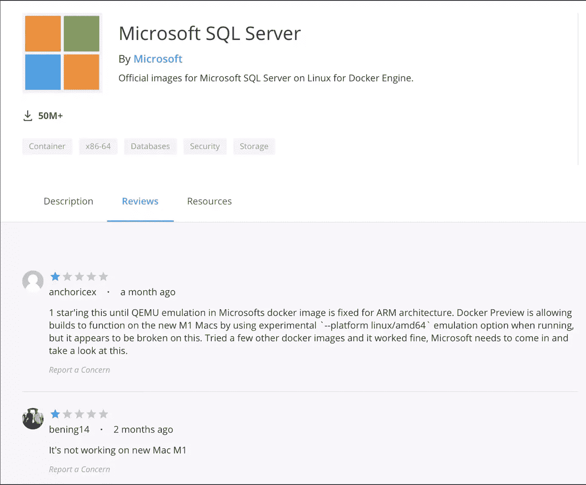
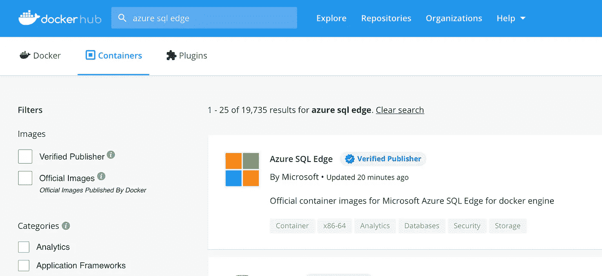
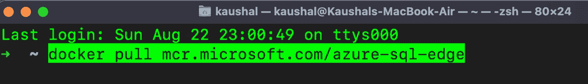
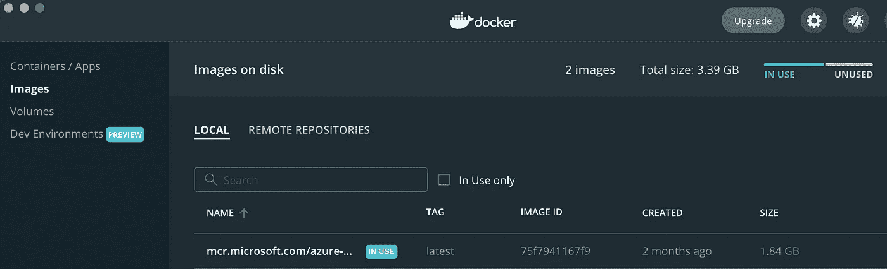
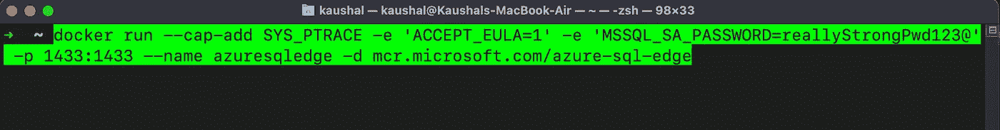
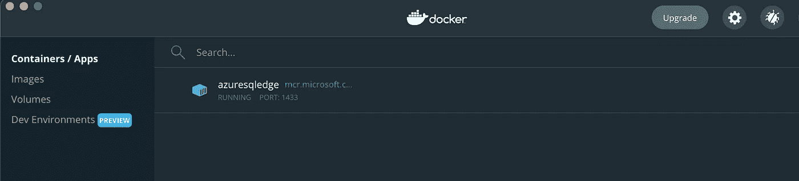
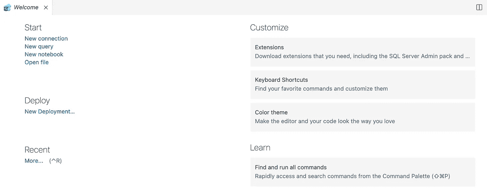
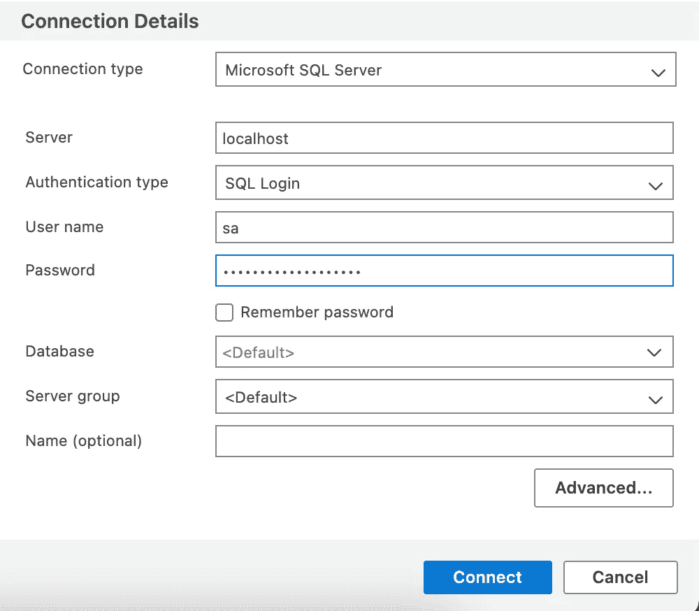

# 在 Mac M1 上开始使用 SQL Server

> 原文：<https://medium.com/geekculture/getting-started-with-sql-server-on-mac-m1-9da4641df2cf?source=collection_archive---------3----------------------->

M1 黑客促进发展

Photo by [AltumCode](https://unsplash.com/@altumcode?utm_source=medium&utm_medium=referral) on [Unsplash](https://unsplash.com?utm_source=medium&utm_medium=referral)

毫无疑问，新的苹果 M1 Mac 是革命性的设备，具有惊人的快速处理能力和强大的苹果硬件。但是随着所有这些超级可靠的特性和能力而来的是某些限制，因为新的 M1 处理器。许多软件仍然与此不兼容，其中一个非常有用的软件是 SQL Server。

经过几个小时的搜索，我发现了一些可以在 Mac M1 上运行的方法。

1.  **使用 Parallels Desktop**

您可以使用 Parallels Desktop M1 预览版在 ARM 上安装 Windows 10，然后在虚拟机中安装 SQL Server 的 Windows 版本。但是你们中的许多人可能不喜欢为此付费，并且正在寻找一些其他的解决方法。

**2。Microsoft SQL Server 的 Docker 映像。**

Photo by [Ian Taylor](https://unsplash.com/@carrier_lost?utm_source=medium&utm_medium=referral) on [Unsplash](https://unsplash.com?utm_source=medium&utm_medium=referral)

这里我们必须使用 Docker，它是一个提供操作系统级虚拟化的产品，因此可以作为容器提供软件或包。由于 M1 的 Docker 可以通过 QEMU 模拟 x86_64 Linux，所以我去 Docker Hub 搜索 SQL Server。但是对很多人来说，它在 M1 Mac 上仍然不起作用。所以，你可以试试你的运气，或者转到下面的解决方案。

3. **Azure SQL Edge**

非常感谢微软团队，为 SSMS (SQL Server Management Studio)提供了替代方案。这个工具就是 **Azure Data Studio** 。

要获得这个，你可以去[下载-azure-data-studio](https://docs.microsoft.com/en-us/sql/azure-data-studio/download-azure-data-studio?view=sql-server-ver15#macos-installation) 并下载安装程序。

下载完成后，下一步是从 docker 获取 Azure SQL Edge 的图像。为此，你需要去码头枢纽。

现在，如果您在 docker hub 上还没有帐户，您可以创建一个新的 ID，或者在[https://hub.docker.com](https://hub.docker.com/)上使用您现有的 ID 登录 Docker Hub。一旦你登录，搜索 **Azure SQL Edge** ，你会看到一个微软托管的 docker 镜像。

现在转到您的 Mac OS 终端，使用下面的命令下载这个映像。

**码头工人拉 mcr.microsoft.com/azure-sql-edge**

Command to pull docker image

下面你可以看到 Docker 桌面下载的图片。

下载映像后，可以使用它来启动 Azure SQL Edge 的实例，然后可以在任何本地主机端口上运行。

为此，您需要再次使用终端。使用以下命令运行此实例。

**docker run-cap-add SYS _ PTRACE-e ' ACCEPT _ EULA = 1 '-e ' MSSQL _ SA _ PASSWORD = reallystrong pwd 123 @ '-p 1433:1433-name SQL server-d mcr.microsoft.com/azure-sql-edge**

一旦命令成功，返回 Docker 桌面并点击容器选项。在那里，您会发现容器以我们在上面使用的相同名称运行。

现在启动 Azure Data Studio 并点击 New Connection 来设置 SQL 连接。

点击新建连接后，你会发现一个如下的窗口。输入如图所示的值。这里，密码将是您在终端上运行 docker pull 命令时给出的密码。

点击连接，瞧，:D
你已经准备好使用 sql 数据库了。

要创建新的数据库或表，您需要使用 SQL 命令，因为这些命令不提供与 SQL Server 相同的功能。

对此可以参考:[https://docs . Microsoft . com/en-us/SQL/azure-data-studio/quick start-SQL-server？view=sql-server-ver15](https://docs.microsoft.com/en-us/sql/azure-data-studio/quickstart-sql-server?view=sql-server-ver15)

非常感谢您花时间阅读这篇文章。这是我在这里的第一个帖子，所以请原谅我在写作中的任何错误。如果你发现这里有需要改进的地方，我很乐意看到你的评论。