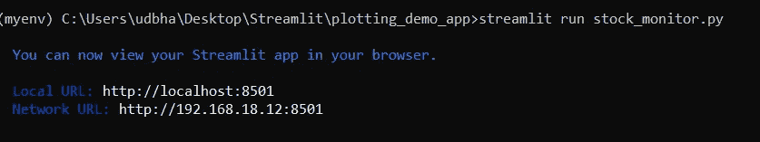
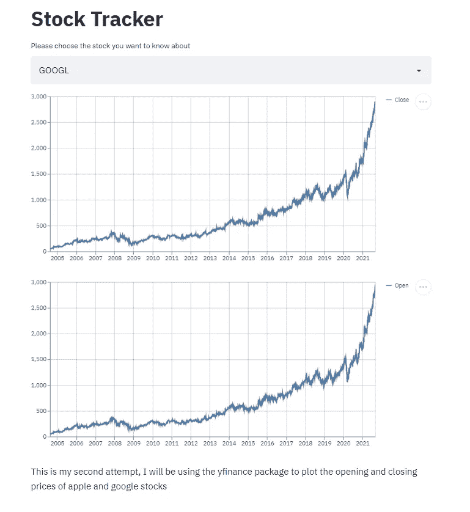

# Streamlit 入门

> 原文：<https://medium.com/geekculture/getting-started-with-streamlit-ed81eafcb298?source=collection_archive---------13----------------------->

使用 Streamlit 解释您的 EDA 和机器学习模型

Photo by [XPS](https://unsplash.com/@xps?utm_source=unsplash&utm_medium=referral&utm_content=creditCopyText) on [Unsplash](https://unsplash.com/?utm_source=unsplash&utm_medium=referral&utm_content=creditCopyText)

Streamlit 是一个 web 应用程序框架，它帮助我们构建和开发基于 Python 的 web 应用程序，这些应用程序可用于共享分析结果、构建复杂的交互体验以及阐释新的机器学习模型。
简而言之，将它视为所有机器学习任务的可交互界面，从提供商业案例概述，到 EDA，再到解释模型的学习和影响！

现在，我喜欢 Streamlit 的一点是，在框架上开发是一个快速、灵活和有趣的过程。您可以实时看到您的更改，调试您的代码，找到您需要的任何支持和指南！

数据科学通常被认为是现代梦寐以求的工作，并且极具挑战性！数据科学最具挑战性的方面之一被认为是能够解释你做了什么，你是如何做的，以及它能产生什么影响。这种非常重要的交流是艰难的，通常是因为两件事，复杂的系统很难解释，有时结果需要用更简单和精心制作的交互方式来解释，而不是你通常的 PowerPoint。

想想看，企业主问你，如果他们推出新的产品或在活动过程中改变某些东西，会有什么影响，并希望看到影响，那么一个静态的词或 PowerPoint 不能解决你的问题。这是可以接受用户输入的 web 应用程序工作得最好的地方。现在，当我们有了 Flask 或 Django，并且我们可以在 GCP 或 AWS 上部署整个解决方案时，为什么还要简化呢？这些选项都不太管用。许多都很慢，不接受用户输入，或者对于为数据科学如此基础的决策过程提供信息来说不是最佳选择。现在，这就是 Streamlit 的用武之地，这是一个旨在实现高速性能和交互的框架。

但是关于框架的讨论已经足够了，让我们使用它吧！我们将遵循一些简单的步骤，我将为我们将要制作的应用程序提供代码。

***安装流线型***

要运行任何 Streamlit 应用程序，您必须首先安装 Streamlit。我使用了一个名为 pip 的包管理器来完成这项工作，但是您可以使用您选择的任何包管理器(例如 brew)来安装它。

> pip 安装流程

***你的项目组织***

我认为学习一个新主题和创建多个项目/应用最重要的事情之一是确保你的代码有一个好的结构。我建议将你制作的所有应用程序和项目放在各自的文件夹中。

> mkdir streamlit _ apps
> CD streamlit _ apps
> mkdir plotting _ demo _ app

我们从导入整个程序中需要的所有依赖项开始。我们将使用的主要库是 Yfinance 和 Streamlit。Yfinance 将允许我们接收任何股票的历史股价，Streamlit 将允许我们将 web 应用程序部署到本地主机上。

现在我们已经设置了依赖项，我们终于可以开始构建我们的应用程序了！

首先，为了运行程序，请到您的终端键入命令

> *streamlit run stock _ monitor . py*。

用您选择从此程序创建的文件名替换 file_name.py。然后，一个 web 应用程序应该会在您的本地主机上打开！

现在在您的浏览器上打开本地主机，您可以看到输出！

我已经在上面的 GitHub Gist 中包含了这个程序的全部代码，正如你所看到的，请在你的终端尝试一下，这应该是一个简单的启动方式，请继续关注一些更具交互性的仪表盘！

可以关注我或者联系我在【udbhavpangotra@protonmail.com】T2
udbhavpangotra(Udbhav Pangotra)(github.com)Udbhav Pangotra | LinkedIn