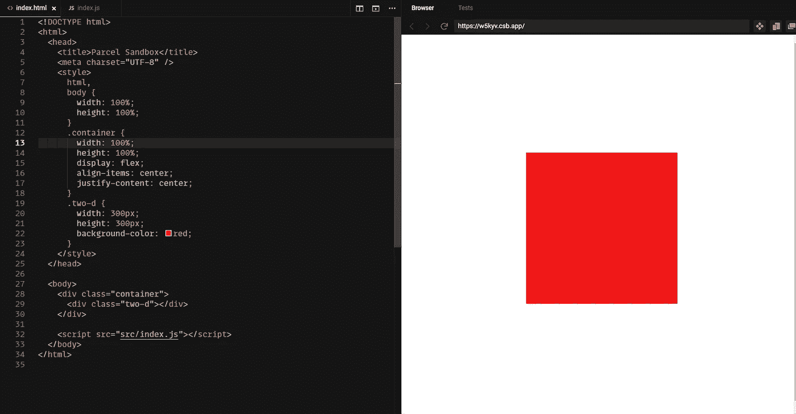
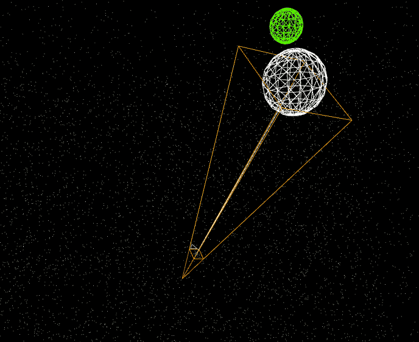
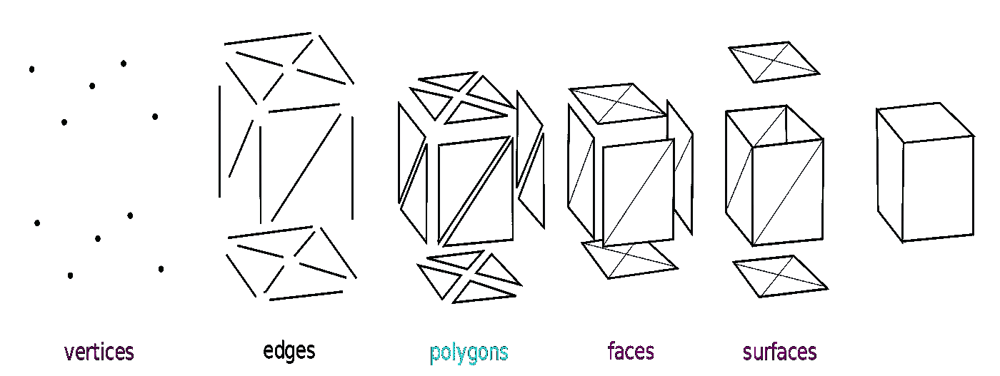
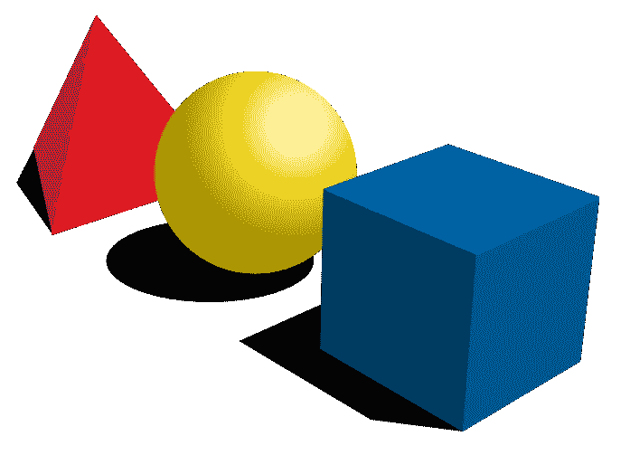
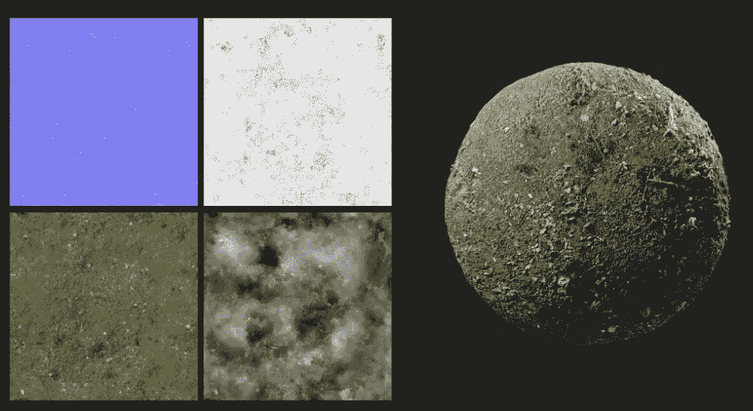
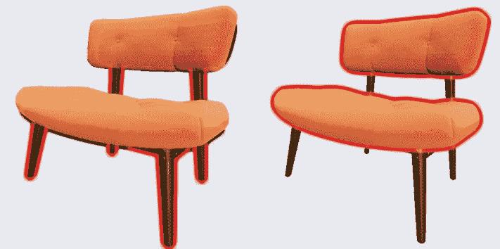
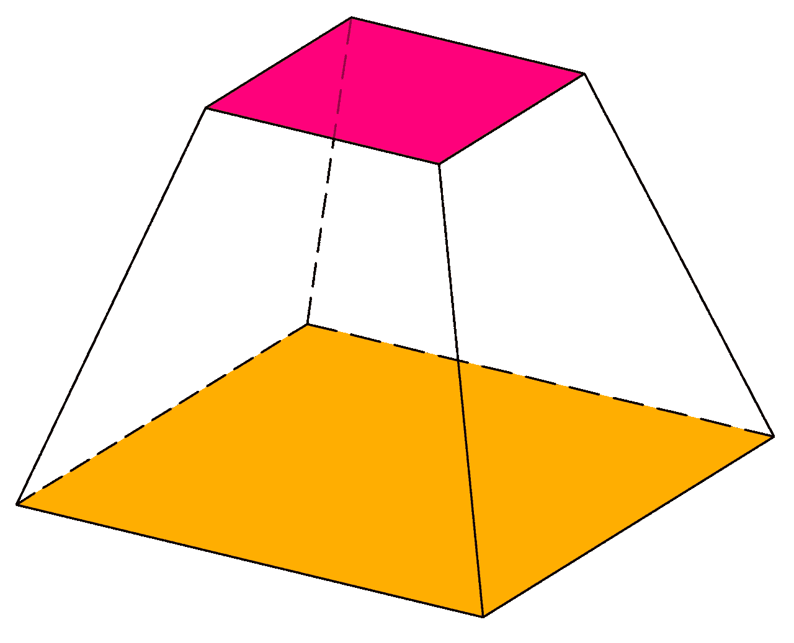
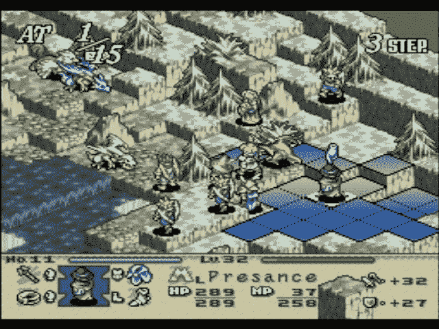
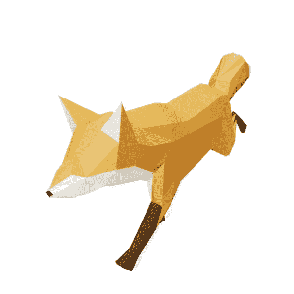

# Three.js 入门

> 原文：<https://medium.com/geekculture/getting-started-with-three-js-1c2d02e18330?source=collection_archive---------0----------------------->


在浏览器中渲染 3D 对象的能力为创建交互式体验开辟了许多令人兴奋的可能性。无论您是在寻找一种新的方式来展示您的电子商务网站上的产品，创建令人惊叹的登录页面，甚至是开发一个游戏。

由于直接处理 WebGL(用于在任何兼容的 web 浏览器中呈现交互式 2D 和 3D 图形的 JavaScript API)可能会很复杂，因此 three.js 等库提供了一种简化的方法来处理 3D 对象的呈现、动画制作和交互，同时在幕后完成所有繁重的工作。

话虽如此，对于以前从未接触过 3D 的开发人员来说，three.js 本身仍然有点令人不知所措。希望这篇文章能让您快速了解并提供必要的基础，即使您以后需要更高级的特性，也能对您有所帮助。

# 渲染一个简单的立方体需要什么？

一开始，web 开发人员使用 3D 可能会感到困惑，这是因为即使是渲染立方体这样简单的任务也需要一些 3D 专业知识。

例如，如果有人告诉你，web 开发人员，要呈现一个红色的框，我敢打赌你心里想的是“好的，我将创建一个 div，使用一些 CSS 来调整它的大小、位置和颜色”。很简单。



然而，在 3D 中做同样的事情需要你:
A .创建一个被称为“场景”的东西
B .定义一个立方体几何图形
C .创建一个材质并将其附加到立方体上(使其为红色)
D .创建一个相机
E .添加照明
F .告诉 three.js 渲染所有这些

A demo of that red cube in three.js

# 现场

在 three.js 中，一个场景就像一个容器，容纳了所有用于渲染 3D 图像的对象。想象一个剧院舞台，我们放置演员、布景和灯光的地方。以同样的方式，我们给场景分配 3D 物体和照明。

就像我们的剧院里可能有多个舞台布景，每个都在上演不同的戏剧一样，我们可以创建多个场景并在它们之间切换，或者同时呈现它们。



Origin: [https://threejs.org/examples/?q=camera#webgl_camera](https://threejs.org/examples/?q=camera#webgl_camera)

# 3D 几何图形

3D 几何图形基本上是一组“如何创建 3D 形状”的说明。它由面、边和顶点组成。



Source: [https://en.wikipedia.org/wiki/Polygon_mesh](https://en.wikipedia.org/wiki/Polygon_mesh)

幸运的是，three.js 为我们提供了一些内置的几何类，比如 BoxGeometry、SphereGeometry、CylinderGeometry 等等。

例如，要创建一个简单的盒子，我们需要做的就是提供宽度、高度和深度。我们不需要钻研定义所有面孔的复杂性[我们自己](https://github.com/mrdoob/three.js/blob/dev/src/geometries/BoxGeometry.js)。

three.js 中使用的尺寸单位表示米，所以 1 个单位= 1 米。

```
const geometry = new THREE.BoxGeometry(10, 10, 10);
```



Source: [https://en.wikipedia.org/wiki/Shape](https://en.wikipedia.org/wiki/Shape)

如果您对现有的几何图形不满意，或者需要创建自己的几何图形类，这是非常可能的。这里可以看到 three.js [提供的一些例子。](https://github.com/mrdoob/three.js/tree/dev/examples/jsm/geometries)

# 材料

想象你手里拿着两个立方体，一个是玻璃做的，另一个是混凝土做的。两者可能具有相同的形状，但是它们看起来不同，并且具有不同的物理属性，例如反射率、表面和不透明度。

在 3D 世界中，我们使用材质来定义 3D 对象的属性。

使用 three.js，我们可以使用内置的材质类(如 MeshMatcapMaterial 或 MeshLambertMaterial)创建自己的材质，每个材质都有自己的属性，或者使用 MaterialLoader 从外部加载材质。

```
// A basic material, just coloring our cube red
const material = new THREE.MeshStandardMaterial({ color: 0xff0000 });
```

纹理贴图也值得一提。这些是图像文件，可以用来定义更详细的材料，并使它们看起来真实。有许多类型的纹理贴图，比如定义颜色的“漫射贴图”，或者定义物体表面的“法线贴图”。典型地，多个纹理贴图被一起应用。[这篇很棒的文章](https://conceptartempire.com/texture-maps/)详细讲解了每一张纹理贴图。



Multiple texture maps are used to define the realistic texture of a ball of grass and soil

# 网状物

网格是代表模型一部分的对象。它包含一个几何体及其材质。3D 模型可以由多个网格构建。



Each highlighted part is a mesh. All meshes combined define the model.

```
const geometry = new THREE.BoxGeometry(10, 10, 10);const material = new THREE.MeshStandardMaterial({ color: 0xff0000 });const cube = new THREE.Mesh(geometry, material);
```

# 装载机

有时，我们希望从 3D 建模程序创建的现有文件中导入 3D 模型，而不是从头开始创建它们。为此，我们可以使用加载器，它是负责加载此类文件并将其转换为 three.js 对象的函数。

每种不同类型的 3D 文件都有不同的加载程序。例如，加载 GLTF 文件将如下所示:

您是否注意到 GLTFLoader 类不是直接从“三个”包中导入的，而是从一些神秘的“示例”文件夹中导入的？这是因为加载器不是核心 three.js 库的一部分，而是一个扩展。尽管名字有误导性(“示例”)，但该文件夹包含一些官方扩展，它们与基础包一起维护。

这个想法是，如果您对其中一个不满意，或者需要一些额外的特性，您可以简单地将这些文件复制到您的项目中，并在您认为合适的时候进行修改。当然，你也可以使用加载器或者其他开发者做的其他扩展。

# 照相机

相机就像是我们场景的一扇窗户。没有明确的摄像机，我们什么也看不见。在定义相机时，我们创建了一个所谓的“平截头体”，这是一个数学术语，指顶部被切掉的四边矩形金字塔。

```
const perspectiveCamera = new THREE.PerspectiveCamera(
  50, *// fov — Camera frustum vertical field of view.* width / height, *// aspect — Camera frustum aspect ratio.* 1, *// near — Camera frustum near plane.* 2000 *// far — Camera frustum far plane.* );
```



A frustum

three.js 中有多种类型的相机，但最有用的两种是透视相机和正交相机。

**透视相机—** 在这种模式下，深度感知被模拟，以反映人眼感知世界的方式。例如，如果一个立方体比另一个离我们更近，它就会显得更大。这可能是你最常用的相机。

**正交相机—** 有了正交相机，就没有了深度感知，所以无论物体放在场景的什么地方，看起来都是一样的大小。例如，这对于等距游戏很有用。



An isometric video game using an orthographic camera

# 照明设备

就像在现实生活中，没有灯光，我们的场景会变得漆黑一片。

Three.js 有多个内置光源，我们可以使用，甚至组合起来创造完美的环境。

值得注意的是，一些光类支持投射阴影，而一些不支持，这取决于它们的物理特性。例如，“动态光”是一种向特定方向发射的光。这种光的行为就好像它存在于无限远的地方，并且从它发出的光线都是平行的。一个常见的用例是模拟日光。因为是单向光，所以可以发出阴影。

另一方面，环境光是一种均匀地全局照亮场景中所有对象的光。由于场景中的每个点接收相同数量的光，环境光不能用于投射阴影。

定义灯光时，我们通常会提供颜色和强度。

```
const directionalLight = new THREE.DirectionalLight(0xffffff, 1);directionalLight.position.set(0, 2, 10);
```

灯光也可以来自外部来源，如 HDR 文件(HDR 是一个 360 度高动态范围的图像包裹在一个三维模型。)

# 阴影

投射阴影是一个非常昂贵的计算，所以在 three.js 中它是默认关闭的。为了支持它，我们需要:

A.打开渲染器的阴影支持(参见下一节关于什么是渲染器)。我们还需要提供一种类型的阴影贴图，每一种都提供了一点不同的效果和计算效率。详情见[此处](https://threejs.org/docs/#api/en/constants/Renderer)下的“阴影类型”。

```
renderer.shadowMap.enabled = true;
renderer.shadowMap.type = THREE.PCFSoftShadowMap;
```

B.告诉每个单独的网格它是否应该发射和/或接收阴影。

```
cube = new THREE.Mesh(geometry, material);cube.castShadow = true;
cube.receiveShadow = true;
```

C.允许光源投射阴影。我们还应该提供阴影贴图的大小和偏差，这会修改阴影的像素化。

```
const spotLight = new THREE.SpotLight(0xffffff, 1);*// make it cast shadows* spotLight.castShadow = true;
spotLight.shadow.mapSize.width = 1024;
spotLight.shadow.mapSize.height = 1024;
spotLight.shadow.bias = -0.0001;
```

# 渲染器

render 类用于将所有场景组件渲染到 canvas 元素中。这个很简单。

您需要使用`setSize`属性提供所需的画布大小，以及设备的像素密度。请注意，在画布的大小取决于页面大小的情况下，我们应该在调整窗口大小时更新渲染器和相机。

```
function onWindowResize() {
  camera.aspect = window.innerWidth / window.innerHeight;
  camera.updateProjectionMatrix(); renderer.setSize(window.innerWidth, window.innerHeight);
}
```

# 鼓舞

通常情况下，我们不会仅仅使用 three.js 来渲染一个静态的 3D 图像。我们希望用户与场景互动或创建动画。为了让 three.js 重新呈现画布，我们每次都需要调用`renderer.render(scene, camera);`。

但是，如果我们的变化很频繁，例如当我们给场景添加自动旋转效果时，我们可以简单地做这样的事情:

```
function animate() {
   // Schedual the next update
   requestAnimationFrame(animate); // Some other changes that should occur on animate
   // for instance, here we can rotate the cube a litle on every frame
   *cube.rotation.x += 0.01;
   cube.rotation.y += 0.01;*// re-render
   renderer.render(scene, camera);
}animate();
```

这也是支持加载的 3D 文件所必需的，这些文件带有自己的动画。



Animation loop from file

# 相机控制

相机控制是另一种类型的扩展，它为我们的场景增加了一层交互性，允许用户放大和缩小，旋转场景，甚至在其中导航。

让我们以一个更常见的相机控件为例:轨道控件，通过定义它们，用户可以旋转和缩放场景。

```
const orbitControls = new OrbitControls(camera, renderer.domElement);
```

动态观察控件有一些其他现成的功能，比如给场景添加自动旋转。

请注意，您必须将`orbitControls.update()`添加到您的动画函数中才能支持它。

# 鼠标事件

Three.js 本质上呈现了一个画布，因此，拾取鼠标事件比您可能习惯的要复杂。

那么，如果你需要跟踪点击或悬停在 3d 对象上，会发生什么呢？这就是雷卡斯特课程的目的。光线投射用于计算出鼠标正在与 3d 空间中的什么对象进行交互。

下面是一个如何拾取被点击对象的基本示例:

和一个演示，所以你可以看到它的运行:

这应该涵盖了所有的基础知识。希望 three.js 现在更有意义一点！

# 额外阅读

*   [https://discoverthreejs.com/](https://discoverthreejs.com/)——令人惊叹的免费在线 three.js 书籍和指南。一个很好的学习资源。
*   [https://threejs.org/examples](https://threejs.org/examples)——three . js 文档对初学者来说并不友好，但它确实值得使用示例部分来获得想法和了解更复杂的主题。