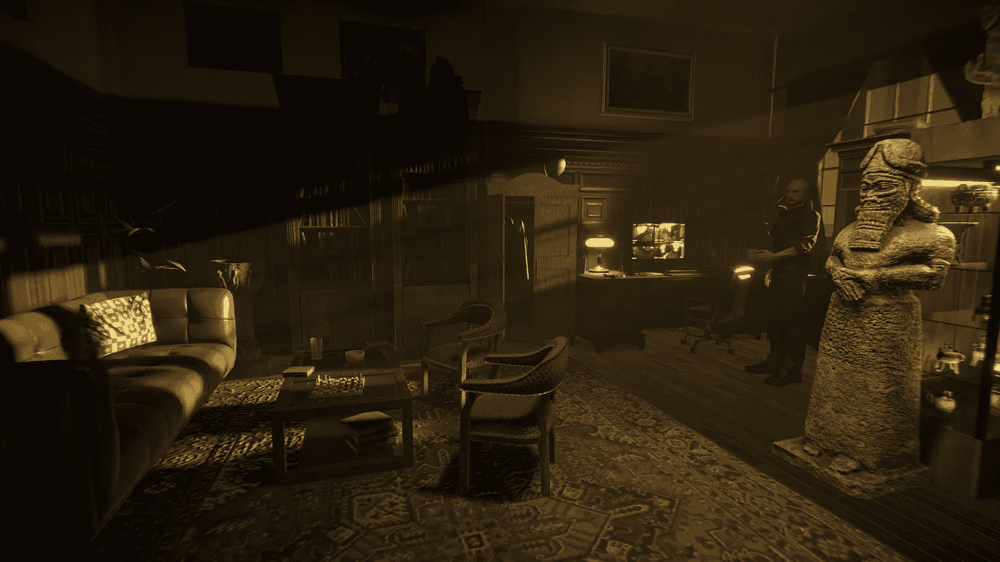

# Unity Recorder 入门

> 原文：<https://medium.com/geekculture/getting-started-with-unity-recorder-ccb26cf577e7?source=collection_archive---------8----------------------->

你有没有发现自己用外部资源拍摄 Unity 项目的截屏，得到的结果不尽如人意？让我们从 Unity 内部收集最好的截图、视频和 gif 来解决这个问题。

前往*包管理器*并搜索 *Unity 记录器*。您可能需要*启用预览包*，这取决于您的 Unity 版本。