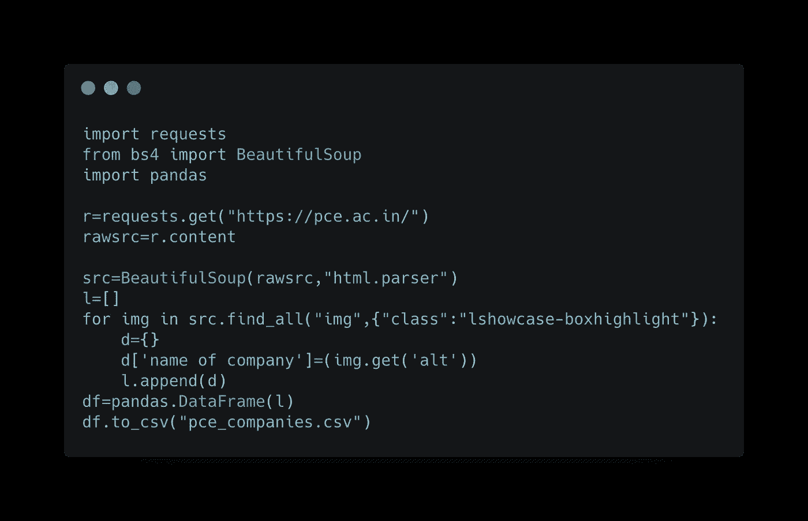
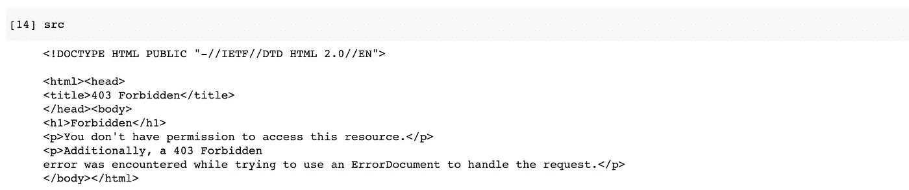
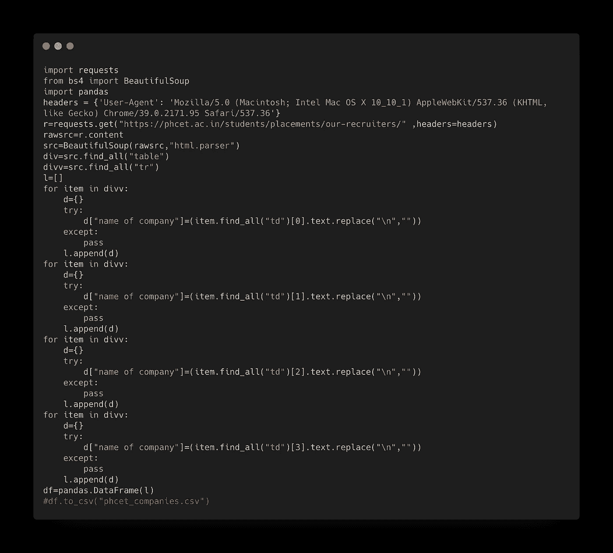
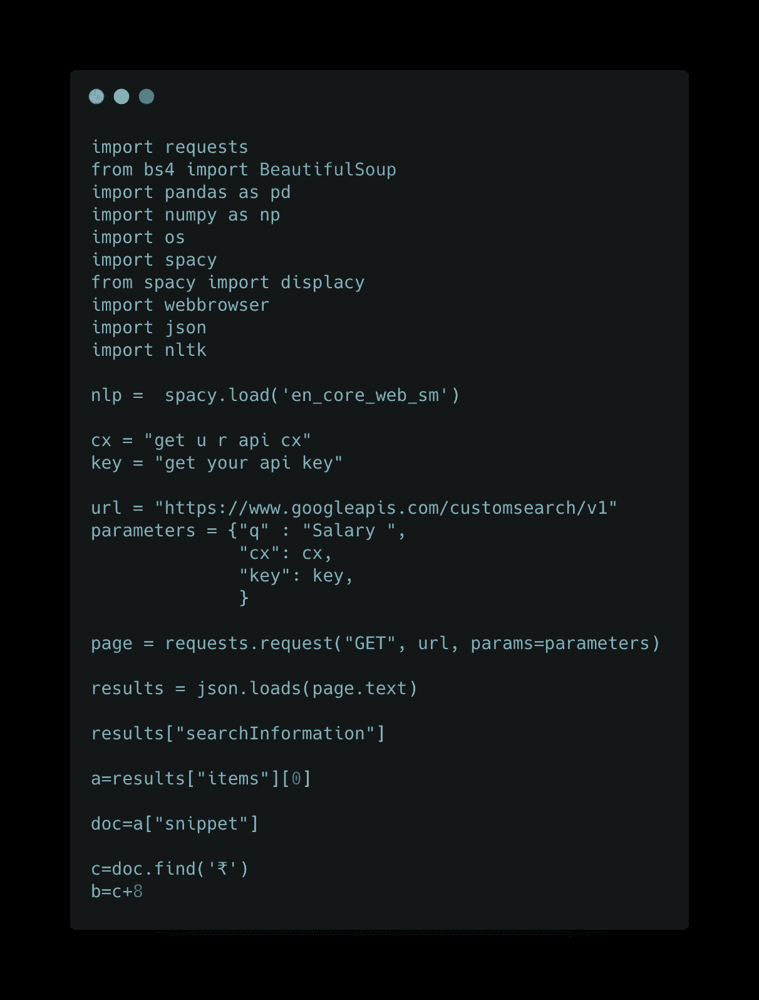
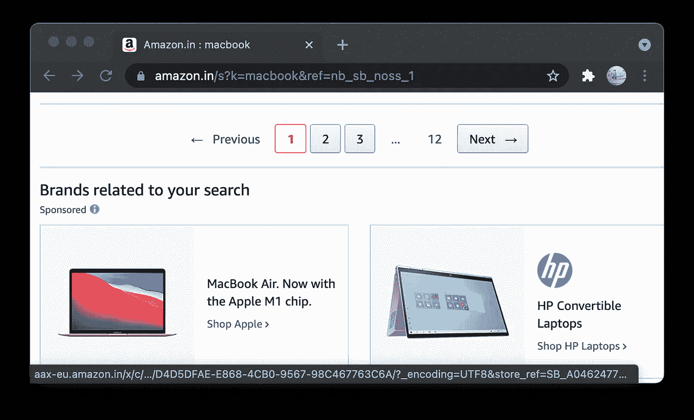
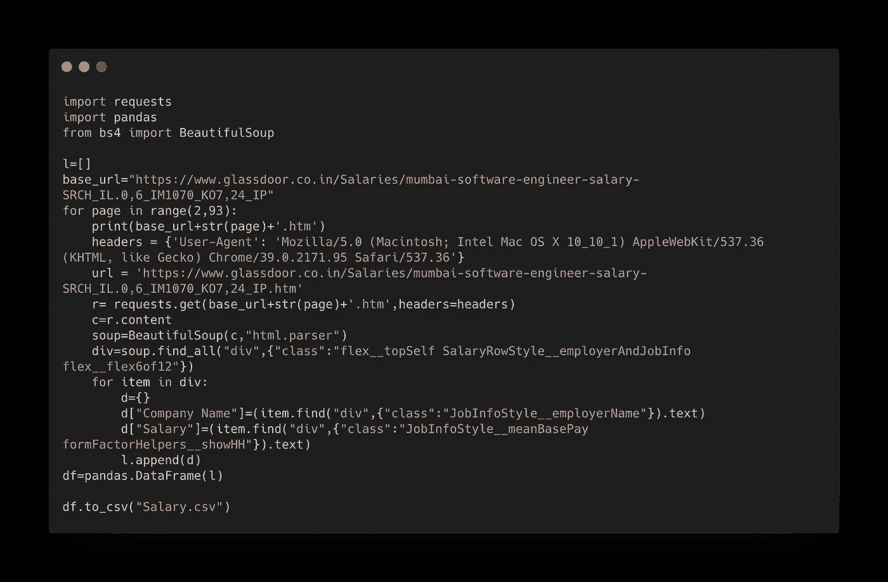

# 开始使用 web 抓取进行数据分析。

> 原文：<https://medium.com/geekculture/getting-started-with-web-scraping-for-data-analysis-fe55cc0b8d61?source=collection_archive---------10----------------------->


Image from undraw

> “不做数据集就成不了数据科学家”~ kaggle

如果您正在为数据分析或机器学习收集数据，那么您正在创建自己的数据集！恭喜🎉。如果你热爱这个数据科学和分析的世界，你会遇到需要创建自己的数据集的时刻，而网络抓取是你获取文本数据的*。所有的网站都会不断更新，因此网站结构可能会发生变化，导致代码可能无法工作，但策略的有效性仍将保持不变。*

****我给你总结一下****

*是的，我不会用从网上复制粘贴的方式来烦你们，但是我会简单介绍一下网络抓取，以及我们将在本文中讨论的内容。网页抓取是一种可以从实际网页中提取并保存数据的方法🤭。已经有很多资料来源，那么这篇文章有什么不同呢？你会问。你不仅会学到数据提取的基础知识，还会学到一些抽象概念，这些抽象概念会让你爱上数据提取的美妙之处，此外，我们还会讲述如何通过自动化和网络爬行来完成不完整的数据。我们的项目是提取地区*孟买*和*浦那*的大学分班数据，这是研究论文链接，如果你要实现它，我会推荐你浏览一下。*

*[https://www.irjet.net/archives/V8/i6/IRJET-V8I6216.pdf](https://www.irjet.net/archives/V8/i6/IRJET-V8I6216.pdf)*

****宝贝步骤****

*还有比蟒蛇🥺更漂亮的东西吗？帮助我们的是请求、美丽的海豚和熊猫*

*要求:将以代码的形式为我们获取网页的内容*

*beautifulSoup:将通过从 html 元素中遍历和获取文本数据来帮助我们提取数据，它可以是带有一些文本的*

*熊猫:它将为我们提供数据框架，它将为我们保存数据*

**

*Web scraping*

> *请注意，上面代码片段中的代码将无法工作，因为网站正在更新，您可以考虑下一个示例中的代码，但提取策略仍然可以使用*

*好了，我们直接进入棘手的部分😬但是我们有这个。既然你已经看到了代码片段，你们中的许多人应该已经认识到了这个结构，但是我仍然会详细解释它。初始化导入后，我们在*请求的帮助下获取网站的内容。get* 然后我们用 *BeautifulSoup* 解析内容。之后你应该查看你的源代码，如果你使用笔记本，只需运行带有 *src* 的代码单元，因为我们的源代码就存储在其中。*

*还记得抽象这个词吗？🤔在这里，如果你能看到我们正在提取的网页，它不包含文本，但图像。但是我们已经有了知道一切的消息来源😌虽然 Verbos 很大！亲提示✨只是做一个快速搜索的 cmd + F 和搜索你想为我提取的是一个公司的名称，我可以看到很多名字，我只是搜索其中一个，并找到了值的结构在“alt”描述符的 img 标签在 html 中。现在，我们希望提取所有公司的名称，我们使用 *find_all* ，因为 *< img >* 标签中的信息，我们已经将其指定为 img，并为其分配了类名，因为所有公司都有相同的类名。然后我们将它附加到 dataframe 中并导出 csv 文件。因此，即使有许多方法可以将数据以不同的结构呈现，您仍然可以提取它。*

*[](https://github.com/siddheshshivdikar/college-placement-scraping) [## siddheshvdikar/大学-安置-刮刮

### 孟买和浦那大学 50 +所大学数据的搜集与分析👨🏻‍🏫 …

github.com](https://github.com/siddheshshivdikar/college-placement-scraping) 

与上面的例子相似，你会发现我的 github repo 有很多变化，它包含了从表格、div 甚至动态出现的 html 片段中提取信息的变化。

**欺骗网站:不是机器人🤖**



Forbidden to access url

```
headers = {'User-Agent': 'Mozilla/5.0 (Macintosh; Intel Mac OS X 10_10_1) AppleWebKit/537.36 (KHTML, like Gecko) Chrome/39.0.2171.95 Safari/537.36'}url = 'enter_your_url'r= requests.get(base_url+str(page)+'.htm',headers=headers)
```

粘贴网站的网址，那容易吗？是的，但是有一个问题，一个网站可能会认为这个程序是一个机器人，并会否认发送页面源。这是一个非常简单的步骤来欺骗 web 源，它可能会拒绝你获取页面源，你猜对了，他们不想让你抓取数据。头考虑元信息，你的电脑可以欺骗这将允许你刮你的数据。为了进一步增强这一点，您甚至可以创建一个虚拟设备，并为其分配一个虚拟 mac 地址。在我们的场景中，我们仅仅通过简单的头球就晋级了。

**另一个:表格示例💁**



html table extraction

与上述提取方法类似，我们添加了标题以避免禁止访问，这里用于提取的策略称为*组件挖掘。*向下挖掘嵌套的 html 元素，直到找到可以循环提取的数据。进一步简化步骤 html 元素只是深入考虑它是一个地雷！

```
Layer1 | Layer2 | Layer3 | **Amethyst**
```

> 类似地

```
Src | Table | Tr | Td | **Data**
```

你们都可以自己尝试这段代码，它已经过更新，可以工作了，下面的代码片段也可以工作了，🧑🏻‍💻。

**自动化:将死♛**

这是自然语言处理和网页抓取的另一部分。正如你所看到的，我们已经从网上搜集了学院的名字，但是现在我们需要公司当年和本地区的工资。



Automated Natural Language Processing with web scraping

下面是自动化代码片段的一个简单想法，现在您可以使用 Google api 来生成自定义查询。我们需要我们的查询有点像这样“公司的薪金 ***公司名称******地区名称*** 年份 ***年份编号*** ”，因为我们已经提取了查询中粗体列名称的所有值。我们可以从 csv 加载数据帧，对于中的每一行，我们可以将值放在搜索查询中，此外，您可以在查询中包括新的角色。我们需要缺失的金额值，此外，我们知道 INR 以₹开始，所以只需找到货币符号，然后提取前面的数字条目，我们前面只使用了 7 位数字，因为我们已经研究了查询结果，就像一个迷人的✨.

**爬行是一种方式:网络爬行🕸**



Pagination with similar structure.

网页抓取简化！有些网页包含分页，分页就像你在 Amazon.com 上看到的，你在那里搜索一个产品，会有不同的结果，也有不同的页面。如果你注意到这些网页的结构是一样的，对吧。此外，如果你注意到链接保持不变，但只有一个数字的变化！

```
https://www.amazon.in/s?k=macbook&page=***2***&qid=1624594558&ref=sr_pg_***2***https://www.amazon.in/s?k=macbook&page=***3***&qid=1624594582&ref=sr_pg_***3***
```

如果你参考上面的链接，你可以看到页码是唯一更新的东西。为什么这对我们来说是一件大事，我们可以一页一页地提取页面？不，我们使用这种抓取技术来抓取相似的信息。

**让我们爬起来:拼起来😶‍🌫️**

我们拥有实现网络爬虫的一切关键因素。让我们抓取 glassdoor 作为参考，并提取工资和公司，以匹配我们以前获得的仅包含图像的大学数据集的缺失值。



web crawling

为了从一定数量的页面中抓取所有数据，我们需要知道页面的结束限制，这可以通过查看分页计数很容易地知道。我们将使用我们已经学到的知识，随着 url 中页码的变化，我们将使用字符串操作技术来生成我们的 url，正如您可以看到的，我们的循环将运行 92 次，每次迭代都会在 URL 中插入编号，如下所示。

```
r= requests.get(base_url+**str(page)**+'.htm',headers=headers)
```

获得 url 后，我们将收集必要的数据，这类似于我们已经讨论过的过程。我还是会把它摘录下来，这样你就能理解我在这里提到的那块。

```
c=r.content
    soup=BeautifulSoup(c,"html.parser")
    div=soup.find_all("div",{"class":"flex__topSelf SalaryRowStyle__employerAndJobInfo flex__flex6of12"})
    for item in div:
        d={}
        d["Company Name"]=(item.find("div",{"class":"JobInfoStyle__employerName"}).text)
        d["Salary"]=(item.find("div",{"class":"JobInfoStyle__meanBasePay formFactorHelpers__showHH"}).text)
        l.append(d)
df=pandas.DataFrame(l)
```

接下来，您可以简单地将其附加到您的数据帧中，并根据您的喜好导出为 csv 或 xlxs 格式。这使您可以自由地进行列匹配，以将那些不完整的值有效地填充到 80%的准确度。

**总结:结论🥳**

爱上数据科学和分析领域是如此容易，它让你研究各种有趣的主题，挖掘已经挖掘出来但尚未发现的成果。我和我的团队成员以及项目向导也成功地生成了数据集。我将链接下面的数据集，如果你喜欢这个数据集，请考虑投票支持这个数据集并分享这篇文章。我要感谢并提及我们的项目指南 [Sharvari Govilkar](https://medium.com/u/4b07afb4ea42?source=post_page-----fe55cc0b8d61--------------------------------) 为我们提供指导，激励我们选择一个未经研究的、区域性的、最重要的是对安置团队有所贡献和帮助的主题。我要感谢我们的团队成员 [Akhilesh Shinde](https://medium.com/u/ee1e9288d2e5?source=post_page-----fe55cc0b8d61--------------------------------) 、 [Aniket Shinde](https://medium.com/u/5480407f3523?source=post_page-----fe55cc0b8d61--------------------------------) 和 [Vivek Singh](https://medium.com/u/2ca651efa263?source=post_page-----fe55cc0b8d61--------------------------------) 对工作的贡献。这的确是一次难忘的经历。我将很快写一篇关于发布数据集的文章，直到那时，快乐编码每个人🦦.

## 你准备好下一部分了吗？动态刮擦来了🙃

[https://siddheshshivdikar . medium . com/dynamic-web-scrape-using-selenium-scrape-protected-websites-401 de 3497939](https://siddheshshivdikar.medium.com/dynamic-web-scraping-using-selenium-scrape-protected-websites-401de3497939)

[https://www.kaggle.com/siddheshshivdikar/college-placement](https://www.kaggle.com/siddheshshivdikar/college-placement)*