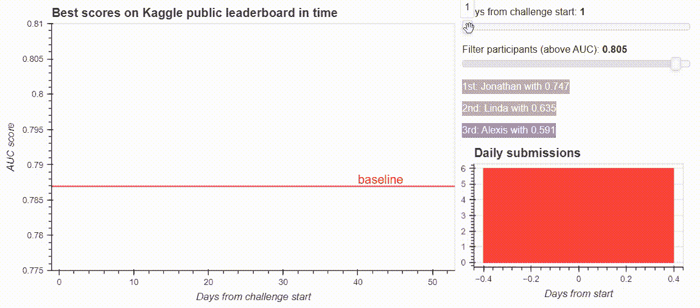
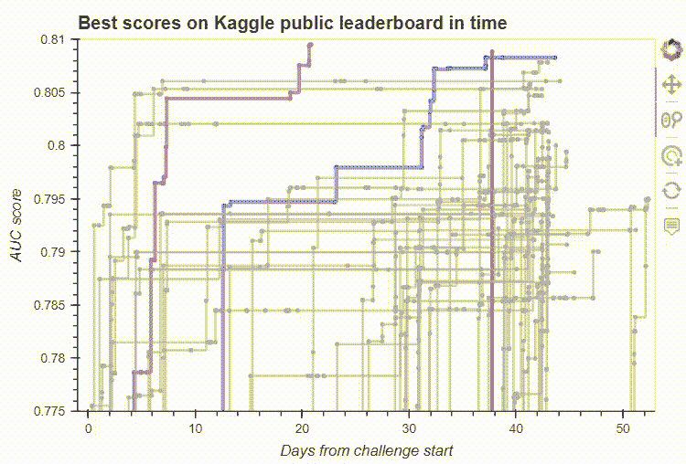

# 了解数据可视化工具:来自 Kaggle 挑战赛排行榜的散景仪表板

> 原文：<https://medium.com/geekculture/getting-to-know-data-visualization-tools-a-bokeh-dashboard-from-a-kaggle-challenge-leaderboard-d40bd9666d43?source=collection_archive---------40----------------------->

**史诗般的卡格尔之战挑战参与者提供的互动可视化技巧和诀窍**

如果你是一个数据爱好者，当你进入数据可视化工具的世界时，你可能会遇到 python 的散景库。散景提供了大量的交互性，同时人们仍然可以在他们熟悉的 python 环境中编码。在这篇文章中，我将通过我的最新项目展示 Bokeh 的基本工具:来自 Kaggle challenge 排行榜的仪表板。跟我来，这篇博文可能是对创建类似项目感兴趣的人的一个很好的参考，并且可以利用 Bokeh 的令人敬畏的交互式数据可视化工具。

The dashboard from the Kaggle challenge leaderboard. Image by the author.

# 动机

Kaggle 是一个平台，供数据科学家和学生测试他们的算法和知识，以解决各种挑战。作为布达佩斯技术经济大学数据科学课程的联合讲师，我很高兴看到我的学生在课堂 Kaggle 比赛中如何应对机器学习挑战。

> 由于我们的年度课堂挑战变成了一场有趣的战斗，我们对每天提交的数量和排行榜的动态如何随时间变化感兴趣。这给了我很大的动力从排行榜上制作一个交互式仪表盘。

Photo by [Jonathan Chng](https://unsplash.com/@jon_chng?utm_source=unsplash&utm_medium=referral&utm_content=creditCopyText) on [Unsplash](https://unsplash.com/s/photos/race?utm_source=unsplash&utm_medium=referral&utm_content=creditCopyText)

# 散景图书馆

在数据可视化工具中，有几个选项可供选择来创建仪表板。几个月前，我开始了解 Bokeh python 库，并为这个项目选择了它，因为它提供了一个很好的平台来创建交互式和可定制的可视化。很容易将从散景生成的图嵌入到网站，因为它可以生成 HTML 页面，也很容易创建散景应用程序。要想获得更多使用散景的动力，只需查看一下[演示仪表盘](https://demo.bokeh.org/)。

# 第一个诀窍是数据准备

Kaggle 允许挑战所有者下载所有提交的公开和私人分数。我编写了一个脚本，遍历下载的文件夹结构并将这些信息收集到一个 pandas dataframe 中(您可能需要不同的代码来应对不同的挑战，但是当然，我可以根据请求发布我的代码:)。您可以在[项目的 Github 资源库](https://github.com/norabalogh/kaggle-bokeh-dashboard)中找到本文中收集的数据和所有代码。

我们对每次提交都有以下信息:

*   *名字*:参与者的名字(我把实际名字改成了随机的名字)
*   *days_from_start* :提交内容上传的时间，从挑战开始算起
*   *auc:* 提交的公开 auc 分数

> 第一个技巧是我想如何可视化数据。我只想给一个参与者展示那些提交的内容，它们比之前的要好。

这可以通过按时间顺序对参与者的提交进行排序，并使用 pandas 的 cummax 来计算当时的最佳解决方案来完成。我将这个最好的分数存储在一个名为 *auc_max* 的新列中。

使提交可视化更容易的另一个技巧是创建一个颜色列。因此，我可以根据参与者的最高分数对他们进行分类，并对前三份提交的内容进行不同的着色。我们很快就会看到，我们可以用颜色列名轻松地设置散点图的填充颜色。

人们可以将 pandas 数据帧直接传递给 Bokeh 的可视化工具，但使用 Bokeh 自己的 ColumnDataSource 对象可以让我们访问更高级的选项，如可以在绘图和小部件之间共享数据。从我们的数据框架创建 ColumnDataSource 非常简单

# 排行榜可视化

现在我们有了每个人的历史最好成绩的数据框架，让我们深入 Bokeh 的可视化工具。首先，我们通过以下方式创建虚拟画布:

> 即使是简单的图形也有交互功能，这真是太棒了。通过定义图形的工具参数，我们将它们添加到我们的绘图中。例如，平移工具允许我们在绘图中移动图形，而 wheel_zoom 允许我们放大和缩小。

在我的排行榜上，我希望及时看到每个参与者的提交内容。这就是为什么我们的 x 轴将是 *days_from_start* 列，而 y 轴是 *auc_max* 分数。然后，用每一个新的有史以来最好的提交做一个散点图只是一行代码:

这里，绘图的源是我们转换成 ColumnDataSource 的 dataframe，我们在 x、y、legend_field 和 color 参数中引用这个对象的列。

下一个挑战是用线条连接代表提交的图表上的点。我想给每个参与者画一条线，让他们沿着这条线前进。为此，我需要 ColumnDataSource 对象的子集(按名称列)。这可以通过 Bokeh 的 CDSView 类来完成，在这里我们可以为每个参与者过滤数据集。当我有了子集，我用一个阶跃函数连接这些点。在下面的代码中，您可以看到我创建了一个 col_df 对象，其中包含了按最高分数排序的参与者。有了这个，我可以用不同的方式想象挑战的获胜者。

现在我们有了仪表板的核心，我们可以使用 Bokeh 的内置交互工具。当然，这让我们想要更多的交互性，所以让我们得到它。

Bokeh’s built-in interactive tools on our leaderboard visualisation. Image by the author.

# 使用悬停工具和小部件增加更多交互性

我想将鼠标悬停在散点图上，查看一些关于代表提交的点的信息。这就是 HoverTool 的确切用途，它只有两行代码:

我可以将工具提示的标签和值定义为(标签，值)元组的列表，其中以“@”开头的元素与 ColumnDataSource 中的列相关联。

我需要的下一件事是用一个交互式滑块删除点。我添加了两个滑块:一个用于我的 x 轴 days_from_start，以检查参与者的战斗如何发展，另一个用于根据他们的最佳分数过滤参与者。

最重要的一点是，每个滑块都有一个值，我们可以通过与滑块的交互来设置。因此，我们需要一个函数来更新我们的绘图，并过滤数据。对我来说，这个函数叫做 update_data。更多细节，可以查看 [Github 回购](https://github.com/norabalogh/kaggle-bokeh-dashboard)。我们需要的是告诉散景在与滑块交互时该做什么:

就是这样！我们一起完成了核心部分。我还在我的仪表板上添加了一个直方图，以便及时查看每日提交的数量。您也可以在源代码中找到它。设置应用程序现在很容易，因为你只需要在命令行运行一个`bokeh serve --show your_bokeh_script.py`，那里有你的散景脚本。

# 外卖食品

首先，我尝试在 for 循环中创建散点图，通过参与者的名字过滤数据，并为每个人创建不同颜色的点。我发现很有启发性的一点是，通过使用颜色列，并简单地将该列添加到 legend_field 参数中，也可以简单得多。

同样重要的是要注意，散景也有一个*线*功能，在点之间画一条线。不幸的是，它不能与 CDSView(数据的过滤子集)一起工作，所以在我处理了一段时间后，发现 *step* 函数是一种解脱，它可以完美地与数据子集一起工作。

我发现令人惊奇的是，你可以定制你的情节到最小的细节。我只展示了几个，比如如何让一个滑块显示 3 位数的数字，或者如何以不同的方式可视化挑战的获胜者。乍一看，管理 ColumnDataSource 对象并使用 CDSView 工具对其进行过滤可能有些棘手，但它们允许我们用更简单的代码绘制图形，并在不同的图形之间共享数据。

我希望这篇使用 Bokeh 的数据可视化工具的博文对你有所帮助。如果你有类似的项目需要解决，可以找我和我在 [dmlab](https://dmlab.hu/en/) 的同事，或者了解这个项目的更多细节，可以查看[其 GitHub repo](https://github.com/norabalogh/kaggle-bokeh-dashboard) 。欢迎任何进一步改进的想法！

## 参考

[1]散景 2.3.2 文档[https://docs.bokeh.org/en/latest/docs/user_guide/tools.html](https://docs.bokeh.org/en/latest/docs/user_guide.html)