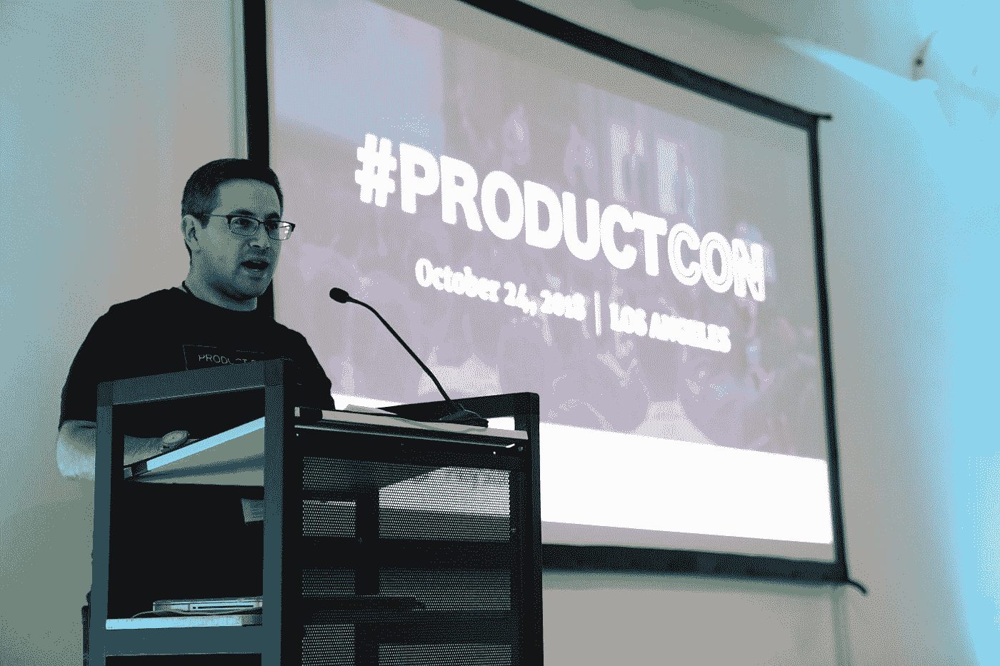

# 作为数据科学家获得下一次晋升

> 原文：<https://medium.com/geekculture/getting-your-next-promotion-as-a-data-scientist-85e97f124d13?source=collection_archive---------29----------------------->

**在您的数据科学职业生涯中前进**

Advance in your career, get known teach. Photo by [Product School](https://unsplash.com/@productschool?utm_source=medium&utm_medium=referral) on [Unsplash](https://unsplash.com?utm_source=medium&utm_medium=referral)

在获得博士或硕士学位后，如果你进入数据科学领域，你需要证明你拥有这份工作所需的技术技能。

如果你已经有了一份数据科学的工作，你将会为下一次晋升而努力。

这意味着您必须:

1.  拥有所需的技术技能，
2.  能够让招聘经理或你现在的经理相信，你有足够的技能达到足够高的水平，足以保证招聘到更高的职位。所以，这意味着你需要有人际交往能力。

所以，不要忽视你的人际交往技能，或者“软技能”。

数据科学不仅仅是数学、统计或编程方面的知识。

当我开始我的科学生涯时，我不明白人际交往技能的价值，也不明白“熟人”如何能帮你找到工作，如何能让你的问题超级快地消失，只需很少甚至不需要网上搜索。

当然，每个程序员都知道 Google、文档和 Stackoverflow 是编码成功的关键——其他人给你问题的解决方案。科学家都知道研究论文需要被阅读和理解。但我指的是直接与人交谈，文字聊天和语音。

我建议数据科学家在谈论他们实际做的事情时磨练他们的技能。你教别人越多，你就越能学会组织你的思想，清楚地描述你告诉别人的事情，你就越能认真地学习你的技能。

数据科学家必须是高度技术化的人，但也需要获得正确的社会方面。数据科学家将协作精神融入他们的工作中，我的意思是数据科学家在问题上与其他人合作得很好，并帮助其他人发现他们数据中的意义。

为困难的问题创造伟大的解决方案需要与所有利益相关者进行大量的沟通:老板和团队领导，其他团队，外部合作者，甚至公众，至少获得公众的意见作为数据(不要踩到你的公关人员的脚趾)。

# 如何获得更多关注

这需要技能和活动来教育人们(技术的和非技术的)你在做什么工作，也需要技能来吸引他们的注意力并给人留下深刻印象。

这需要面对面和视频聊天的说话技巧:团队会议、与领导会面、会议、工作面试。

还需要简历写作和格式技巧，以及 LinkedIn 个人资料优化，以吸引潜在雇主的注意。

真正有助于找工作的是得到认识你的人的推荐。这需要认识更多的人，让他们相信你的技能。为什么一个人会冒着自己的声誉和雇主的成功以及工作保障的风险去推荐一个不具备所需条件的人呢？

# 数据科学家做什么:

让我们后退一步，考虑一下雇主对数据科学家的要求。

数据科学是解决问题的一种方式；数据科学家使用数据分析进行预测和回答问题。数据科学应用于各个行业。数据科学应该具备数学、统计、编码、数据管理和商业知识方面的技能(数据科学所针对的特定领域)。

数据科学有可能被深度学习等先进的机器学习算法自动化，但不是所有东西都可以自动化，系统首先需要人来构建。

数据科学家需要能够与团队的其他成员交流他们的发现。数据科学家还具备业务理解能力，因此他们可以与组织内的经理、董事和其他员工合作。

有专门研究深度学习、神经网络或决策树等机器学习算法的数据科学家，但科学家在团队中工作，团队中也需要数据工程师、数据分析师和机器学习工程师。

如果一个专业人士想在职业生涯中更快发展，他们应该专攻。专家更快被认可，因为当他们能够集中注意力时，他们能更快地收集技能。

沃伦·巴菲特和比尔·盖茨三世是好朋友，有一次他们去拜访比尔的父母和比尔的父亲(比尔·盖茨二世)，请他们各自写下自己的秘密武器。

Focus, meditation can help. Photo by [Damir Spanic](https://unsplash.com/@spanic?utm_source=medium&utm_medium=referral) on [Unsplash](https://unsplash.com?utm_source=medium&utm_medium=referral)

单独地，没有商量，他们每个人都写了一个词，“专注”。

专注能让一个人很快擅长一件事。通常，雇主会要求员工做许多不同的任务。

# 那么，你如何专攻数据科学呢？

Data Visualisation: Photo by [Clay Banks](https://unsplash.com/@claybanks?utm_source=medium&utm_medium=referral) on [Unsplash](https://unsplash.com?utm_source=medium&utm_medium=referral)

机器学习、数据可视化、数据工程和数据仓库是一些最大的数据科学任务。人们经常会问，数据科学家是否应该成为百事通，或者能够拥有一些核心能力。

很多成功人士都有“T 型”技能:他们擅长很多事情，但只擅长一件事。所以他们对大多数事情都很肤浅，但对一件事却很深刻。

如果你在任何有空的时候多学习，你可以在你选择的子领域获得更多的技能。可用时间:下班后、上班前、周末，甚至是上班期间，如果你能说服你的领导/主管让你在那个子领域多做些工作。

当然，你也可以被要求参加课程，或者说服你的领导某门课程适合你。这可以由你的雇主或你出资。住宿(面对面)课程和在线课程。

你可以自己学习课程，在这种情况下，你需要动力和毅力坚持到课程结束，同时真正学到给你的东西。大多数人(所有人，不仅仅是数据科学家)从来没有完成他们购买和开始的许多课程。

另一种方法是让某人每天或每周督促你做更多的事情，并得到你强烈渴望的结果。你可以有一个教练:一个让你负责并让你更加努力的人。数据科学职业蔻驰推动数据科学家改进，类似于数据科学家如何被期望推动数据科学团队和整个组织实施所发现的以获得结果。

Coach: Have someone experienced guide and encourange you. Photo by [Nathan Dumlao](https://unsplash.com/@nate_dumlao?utm_source=medium&utm_medium=referral) on [Unsplash](https://unsplash.com?utm_source=medium&utm_medium=referral)

数据科学导师是曾经站在你的立场上的人，他可以给出最适合你的建议。这是一个关心你是否得到结果的人，有时甚至超过你的关心。

一个教练可以是不断努力取得进步的人，也可以是实现你的目标的人，继续努力实现更高的目标，取得下一组更高的成绩的人。

如果你想让数据科学职业蔻驰改变你的职业生涯，让你快速解决更大、更重要的问题，让你的工作范围更广，获得(也应该获得)更高的薪酬，那么请访问我的 LinkedIn 个人资料，这里:[https://linkedin.com/in/vincent-hall-consulting](https://linkedin.com/in/vincent-hall-consulting)

观看我的视频，了解更多关于我所做的事情，以及我的客户得到的结果。

联系我，告诉我你的情况和你想要什么。

如果你想跳过 LinkedIn 连接请求，请在这里向我预订一个免费的咨询电话:【https://calendly.com/intellect_vince/30min

如果你想在我写作的时候把我的新文章发给你，请使用这个链接:【https://vince-hall-consulting.medium.com/subscribe】T4
如果你订阅了 Medium，我会得到一部分订阅费，谢谢。