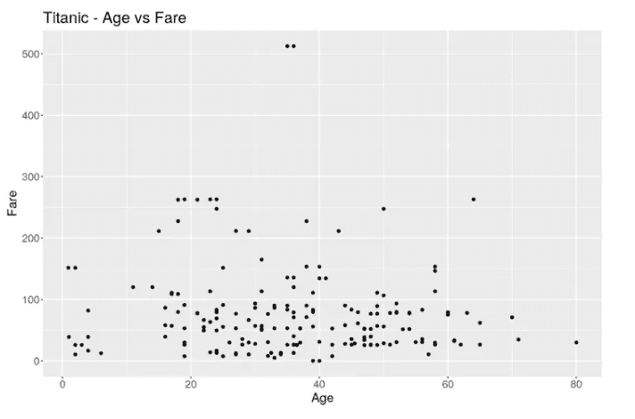
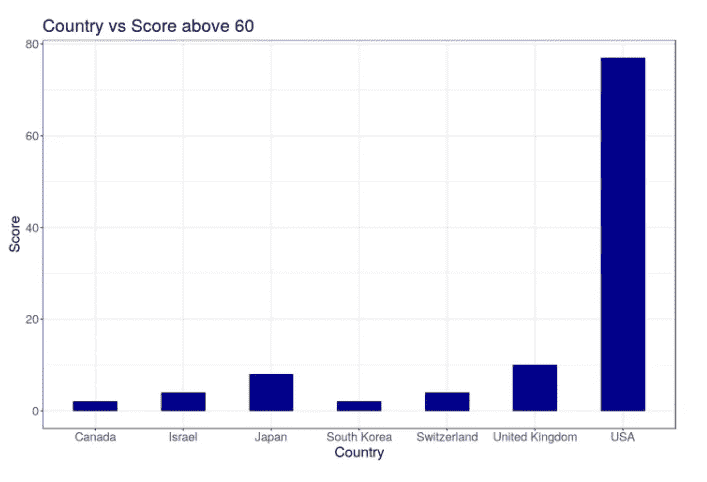
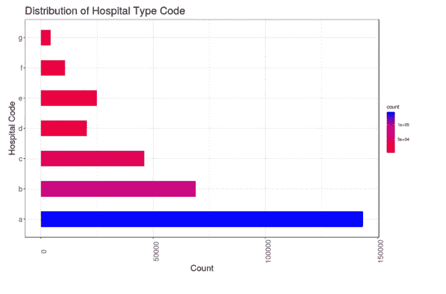
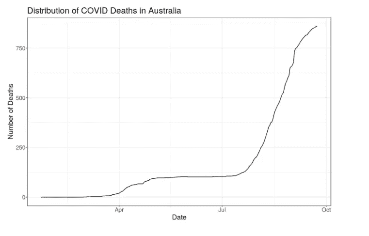
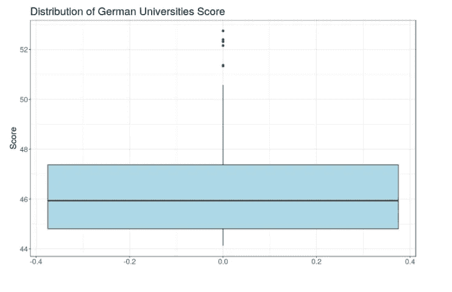
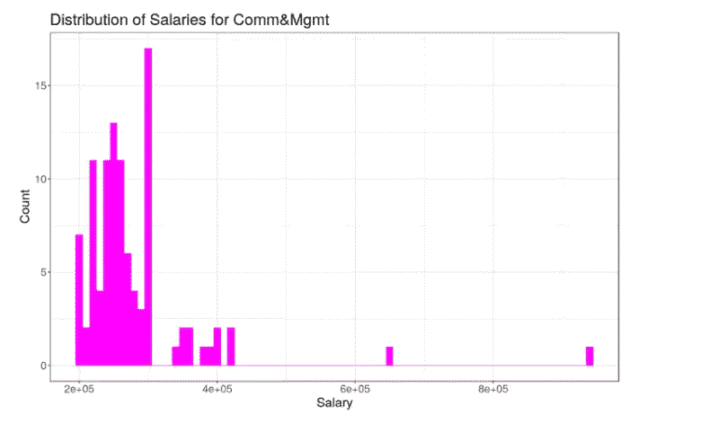
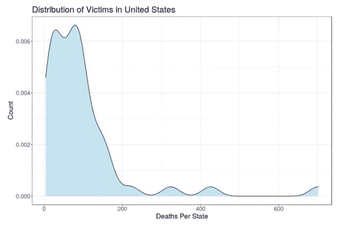
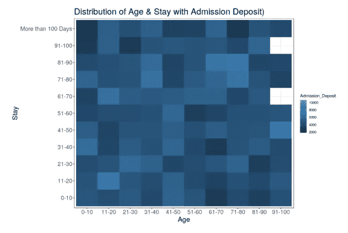

# ggplot 在行动！

> 原文：<https://medium.com/geekculture/ggplot-in-action-7008f304bee1?source=collection_archive---------24----------------------->

你的作弊行为真可耻！


Photo by [Bench Accounting](https://unsplash.com/@benchaccounting?utm_source=unsplash&utm_medium=referral&utm_content=creditCopyText) on [Unsplash](https://unsplash.com/s/photos/online-classes?utm_source=unsplash&utm_medium=referral&utm_content=creditCopyText)

首先，安装`pandas`和`plotnine`包，确保它们可用。

```
!pip install pandas plotnine
```

为了用来自`plotnine`的`ggplot`类制作一个情节，我们必须提供三样东西:

1.  包含我们数据的数据框。
2.  如何将数据框的列转换为图形元素的位置、颜色、大小和形状(“美学”)。
3.  要显示的实际图形元素(“几何对象”)。

散点图

```
fig(12,8)
ggplot(titanic, aes(x=Age, y=Fare)) + 
  geom_point() + 
  labs(y="Fare", 
       x="Age", 
       title="Titanic - Age vs Fare")+
        theme_gray()+
       theme(plot.title = element_text(size=22),axis.text.x= element_text(size=15),
                            axis.text.y= element_text(size=15), axis.title=element_text(size=18))
```



条形图

```
fig(12,8)
ggplot(university[university$score>60,], aes(country))+
geom_bar(stat="count", width = 0.5, fill="darkblue")+
 labs(x="Country",
         y="Score", 
       title="Country vs Score above 60 ")+ 
theme_bw()+
theme(plot.title = element_text(size=22),axis.text.x= element_text(size=15),
                            axis.text.y= element_text(size=15), axis.title=element_text(size=18))
```



水平条形图

```
fig(12,8)
ggplot(hosp_code, aes(x=hospital_code,y=count))+
geom_bar(stat="identity",width = 0.5,aes(fill=count))+ 
scale_fill_gradient(low = "red", high = "blue")+
coord_flip()+
 labs(x="Hospital Code",
         y="Count", 
       title="Distribution of Hospital Type Code")+ 
theme_bw()+
theme(plot.title = element_text(size=22),axis.text.x= element_text(size=15,angle=90),
                            axis.text.y= element_text(size=15), axis.title=element_text(size=18))
```



饼图

```
fig(12,8)
pie <- ggplot(netflix, aes(x = "", fill = factor(type))) + 
  geom_bar(width = 1) +
  theme(axis.line = element_blank(), 
        plot.title = element_text(hjust=0.5,size=22)) + 
  labs(fill="class", 
       x=NULL, 
       y=NULL, 
       title="Pie Chart of Netflix shows")

pie + coord_polar(theta = "y", start=0)
```


时间序列图表

```
fig(12,8)
ggplot(aus_deaths, aes(x=ObservationDate)) + 
  geom_line(aes(y=total)) + 
    labs(x="Date",
         y="Number of Deaths", 
       title="Distribution of COVID Deaths in Australia")+ 
theme_bw()+
theme(plot.title = element_text(size=22)
      ,axis.text.x= element_text(size=15),
       axis.text.y= element_text(size=15),
        axis.title=element_text(size=18))
```



箱形图

```
fig(12,8)
ggplot(german_university, aes(y=score))+ 
geom_boxplot(varwidth=T, fill="lightblue")  +
labs(x="",
    y="Score", 
    title="Distribution of German Universities Score")+  
theme_bw()+
theme(plot.title = element_text(size=22)
      ,axis.text.x= element_text(size=15),
       axis.text.y= element_text(size=15),
        axis.title=element_text(size=18))
```



直方图

```
fig(12,8)
ggplot(com_df, aes(x=salary)) + 
geom_histogram(binwidth=10000,fill="magenta")+
labs(x="Salary",
         y="Count", 
       title="Distribution of Salaries for Comm&Mgmt")+  
theme_bw()+
theme(plot.title = element_text(size=22)
      ,axis.text.x= element_text(size=15),
       axis.text.y= element_text(size=15),
        axis.title=element_text(size=18))
```



密度图

```
fig(12,8)
ggplot(death_by_state, aes(x=freq))+
  geom_density(color="darkblue", fill="lightblue",alpha=0.7)+
labs(x="Deaths Per State",
         y="Count", 
       title="Distribution of Victims in United States")+  
theme_bw()+
theme(plot.title = element_text(size=22)
      ,axis.text.x= element_text(size=15),
       axis.text.y= element_text(size=15),
        axis.title=element_text(size=18))
```



热图图

```
fig(12,8)
ggplot(sample_n(health,30000), aes(Age,Stay , fill=Admission_Deposit)) + 
  geom_tile()+
labs(y="Stay",
         x="Age", 
       title="Distribution of Age & Stay with Admission Deposit)")+  
theme_bw()+
theme(plot.title = element_text(size=22)
      ,axis.text.x= element_text(size=15),
       axis.text.y= element_text(size=15),
        axis.title=element_text(size=18))
```



如果你卡住了，一定要伸出手来评论！

其他可能感兴趣的文章:

*   [熊猫 10 分钟指南。这将作为获得…的基本指南|由 Sam |极客文化| 2022 年 1 月| Medium](/geekculture/pandas-10-minute-guide-31dc26a874f7)
*   您的 go to Numpy 清单。快速浏览所有重要的… |作者 Sam |极客文化| 2022 年 1 月| Medium
*   [Apache Spark-I 入门|作者 Sam |极客文化| 2022 年 1 月| Medium](/geekculture/getting-started-with-apache-spark-i-5fbbe7b47667)
*   [细流企鹅和帕尔默企鹅。上周在网飞疯狂狂欢… |作者:山姆|极客文化|媒体](/geekculture/streamlit-and-palmer-penguins-92a09004ed45)

干杯，请关注更多此类内容！:)

如果你喜欢它的内容，你现在也可以给我买一杯咖啡！
[samunderscore12 正在创作数据科学内容！(buymeacoffee.com)](https://www.buymeacoffee.com/samunderscore12)