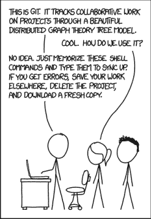
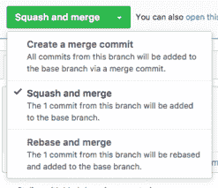

# Git 201

> 原文：<https://medium.com/geekculture/git-201-9ee37ed1235e?source=collection_archive---------29----------------------->


你在为客户开发产品，但是你在为你的同事编写代码。本指南的目标是帮助您的工程团队建立 git 实践，允许快速的 PR 评审周期，这样您的团队就不会发疯，您和您的同事可以很快解除封锁，并且变更风险很低。

本指南假设您已经理解了 git 的基础知识，比如 repo 克隆、提交、推送和分支。



*If that doesn’t fix it, git.txt contains the phone number of a friend of mine who understands git. Just wait through a few minutes of ‘It’s really pretty simple, just think of branches as…’ and eventually you’ll learn the commands that will fix everything. Source:* [*XKCD*](https://xkcd.com/1597/)*.*

# 分支和拉取请求

为新工作创建新分支。当你准备好将你的工作放入`[main](https://github.com/github/renaming)`时，从 GitHub 网站打开一个 pull 请求。在集成测试已经通过并且 PR 已经被审查之后，您可以"[挤压和合并](https://docs.github.com/en/github/collaborating-with-pull-requests/incorporating-changes-from-a-pull-request/about-pull-request-merges#squash-and-merge-your-pull-request-commits)"。

分支+“挤压和合并”的一些好处包括:

*   分支增加了新代码的可见性，因为人们可能不会收到直接提交给`main`的通知。
*   `main`更简洁，因为它是按合并时间而不是混合提交排序的 PR 列表。
*   恢复从网站打开的 PR 比恢复从命令行创建和推送的提交更容易。
*   提交者可以确保(除非在极端紧急的情况下)测试已经通过了他们的分支。想象一下，对于您的同事来说，将`main`重新构建到他们的分支中是多么令人沮丧，并且发现，在 20 分钟的测试构建之后，唯一的失败是您直接推给`main`的 lint 错误。

# 分支基础

开始一个新分支的工作:

```
git checkout -b <branchname>
```

第一次将分支推送到 GitHub:

```
git push -u origin <branchname>
```

现在您已经用`-u`设置了分支，您可以使用常规的 push 命令进行后续更改:

```
git push
```

# 拉式请求基础

从 GitHub 中，您可以在您的分支上打开一个 pull 请求。

除非在紧急情况下，否则请等到集成测试构建通过后再合并到您的 PR 中。许多团队还要求每个 PR 至少由另一个团队成员审核。

使用“压缩并合并”选项将您的开放拉动请求合并到`main`中。



[*Squash and merge*](https://docs.github.com/en/github/collaborating-with-pull-requests/incorporating-changes-from-a-pull-request/about-pull-request-merges#squash-and-merge-your-pull-request-commits) *from GitHub*

# 拉式请求标签

在 GitHub 上提供关于你的拉取请求的额外上下文是很有帮助的。

我最喜欢的公关标签是:

*   **已阻止，**用于需要审核但由于外部相关性不应合并的 PRs。
*   **需要在 X 上测试/在 X 上完成测试，**其中 X 类似于 staging，或者您的数学评估框架。这对于需要手动或专门测试的 PRs 来说非常好。

我还推荐使用 [**草案拉式请求**](https://github.blog/2019-02-14-introducing-draft-pull-requests/) 用于公开评论的 pr，但需要高层次的方向性指导，而不是低层次的细粒度审查。

# 受保护的分支

在过去的几年里，GitHub 已经发布了许多围绕[保护分支](https://docs.github.com/en/github/administering-a-repository/defining-the-mergeability-of-pull-requests/about-protected-branches)的特性，这些特性使得围绕 PRs 有计划地执行你的团队的政策和规范变得容易。

我建议您使用以下方法:

*   [要求线性历史](https://docs.github.com/en/github/administering-a-repository/defining-the-mergeability-of-pull-requests/about-protected-branches#require-linear-history)，以强制使用挤压&合并
*   [要求在合并](https://docs.github.com/en/github/administering-a-repository/defining-the-mergeability-of-pull-requests/about-protected-branches#require-status-checks-before-merging)之前进行状态检查，以强制 CI 通过
*   [如果您的团队超过三人左右，在合并](https://docs.github.com/en/github/administering-a-repository/defining-the-mergeability-of-pull-requests/about-protected-branches#require-pull-request-reviews-before-merging)之前要求进行拉式请求审查

# 创建小型、增量式 PRs

你正在开发一个大的特性，在这个过程中你会遇到一些错误和拼写错误。为什么不把这些包括在你即将在 GitHub 上发布的大公关中呢？

将不同的逻辑变化捆绑在一个 PR 中会给你的审核者带来额外的负担，它会增加你的 PR 被认为是“大怪物 PR”的机会，并且随着你的分支机构开放时间的延长，它会增加你合并冲突的风险。

对于一个删除了三个空格的小 PR 来说，要比一个删除了三个空格的大 PR 容易得多。创建许多小公关有助于分散公关审查的精神负担，建立信任，大多数公关审查将是快速和容易的，并减少您的功能公关膨胀。

这种方法需要在你的团队中得到批准，你可以处理大量的小型 PRs，它需要停止工作，创建一个新的分支，并在那里进行更改。然而，我从经验中看到，当审核周期变得更快、更有效时，创建 PR 时这一点额外的努力会得到很多倍的回报。

# 合并冲突

没有人喜欢合并冲突。在合并冲突发生之前阻止它们！以下是一些建议:

*   创建小型、增量式 PRs
*   在打开请购单之前，重新设定`main`的基准(说明如下)
*   更好的是，在你的分支机构中频繁调整`main`
*   缩短打开 PR 和合并之间的时间

然而，当合并冲突不可避免地发生时，您有两种选择。**重设基础将在** `**main**` **之上“重写”您的提交，而合并将混合来自** `**main**` **的提交。**对重定基准的完整描述超出了本指南的范围，但是，重定基准与合并的效果大致如下所示。

重置基础后的提交顺序:

```
<main> <main> <main> **<your branch> <your branch> <your branch>**
```

合并后的提交顺序:

```
<main> **<your branch> <your branch>** <main> <main> **<your branch>**
```

## 选项#1 重定基础和重写

由于上一节所述的原因，非常鼓励重新设定分支的基准。

警告:在打开一个 PR 并有许多评论和长时间的讨论后，重新设定基准会重写提交历史，并可能过早关闭评论，使它们难以跟踪。

将`main`转储到您的分行:

```
git pull --rebase origin main
```

重置基础可能会覆盖部分提交历史，所以通常需要将这些更改强制推送到 GitHub。

```
git push --force origin <branchname>
```

如果在重置基础时有大量冲突，请尝试中止重置基础。

```
git rebase --abort
```

然后使用一个交互式的 rebase 来“挤压”当前分支上的一些提交。

```
git rebase -i HEAD~<N = number of commits to view>
```

例如:

```
git rebase -i HEAD~3
```

然后你可以重新开始。

额外提示:

*   每周对长时间运行的分支进行几次重定基
*   在重设基础之前挤压提交

## 选项#2 从 main 合并

从`main`开始的合并是混乱的，并且合并提交可能是笨拙的。小心使用。

确保`main`是本地最新的，然后合并`main`并推送。

```
git merge main
git push origin <branchname>
```

# 重写历史

当 N 是一个数字时，下面的命令将带您进入一个交互式 rebase 环境，允许您压缩提交、删除提交和重新排序提交，以及其他有用的操作。

```
git rebase -i HEAD~N
```

重写提交历史后，您可能需要强制推送您的分支。

```
git push --force origin <branchname>
```

# 创建小型提交

您可能认为您知道 git commit，但是尝试一下-p 选项，为您自己提供一个交互式环境来存放文件的各个部分，对是否提交进行细粒度的控制。

```
git commit -p
```

如果您希望分阶段进行更改而不是直接提交更改，您可以交互添加，而不是提交。

```
git add -p
```

# Git 编辑器

如果您发现用于重定基础和提交的默认 git 编辑器难以使用，可以通过在~/中设置以下环境变量来更改它。bashrc 或者~/.zshrc。

```
export GIT_EDITOR=emacs
```

# Git 错别字

你经常把单词打错成“comit”“stauts”和“checkotu”吗？您可以在全局 git 配置中使用 [git 别名](https://git-scm.com/book/en/v2/Git-Basics-Git-Aliases),自动将您输入错误的命令识别为正确的命令。例如，运行下面的代码后，您可以键入“git checkotu”来签出文件。

```
git config --global alias.checkotu checkout
git config --global alias.comit commit
```

# 承认

感谢阅读！非常感谢 [SigOpt](http://sigopt.com/) 的工程团队，感谢他们启发并帮助完善原始文档。

如果你觉得这篇文章有帮助，请在这里或 Twitter 上给我留言(我是[@ Alexandra 777](https://twitter.com/alexandraj777))。