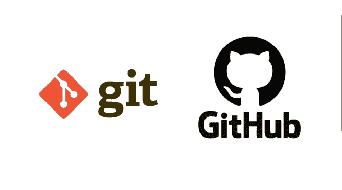
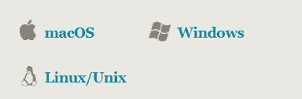
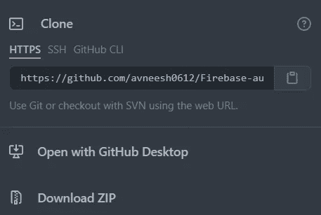
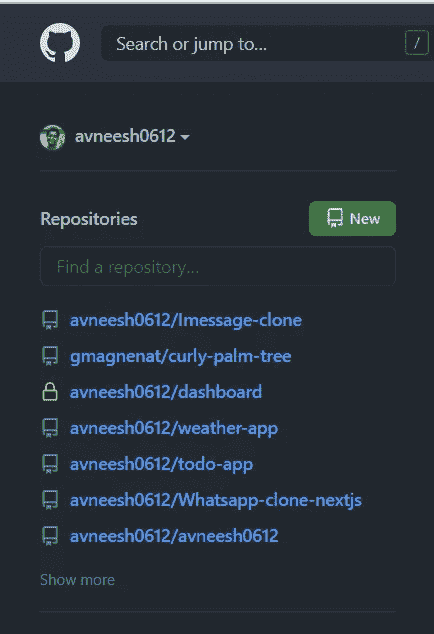
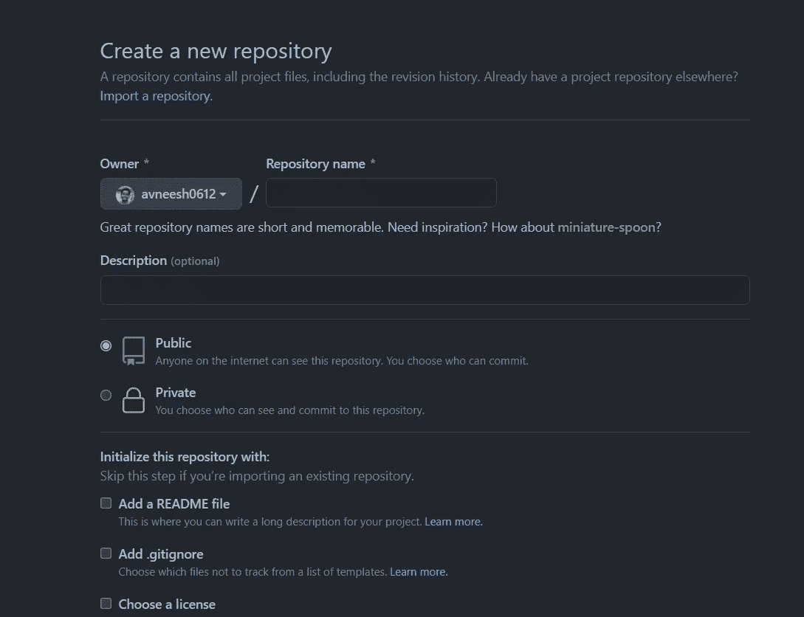

# Git 和 Github 速成班

> 原文：<https://medium.com/geekculture/git-and-github-crash-course-b44f4885ff66?source=collection_archive---------9----------------------->



## Git 是什么？

Git 是使用最广泛的现代版本控制系统。Git 是一个积极维护的开源项目，最初由 Linux 操作系统内核的著名创建者 Linus Torvalds 于 2005 年开发。数量惊人的软件项目依赖 Git 进行版本控制，包括商业项目和开源项目。

## 什么是 Github？

GitHub 是一个用于版本控制和协作的代码托管平台。它让你和其他人在任何地方一起工作。

# Git 安装

去 [git](https://git-scm.com/downloads) 为你的操作系统下载 git。



# Git 设置

运行这些命令，您的 git 就可以使用有用的命令了。

```
git config --global user.name "John Doe" # your name
git config --global user.email johndoe@example.com # your email
```

# 重要的 Git 命令

## Git 初始化

这将在您的计算机上本地初始化一个空的存储库。

```
git init
```

## Git 添加

该命令将文件添加到临时区域，稍后您可以通过消息提交它。

```
git add . # to add all files
git add filename # add a specific file
```

## Git 状态

该命令显示哪些文件已经添加到临时区域，哪些文件还需要添加。

```
git status
```

## Git 提交

该命令提交文件更改，并帮助您跟踪代码。每当你添加一个新的特性时，你可以用一个消息来提交它。

```
git commit -m "this is the message"
```

## Git 推送

该命令用于将您的代码推送到 git 提供者，如 github、bitbucket。

```
git push
```

## **Git 克隆**

如果您想在您的机器上复制整个存储库，请执行以下操作-

转到您想要复制的回购协议，然后单击代码按钮，它会显示一个下拉菜单。



只需复制并运行命令

```
git clone [https://github.com/avneesh0612/Firebase-auth-demo.git](https://github.com/avneesh0612/Firebase-auth-demo.git)     # enter the url you have got
```

# Git 分支

***首先，什么是 git 分支？***

git 分支代表一条独立的开发路线。分支充当编辑/暂存/提交过程的抽象。您可以将它们视为请求全新的工作目录、临时区域和项目历史的一种方式。

**创建一个分支**

```
git branch branchname
```

**检查所有分支机构**

```
git branch
```

**开关支路**

```
git checkout branchname
```

**合并一个分支**

```
git merge branchname
```

# 如何将存储库连接到 Github

去 [Github](https://github.com/) 注册一个账户。



单击“新建”,它会将您重定向到此页面。



给你的存储库起一个你喜欢的名字，然后如果你想要一个描述，你可以添加它。这不是强制性的。

您可以选择它是私有的或公共的，其余的保持默认。当您单击创建存储库时。你会看到一个类似这样的页面-


现在只需复制命令并粘贴到终端中。

完成后，您可以简单地添加、提交和推送文件。

```
git add .
git commit -m "completed"
git push
```

恭喜你，你已经完成了 git 和 GitHub 🥳.的速成课程

如果你想为一个开源项目做贡献，请查看这个。

社会联系

[Instagram](http://instagram.com/avneesh__agarwal)

[LinkedIn](https://www.linkedin.com/in/avneesh-agarwal-78312b20a/)

(T4) Github (T5)

(T6) Linktree(T7)