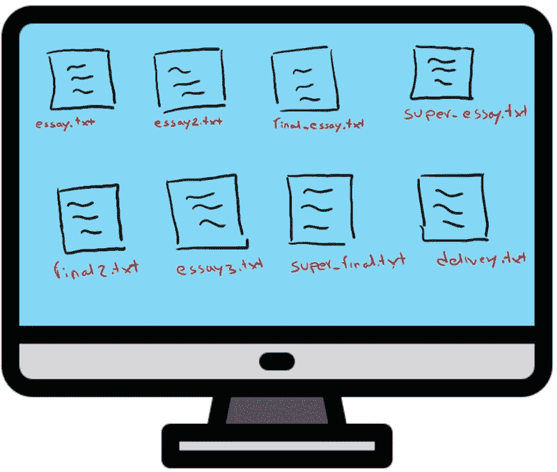
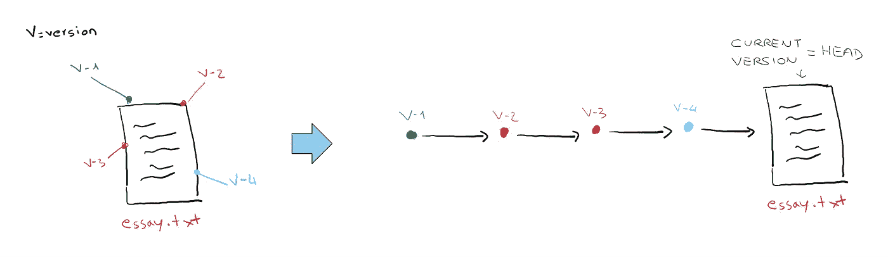
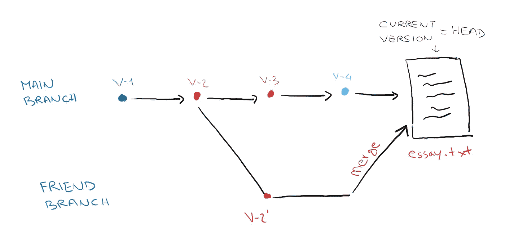
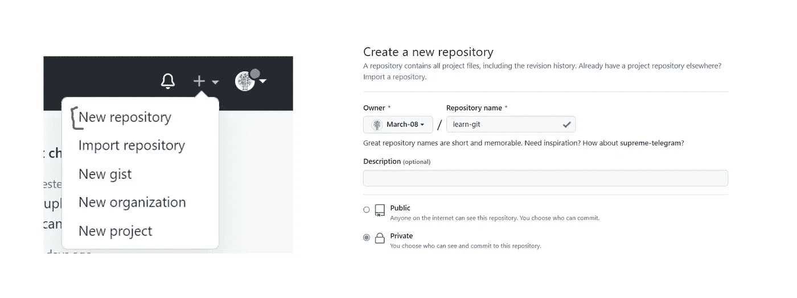
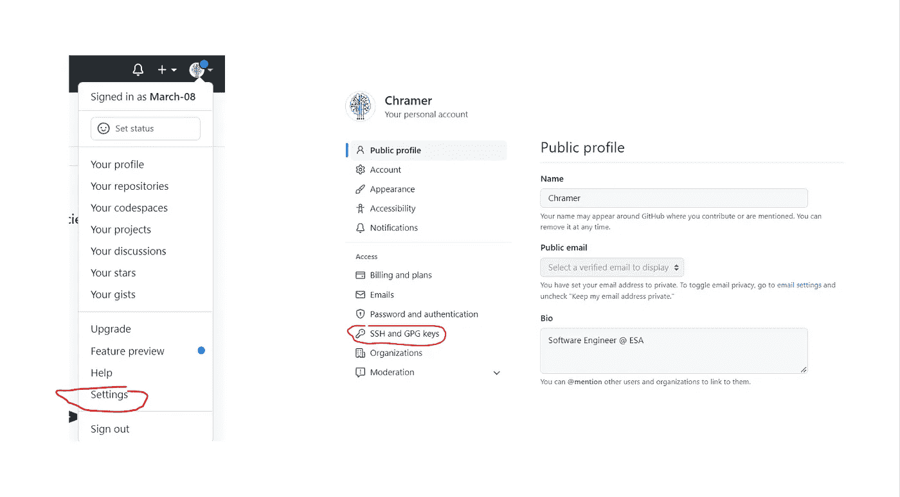
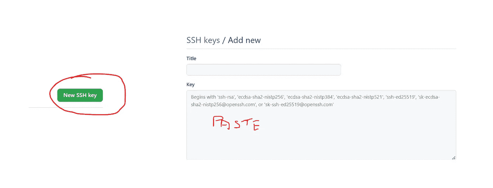
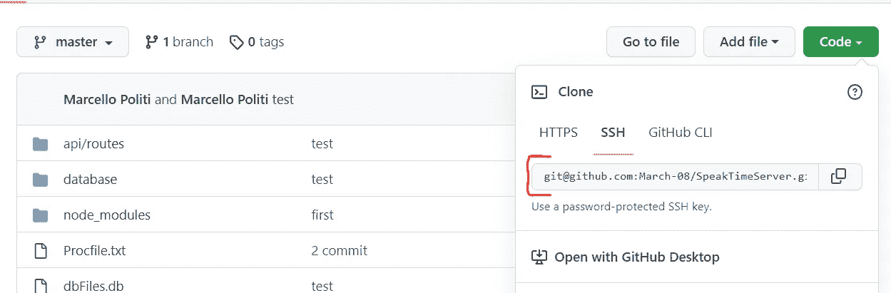

# 面向初级数据科学家的 Git 和 Github

> 原文：<https://medium.com/geekculture/git-and-github-for-beginner-data-scientists-602a3a5574d8?source=collection_archive---------7----------------------->


Photo by [Mohammad Rahmani](https://unsplash.com/@afgprogrammer?utm_source=medium&utm_medium=referral) on [Unsplash](https://unsplash.com?utm_source=medium&utm_medium=referral)

## 如何使用最著名的版本控制软件

如果您从未使用过 Git，现在是开始使用的好时机。但是 Git 是什么，是用来做什么的？

## 实际例子

想象一下，作为一名高中生，他必须写一篇关于气候变化的论文。你开始在笔记本上写东西，保存文件并将其命名为 *essay.txt*
在与朋友交谈后，你发现你的文章太短了，于是你把笔记本放回面前，复制了一份文件，这样你可以确保在最糟糕的情况下不会改变文章中的重要内容，你添加内容并创建第二篇新文章，命名为*essay 2 . txt*T5 第二天，你的母亲给了你一些建议，于是你编辑了你的文章并创建了

*这样持续几天你会发现你的桌面会超级乱！*

**

*Your messy desktop (Image by Author)*

*我敢肯定，如果你是一名数据科学家新手(甚至是一名高级专家)，你会在使用 Colab 或 Jupyter 时经历同样的事情，但你会看到类似于 *untitled.ipynb* 、 *final_project2.ipynb* 、 *super_final.ipynb* 等内容，而不是一篇文章…*

## *Git 如何提供帮助？*

*Git 只允许你保存你正在跟踪的文件( *essay.txt* )一次，但是它会智能地保存你随时间编写的不同版本。每次编辑文件时，Git 都会创建一个指向文件的指针，并且只保存对主文件所做的更改，这样就不会因为冗余数据而占用内存。一旦你有了所有不同的版本，如果你发现以前的版本比你写的上一个版本更好，你可以来回浏览。*

**

*File versions (Image by Author)*

*你接到一个朋友的电话，他说他想帮你写论文，尤其是他非常擅长写引言。然后他还想拿到文件编辑第一部分，同时你继续完善论文，最终你要把你写的测试结合起来。Git 允许您使用 *git 分支*和 *git 合并*来完成这项工作。因此，现在不同的版本不会在一条直线上相互跟随，而是会有两条线，一条给你，一条给你的朋友(准确地说是一个分支)，当你最终将你的努力相加(合并)时，这两条线会走到一起。*

**

## *为什么选择 Github？*

*简而言之，Github 托管你的项目，此外，在线项目可以被其他用户修改，这样你就可以与其他程序员合作。与 Github 交互的主要方式是通过 GUI 或者从命令行使用 Git。*

## *建立 Github 回购协议*

*首先，注册并登录 Github。并按照图片中的示例创建一个新的存储库。根据您是独自工作还是与社区合作来选择是否将其设为私有/公共。*

**

*Set up new repository (Image by Author)*

## *将 Git 连接到 Github*

> *使用 SSH 协议，您可以连接并认证远程服务器和服务。使用 SSH 密钥，您可以连接到 GitHub，而无需在每次访问时提供您的用户名和个人访问令牌。*

*让我们从在终端上使用以下命令生成 SSH 密钥开始。*

```
*ssh-keygen -t ed25519 -C "*my_github_email@gmail.com*"*
```

*单击 enter，直到程序生成 SSH 密钥。*

*现在我们必须启动 ssh 代理，也就是在后台管理密钥的程序，如果你想了解更多关于 ssh 代理的信息，请阅读这篇文章。然后我们必须将我们的密钥添加到 ssh 代理程序中。*

```
*eval "$(ssh-agent -s)"
ssh-add ~/.ssh/id_ed25519*
```

*请注意，id_ed25519 是包含您的私钥的文件名，而 id_ed25519 包含公钥。如果您选择了不同的名称，请使用您的自定义文件名。*

***在 Github 上添加你的 SSH 密钥***

*现在，如果您想使用 Git 远程编辑 Github 存储库，您需要告诉 Github 哪些 SSH 密钥有权编辑存储库。所以使用下面的命令添加复制 SSH 密钥(您不能在终端中使用 *ctrl+c**

```
*clip < ~/.ssh/id_ed25519.pub*
```

*现在将密钥粘贴到下面的框中*

**

*Set Up your SSH Key (Image by Author)*

**

*Set Up your SSH Key (Image by Author)*

*现在使用这个命令来测试连接是否工作正常。*

```
*ssh -T git@github.com*
```

*如果这对你不起作用，可能这个[会帮你解决。](https://stackoverflow.com/questions/15589682/ssh-connect-to-host-github-com-port-22-connection-timed-out)*

*[](https://stackoverflow.com/questions/15589682/ssh-connect-to-host-github-com-port-22-connection-timed-out) [## ssh:连接到主机 github.com 端口 22:连接超时

### 我有一个代理，我正在成功地推进 git 一段时间。现在我不能推进 git 的所有…

stackoverflow.com](https://stackoverflow.com/questions/15589682/ssh-connect-to-host-github-com-port-22-connection-timed-out) 

太好了，现在您可以开始编辑您存储库了！

## 克隆存储库

让我们克隆存储库(在您的本地机器上下载 repo 以进行一些更改)。复制您的 repo 的 ssh 链接，并运行以下命令。



SSH Link (Image by Author)

```
git clone ssh_link_of_your_repo
```

现在，您已经在本地机器上拥有了存储库，您可以使用您最喜欢的 IDE 进行更改。例如，让我们添加一个 README.md 文件。

```
touch README.md
nano README.md>>>nano Editor<<<
# My title
this is an example
>>> close nano Editor<<<
```

## 添加并提交

现在您必须告诉 Git 跟踪这个文件，这样当它被修改时，他将保存不同的版本。为此，只需运行

```
git add README.md
```

如果创建了多个文件，还可以使用下面的命令添加所有内容。

```
git add .
```

现在让我们将这个文件保存在原始的远程存储库中，以便让其他开发人员也能阅读 yuo 所做的更改。

记住远程存储库叫做*源*，主分支叫做*主*(或*主*)

```
git commit -m "describe your commit here"
git push origin master
```

现在你可以在 Github 上查看你的在线知识库已经改变了！

## 最终想法

我希望通过阅读这篇文章，你已经意识到使用像 Git 和 Github 这样的工具的重要性。笔记本对于做初步研究来说是有用和容易的，但是一个更大的项目总是需要一种更结构化的工作方式。通过阅读本文，您将知道 Git 提供了哪些主要特性，并且您将知道如何建立 SSH 连接来远程使用存储库。在以后的文章中，我将更详细地描述 Git 提供的各种命令，并展示如何使用它们。

# 结束了

*马赛洛·波利蒂*

[Linkedin](https://www.linkedin.com/in/marcello-politi/) ， [Twitter](https://twitter.com/_March08_) ， [CV](https://march-08.github.io/digital-cv/)*