# 适合初学者的 Git 和 GitHub。

> 原文：<https://medium.com/geekculture/git-and-github-for-beginners-15dc8a8b385d?source=collection_archive---------37----------------------->

这篇文章是为准备开始使用 Git 和 GitHub 的初学者准备的。通过这篇文章，首先我将讨论什么是 Git 和 GitHub，然后我将转向使用 Git 时你必须知道的基本命令。

Git 是一个免费、开源的**分布式版本控制系统**，这意味着它是一个软件工具，通过管理源代码来帮助软件团队在大型软件项目上协同工作。版本控制系统以结构化的方式在一个称为存储库的特殊数据库中跟踪源代码。没有版本控制系统，很难跟踪对项目所做的更改，也很难知道是谁做了这些更改。你必须将不同的文件保存为最终版本、最新版本，最后，你必须处理一个新的最终版本。对于软件团队来说，版本控制系统使得跟踪团队成员所做的更改变得更加容易，而不需要通过电子邮件发送更新，并且在项目中有效地协作。

您可以使用命令行、图形用户界面、代码编辑器或 IDE 来使 git 工作。在整篇文章中，我们将讨论使用命令行的 Git。

**什么是 GitHub？**

GitHub 是一个托管服务，可以用来与 Git 集成。GitHub 还有很多其他的解决方案。最受欢迎的替代品是 **GitLab** 和 **Bitbucket** 。所以你不需要 GitHub 来使用 Git，但是没有 Git 你就不能使用 GitHub。当不止一个人在一个项目上工作时，GitHub 很有帮助，让他们建立一个集中的存储库，每个人都可以管理、编辑和上传代码文件，以一种有组织的、简单的方式避免所有的混乱。

# git 和 GitHub 入门:

**安装 Git 并创建一个 GitHub 帐户**

首先，您必须安装 Git 并创建一个 GitHub 帐户。你可以[点击这里](https://git-scm.com/downloads)安装 Git。完成后，在这里创建一个 GitHub 账户[。](https://github.com/)

**配置 git**

然后，您必须在 Git Bash 终端中配置您的用户名和电子邮件地址。您可以使用以下命令来配置您的用户名。

`git config — — global user.name “Username”`

您可以通过以下命令配置电子邮件地址。

`git config — — global user .email “ Your email ”`

**创建一个本地 git 存储库(项目)**

首先，您必须创建一个想要存储所有项目文件的文件夹，并用 Git Bash 打开它。

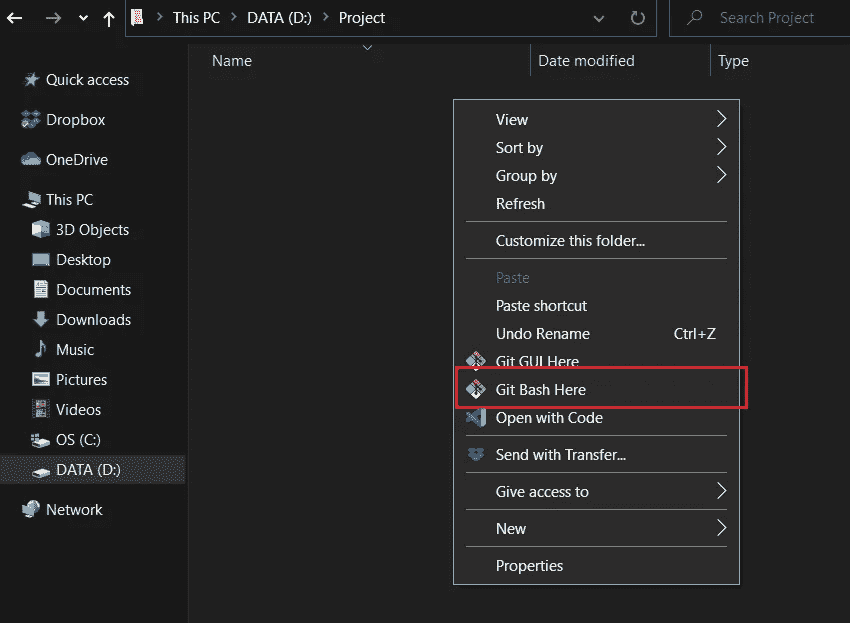

**初始化 git 储存库**

接下来，您必须初始化 git 存储库。为此，您可以使用`**git init**`命令。

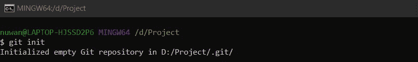

**向存储库添加新文件**

您可以使用`**touch**`命令向存储库中添加新文件。这里我添加了两个文件，分别是 file1.txt 和 file2.txt(或者您可以手动创建这些文件)

然后您可以使用`**git status**`命令来找出 git 知道哪些文件的存在。因为这些文件还没有添加到索引(临时区域)中。这里我们可以看到两个未被跟踪的文件。如果不指示 git 跟踪它们，git 就不会跟踪这些文件。

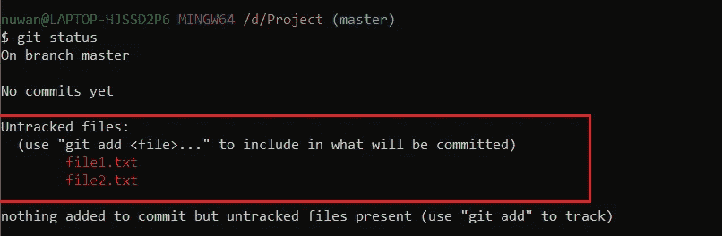

**向暂存环境添加文件**

您可以使用`**git add**`命令将文件添加到暂存区。

`**git add -A**`命令会将所有现有文件添加到暂存区。您可以使用`**git add “<filename> ”**`将文件单独添加到暂存区。

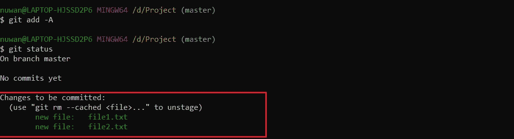

将文件添加到暂存区后，您可以再次检查`**git status**`。然后，您可以看到所有现有文件都被添加到索引中，并准备提交。

**创建提交**

提交意味着在给定时间记录存储库的快照。您可以使用以下命令进行提交。

`**git commit**`

这将启动默认的文本编辑器来提交消息，并且提交的快照将被暂存。

`**git commit –m “<message>”**`

使用这个命令，您可以通过提交消息直接提交更改。您可以看到`**git commit**`命令已经提交了对本地存储库的更改。提交消息应该清楚地解释您的更改。

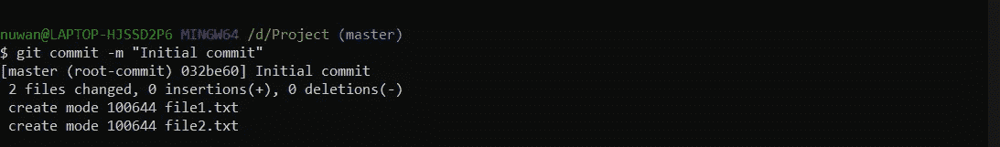

**创建分支**

如果您需要向主项目添加一个新特性，您可以使用一个分支来开发新特性，而无需对主项目进行更改。默认情况下，每个 Git 存储库的第一个分支都是主分支。

您可以使用以下命令创建一个分支。

`**git branch <branch>**`

要移动到新创建的分支，您可以使用`**git checkout**`命令。

`**git checkout <branch>**`

您可以使用`**git checkout –b <branch>**`命令创建一个分支，同时检查新的分支。

我创建了一个 file3.txt 文件，并将其提交给新创建的分支。

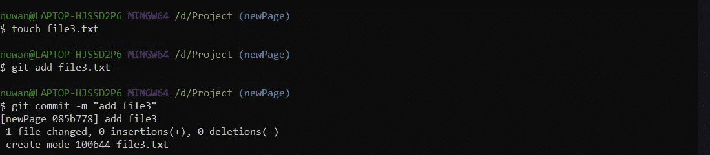

**合并分支**

合并用于合并不同分支的工作。

您可以使用 merge 命令将新创建的分支合并到主分支。合并时，请确保在目标分支中签出。

我的目的分行是主分行。所以首先我必须签入主分支，然后用 merge 命令合并新分支。

`**git merge <branch>**`

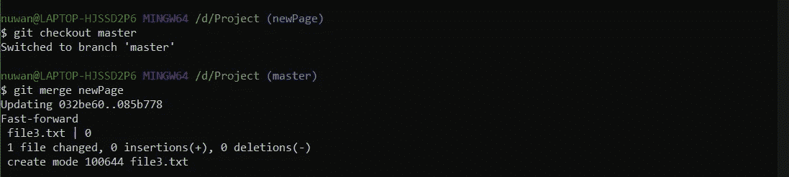

现在，您对新分支所做的更改将与主分支合并。

**将更改从 GitHub 拉到本地存储库**

从远程 GitHub 存储库到本地存储库的拉取已经完成。

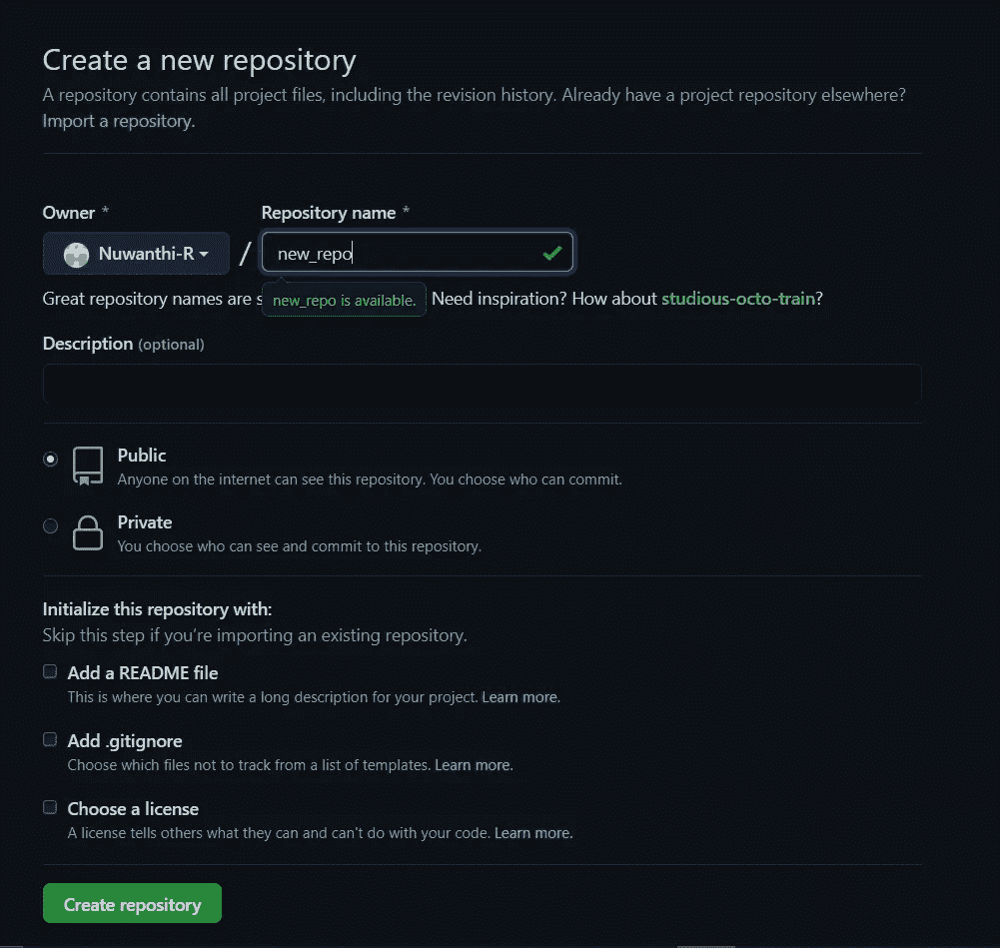

创建远程存储库之后，您必须复制远程存储库的 URL，并使用`**git remote add origin <URL>**`添加它

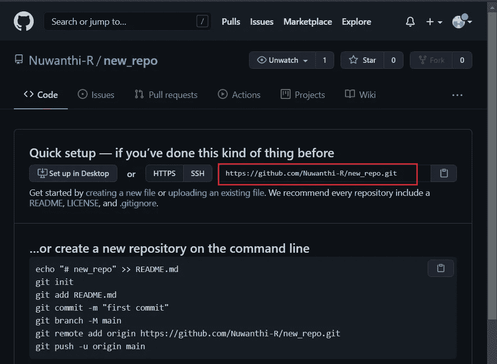

在这个命令中，您将添加远程存储库，并将 URL 作为本地 git 存储库的起点。

总是在推动之前拉动变化。这将确保您的本地副本与远程存储库同步。由于团队的其他成员正在向远程副本推送，如果您在同步之前推送，推送时可能会出现合并冲突。

要将 GitHub 中央存储库上的更改转移到本地存储库，可以使用`**git pull origin master**`命令。

**将本地存储库推送到 GitHub**

该命令用于将本地存储库中的提交转移到远程存储库中。

由于我已经将更改合并到主分支，现在我可以使用`**git push origin master**`将主分支中的文件添加到中央存储库中。

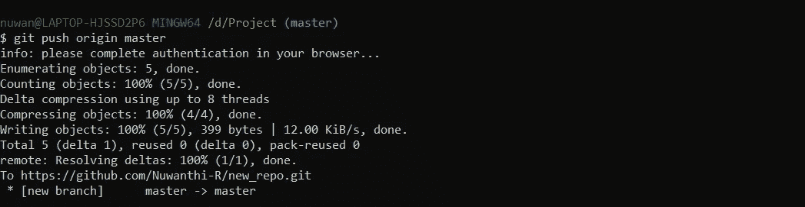

也可以在将分支推送到 GitHub 后，将正在处理的分支合并到主分支。让我们假设我正在一个名为 newProject2 的分支上工作

我已经使用了命令`**git push origin newProject2**`

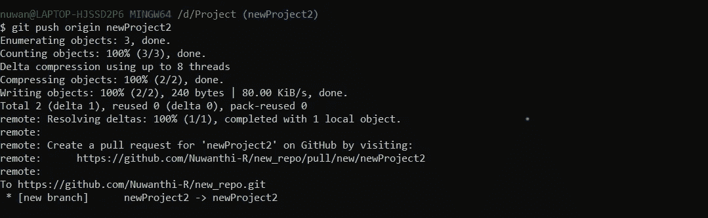

当你刷新 GitHub 页面时，你可以看到一个通知，说 newProject2 有最近的推送。然后您必须创建一个 pull 请求来提醒存储库所有者将您的分支中的变更合并到主分支中。

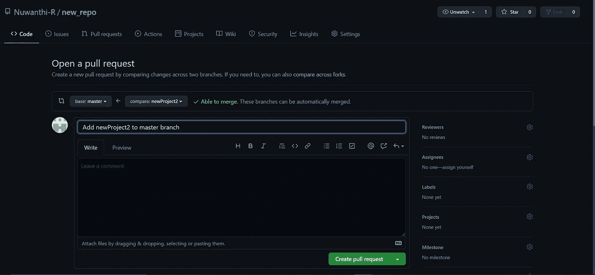

然后，您会在底部看到一个按钮，上面写着“合并拉取请求”。通过单击，您可以将您的更改合并到主分支中。

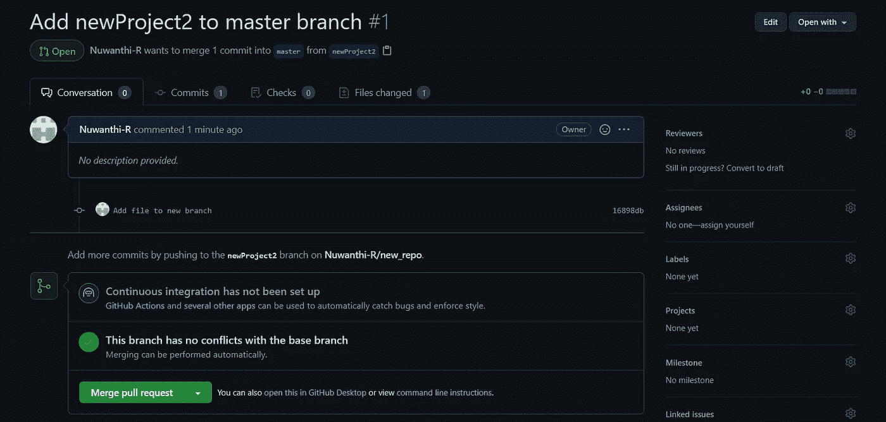

合并完成后，它会给你一个消息“拉请求成功合并。

合并分支后，最好删除分支，因为太多的分支会造成混乱。

这些是您在处理 Git 和 GitHub 项目时会遇到的最常见、最基本的命令。我希望这篇文章能够帮助初学者了解 Git 命令的基本概念。

[获取更多 Git 命令！](https://www.atlassian.com/git/glossary)

如果你有任何改进的建议，[让我知道！](http://www.linkedin.com/in/nuwanthirajapaksha)