# Git 分支变得简单

> 原文：<https://medium.com/geekculture/git-branching-made-easy-1cc894b9fd03?source=collection_archive---------13----------------------->

这是 Git 简介系列文章的第二篇。第一篇文章可以在这里找到。注意，第一条是本文的前提。

在处理一个大项目时，项目的几个特性是同时开发的。Git 分支有助于以极其有效的方式实现这一目的。让我们试着用一个例子来理解它。假设有两个开发者——DevA 和 DevB。两人都在一起做一个项目。这是他们的 Git 存储库当前的提交历史。

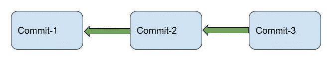

过了一段时间，他们觉得如果 DevA 开始开发 featureA，DevB 开始开发 featureB 会更好。在一个没有分支的世界中，两个开发人员将致力于相同的开发路线。DevA 将看到 DevB 所做的提交和更改，反之亦然。事情不会变得扑朔迷离吗？将 DevA 的工作与 DevB 的工作分开将变得极其困难。

Git 分支提供了一种简单的机制，可以同时开发项目的几个特性，然后在主项目中合并这些特性。这有助于将你的工作与团队其他成员的工作完全隔离开来。我认为，一旦我们开始使用 Git 分支，我们会更好地理解它的威力。所以让我们直接开始吧。

简而言之，这就是 Git 分支的工作方式。每当你想在你的项目中开发一个特定的特性时，你就分支到另一条开发线。一旦您完成了特性的实现，特性分支就可以合并到最初的开发路线中(也称为主分支)。

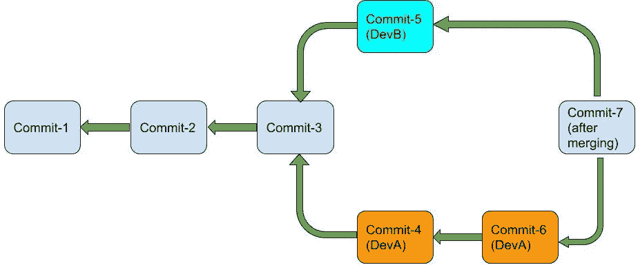

Orange color depicts the branch in which featureA is implemented, while the Cyan color depicts the branch in which featureB is implemented. Branching helps maintain isolation in the development environment for both the developers.

# 什么是 Git 分支？

一直以来(在前一篇文章中),我们都是在一条直线上开发，没有任何分支。嗯，那是个谎言！我们还在一个分支上，主分支。这是 Git 在您执行`git init`时创建的默认分支。请记住，当您执行`git log`时，您将会看到在您的最新提交中写入了一个 master。

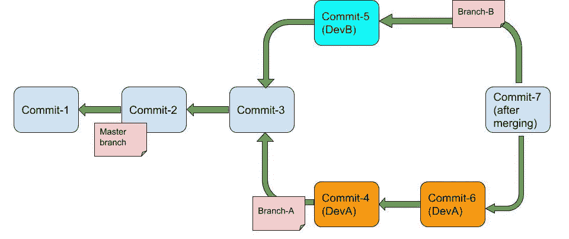

Every branch has a name. Stickers denote the name of the branches. The Master branch is the default branch created when we do a git init.

总的来说，总支被认为是发展的主线。为了实现一个特定的特性，您可以分支到另一个特性分支，然后将该特性分支合并到主分支中。因此，主分支应该是永久的，而其他分支在它们被创建的目的实现之后(在将它们合并到另一个分支之后)就会消亡。

# Git 分支在内部是如何工作的？如何创建 Git 分支？

目前，这是我们的知识库的样子-

```
>>> git log
commit e097d8da357fe97c36c7178f0b770ae44b1f1f3c (HEAD -> master)
Author: pprakarsh <[prakarshparashar@gmail.com](mailto:prakarshparashar@gmail.com)>
Date:   Thu May 21 10:24:55 2020 +0530changed file2commit 6642a0de776b52bbe993555a4bf14aed060afea2
Author: pprakarsh <[prakarshparashar@gmail.com](mailto:prakarshparashar@gmail.com)>
Date:   Sun May 3 22:14:12 2020 +0530added another line in file1commit 155891ca19d94f67159a992c77923818b57d74a5
Author: pprakarsh <[prakarshparashar@gmail.com](mailto:prakarshparashar@gmail.com)>
Date:   Sun May 3 10:41:06 2020 +0530created file1, created subDir1 and created file2 in it
```

通知`master`写在最近一次提交上。

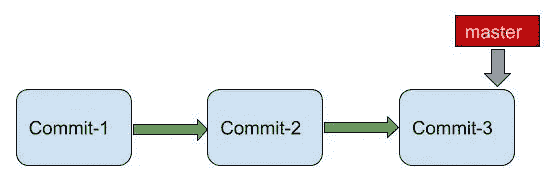

要创建一个新的分支`feature1`，执行以下命令

```
>>> git branch feature1
>>> git log
commit e097d8da357fe97c36c7178f0b770ae44b1f1f3c (HEAD -> master, feature1)
Author: pprakarsh <[prakarshparashar@gmail.com](mailto:prakarshparashar@gmail.com)>
Date:   Thu May 21 10:24:55 2020 +0530changed file2commit 6642a0de776b52bbe993555a4bf14aed060afea2
Author: pprakarsh <[prakarshparashar@gmail.com](mailto:prakarshparashar@gmail.com)>
Date:   Sun May 3 22:14:12 2020 +0530added another line in file1commit 155891ca19d94f67159a992c77923818b57d74a5
Author: pprakarsh <[prakarshparashar@gmail.com](mailto:prakarshparashar@gmail.com)>
Date:   Sun May 3 10:41:06 2020 +0530created file1, created subDir1 and created file2 in it
```

您现在会注意到在最近一次提交中写入了`master, feature1`。因此，已经创建了新的分支特征 1，其指向由`master`分支指向的相同提交。

要查看所有 git 分支，请执行下面的命令。

```
>>> git branch
  feature1
* master
```

请注意母版上的星号。这表示主节点是我们当前的工作分支。

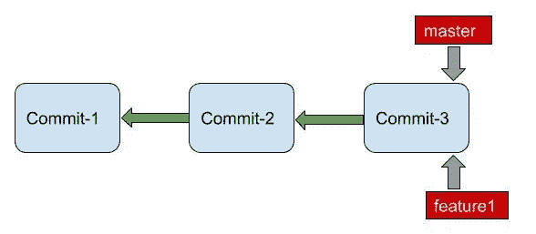

feature1 branch originates from Commit-3\. (Currently, no commits have been created in feature1 branch)

所以，总结一下:

1.  使用`git branch branchname`创建一个新的分支。
2.  当一个新的分支被创建时，比方说，从分支 1 创建的分支 2，然后分支 2 指向我们刚刚看到的分支 1 中的最新提交。
3.  `git branch`查看存储库中所有工作的分支

# 深入研究 Git 参考

让我们暂时离题，谈谈 Git 引用。很好地理解 Git 引用对理解 Git 分支如何在内部工作很有帮助。

那么，什么是 Git 引用呢？它们有什么用处？

Git 中的引用提供了一种标记重要对象的机制，这样以后就可以很容易地引用它们。假设对于项目的某个部分，您希望经常引用 commit-2 中的代码。这需要我们知道提交对象的提交散列。但是，我们可以使用已经创建的引用来引用提交对象，而不是执行一个`git log`，然后重复搜索提交散列。我们稍后将看到如何创建引用。

参考文献有两种:
1。机头
2。标签

执行以下命令，查看这些引用是如何存储在`.git`目录中的。

```
>>> tree .git/refs.git/refs
├── heads
│   ├── feature1
│   └── master
└── tags
```

让我们逐一看看*头*和*标签*

## 头

还记得我们之前执行`git log`的时候，也看到了`HEAD -> master`。这是什么头？HEAD 只不过是指向我们当前工作的分支的指针。一个例外是分离的头状态(别担心！这个我们一会儿再说)。如果我们在主分支机构工作，我们会看到`HEAD -> master`。

```
>>> git log
commit e097d8da357fe97c36c7178f0b770ae44b1f1f3c (HEAD -> master, feature1)
Author: pprakarsh <[prakarshparashar@gmail.com](mailto:prakarshparashar@gmail.com)>
Date:   Thu May 21 10:24:55 2020 +0530changed file2commit 6642a0de776b52bbe993555a4bf14aed060afea2
Author: pprakarsh <[prakarshparashar@gmail.com](mailto:prakarshparashar@gmail.com)>
Date:   Sun May 3 22:14:12 2020 +0530added another line in file1commit 155891ca19d94f67159a992c77923818b57d74a5
Author: pprakarsh <[prakarshparashar@gmail.com](mailto:prakarshparashar@gmail.com)>
Date:   Sun May 3 10:41:06 2020 +0530created file1, created subDir1 and created file2 in it
```

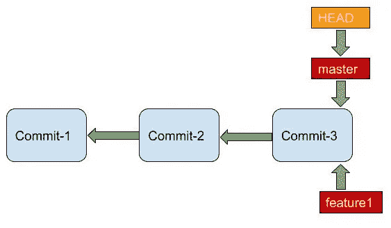

HEAD points to the current working branch, master branch.

假设我们切换到`feature1`分支。(我们目前在主分支上。我们已经创建了`feature1`分支，但是我们仍然在主分支上。要切换到`feature1`分支，执行以下命令。

```
>>> git checkout feature1
Switched to branch 'feature1'>>> git branch
* feature1
  master
```

我们已将当前工作分支更改为`feature1`。

```
>>> git log
commit e097d8da357fe97c36c7178f0b770ae44b1f1f3c (HEAD -> feature1, master)
Author: pprakarsh <[prakarshparashar@gmail.com](mailto:prakarshparashar@gmail.com)>
Date:   Thu May 21 10:24:55 2020 +0530changed file2commit 6642a0de776b52bbe993555a4bf14aed060afea2
Author: pprakarsh <[prakarshparashar@gmail.com](mailto:prakarshparashar@gmail.com)>
Date:   Sun May 3 22:14:12 2020 +0530added another line in file1commit 155891ca19d94f67159a992c77923818b57d74a5
Author: pprakarsh <[prakarshparashar@gmail.com](mailto:prakarshparashar@gmail.com)>
Date:   Sun May 3 10:41:06 2020 +0530created file1, created subDir1 and created file2 in it
```

请注意，在我们的最新快照上，现在有了`HEAD -> feature1`，而不是`HEAD -> master`。自从我们转到`feature1`分公司，我们的头现在指向`feature1`。因此，HEAD 只不过是指向 git 存储库中当前分支的指针。

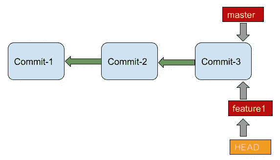

After switching to the feature1 branch, HEAD now points to feature1.

现在再一次，真相时刻到了！我们一直在谈论的分支也只不过是一个*引用对象*。它是指向分支中最新提交的指针。当在分支中创建新的提交对象时，分支指针被简单地更新以指向新的提交对象。

那么，Git 如何能够识别我们正在处理的当前提交对象，它获取 HEAD 引用对象，它提供分支引用对象(对于当前工作的分支),然后分支引用对象提供提交对象。因此得名`HEAD -> branch`。

目前，在我们的 git 存储库中，引用— `HEAD->feature1`、`feature1`和`master`指向同一个提交对象。而`HEAD`引用对象指向`feature1`引用对象。

总结:
1。*分支*引用对象跟踪我们在分支上的最新提交。只有在分支中创建新的提交对象时，才会更新*分支*引用对象。
2。 *HEAD* 引用对象跟踪我们当前工作的分支。每当当前工作分支切换到另一个分支时，更新*头*参考对象。

## 标签

标签主要用于标记 Git 提交历史中的重要点(提交)。虽然 heads 是内置的引用，但是标签是需要创建的。

假设提交-2 是一个重要的提交，需要经常引用。我们可以创建一个指向 commit-2 的标签。每当需要引用 commit-2 对象时，我们都可以使用这个标记。

因为理解 Git 分支不需要知道标签。我们将在另一篇文章中讨论它。该文章的链接可在[此处](http://nothing)获得。

# 继续 Git 分支

所以，我们看了如何创建分支，如何在分支之间切换，以及列出所有分支。我们还看了什么是 HEAD 引用对象，以及*分支*只不过是指向该分支的最新提交的指针(引用对象)。
现在，让我们做一些更改，并在新的`feature1`分支中创建更多的提交。请注意，我们目前在我们的`feature1`分支。执行以下命令，在`feature1`分支中创建两个新的提交。

```
>>> echo "I have been created in feature1 branch." > file3
>>> git add file3
>>> git commit -m "added file3"
[feature1 693f09b] added file3
 1 file changed, 1 insertion(+)>>> echo "Another commit in file3" >> file3
>>> git add file3
>>> git commit -m "change in file3"
[feature1 ef154d8] change in file3
 1 file changed, 1 insertion(+)>>> git log
commit ef154d8ae3bac0e2bdcd8102381e49a3a5c480ee (HEAD -> feature1)
Author: pprakarsh <[prakarshparashar@gmail.com](mailto:prakarshparashar@gmail.com)>
Date:   Sat Jul 18 12:23:49 2020 +0530change in file3commit 693f09b8c388a684156f9654d99ad5c4b8f2133c
Author: pprakarsh <[prakarshparashar@gmail.com](mailto:prakarshparashar@gmail.com)>
Date:   Sat Jul 18 12:18:07 2020 +0530added file3commit e097d8da357fe97c36c7178f0b770ae44b1f1f3c (master)
Author: pprakarsh <[prakarshparashar@gmail.com](mailto:prakarshparashar@gmail.com)>
Date:   Thu May 21 10:24:55 2020 +0530changed file2commit 6642a0de776b52bbe993555a4bf14aed060afea2
Author: pprakarsh <[prakarshparashar@gmail.com](mailto:prakarshparashar@gmail.com)>
Date:   Sun May 3 22:14:12 2020 +0530added another line in file1commit 155891ca19d94f67159a992c77923818b57d74a5
Author: pprakarsh <[prakarshparashar@gmail.com](mailto:prakarshparashar@gmail.com)>
Date:   Sun May 3 10:41:06 2020 +0530created file1, created subDir1 and created file2 in it
```

我们可以看到`feature1`分支比主分支提前 2 次提交。

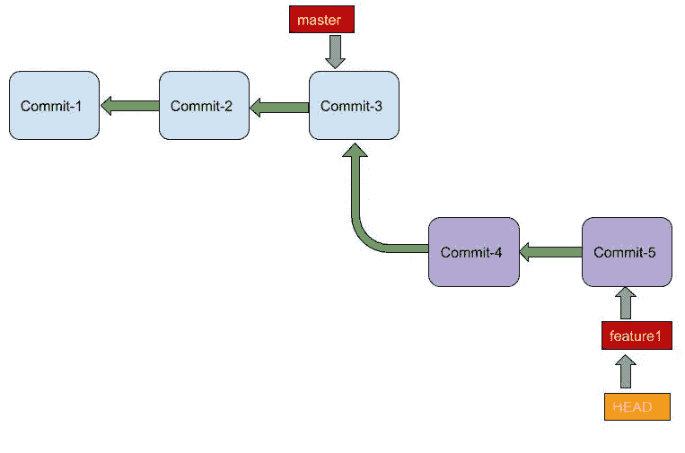

Commit history of our current Git repository. feature1 pointer moves to the latest commit, while HEAD points to the working branch pointer (feature1)

现在我们想把我们的`feature1`分行并入总分行。那么，我们如何做到这一点呢？

# 合并分支概述:

当我们完成一个特定特性的实现时，我们会希望将它合并到它所来自的分支中。当我们想要将 branch2 合并到 branch1 时，我们有两种可能的情况:

## 快进合并:

当 branch1(引用对象)和 branch2(引用对象)的最低共同祖先是 branch1(引用对象)时，执行快速向前合并。

请注意，当我们谈论 branch1/branch2(引用对象)时，我们谈论的是该分支上的最新提交。

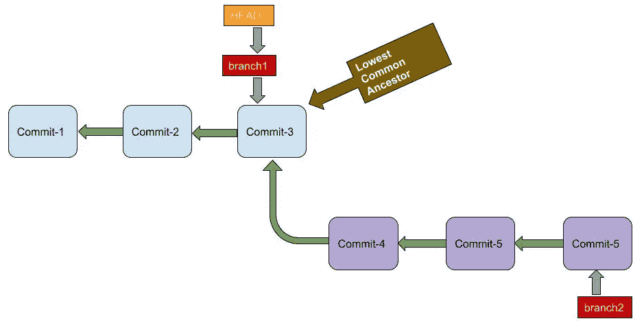

Lowest Common Ancestor of branch1 and branch2 is the latest commit of branch1

注意，头部指向 branch1。因此，如果要将 branch2 合并到 branch1，我们当前的工作分支必须是 branch1。

快进合并很简单。在快速向前合并期间，branch1 指针被简单地移动到 branch2 指针所指向的同一个提交。

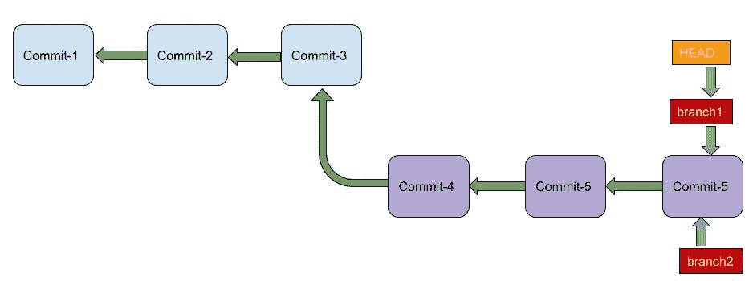

In a Fast-Forward merge, the branch1 pointer simply moves to the position of branch2 pointer. The HEAD pointer follows the branch1 pointer.

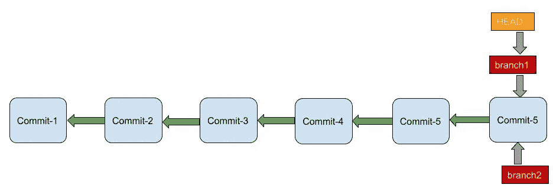

Redrawing the previous image

## 三路合并:

当 branch1(引用对象)和 branch2(引用对象)的最低共同祖先是某个其他提交对象，而不是 branch1(引用对象)或 branch2(引用对象)时，执行三向合并。
这通常发生在新分支被创建后，一些新的提交被添加到原始分支时。

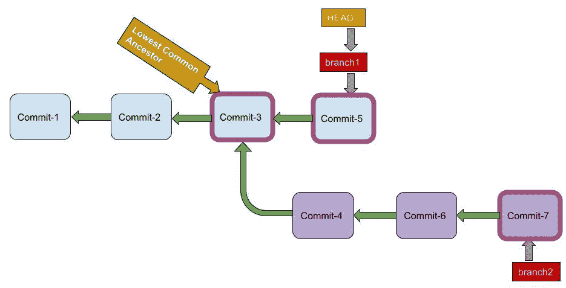

Lowest Common Ancestor of branch1 and branch2 is neither pointed by branch1 pointer nor by branch2 pointer. Commit-3, Commit-5, and Commit-7 will be involved in a 3-way merge

而不是向前移动分支指针。创建一个新的提交— *合并提交。*该提交有两个父级——一个来自 branch1，一个来自 branch2。branch1 和 branch2 中的更改被合并并组合到这个新的*合并提交中。*

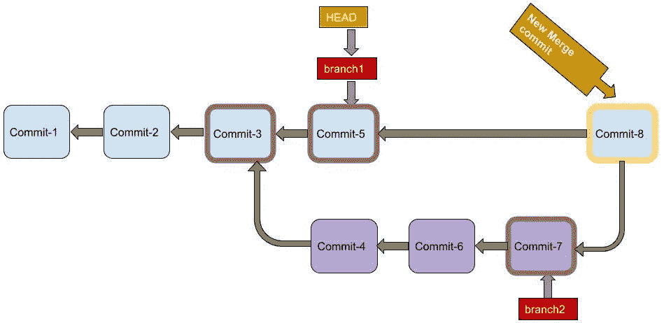

On merging, a new merge commit, commit-8 is created in branch1, which incorporates the changes made in both branch1 and branch2.

现在，我们对将 branch2 合并到 branch1 时的两种可能场景有了一个很好的想法。现在让我们在 git 存储库中尝试一下快进合并和三向合并。

# 合并分支实现:

在处理分支时，简单地做一个`git log`可能不是最好的方法。下面显示了一个更好的可视化 git 分支的命令。

```
>>> git log --all --color --graph --pretty=format:'%Cred%h%Creset -%C(yellow)%d%Creset %s %Cgreen(%cr) %C(bold blue)<%an>%Creset' --abbrev-commit* ef154d8 - (HEAD -> feature1) change in file3 (5 days ago) <pprakarsh>
* 693f09b - added file3 (5 days ago) <pprakarsh>
* e097d8d - (master) changed file2 (9 weeks ago) <pprakarsh>
* 6642a0d - added another line in file1 (3 months ago) <pprakarsh>
* 155891c - created file1, created subDir1 and created file2 in it (3 months ago) <pprakarsh>
```

输出变得丰富多彩和整洁。你不需要重复编写这个庞大的命令，你可以为这个命令设置一个别名(比如说`git lg`)。

```
>>> git config --global alias.lg "log --all --color --graph --pretty=format:'%Cred%h%Creset -%C(yellow)%d%Creset %s %Cgreen(%cr) %C(bold blue)<%an>%Creset' --abbrev-commit"
```

现在执行`git lg`会给我们同样漂亮的输出。

```
>>> git lg
* ef154d8 - (HEAD -> feature1) change in file3 (5 days ago) <pprakarsh>
* 693f09b - added file3 (5 days ago) <pprakarsh>
* e097d8d - (master) changed file2 (9 weeks ago) <pprakarsh>
* 6642a0d - added another line in file1 (3 months ago) <pprakarsh>
* 155891c - created file1, created subDir1 and created file2 in it (3 months ago) <pprakarsh>
```

我们看到 feature1 分支比`master`分支提前了两次提交。feature1 分支和`master`分支的最低共同祖先是主分支指向的提交。因此，这就是快速向前合并的情况。我们想把`feature1`分公司并入`master`分公司。因此头必须指向主人。所以，第一步是结帐到`master`分支(我们想要合并的分支)。

```
>>> git checkout master
Switched to branch 'master'
>>> git branch
  feature1
* master
>>> git lg
* ef154d8 - (feature1) change in file3 (5 days ago) <pprakarsh>
* 693f09b - added file3 (5 days ago) <pprakarsh>
* e097d8d - (HEAD -> master) changed file2 (9 weeks ago) <pprakarsh>
* 6642a0d - added another line in file1 (3 months ago) <pprakarsh>
* 155891c - created file1, created subDir1 and created file2 in it (3 months ago) <pprakarsh>
```

要将`feature1`分支合并到`master`分支，执行以下命令。

```
>>> git merge feature1
Updating e097d8d..ef154d8
Fast-forward
 file3 | 2 ++
 1 file changed, 2 insertions(+)
 create mode 100644 file3
>>> git lg
* ef154d8 - (HEAD -> master, feature1) change in file3 (5 days ago) <pprakarsh>
* 693f09b - added file3 (5 days ago) <pprakarsh>
* e097d8d - changed file2 (9 weeks ago) <pprakarsh>
* 6642a0d - added another line in file1 (3 months ago) <pprakarsh>
* 155891c - created file1, created subDir1 and created file2 in it (3 months ago) <pprakarsh>
```

观察`git merge feature1`命令的输出。输出显示快进合并。在执行`git lg`时，我们看到主设备现在指向与 feature1 相同的提交对象，而 HEAD 指向主设备。

`feature1`分支指针现在没有用了，所以我们可以删除`feature1`分支。

```
>>> git branch -d feature1
Deleted branch feature1 (was ef154d8).
>>> git branch
* master
>>> git lg
* ef154d8 - (HEAD -> master) change in file3 (5 days ago) <pprakarsh>
* 693f09b - added file3 (5 days ago) <pprakarsh>
* e097d8d - changed file2 (9 weeks ago) <pprakarsh>
* 6642a0d - added another line in file1 (3 months ago) <pprakarsh>
* 155891c - created file1, created subDir1 and created file2 in it (3 months ago) <pprakarsh>
```

注意不再有`feature1`分支。

现在让我们创建一个新的分支`branch1`并尝试进行 3 路合并。为此，我们还需要创建一些新的提交。执行以下命令创建一个新分支`branch1`。

```
>>> git branch branch1
>>> git branch
  branch1
* master
>>> git lg
* ef154d8 - (HEAD -> master, branch1) change in file3 (5 days ago) <pprakarsh>
* 693f09b - added file3 (5 days ago) <pprakarsh>
* e097d8d - changed file2 (9 weeks ago) <pprakarsh>
* 6642a0d - added another line in file1 (3 months ago) <pprakarsh>
* 155891c - created file1, created subDir1 and created file2 in it (3 months ago) <pprakarsh>
```

我们目前在主分支机构。我们将在主分支中创建一个新的提交对象。目前，master 和 branch1 都指向同一个提交对象。

```
>>> echo "Another commit in master" >> file3
>>> git add file3
>>> git commit -m "file3 changes"
[master f614763] file3 changes
 1 file changed, 1 insertion(+)
>>> git lg
* f614763 - (HEAD -> master) file3 changes (10 seconds ago) <pprakarsh>
* ef154d8 - (branch1) change in file3 (5 days ago) <pprakarsh>
* 693f09b - added file3 (5 days ago) <pprakarsh>
* e097d8d - changed file2 (9 weeks ago) <pprakarsh>
* 6642a0d - added another line in file1 (3 months ago) <pprakarsh>
* 155891c - created file1, created subDir1 and created file2 in it (3 months ago) <pprakarsh>
```

注意，主对象现在指向新的提交对象。我们现在将切换到`branch1`。头部现在将指向 branch1。

```
>>> git checkout branch1
Switched to branch 'branch1'
>>> git branch
* branch1
  master
>>> git lg
* f614763 - (master) file3 changes (8 minutes ago) <pprakarsh>
* ef154d8 - (HEAD -> branch1) change in file3 (5 days ago) <pprakarsh>
* 693f09b - added file3 (5 days ago) <pprakarsh>
* e097d8d - changed file2 (9 weeks ago) <pprakarsh>
* 6642a0d - added another line in file1 (3 months ago) <pprakarsh>
* 155891c - created file1, created subDir1 and created file2 in it (3 months ago) <pprakarsh>
```

我们现在将在`branch1`中创建新的提交。

```
>>> echo "creating file4" > file4
>>> git add file4
>>> git commit -m "created file4"
[branch1 9e2566a] created file4
 1 file changed, 1 insertion(+)
 create mode 100644 file4
>>> git lg
* 9e2566a - (HEAD -> branch1) created file4 (3 seconds ago) <pprakarsh>
| * f614763 - (master) file3 changes (10 minutes ago) <pprakarsh>
|/  
* ef154d8 - change in file3 (5 days ago) <pprakarsh>
* 693f09b - added file3 (5 days ago) <pprakarsh>
* e097d8d - changed file2 (9 weeks ago) <pprakarsh>
* 6642a0d - added another line in file1 (3 months ago) <pprakarsh>
* 155891c - created file1, created subDir1 and created file2 in it (3 months ago) <pprakarsh>
```

注意提交对象`ef154d8`处的差异。提交对象`f614763`(属于`master`分支)和`9e2566a`(属于`branch1`分支)都包含对同一父提交对象`ef154d8`的引用。

在`branch1`中创建另一个提交对象。

```
>>> echo "another line in file4" >> file4
>>> git add file4
>>> git commit -m "file4 changes"
[branch1 0b17834] file4 changes
 1 file changed, 1 insertion(+)
>>> git lg
* 0b17834 - (HEAD -> branch1) file4 changes (7 seconds ago) <pprakarsh>
* 9e2566a - created file4 (14 minutes ago) <pprakarsh>
| * f614763 - (master) file3 changes (24 minutes ago) <pprakarsh>
|/  
* ef154d8 - change in file3 (5 days ago) <pprakarsh>
* 693f09b - added file3 (5 days ago) <pprakarsh>
* e097d8d - changed file2 (9 weeks ago) <pprakarsh>
* 6642a0d - added another line in file1 (3 months ago) <pprakarsh>
* 155891c - created file1, created subDir1 and created file2 in it (3 months ago) <pprakarsh>
```

我们可以看到在`branch1`中创建了新的提交对象`0b17834`。

现在让我们将`branch1`合并到`master`分支中。注意，`branch1`引用对象(`0b17834`)和`master`引用对象(`f614763`)的*最低共同祖先*是不同的提交对象(`ef154d8`)。因此，它是一个 3 路合并。但是，首先，我们需要切换到`master`分支。

```
>>> git checkout master
Switched to branch 'master'
>>> ls
subDir1  file1  file3
>>> git lg
* 0b17834 - (branch1) file4 changes (11 minutes ago) <pprakarsh>
* 9e2566a - created file4 (24 minutes ago) <pprakarsh>
| * f614763 - (HEAD -> master) file3 changes (34 minutes ago) <pprakarsh>
|/  
* ef154d8 - change in file3 (5 days ago) <pprakarsh>
* 693f09b - added file3 (5 days ago) <pprakarsh>
* e097d8d - changed file2 (9 weeks ago) <pprakarsh>
* 6642a0d - added another line in file1 (3 months ago) <pprakarsh>
* 155891c - created file1, created subDir1 and created file2 in it (3 months ago) <pprakarsh>
```

注意，存储库的内容没有显示`file4`，因为`file4` blob 对象不能通过当前的提交对象`f614763`访问。

执行以下命令，将`branch1`合并到`master`分支。

```
>>> git merge branch1
Merge made by the 'recursive' strategy.
 file4 | 2 ++
 1 file changed, 2 insertions(+)
 create mode 100644 file4>>> git lg
*   15357ad - (HEAD -> master) Merge branch 'branch1' (15 seconds ago) <pprakarsh>
|\  
| * 0b17834 - (branch1) file4 changes (15 minutes ago) <pprakarsh>
| * 9e2566a - created file4 (29 minutes ago) <pprakarsh>
* | f614763 - file3 changes (39 minutes ago) <pprakarsh>
|/  
* ef154d8 - change in file3 (5 days ago) <pprakarsh>
* 693f09b - added file3 (5 days ago) <pprakarsh>
* e097d8d - changed file2 (9 weeks ago) <pprakarsh>
* 6642a0d - added another line in file1 (3 months ago) <pprakarsh>
* 155891c - created file1, created subDir1 and created file2 in it (3 months ago) <pprakarsh>
```

通过执行`git lg`命令可以清楚地看到合并。一个新的合并提交对象(`15357ad`)已经被创建，它包含了`master`分支和`branch1`中的变更。主服务器现在指向这个提交对象。

如果我们确定`branch1`不再有用，我们可以通过执行`git branch -d branch1`命令删除`branch1`。我选择不删。

# 合并冲突的情况

现在，我们了解了 *Git 合并*是如何工作的，我们也知道如何进行 *Git 合并*。如果我们正在合并两个分支，那么两个分支中的更改都将合并到合并中。但是，如果我们在两个分支中的同一个文件的同一个部分中进行更改呢？很明显，这两个变化不能被合并到最终的合并中。这会导致合并冲突。我们如何解决这些合并冲突？

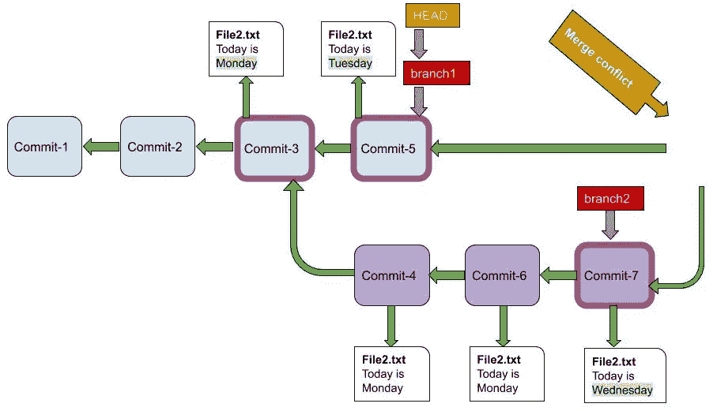

In file2.txt, changes in the same part of the file lead to a merge conflict. Which change should be incorporated in the merge? — Tuesday or Wednesday

这里要考虑的重要一点是，只有在三向合并的情况下才会发生合并冲突。在快速向前合并的情况下，只在一个分支中进行更改，因此合并冲突是不可能的。

让我们看看如何解决合并冲突。首先，我们将在 git 存储库中创建一个新的分支`branch2`。

```
>>> git branch branch2
>>> git branch
  branch1
  branch2
* master
>>> git lg
*   15357ad - (HEAD -> master, branch2) Merge branch 'branch1' (3 hours ago) <pprakarsh>
|\  
| * 0b17834 - (branch1) file4 changes (3 hours ago) <pprakarsh>
| * 9e2566a - created file4 (3 hours ago) <pprakarsh>
* | f614763 - file3 changes (3 hours ago) <pprakarsh>
|/  
* ef154d8 - change in file3 (5 days ago) <pprakarsh>
* 693f09b - added file3 (5 days ago) <pprakarsh>
* e097d8d - changed file2 (9 weeks ago) <pprakarsh>
* 6642a0d - added another line in file1 (3 months ago) <pprakarsh>
* 155891c - created file1, created subDir1 and created file2 in it (3 months ago) <pprakarsh>
```

注意，已经创建了一个新的分支`branch2`，它指向与`master` ( `15357ad`)相同的提交对象。另外，请注意，我们目前在`master`分支中。我们将在主分支中创建另一个提交对象。

```
>>> echo "Today is Tuesday" > file5
>>> git add file5
>>> git commit -m "file5 added, Tuesday"
[master 2a4af24] file5 added, Tuesday
 1 file changed, 1 insertion(+)
 create mode 100644 file5>>> git lg
* 2a4af24 - (HEAD -> master) file5 added, Tuesday (11 minutes ago) <pprakarsh>
*   15357ad - (branch2) Merge branch 'branch1' (3 hours ago) <pprakarsh>
|\  
| * 0b17834 - (branch1) file4 changes (3 hours ago) <pprakarsh>
| * 9e2566a - created file4 (4 hours ago) <pprakarsh>
* | f614763 - file3 changes (4 hours ago) <pprakarsh>
|/  
* ef154d8 - change in file3 (5 days ago) <pprakarsh>
* 693f09b - added file3 (5 days ago) <pprakarsh>
* e097d8d - changed file2 (9 weeks ago) <pprakarsh>
* 6642a0d - added another line in file1 (3 months ago) <pprakarsh>
* 155891c - created file1, created subDir1 and created file2 in it (3 months ago) <pprakarsh>
```

我们可以看到在`master`分支中创建了一个新的提交对象。我们现在将切换到`branch2`，并在`branch2`中创建一个新的提交。切换到`branch2`，我们会看到工作目录中没有`file5`。这是因为我们当前在一个不同的提交对象上(`15357ad`)。

```
>>> git checkout branch2
Switched to branch 'branch2'
>>> git branch
  branch1
* branch2
  master>>> git lg
* 2a4af24 - (master) file5 added, Tuesday (16 minutes ago) <pprakarsh>
*   15357ad - (HEAD -> branch2) Merge branch 'branch1' (3 hours ago) <pprakarsh>
|\  
| * 0b17834 - (branch1) file4 changes (3 hours ago) <pprakarsh>
| * 9e2566a - created file4 (4 hours ago) <pprakarsh>
* | f614763 - file3 changes (4 hours ago) <pprakarsh>
|/  
* ef154d8 - change in file3 (5 days ago) <pprakarsh>
* 693f09b - added file3 (5 days ago) <pprakarsh>
* e097d8d - changed file2 (9 weeks ago) <pprakarsh>
* 6642a0d - added another line in file1 (3 months ago) <pprakarsh>
* 155891c - created file1, created subDir1 and created file2 in it (3 months ago) <pprakarsh>>>> ls
subDir1  file1  file3  file4
```

我们现在将在`branch2`中创建一个新的提交对象。我们也将在`branch2`中创建`file5`，其内容与`master`分支中的内容相同，只是名称不同。

```
>>> echo "Today is Wednesday" > file5
>>> git add file5
>>> git commit -m "file5 added, Wednesday"
[branch2 206760e] file5 added, Wednesday
 1 file changed, 1 insertion(+)
 create mode 100644 file5>>> git lg
* 206760e - (HEAD -> branch2) file5 added, Wednesday (31 seconds ago) <pprakarsh>
| * 2a4af24 - (master) file5 added, Tuesday (18 minutes ago) <pprakarsh>
|/  
*   15357ad - Merge branch 'branch1' (3 hours ago) <pprakarsh>
|\  
| * 0b17834 - (branch1) file4 changes (3 hours ago) <pprakarsh>
| * 9e2566a - created file4 (4 hours ago) <pprakarsh>
* | f614763 - file3 changes (4 hours ago) <pprakarsh>
|/  
* ef154d8 - change in file3 (5 days ago) <pprakarsh>
* 693f09b - added file3 (5 days ago) <pprakarsh>
* e097d8d - changed file2 (9 weeks ago) <pprakarsh>
* 6642a0d - added another line in file1 (3 months ago) <pprakarsh>
* 155891c - created file1, created subDir1 and created file2 in it (3 months ago) <pprakarsh>
```

在`branch2`分支中创建了一个新的提交对象`206760e`。我们可以在提交时看到分歧`15357ad`。这个提交对象`15357ad`充当提交对象— `2a4af24`(在`master`分支中)和`206760e`(在`branch2`分支中)的父对象。现在让我们切换回`master`分支，并尝试将`branch2`合并到`master`分支中。

```
>>> git checkout master
Switched to branch 'master'>>> git merge branch2
Auto-merging file5
CONFLICT (add/add): Merge conflict in file5
Automatic merge failed; fix conflicts and then commit the result.
```

在执行`git merge`命令时，我们会看到我们的合并失败了。这是因为 git 无法自己解决冲突。我们将不得不手动解决冲突。

运行`git status`，这将提供有冲突的文件的名称。

```
>>> git status
On branch master
You have unmerged paths.
  (fix conflicts and run "git commit")
  (use "git merge --abort" to abort the merge)Unmerged paths:
  (use "git add <file>..." to mark resolution)both added:      file5no changes added to commit (use "git add" and/or "git commit -a")
```

我们将看到`file5`导致了合并冲突。现在使用你选择的编辑器打开`file5`。你会看到这样的东西。低于`<<<<<<< HEAD`和高于`=======`的所有内容都属于当前工作分支中的最新提交(在这种情况下为`master`)，而在`=======`和`>>>>>>> branch2`之间的所有内容都属于另一个分支的最新提交(在这种情况下为`branch2`)。

```
<<<<<<< HEAD
Today is Tuesday
=======
Today is Wednesday
>>>>>>> branch2
```

编辑文件并解决冲突。现在你的文件看起来会像这样。

```
Today is Wednesday
```

然后执行`git add filename`将文件标记为已解析，最后执行`git commit`提交更改并完成分支合并过程。

```
>>> git add file5
>>> git commit
[master 4cf897d] Merge branch 'branch2'
>>> git lg
*   4cf897d - (HEAD -> master) Merge branch 'branch2' (2 minutes ago) <pprakarsh>
|\  
| * 206760e - (branch2) file5 added, Wednesday (32 minutes ago) <pprakarsh>
* | 2a4af24 - file5 added, Tuesday (49 minutes ago) <pprakarsh>
|/  
*   15357ad - Merge branch 'branch1' (4 hours ago) <pprakarsh>
|\  
| * 0b17834 - (branch1) file4 changes (4 hours ago) <pprakarsh>
| * 9e2566a - created file4 (4 hours ago) <pprakarsh>
* | f614763 - file3 changes (4 hours ago) <pprakarsh>
|/  
* ef154d8 - change in file3 (5 days ago) <pprakarsh>
* 693f09b - added file3 (5 days ago) <pprakarsh>
* e097d8d - changed file2 (9 weeks ago) <pprakarsh>
* 6642a0d - added another line in file1 (3 months ago) <pprakarsh>
* 155891c - created file1, created subDir1 and created file2 in it (3 months ago) <pprakarsh>
```

在运行`git lg`时，我们可以清楚地看到`branch2`已经成功合并到了`master`分支中。已经创建了一个新的提交对象(`4cf897d`)，它合并了合并冲突解决之后两个分支的改变。

这就完成了我们对 Git 分支的讨论。需要考虑的重要一点是，虽然我们一次只讨论了两个分支，但是实际上可以嵌套多个分支。这个想法是，我们一次只考虑两个分支，将它们合并成一个，然后选择另外两个分支，以此类推。

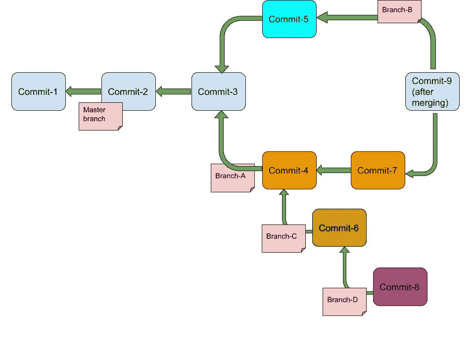

Notice the nesting of maser branch, Branch-A, Branch-B, and Branch-C

## 分离头状态

从本文开头关于 Git 引用的讨论中，我们了解到，branch 只不过是对分支中最新提交的引用(指针)。我们还谈到了 HEAD 是指向当前分支的指针(`HEAD-><branchname>`)。
在分离的 HEAD 状态下，HEAD 指向其他提交(不是分支)。这使得开发人员能够将头部移动到不同的提交对象，并重新创建与另一个提交相同的工作目录状态。

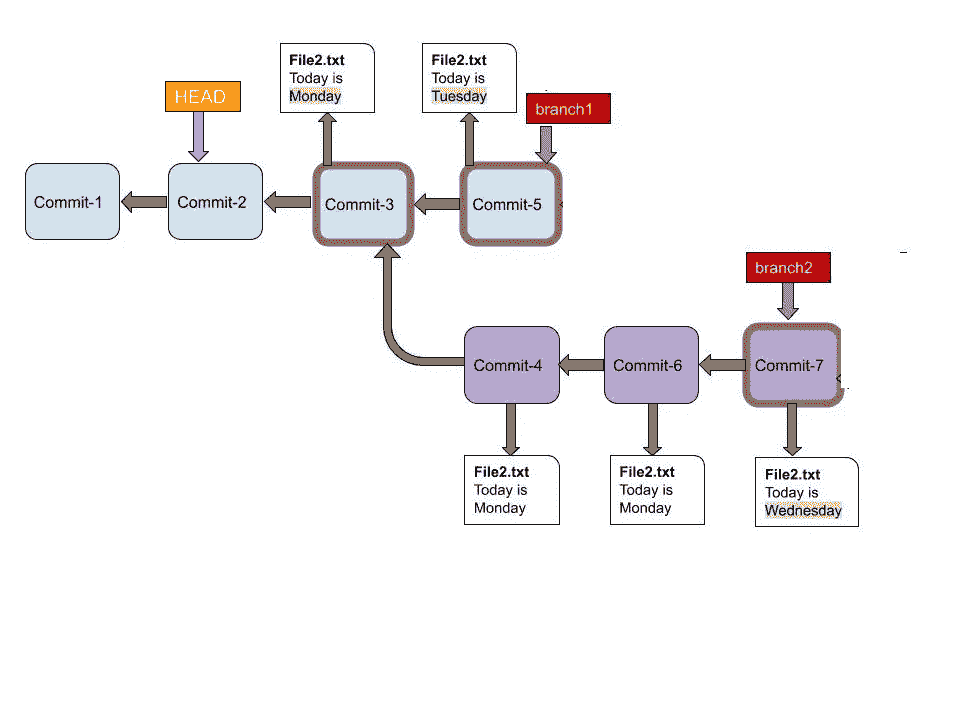

Detached HEAD state, HEAD pointing to Commit-2, instead of branch1 (HEAD->branch1).

您可以执行这个命令将 HEAD 移动到另一个提交对象。

`git checkout <commit-hash>`

通过分支到一个新的分支，您可以在分离的 HEAD 状态下进一步对您的存储库进行更改，从而允许您使用您已经保存的提交快照。

我们对 Git 分支的讨论到此结束。希望这篇文章对你有帮助！请在下面的评论中告诉我你的想法。在下一篇文章中，我们将深入了解跟踪 Git 存储库中的变更。

本系列的第一篇文章(关于 Git 内部机制)可以在[这里](/geekculture/a-beginners-guide-to-git-and-git-internals-1e7dcd89d65e)找到。