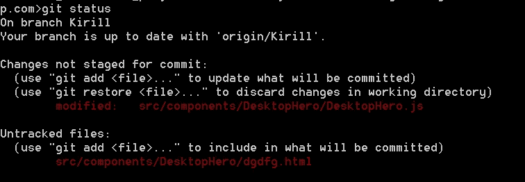
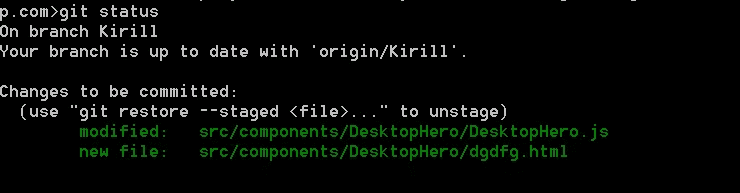
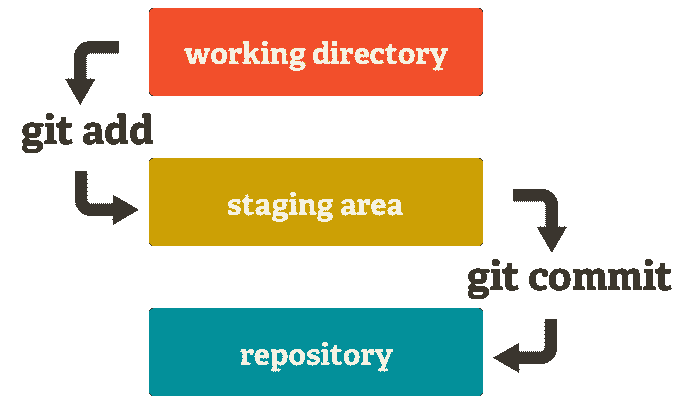
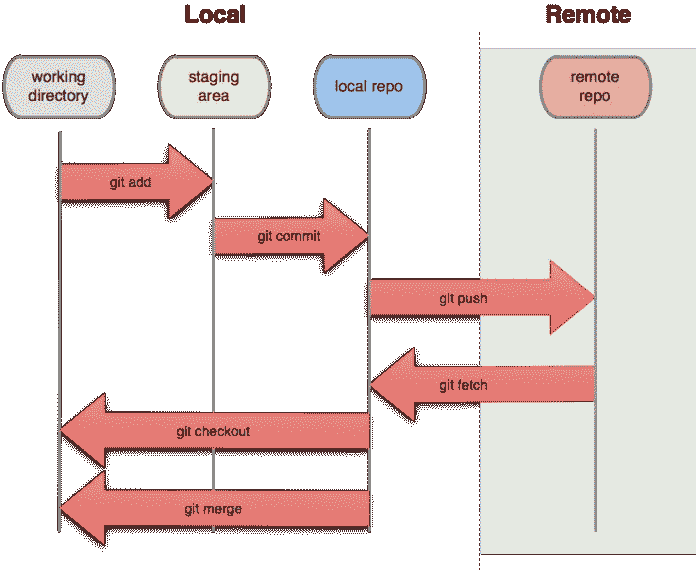

# 从头开始

> 原文：<https://medium.com/geekculture/git-from-scratch-a-z-44226714175?source=collection_archive---------36----------------------->


# 简介:

许多开发人员在 Git 版本控制系统方面存在问题，他们在 Git 知识方面存在差距，这导致他们的招聘流程出现问题，特别是大多数开发人员专注于升级和掌握他们的编码技能，他们缺乏 Git 版本控制系统技能，这甚至导致他们在与版本控制系统团队合作时浪费太多时间的问题。 他们打电话给团队领导或高级开发人员来帮助他们解决许多与 Git 系统内部的提交、合并冲突、重定基础和合并相关的问题，浪费了他们和其他团队成员的时间，这导致了极端的性能问题。

如果你对 Git 完全陌生，这将帮助你开始使用 Git，理解 Git 的含义和许多你需要理解的关于 Git 的基本概念。如果你对 Git 版本控制系统有中等程度的了解，这将有助于你升级，并掌握你的知识。

几年前，当我发现知识的缺乏导致一些性能问题，浪费时间与其他团队成员一起修复合并冲突，特别是使用 Git rebase 方法时，我开始升级并掌握我的 Git 知识。

## 我们将在文章中讨论以下几点:

**1-什么是 Git&Git/Github 有什么区别？**

**2-为什么我们必须使用版本控制系统？**

**3-版本控制系统中的热门术语**

**4-创建 Github 库&使用 Git 命令**

**5-如何生成 SSH 公共密钥**

**6-Git Stash**

> ***请关注我的*** *中的* ***，获取下一篇新文章的通知。*** *我也活跃在推特上*[***@ IbraKirill***](https://twitter.com/IbraKirill)*。*

# **什么是 Git&Git/Github 有什么区别？**

## 什么是 Git:

它是由莱纳斯·托瓦尔兹于 2005 年创建的。这是一个免费和开源的分布式版本控制系统，一个我们用来在一个中心位置保护我们的代码版本的工具，跟踪项目和文件，因为它们随着时间的推移随着不同程序员的操作而发生变化。这使得开发人员可以轻松协作，因为他们可以下载软件的新版本，进行更改，并上传最新版本。

不用 GitHub/Bitbucket/GitLab 也可以用 git 作为例子如果你在一家公司，你想用一些私有的东西比如公司的集中式服务器，所有团队成员通过 git 工具在集中式服务器上推送代码，你可以使用 GUI 程序或者终端命令行。

## 什么是 Github:

是一家使用 Git 进行软件开发和版本控制的互联网托管提供商。它提供了 Git 的分布式版本控制和源代码管理功能，以及它自己的特性。

简单来说:它是大的云存储，它使用 Git 版本控制。它通过使用 GUI 工具简化了 git 工具的使用，不需要 git 命令，并为您提供了一些功能，如 bug 跟踪器或问题跟踪器、拉请求、变更日志和许多其他功能。

# **为什么我们必须使用版本控制系统？**

想象一个不使用版本控制系统的开发团队，简单地使用 google drive 或 dropbox 这样的云存储提供商来存储和共享他们的所有代码。两个开发人员在不同的上处理相同的文件，然后文件被发布，并更新应用程序，应用程序上出现错误，他们没有选择知道谁对源文件进行了破坏，或者恢复到以前的版本以使在线应用程序再次工作。或者，如果您创建了一个新的组件或文件，您应该向所有同事发送一份副本，放入他们的项目文件中，这完全是一件令人头痛的事情。

## Git 解决了所有这些问题:

1-开发人员参与同一个项目。

2-您可以恢复更改，并知道是谁做的。

3-你可以一起合作解决问题:不同的人可以解决大的 bug。

4-你可以一起合作，创造新的功能:作为一个例子:大的任务，使网页布局和添加功能，所以用户界面开发者可以添加布局，同时开发者添加功能，而第一个开发者增强布局的风格。

5-您可以轻松解决冲突:在两个版本之间进行比较，并选择正确的代码版本。

6-我们可以组织功能和版本，找出不同版本之间的差异，并能够计算出每个版本中包含了哪些功能。

# **版本控制系统中的热门术语**

在我们开始实际解释之前，我们应该知道以下术语，因为当我们使用 Git 时，我们会经常看到它们:

**存储库:**是一个包含你的项目的各种不同版本的所有文件的地方，如果你有两个项目 web 或 mobile，那么你有两个存储库，它跟踪对你的项目中的文件所做的所有更改，随着时间的推移建立历史。

**本地存储库:**这是我们将进行本地更改的存储库，通常这个本地存储库在我们的计算机上。它具有与任何其他 Git 存储库完全相同的特性和功能

**远程仓库:**是一个在中央服务器或云存储上的仓库(Github、Gitlab、Bitbucket 等……)。

**Origin:** 在 Git 中，“Origin”是项目最初被克隆的远程存储库的简称。更准确地说，它被用来代替原始存储库的 URL——从而使引用更加容易。注意，origin 绝不是一个“神奇”的名字，而只是一个标准约定。

**分支:**Git 中的分支类似于树的分支。类似地，树枝附着在树的中心部分，称为树干。虽然树枝可以生长和脱落，但树干仍然紧密，是我们可以说树活着和站立的唯一部分。**Git 中的主要或默认分支是主分支(类似于树的主干)。一旦存储库创建完毕，主分支也随之创建。在一个项目的开发过程中，Git 分支在许多不同的地方提供帮助。如上所述，分支创建了另一条开发路线，它与主要的稳定的主分支完全不同或隔离。**

我们可以从主分支创建一个分支来添加特定的功能，如添加登录按钮或修复特定的错误。我们创建一个新的分支，然后处理它。当我们完成时，并且当我们确定不再有 bug 时(至少我们尝试这样做！)，我们将变更推回到主分支以更新项目。当我们有一个在线产品网站或移动应用程序时，这尤其有用。

**提交:**如果您完成了一个特性或者修复了一个特定的 bug，那么您就提交了您的变更，提交是关于您的存储库中的快照或者检查点的特定变更。提交是您的存储库在特定点的快照。

**克隆:**将一个现有 Git 存储库的副本放到一个新的本地目录中。Git 克隆操作将为存储库创建一个新的本地目录，复制指定存储库的所有内容，创建远程跟踪分支，并在本地签出一个初始分支。默认情况下，克隆将创建一个对称为 origin 的远程存储库的引用。

# **创建 Github 库&使用 Git 命令**

## 安装

安装 git 很简单——只需遵循下载页面[https://git-scm.com/downloads](https://git-scm.com/downloads)上的步骤。在安装 Git 的过程中，确保您也选择在正常的控制台窗口上运行 Git，这将使您能够在命令提示符下使用 **git** 命令运行 Git。根据您的配置，您可以使用命令行或 git bash 来访问 git，我更喜欢 git bash。

然后，我们有两种方法开始使用本地/远程存储库:初始化，克隆。

## 正在初始化:

安装后，我们会创建一个工作文件夹，您可以在其中测试项目并跟踪变更。一旦你“cd”到工作文件夹，创建一个文件并添加随机代码到其中。我们运行命令`**git init**`用于初始化我们工作文件夹中的一个空 git 存储库。运行这个命令会发生什么？— git 在运行命令的目录中创建一个名为`.git`的隐藏文件夹。您可以在基于 Linux 的系统上使用`ls -a`命令查看隐藏的文件和文件夹。这个文件夹是 git 存储所有关于文件的元数据、对这些文件所做的更改以及其他配置数据的地方。

## 克隆:

正如我们上面提到的，如果我们在 Github、bitbucket 或 Gitlab 等上创建一个远程存储库，我们将克隆它并在本地存储库上工作。

## 工作区和集结地:

工作区是 git 不处理的文件所在的地方。这些文件也称为“未跟踪文件”它就像您的暂存空间，您可以在其中添加新内容，修改或删除内容，如果您修改或删除的内容在您的存储库中，您就不必担心丢失您的工作。

Staging area，这是下一次提交将要包含的文件，它让 git 知道下一次提交文件中会发生什么变化。简而言之，存储库是 Git 实际知道的文件，包含项目的所有提交。

我建议欧洲大学的 [**在线学位**](https://click.linksynergy.com/fs-bin/click?id=GGg4no0HUcA&offerid=871625.130&subid=0&type=4) 课程的读者，其中许多是免费的 [**。**](https://click.linksynergy.com/fs-bin/click?id=GGg4no0HUcA&offerid=871625.130&subid=0&type=4)

## **提交变更&** 检查状态 **:**

在添加任何更改之前，我们可以使用以下命令检查我们的存储库的状态:

```
git status
```

它会告诉我们我们在哪个分支，没有什么要提交的—没有对这个文件夹中的任何文件的更改可以提交。

我们可以对代码进行修改，比如添加额外的语句或函数，或者添加新文件。然后运行`git status`，会出现如下结果:



`**git status**`:显示我的工作目录的状态。

我们将通过以下命令将工作区中的所有文件移动到登台区:

```
git add file_pathName  //to add an individual file change
or 
git add .  //to add all unstaged fileschanges
```

如果您在它之后运行`git status`，它将向您显示，您所有的新文件&更改都已添加，您需要提交它们或使它们不登台以用于所有更改或特定更改，从而将它们从登台区中移除:



所以命令`git add`告诉 git 跟踪你的文件，如果它没有被跟踪的话。

Git 有一个[暂存区](https://git-scm.com/about/staging-area)——一个中间位置，我们可以在提交之前编辑和检查我们的更改。

然后，我们提交更改，并将它们添加到本地存储库中，提交应该包含有关更改的简要细节:

```
git commit –m “Commit”
```

当我们提交变更时，所有被暂存的变更都将被提交到存储库中。



在提交我们的变更之后，我们可以看到`git status`说没有什么要提交的，工作树是干净的——这意味着在我们的工作区域中没有其他的变更可以在此时添加和提交。

## 将本地更改推送到远程存储库:

如果您只是从`git init`开始，而不是从`git clone`开始，要将您的本地 git 存储库链接到您在 GitHub 或 BitBucket 上的在线存储库，您需要将一个 **origin** 附加到您的远程 git 项目，以指定 origin 将被在线托管。您将使用这个命令。

```
git remote add origin [https://github.com/name/repositoryname.git](https://github.com/itonnie/repositoryname.git)
```

要将代码从本地 repo 推送到我们的远程 repo，使用下面的命令。

```
git push remoteRepoName BranchName
git push -u origin master
//or you can just write:
git push
```

Github 会要求你登录知道你是谁，谁会推送，GitHub 登录出现弹出窗口，你输入你的数据，或者通过添加 ssh 公钥或者通过 git 命令行配置:

```
git config — global user.email "your email"
git config — global user.password "your pass"
```

## 从远程存储库提取更改:

如果我在运行 git push commit 之前与一个团队一起工作，我应该获取团队中任何同事添加的任何新更改，因此我将运行下面的命令:`git pull`从远程 repo 获取所有更改，或者从远程 repo 获取一个副本，并将其与本地 repo 合并



# 如何生成 SSH 公钥

## 什么是 SSH 密钥？

SSH 密钥是 SSH(安全外壳)网络协议的访问凭证。这种经过认证和加密的安全网络协议用于[不安全开放网络](https://whatismyipaddress.com/unsecured-network)上的机器之间的远程通信。SSH 用于远程文件传输、网络管理和远程操作系统访问。SSH 使用一对密钥来启动远程方之间的安全握手。密钥对包含公钥和私钥。

## 为什么要用 SSH Key？

当使用 GitHub/Gitlab/Bitbucket 存储库时，您经常需要使用您的用户名和密码向 GitHub 表明您的身份。SSH 密钥是标识您自己的另一种方式，不需要您每次都输入用户名和密码。

SSH 密钥是成对的，一个公钥与 GitHub 等服务共享，一个私钥只存储在您的电脑上。如果密钥匹配，您将被授予访问权限。

SSH 密钥背后的加密技术确保了没有人能够从公钥逆向工程出您的私钥。

## 如何生成 SSH 密钥对？

使用 SSH 授权的第一步是生成我们自己的密钥对，打开您的 git 命令行，您的机器上可能已经有一个 SSH 密钥对了。您可以通过移动到您的`.ssh`目录并列出内容来查看是否存在一个:

```
cd ~/.ssh
ls
```

如果您看到`id_rsa.pub`，您已经有一个密钥对，不需要创建新的。

如果没有看到`id_rsa.pub`，使用下面的命令生成一个新的密钥对。确保用自己的电子邮件地址替换`your@email.com`。

```
ssh-keygen -o -t rsa -C "our_email"
//(The -o option was added in 2014; if this command fails for you, just remove the -o and try again)
```

或者

```
ssh-keygen –t rsa –b 4096 –C “our_email”
```

当询问保存新密钥的位置时，按 enter 键接受默认位置。然后会要求您提供一个可选的密码。这可以用来使你的钥匙更加安全，但你可以通过点击回车键跳过它。

**向 GitHub 添加公钥:**

我们应该运行以下命令:

```
cat ~/ .ssh/id_rsa.pub
```

这个命令显示你写的任何文件的任何内容的路径，所以它会显示你的文件内容包含一个公钥，复制整个公钥，然后进入你的 Github 帐户设置输入 ssh 和 GPG 密钥部分，按下新的 SSH 密钥，输入你的密钥，把一个密钥的标题，如“我的家庭电脑”，并添加密钥。

# **Git Stash**

当我们在我们的分支上添加、编辑或删除一些文件时，我们应该将它们添加到 stage 区域，并提交我们的更改，Stashing:允许我们保存更改供以后使用，而不用将它们添加到 stage 区域并提交它们。

让我们假设你正在为你的产品实现一个新的特性。您的代码正在进行中，突然一名测试人员发现了应用程序中的一个紧急错误。因此，你必须将你的新功能工作搁置几个小时。您不能提交您的部分代码，也不能丢弃您的更改。因此，您需要一些临时空间，在那里您可以存储您的部分更改，并在以后提交它们。

`**git stash**:` command 获取您未提交的更改(暂存的和未暂存的)，保存它们以备后用，然后从您的工作副本中恢复它们。

`**git stash apply**:`您可以重新应用先前存储的更改，该命令将把存储在存储中的更改应用到您当前分支的工作目录中，同时保持存储完好无损。如果你跑`**git stash list**`你会找到隐藏的物品。

`**git stash pop:**` *弹出*您的存储会从您的存储中移除更改，并将它们重新应用到您的工作副本。如果你跑`**git stash list**`，你将找不到隐藏物品。

虽然隐藏对于临时存储以后的更改很有用，但是请记住，它不能代替提交更改。无论您现在是“弹出”还是“应用”,我在不正确的分支上所做的更改都会应用到正确的分支上，这样我就不必从头开始重新做所有这些更改了。

`**git stash list:**`给你一个清单，上面有你的藏匿地点和他们的 id，检查你是否有藏匿地点。

试着在你的分支上做些改变，然后运行`git status`，然后运行`git stash`来保存你的改变，之后运行`git status`你将找不到你的改变。

# 结论:

在本文中，我们了解了什么是版本控制系统&为什么我们必须使用版本控制系统**，**什么是 Git&Git/Github 之间有什么区别，如何**创建** Github 库&使用 Git 命令，如何生成 SSH 公钥，如何生成 SSH 公钥，以及 Git Stash。**很快将会有关于 Git 合并、Git Rebase、合并冲突和拉请求的第二部分文章。*我希望如果你喜欢这篇文章并为之喝彩&请关注我以获得关于新文章的通知。***

> 如果你喜欢看文章，想支持我当作家，你可以 [**请我喝杯咖啡！**](http://buymeacoffee.com/kirillibrahim)
> 
> 从我个人的观点来看:以下两门课程是 Udemy 上最好的课程。教师保持简短和引人入胜，并展示关于该主题的知识。你可以选择你觉得舒服的: [**第一道菜**](https://click.linksynergy.com/link?id=GGg4no0HUcA&offerid=507388.2677498&type=2&murl=https%3A%2F%2Fwww.udemy.com%2Fcourse%2Fgit-and-github-complete-guide%2F) **和，** [**第二道菜**](https://click.linksynergy.com/link?id=GGg4no0HUcA&offerid=507388.3792262&type=2&murl=https%3A%2F%2Fwww.udemy.com%2Fcourse%2Fgit-and-github-bootcamp%2F) **。**