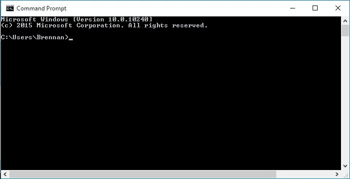

# Git 是为人类服务的，不仅仅是软件工程师

> 原文：<https://medium.com/geekculture/git-is-for-the-people-not-just-software-engineers-770eb2f88a8a?source=collection_archive---------11----------------------->

Git 不仅仅是开发软件的有用工具。


git Logo

## Git 是什么？

你可能见过上面的图片，它是软件工程师笔记本电脑背面的一个标签——它是软件工程师的一个基本工具，大多数人离不开它。我一直很震惊软件之外的人不使用它。

你是否曾经需要创建一个复杂的文档，并且在接近结束时，你有一个像这样的文件夹？

```
report-draft.docx
report-draft-alternative-intro.docx
report-draft2.docx
report-final.docx
report-final-conclusion.docx
report-final2.docx
```

用外行人的话来说，Git 是一种允许你以一种非常高效和灵活的方式管理文档版本或文档文件夹的技术。使用 Git，同一个文件夹将如下所示:

```
report.docx
.git/
```

您仍然可以创建、管理、比较、组合或回滚到不同版本的 report.docx

## 谁应该使用 Git？

这听起来像你做的工作吗？

1.  你的最终产品可以归结为计算机上的文档或文件。你可能是做销售的，你制作幻灯片用于向客户推销产品。
2.  在交付之前，您迭代地改进最终产品。你可能是一名摄影师，在将照片交付给客户之前，你会花大量时间一步一步地编辑照片。
3.  您同时在最终产品的不同组件上工作。你可能是一个作家，从一篇文章的一个部分跳到另一个部分，希望这种经历不那么令人困惑。

## Git 是如何工作的？

我写这个不一定是为了教你怎么用 Git。这需要一点学习曲线——在几段文字中阐明如何有效地使用它是一件非常困难的事情。我写这篇文章是为了让你相信学习如何使用 Git 是值得的，并给你一些学习如何使用 Git 的指导和资源。

**下载 Git**

Git 可以从他们的网站上下载，[这里](https://git-scm.com/)。它适用于所有操作系统。

**舒适地使用命令行**

> 命令行是你的电脑的文本界面。这是一个接受命令的程序，它将命令传递给计算机的操作系统来运行。在命令行中，您可以浏览电脑上的文件和文件夹，就像在 Windows 上浏览 Windows 资源管理器或在 Mac OS 上浏览 Finder 一样。

来自[代码学院](https://www.codecademy.com/article/command-line-commands)。

命令行看起来非常吓人，就像电影或电视节目中某个角色正在黑东西的场景。就像上面所说的，你可以把它们想象成奇特的文件浏览器，在那里你可以运行更复杂的命令。



Command Line

您现在可以尝试打开命令行。如果你在 Windows 上，在开始菜单中搜索“CMD”。如果您在 Mac 上，请尝试搜索“终端”如果你在你的个人电脑上使用 Linux 我将假设你知道什么是命令行，并且本文中没有什么对你来说是新的。

这里的是 codecademy 的另一个很好的资源。

**学习 Git 命令**

[这篇](https://product.hubspot.com/blog/git-and-github-tutorial-for-beginners)是 HubSpot 的一篇关于 Git 命令入门的好文章。它很棒，非常冗长，但它是一个很长的阅读。如果你不想读很长时间，你可以用以下命令快速搜索:

1.  `git init`
2.  `git checkout`
3.  `git add`
4.  `git commit`
5.  `git pull`和`git push`(如果你对在某个地方出版你的作品不感兴趣，你就不需要这些了)

## 结论

Git 是一个版本控制系统，可以帮助你管理文件或文件夹的版本，通常被软件工程师用来管理应用程序代码库。

如果你花时间学习 Git，你会发现它真的可以改善你的工作流程，即使你不是在用软件工作。

感谢阅读！