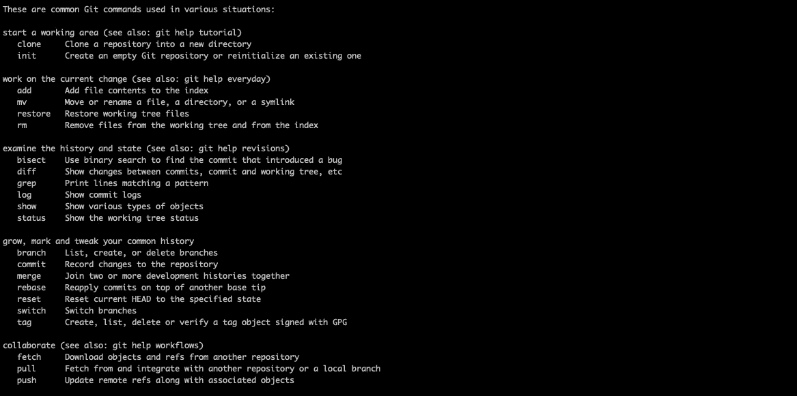
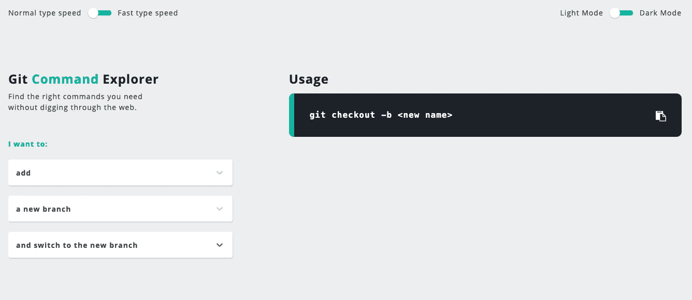

# 自动化工程师 Git 实践。

> 原文：<https://medium.com/geekculture/git-practice-for-automation-engineers-f8aa55c26d87?source=collection_archive---------21----------------------->


Photo by [Roman Synkevych](https://unsplash.com/photos/wX2L8L-fGeA)

在我最近的文章中，我提出了我对测试自动化中如何进行代码审查的看法。在本文中，我想继续介绍使用 Git 版本的最佳实践，以供讨论。

版本控制(有时称为源代码控制)在任何开发项目中都扮演着重要的角色，包括测试自动化。这是对源代码变更进行跟踪和控制的实践。因为版本控制中最常用的工具之一是 Git，所以让我们来看看一些最常用的 Git 命令。

所有自动化工程师每天都要和 Git 打交道，但并不是每个人都很关注这个工具。本文旨在介绍一些有用的 Git 功能，并展示如何在实践中使用它。首先，这篇文章对于想要提高使用 Git 的专业知识的自动化工程师新手和想要但不知道如何保持存储库整洁的人来说是有用的。

首先，我想描述一下我对“正确的”存储库的观点。这种存储库的主要区别是干净的提交历史。这些提交中的每一个都应该是项目中变更的有意义的原子单元。这意味着我们的历史不应该包含带有“特性正在进行中”消息的提交。你的任务是学习如何将你所做的所有改变分成这样的原子单位。

# Git 的好处。

*   它是免费的(并且是开源的):你不需要购买，当然，因为它是开源的，你可以随时贡献代码。
*   性能:Git 关注文件内容而不是文件名，这使得它比其他版本控制软件更快更可靠。
*   安全性:Git 通过一种叫做 SHA1 的加密安全散列算法来保护代码和变更历史。
*   广泛使用:Git 已经成为许多大型组织首选的 VCS 工具。

**最常见的 Git 命令。** 在命令行中使用**git–help**会给出可用 Git 命令的列表:



the output of the git — help on mac os command

让我们看看一些最有用的 Git 命令并理解它们。

孤独的。它是一个 Git 命令行实用程序，用于选择一个现有的存储库并创建它的克隆，即副本。

```
git clone <url remote repo>
```

要克隆特定的分支，可以使用

```
git clone -b <branch> <url remote repo>
```

F 蚀刻。该命令从存储库中获取所有分支。这还会从另一个存储库中下载所有必需的提交和文件。

```
git fetch <url remote repo>
```

C 检查完毕。此命令允许您在分支之间移动。

```
git checkout <branch name>
```

此外，您可以创建一个新的分支并切换到它。

```
git checkout -b <branch name>
```

A dd。这是您需要用来转移已更改文件的命令。

```
git add <file path>
```

C ommit。这是最常用的 Git 命令。在本地完成更改后，您可以通过“提交”来保存它们。

```
git commit -m <message of commit>
```

P 布什。Git push 会将本地提交的更改推送到远程分支。

```
git push
```

A lso，您可以使用该命令创建一个拉取请求(这是团队工作时的标准)。

```
git push origin <name of main repo> <name of branch>
```

完整的。使用 git pull 将从远程存储库中获取所有的更改，并将任何远程更改合并到当前的本地分支中。

```
git pull
```

S 塔什。这是一个非常有用的命令。它允许您在不创建提交的情况下保存我们的更改。当我们想要切换到另一个分支，但是当前的更改还没有准备好提交时，这个选项是很好的。当然，我们可以提交，但是它会包含未完成的工作，没有太多的意义，此外，它会污染我们的存储库。

要将我们的更改保存到 stash，请使用以下命令:

```
git stash
```

要查看保存的更改列表，请使用命令:

```
git stash list
```

要从 stash 返回更改，运行命令:

```
git stash apply
```

**重要**。默认情况下，将应用列表中的最新更改，要选择特定的更改，必须指定索引:

```
git stash apply --index 0
```

亨利-匹克。这个命令允许您将您选择的提交(当然还有它的更改)插入到当前分支中。当我们想要从另一个分支移动特定的变更，但是不想完全合并它们时，这是很有用的。

让我们看一个例子。有两个分支，main 和 release，都有提交历史。

主要分支机构:

```
commit fe19efc1d7a34ddb6193b1e4f859dd9e1a5d7049 (HEAD -> main)some changes for release commit 15471b35d338f8dbcbc43ba1531ad1c5447696f7example cherry-pick commitcommit dfa5218fa6e2bd8a8752eca225c2bd86380724b3Initial new commit
```

发布分支:

```
commit 9fa72be55c083f879ef5a73c2b4350b4056411e8 (HEAD -> release)Initial new commit
```

我们需要获得带有消息“示例精选提交”的提交更改。但是同时，您不需要在发布分支中提交“一些发布的变更”。为此，我们需要对我们需要的提交进行精选。要选择所需的提交，您需要使用它的哈希:

```
git cherry-pick 15471b35d338f8dbcbc43ba1531ad1c5447696f7
```

现在我们可以在发布分支中看到必要的变化:

```
commit e6a95034d392d295741a14ab0eaf084258116f5d (HEAD -> release)
    example cherry-pick commit

commit 9fa72be55c083f879ef5a73c2b4350b4056411e8
    Initial commit
```

**警告！**在 git cherry-pick 命令的执行过程中可能会发生冲突。

在这种情况下工作有点类似于使用 git rebase 命令(我们将在下面讨论)。冲突解决后，您可以继续使用**git cherry-pick—continue**命令。

使用 git 命令后，cherry-pick 记住了主要的提交规则。每一次提交都应该是一个完美的原子变化单位:

> 对你的存储库的主分支的每一次提交都应该是正确的大小，无论是大还是小，这样它就引入了一个原子单位的变化。它应该修复一个 bug，引入一个特性，重构一个系统，并且完整地完成，而不是将更改分散到几个提交中。

当使用 cherry-pick 命令时，适当的提交历史会很有帮助。

R ebase。为了清楚起见，让我们从 Git 的角度简单考虑一下一些自动化脚本的开发周期。Automation engineer 以一个共享分支(通常称为 dev)为基础，创建一个新分支，对其进行自己的更改，然后创建一个合并/拉取请求，将其更改注入到共享分支中。我建议您在创建您的分支到通用分支的合并/拉取请求之前，先进行 rebase。所有这些都是为了解决潜在的冲突，并保持存储库中的历史干净。一个清晰明了的历史使得在将来操纵存储库变得更加容易。那么，为什么要在创建合并/拉取请求之前做任何事情呢？在创建分支之前将其与共享分支合并的主要目的是解决可能的冲突。我打赌每个开发人员都见过类似“存在合并冲突”或“无法自动合并”的消息。因此，我们有一个选择:合并和 rebase。当然，rebase 并不总是合适的，但在这种情况下值得选择。

假设我们需要实现一个新的自动化脚本。首先，我们切换到共享分支(在我们的示例中是 dev ),并执行 pull 来获取最新的更新:

```
git checkout devgit pull origin dev
```

从用于本地开发的 dev 创建特性分支:

```
git checkout -b feature
```

假设我们实现了一个新的自动化脚本并进行一次新的提交:

```
git add .
git commit -m “implemented a new automation script”
```

由于许多开发人员和自动化工程师都在我们的存储库上工作，当我们实现一个新的自动化脚本时，general 分支中有一些变化可能会导致与我们的功能发生冲突或以某种方式影响它。因此，我们必须防止可能的冲突:

```
git pull --rebase origin dev
```

然后，我们必须解决这些冲突(如果存在的话),然后继续:

```
git rebase --continue
```

**注意**:重置基础会覆盖你创建的提交，新旧提交的散列是不同的。

现在您可以安全地创建我们的合并/拉取请求，而不用担心冲突。

```
git push --force origin feature-branch
```

或者

```
git push --force-with-lease origin feature-branch
```

git 推送远程提交历史的 **— force** 选项将被您自己的本地历史强制覆盖。

**— force-with-lease** 是一个更安全的选项，如果更多的提交被添加到远程分支(由另一个团队成员或同事或其他人)中，它不会覆盖远程分支上的任何工作。它确保你不会通过强行推动来覆盖别人的工作。

回复原状。假设我们想要添加对以前提交的更改。为此，我们需要带有— soft 或— mixed 参数的 reset 命令(如果指定了参数，默认情况下使用 mixed)。

```
git reset *--soft HEAD~1*
```

写 HEAD~1 意味着我们想从当前的 HEAD 位置返回一次提交。要查看发生了什么，您可以使用 git 日志和 git 状态。提交列表将不再包含我们删除的提交，对该提交的更改将保留在工作目录中，状态为 stage。然后，您可以添加/修复这些更改，并进行新的提交。如果我们只想删除一个提交，并且它的更改应该用 hard 参数重置，那么它将删除该提交，并且它们的更改不会保留在我们的工作目录中。此外，要更改 Git 中的最后一次提交，commit 命令有一个— amend 参数，但出于某种原因，我更喜欢使用 reset。

值得注意的是，上述方法改变了存储库中的提交历史，这并不总是安全的。在通常被命名为 master、dev 或 main 的共享分支中，通常不会对提交历史进行更改，因为这可能会产生负面影响。

# 结论。

Git 在任何项目中都是非常强大的工具，如果您的团队使用 Git 进行版本控制，您可能会每天使用这些命令。

今天，git 知识是测试人员工作中的一项关键技能。对于那些转向自动化的人来说，这是你应该开始学习的第一步。对于有经验的人来说，SDET 是一把瑞士小刀。然而，要记住所有的命令几乎是不可能的，所以我找到了一个交互式备忘单:



[https://gitexplorer.com/](https://gitexplorer.com/)


[https://test-engineer.site/](https://test-engineer.site/)

# 作者[安东·斯米尔诺夫](https://www.linkedin.com/in/vaskocuturilo/)